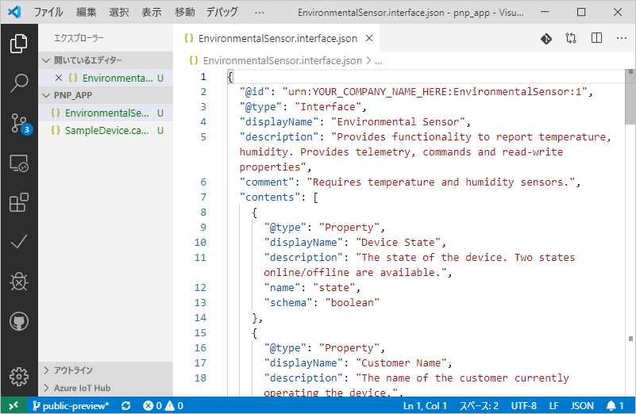
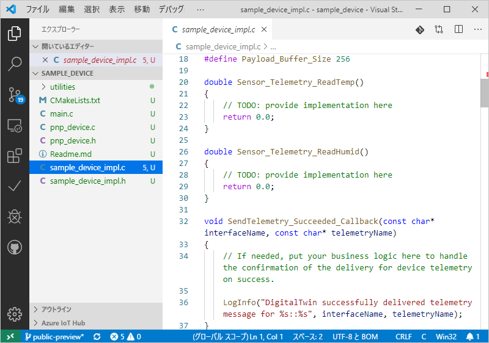

# <a name="quickstart-use-a-device-capability-model-to-create-an-iot-plug-and-play-preview-device-windows"></a>クイック スタート:デバイス機能モデルを使用して IoT プラグ アンド プレイ プレビュー デバイスを作成する (Windows)

"_デバイス機能モデル_" (DCM) には、IoT プラグ アンド プレイ デバイスの機能が記述されています。 DCM は多くの場合、製品 SKU に関連付けられています。 DCM で定義されている機能は、再利用可能なインターフェイスにまとめられています。 DCM からスケルトン デバイス コードを生成できます。 このクイックスタートでは、Windows 上で VS Code を使用して DCM を利用した IoT プラグ アンド プレイ デバイスを作成する方法について説明します。

## <a name="prerequisites"></a>前提条件

このクイックスタートを完了するには、ご利用のローカル コンピューター上に次のソフトウェアをインストールする必要があります。

* **C++ ビルド ツール**と **NuGet パッケージ マネージャー コンポーネント**のワークロードを利用して、[Visual Studio 用のビルド ツール](https://visualstudio.microsoft.com/thank-you-downloading-visual-studio/?sku=BuildTools&rel=16)。 または、同じワークロードを利用する [Visual Studio (Community、Professional、または Enterprise)](https://visualstudio.microsoft.com/downloads/) 2019、2017、2015 が既にインストールされている。
* [Git](https://git-scm.com/download/)。
* [CMake](https://cmake.org/download/)。
* [Visual Studio Code](https://code.visualstudio.com/)。

### <a name="install-azure-iot-tools"></a>Azure IoT Tools のインストール

[VS Code 用の Azure IoT Tools](https://marketplace.visualstudio.com/items?itemName=vsciot-vscode.azure-iot-tools) 拡張機能パックをインストールするには、次の手順に従います。

1. VS Code で、 **[拡張機能]** タブを選択します。
1. **Azure IoT Tools** を検索します。
1. **[インストール]** を選択します。

### <a name="install-the-azure-iot-explorer"></a>Azure IoT Explorer をインストールする

ほとんどの最新の更新プログラムでは、"資産" の下にある .msi ファイルを選択して、ツールの [[リポジトリ]](https://github.com/Azure/azure-iot-explorer/releases) ページから **Azure IoT Explorer** の最新のリリースをダウンロードしてインストールします。

### <a name="get-the-connection-string-for-your-company-model-repository"></a>ご利用の会社モデル リポジトリの接続文字列を取得する

Microsoft の職場または学校アカウントを使用するか、Microsoft パートナー ID (所持している場合) を使用してサインインすると、[Azure Certified for IoT](https://preview.catalog.azureiotsolutions.com) ポータルに、ご利用の_会社モデル リポジトリ接続文字列_が表示されます。 サインインしたら、 **[Company repository]\(会社リポジトリ\)** 、 **[接続文字列]** の順に選択します。

[!INCLUDE [cloud-shell-try-it.md](../../includes/cloud-shell-try-it.md)]

[!INCLUDE [iot-pnp-prepare-iot-hub-windows.md](../../includes/iot-pnp-prepare-iot-hub-windows.md)]

## <a name="prepare-the-development-environment"></a>開発環境の準備

このクイックスタートでは、[Vcpkg](https://github.com/microsoft/vcpkg) ライブラリ マネージャーを使用して、開発環境に Azure IoT C デバイス SDK をインストールします。

1. コマンド プロンプトを開きます。 次のコマンドを実行して Vcpkg をインストールします。

    ```cmd
    git clone https://github.com/Microsoft/vcpkg.git
    cd vcpkg

    .\bootstrap-vcpkg.bat
    ```

    次に、ユーザー全体の[統合](https://github.com/microsoft/vcpkg/blob/master/docs/users/integration.md)をフックするために、以下を実行します (注: 最初の使用時には、管理者権限が必要です)。

    ```cmd
    .\vcpkg.exe integrate install
    ```

1. Vcpkg によって、Azure IoT C device SDK をインストールします。

    ```cmd
    .\vcpkg.exe install azure-iot-sdk-c[public-preview,use_prov_client]
    ```

## <a name="author-your-model"></a>モデルを作成する

このクイックスタートでは、既存のサンプル デバイス機能モデルおよび関連するインターフェイスを使用します。

1. ローカル ドライブに `pnp_app` ディレクトリを作成します。 デバイス モデル ファイルとデバイス コード スタブには、このフォルダーを使用します。

1. [デバイス機能モデルとインターフェイスのサンプル ファイル](https://github.com/Azure/IoTPlugandPlay/blob/master/samples/SampleDevice.capabilitymodel.json)と[インターフェイスのサンプル](https://github.com/Azure/IoTPlugandPlay/blob/master/samples/EnvironmentalSensor.interface.json)をダウンロードし、ファイルを `pnp_app` フォルダーに保存します。

    > [!TIP]
    > GitHub からファイルをダウンロードするには、該当するファイルに移動して **[Raw]** を右クリックし、次に **[名前を付けてリンク先を保存]** を選択します。

1. VS Code を使用して `pnp_app` フォルダーを開きます。 IntelliSense を使用してファイルを表示できます。

    

1. ダウンロードしたファイル内で、`@id` フィールド `schema` とフィールド内の `<YOUR_COMPANY_NAME_HERE>` を一意の値に置き換えます。 英数字 (a-z、A-Z、0-9) とアンダースコアのみを使用してください。 詳細については、[デジタル ツイン識別子の形式](https://github.com/Azure/IoTPlugandPlay/tree/master/DTDL#digital-twin-identifier-format)に関するページを参照してください。

## <a name="generate-the-c-code-stub"></a>C コード スタブを生成する

DCM とそれに関連するインターフェイスの用意ができたので、モデルを実装するデバイス コードを生成できます。 VS Code 上で C コード スタブを生成するには:

1. VS Code で `pnp_app` フォルダーを開き、**Ctrl + Shift + P** キーを押してコマンド パレットを開きます。「**IoT プラグ アンド プレイ**」と入力し、 **[Generate Device Code Stub]\(デバイス コード スタブを生成する\)** を選択します。

    > [!NOTE]
    > IoT プラグ アンド プレイ コード生成 CLI を初めて使用するときは、自動によるダウンロードとインストールに数秒かかります。

1. デバイス コード スタブの生成に使用する **SampleDevice.capabilitymodel.json** ファイルを選択します。

1. プロジェクト名「**sample_device**」を入力します。 これは、デバイス アプリケーションの名前になります。

1. 使用する言語として、 **[ANSI C]** を選択します。

1. 接続方法として **[Via IoT Hub device connection string]\(IoT Hub デバイス接続文字列による\)** を選択します。

1. プロジェクト テンプレートとして **[CMake Project on Windows]\(Windows 上での CMake プロジェクト\)** を選択します。

1. デバイス SDK を含める方法として、 **[Via Vcpkg]\(Vcpkg 経由\)** を選択します。

1. DCM ファイルと同じ場所に **sample_device** という名前の新しいフォルダーが作成され、生成されたデバイス コード スタブ ファイルがそこに格納されます。 VS Code によって、これらを表示する新しいウィンドウが開かれます。
    

## <a name="build-and-run-the-code"></a>コードのビルドと実行

デバイス SDK のソース コードを使用して、生成されたデバイス コード スタブをビルドします。 ビルドしたアプリケーションでは、IoT ハブに接続するデバイスのシミュレーションが行われます。 アプリケーションによりテレメトリとプロパティが送信され、コマンドが受け取られます。

1. `sample_device` フォルダーに `cmake` サブディレクトリを作成して、そのフォルダーに移動します。

    ```cmd
    mkdir cmake
    cd cmake
    ```

1. 次のコマンドを実行して、生成されたコード スタブをビルドします (プレースホルダーを Vcpkg リポジトリのディレクトリに置き換えます)。

    ```cmd
    cmake .. -G "Visual Studio 16 2019" -A Win32 -Duse_prov_client=ON -Dhsm_type_symm_key:BOOL=ON -DCMAKE_TOOLCHAIN_FILE="<directory of your Vcpkg repo>\scripts\buildsystems\vcpkg.cmake"

    cmake --build .
    ```
    
    > [!NOTE]
    > Visual Studio 2017 または2015 を使用している場合、使用しているビルド ツールに基づいて CMake ジェネレーターを指定する必要があります。
    >```cmd
    ># Either
    >cmake .. -G "Visual Studio 15 2017" -Duse_prov_client=ON -Dhsm_type_symm_key:BOOL=ON -DCMAKE_TOOLCHAIN_FILE="{directory of your Vcpkg repo}\scripts\buildsystems\vcpkg.cmake"
    ># or
    >cmake .. -G "Visual Studio 14 2015" -Duse_prov_client=ON -Dhsm_type_symm_key:BOOL=ON -DCMAKE_TOOLCHAIN_FILE="{directory of your Vcpkg repo}\scripts\buildsystems\vcpkg.cmake"
    >```

    > [!NOTE]
    > ご利用の C++ コンパイラが cmake で見つからない場合は、前のコマンドを実行したときにビルド エラーが発生します。 それが発生した場合は、[Visual Studio コマンド プロンプト](https://docs.microsoft.com/dotnet/framework/tools/developer-command-prompt-for-vs)で次のコマンドを実行してみてください。

1. ビルドが正常に完了したら、IoT ハブ デバイス接続文字列をパラメーターとして渡し、アプリケーションを実行します。

    ```cmd
    .\Debug\sample_device.exe "<device connection string>"
    ```

1. そのデバイス アプリケーションによって IoT Hub へのデータの送信が開始されます。

    

## <a name="validate-the-code"></a>コードを検証する

### <a name="publish-device-model-files-to-model-repository"></a>デバイス モデル ファイルをモデル リポジトリに発行する

**Azure IoT Explorer** を使用してデバイス コードを検証するには、モデル リポジトリにファイルを発行する必要があります。

1. VS Code で `pnp_app` フォルダーを開き、**Ctrl + Shift + P** キーを使用してコマンド パレットを開きます。「**IoT プラグ アンド プレイ: モデル リポジトリにファイルを送信する**」と入力して選択します。

1. `SampleDevice.capabilitymodel.json` と `EnvironmentalSensor.interface.json` ファイルを選択します。

1. ご利用の会社モデル リポジトリ接続文字列を入力します。

    > [!NOTE]
    > 接続文字列は、初めてリポジトリに接続するときにのみ必要です。

1. VS Code の出力ウィンドウと通知では、ファイルが正常に発行されたことを確認できます。

    > [!NOTE]
    > デバイス モデル ファイルの発行に関するエラーが発生した場合は、コマンド **[IoT プラグ アンド プレイ: モデル リポジトリからサインアウトする]** を使用してサインアウトし、再度手順を行ってみてください。

### <a name="use-the-azure-iot-explorer-to-validate-the-code"></a>Azure IoT Explorer を使用してコードを検証する

1. Azure IoT エクスプローラーを開きます。 **[アプリの構成]** ページが表示されます。

1. ご利用の _IoT Hub 接続文字列_を入力し、 **[接続]** を選択します。

1. 接続すると、 **[デバイス]** の概要ページが表示されます。

1. 会社リポジトリを追加するには、 **[設定]** 、 **[+ Add module definition source]\(モジュール定義ソースの追加\)** 、 **[会社リポジトリ]** の順に選択します。 お使いの会社モデル リポジトリ接続文字列を追加して、 **[Save and Connect]\(保存して接続する\)** を選択します。

1. **[デバイス]** の概要ページに戻り、前に作成したデバイス ID を見つけます。 デバイス アプリケーションがコマンド プロンプトでまだ実行されている状態で、Azure IoT エクスプローラー内のデバイスの **[接続の状態]** が _[接続済み]_ として報告されていることを確認します (そうでない場合は、そうなるまで **[最新の情報に更新]** を押します)。 詳細を表示するには、デバイスを選択します。

1. **urn:<YOUR_INTERFACE_NAME>:EnvironmentalSensor:1** という ID を持つインターフェイスを展開して、IoT プラグ アンド プレイのプリミティブ (プロパティ、コマンド、テレメトリ) を表示します。 表示されるインターフェイス名は、モデルの作成時に指定した名前です。

1. **[テレメトリ]** ページを選択し、" _[開始]_ " を押して、デバイスから送信されているテレメトリ データを表示します。

1. **[プロパティ (書き込み不可)]** ページを選択して、デバイスから報告された書き込みができないプロパティを表示します。

1. **[プロパティ (書き込み可能)]** ページを選択して、更新を行うことができる書き込み可能なプロパティを表示します。

1. プロパティの**名前**を展開し、新しい名前で更新して、 **[書き込み可能なプロパティの更新]** を選択します。 

1. 新しい名前が **[報告されるプロパティ]** 列に表示されるのを確認するには、ページの上部にある **[更新]** ボタンを選択します。

1. **[コマンド]** ページを選択して、デバイスでサポートされているすべてのコマンドを表示します。

1. **点滅**コマンドを展開し、新しい点滅時間間隔を設定します。 **[コマンドの送信]** を選択して、デバイス上でコマンドを呼び出します。

1. シミュレートするデバイス コマンド プロンプトにアクセスして、出力された確認メッセージを読み、コマンドが想定どおりに実行されたことを確認します。

[!INCLUDE [iot-pnp-clean-resources.md](../../includes/iot-pnp-clean-resources.md)]

## <a name="next-steps"></a>次の手順

このクイックスタートでは、DCM を使用して IoT プラグ アンド プレイ デバイスを作成する方法について学習しました。

DCM と独自のモデルの作成方法の詳細については、次のチュートリアルに進んでください。

> [!div class="nextstepaction"]
> [チュートリアル:Visual Studio Code を使用してデバイス機能モデルを作成し、テストする](tutorial-pnp-visual-studio-code.md)
