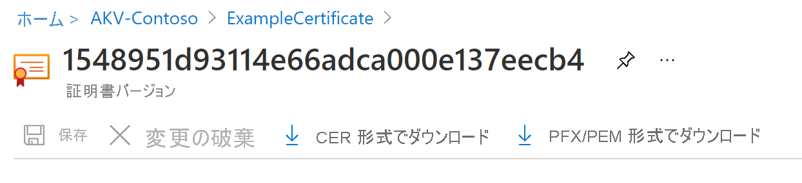

# <a name="export-certificates-from-azure-key-vault"></a>Azure Key Vault から証明書をエクスポートする

Azure Key Vault から証明書をエクスポートする方法について説明します。 Azure CLI、Azure PowerShell、または Azure portal を使用して証明書をエクスポートすることができます。 

## <a name="about-azure-key-vault-certificates"></a>Azure Key Vault の証明書について

Azure Key Vault を使用すると、ネットワーク用のデジタル証明書のプロビジョニング、管理、デプロイを簡単に行うことができます。 また、アプリケーションの通信をセキュリティで保護することもできます。 詳細については、[Azure Key Vault の証明書](./about-certificates.md)に関する記事を参照してください

### <a name="composition-of-a-certificate"></a>証明書の構成

Key Vault 証明書が作成されると、アドレス指定可能な "*キー*" と "*シークレット*" が同じ名前で作成されます。 Key Vault のキーによりキーの操作が可能になります。 Key Vault のシークレットにより、シークレットとして証明書の値を取得できます。 Key Vault 証明書には、公開 x509 証明書メタデータも含まれます。 詳細については、「[証明書の構成](./about-certificates.md#composition-of-a-certificate)」を参照してください。

### <a name="exportable-and-non-exportable-keys"></a>エクスポート可能およびエクスポート不可能なキー

Key Vault 証明書が作成されると、アドレス指定可能なシークレットから秘密キーとともにそれを取得できます。 PFX または PEM 形式で証明書を取得します。

- **エクスポート可能**:証明書の作成に使用されるポリシーで、キーがエクスポート可能であることが示されています。
- **エクスポート不可能**:証明書の作成に使用されるポリシーで、キーがエクスポート不可能であることが示されています。 この場合、秘密キーは、シークレットとして取得されたときの値の一部ではありません。

サポートされているキーの種類: RSA、RSA-HSM、EC、EC-HSM、oct (一覧は[こちら](/rest/api/keyvault/createcertificate/createcertificate#jsonwebkeytype))。エクスポート可能にできるのは、RSA、EC のみです。 HSM キーはエクスポートできません。

詳細については、[Azure Key Vault の証明書について](./about-certificates.md#exportable-or-non-exportable-key)の記事を参照してください

## <a name="export-stored-certificates"></a>保存されている証明書をエクスポートする

Azure CLI、Azure PowerShell、または Azure portal を使用して、Azure Key Vault に保存されている証明書をエクスポートすることができます。

> [!NOTE]
> キー コンテナーに証明書をインポートする場合にのみ、証明書のパスワードが必要です。 Key Vault には、関連付けられているパスワードは保存されません。 証明書をエクスポートするときは、パスワードは空白です。

# <a name="azure-cli"></a>[Azure CLI](#tab/azure-cli)

Azure CLI で次のコマンドを使用して、Key Vault 証明書の **公開部分** をダウンロードします。

```azurecli
az keyvault certificate download --file
                                 [--encoding {DER, PEM}]
                                 [--id]
                                 [--name]
                                 [--subscription]
                                 [--vault-name]
                                 [--version]
```

詳細については、[例とパラメーターの定義](/cli/azure/keyvault/certificate#az_keyvault_certificate_download)を参照してください。

証明書としてダウンロードすることは、公開部分を取得することを意味します。 秘密キーとパブリック メタデータの両方が必要な場合は、シークレットとしてダウンロードできます。

```azurecli
az keyvault secret download -–file {nameofcert.pfx}
                            [--encoding {ascii, base64, hex, utf-16be, utf-16le, utf-8}]
                            [--id]
                            [--name]
                            [--subscription]
                            [--vault-name]
                            [--version]
```

詳細については、[パラメーターの定義](/cli/azure/keyvault/secret#az_keyvault_secret_download)を参照してください。

# <a name="powershell"></a>[PowerShell](#tab/azure-powershell)

Azure PowerShell でこのコマンドを使用して、**TestCert01** という名前の証明書を **ContosoKV01** という名前のキー コンテナーから取得します。 証明書を PFX ファイルとしてダウンロードするには、次のコマンドを実行します。 これらのコマンドは、**SecretId** にアクセスし、内容を PFX ファイルとして保存します。

```azurepowershell
$cert = Get-AzKeyVaultCertificate -VaultName "ContosoKV01" -Name "TestCert01"
$secret = Get-AzKeyVaultSecret -VaultName "ContosoKV01" -Name $cert.Name
$secretValueText = '';
$ssPtr = [System.Runtime.InteropServices.Marshal]::SecureStringToBSTR($secret.SecretValue)
try {
    $secretValueText = [System.Runtime.InteropServices.Marshal]::PtrToStringBSTR($ssPtr)
} finally {
    [System.Runtime.InteropServices.Marshal]::ZeroFreeBSTR($ssPtr)
}
$secretByte = [Convert]::FromBase64String($secretValueText)
$x509Cert = new-object System.Security.Cryptography.X509Certificates.X509Certificate2
$x509Cert.Import($secretByte, "", "Exportable,PersistKeySet")
$type = [System.Security.Cryptography.X509Certificates.X509ContentType]::Pfx
$pfxFileByte = $x509Cert.Export($type, $password)

# Write to a file
[System.IO.File]::WriteAllBytes("KeyVault.pfx", $pfxFileByte)
```

このコマンドは、秘密キー (インポートされたものと同じ) を使用して証明書のチェーン全体をエクスポートします。 証明書がパスワードで保護されていること。
**Get-AzKeyVaultCertificate** コマンドとパラメーターの詳細については、[Get-AzKeyVaultCertificate の例 2](/powershell/module/az.keyvault/Get-AzKeyVaultCertificate) を参照してください。

# <a name="portal"></a>[ポータル](#tab/azure-portal)

Azure portal の **[証明書]** ブレードで証明書を作成またはインポートすると、証明書が正常に作成されたことを示す通知が表示されます。 証明書と現在のバージョンを選択して、ダウンロードするオプションを表示します。

証明書をダウンロードするには、 **[CER 形式でダウンロード]** または **[PFX/PEM 形式でダウンロード]** を選択します。



**Azure App Service 証明書をエクスポートする**

Azure App Service 証明書は、SSL 証明書を購入するための便利な方法です。 ポータル内から Azure アプリに割り当てることができます。 インポートした App Service 証明書は、 **[シークレット]** の下に配置されます。

詳細については、[Azure App Service 証明書をエクスポートする](https://social.technet.microsoft.com/wiki/contents/articles/37431.exporting-azure-app-service-certificates.aspx)手順を参照してください。

---

## <a name="read-more"></a>詳細情報
* [さまざまな証明書のファイルの種類と定義](/archive/blogs/kaushal/various-ssltls-certificate-file-typesextensions)
