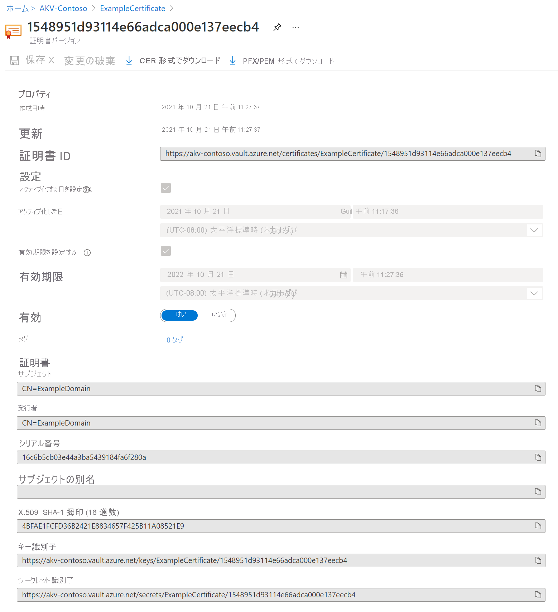

# クイック スタート:Azure portal を使用して Azure Key Vault から証明書の設定と取得を行う

Azure Key Vault は、シークレットのセキュリティで保護されたストアを提供するクラウド サービスです。 キー、パスワード、証明書、およびその他のシークレットを安全に保管することができます。 Azure Key Vault は、Azure Portal を使用して作成および管理できます。 このクイックスタートでは、キー コンテナーを作成し、それを使用して証明書を格納します。 Key Vault の詳細については、[概要](../general/overview.md)に関する記事をご覧ください。

## 前提条件

Azure Key Vault にアクセスするには、Azure サブスクリプションが必要です。 まだサブスクリプションをお持ちでない場合は、開始する前に[無料アカウント](https://azure.microsoft.com/free/?WT.mc_id=A261C142F)を作成してください。

シークレットへのアクセスはすべて、Azure Key Vault 経由で行われます。 このクイックスタートでは、[Azure portal](../general/quick-create-portal.md)、[Azure CLI](../general/quick-create-cli.md)、または [Azure PowerShell](../general/quick-create-powershell.md) を使用してキー コンテナーを作成します。

## Azure へのサインイン

Azure Portal ( https://portal.azure.com ) にサインインします。

## 証明書を Key Vault に追加する

証明書をコンテナーに追加するには、いくつかの追加の手順を実行する必要があります。 この例では、アプリケーションで使用できる自己署名証明書を追加します。 証明書の名前は **ExampleCertificate** です。

1. Key Vault のプロパティ ページで、 **[証明書]** を選択します。
2. **[Generate/Import]\(生成/インポート\)** をクリックします。
3. **[証明書の作成]** 画面で、次の値を選択します。
    - **[証明書の作成方法]** : [生成]。
    - **[証明書名]** : ExampleCertificate。
    - **Subject**:CN=ExampleDomain
    - 他の値は既定値のままにしておきます。 (既定では、高度なポリシーに特に何も指定しない場合、これをクライアント認証証明書として使用できます)。
 4. **Create** をクリックしてください。

証明書が正常に作成されたことを示すメッセージが表示されたら、一覧でそのシークレットをクリックできます。 すると、いくつかのプロパティを確認できます。 現在のバージョンをクリックすると、前の手順で指定した値が表示されます。

## Key Vault から証明書をエクスポートする

[CER 形式でダウンロード] または [PFX/PEM 形式でダウンロード] ボタンをクリックすると、証明書をダウンロードできます。 

## リソースをクリーンアップする

Key Vault に関する他のクイック スタートとチュートリアルは、このクイック スタートに基づいています。 後続のクイック スタートおよびチュートリアルを引き続き実行する場合は、これらのリソースをそのまま残しておくことをお勧めします。
不要になったら、リソース グループを削除します。これにより、Key Vault と関連リソースが削除されます。 ポータルを使用してリソース グループを削除するには:

1. ポータル上部にある検索ボックスにリソース グループの名前を入力します。 このクイック スタートで使用されているリソース グループが検索結果に表示されたら、それを選択します。
2. **[リソース グループの削除]** を選択します。
3. **[リソース グループ名を入力してください:]** ボックスにリソース グループの名前を入力し、 **[削除]** を選択します。

## 次のステップ

このクイックスタートでは、キー コンテナーを作成して証明書を格納しました。 Key Vault およびアプリケーションとの統合方法の詳細については、引き続き以下の記事を参照してください。

- [Azure Key Vault の概要](../general/overview.md)を確認する
- 「[Azure Key Vault 開発者ガイド](../general/developers-guide.md)」を参照する
- [Key Vault のセキュリティの概要](../general/security-features.md)を確認する
