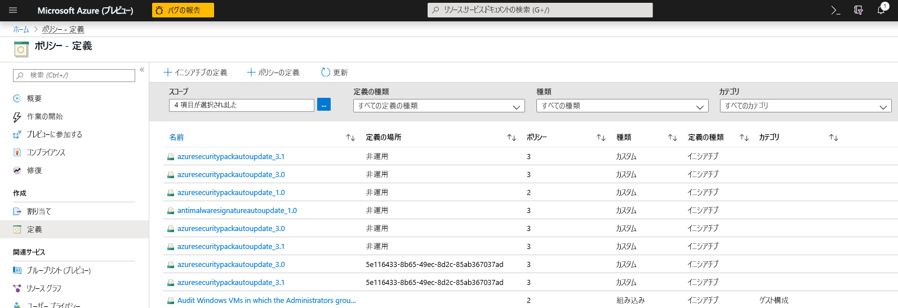
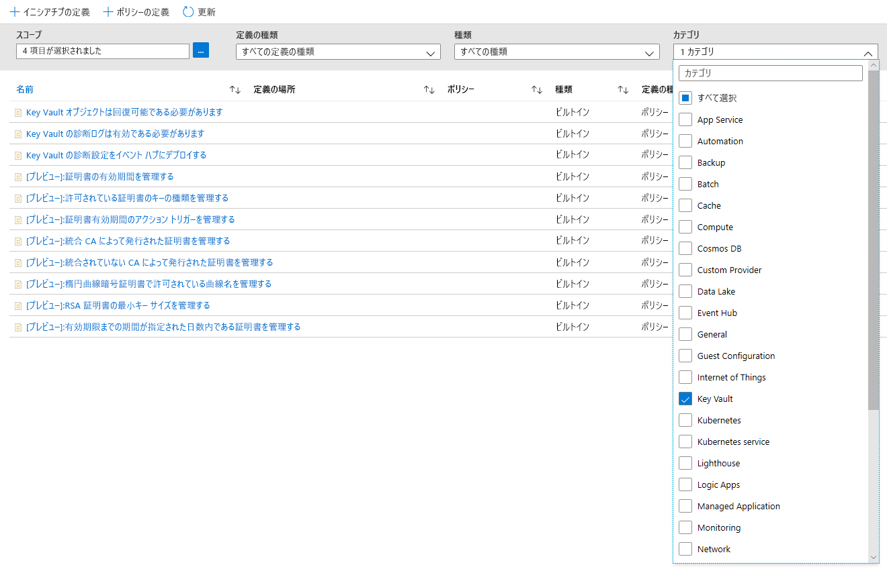
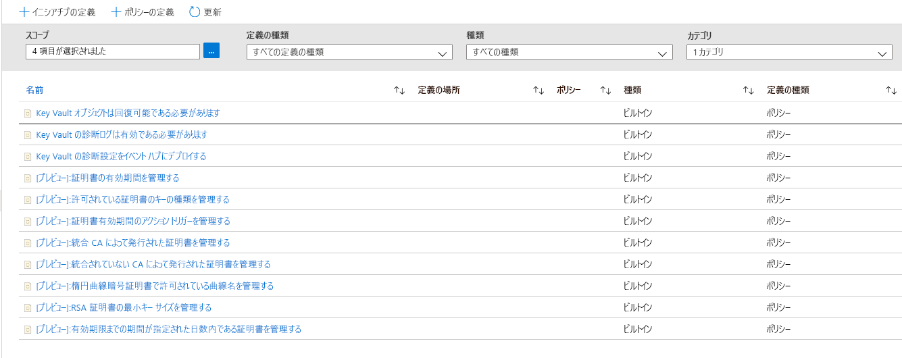
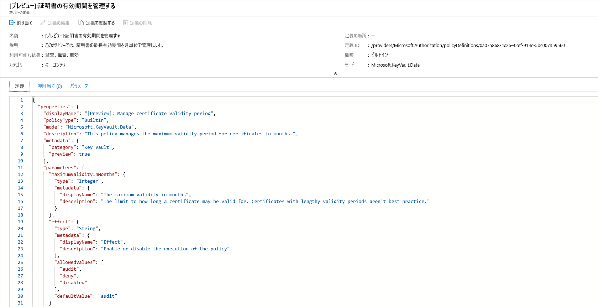
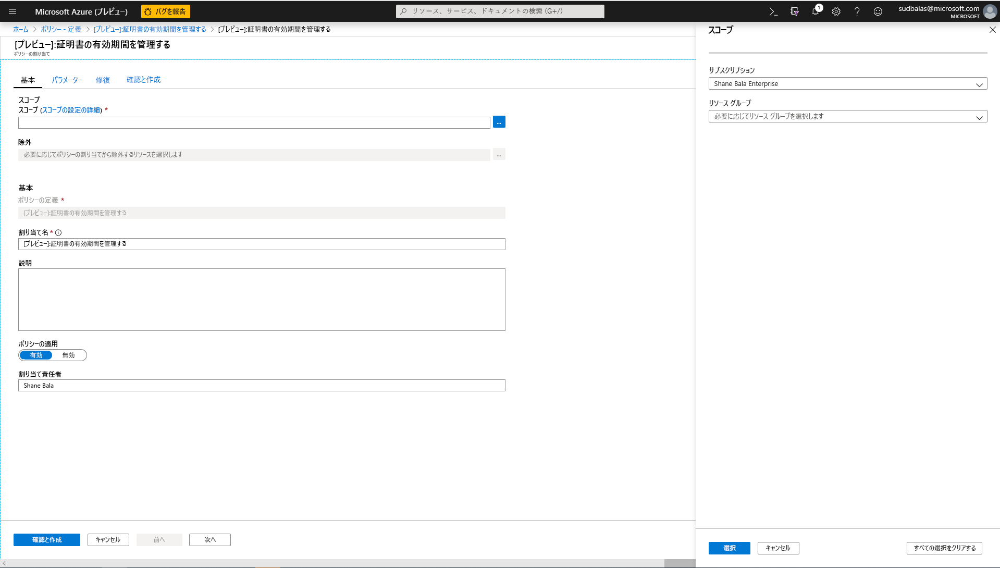
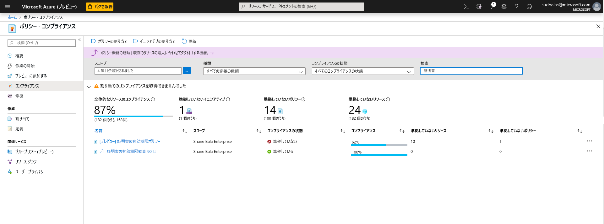
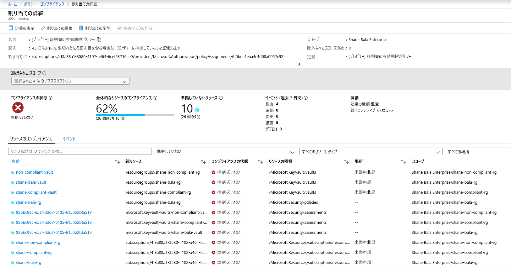
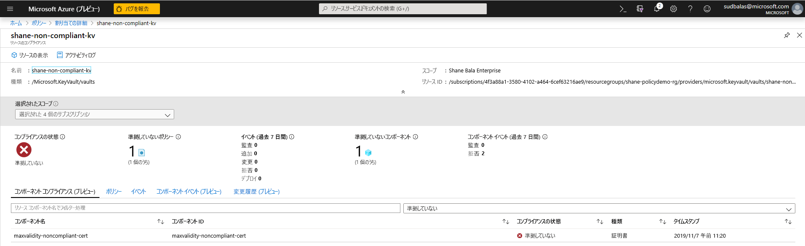
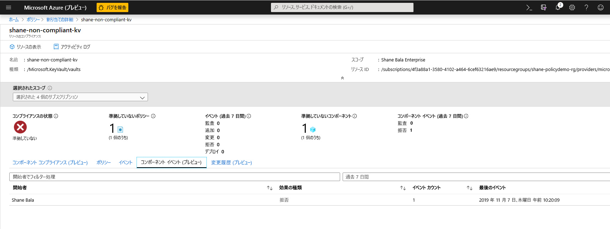

# Azure Key Vault と Azure Policy を統合する

[Azure Policy](../../governance/policy/index.yml) は、ユーザーが大規模な Azure 環境を監査および管理する機能を提供するガバナンス ツールです。 Azure Policy は、割り当てられたポリシー規則に Azure リソースが確実に準拠するように、Azure リソースにガードレールを配置する機能を提供します。 これによりユーザーは、利用中の Azure 環境の監査、リアルタイムの適用、修復を実行できます。 ポリシーによって実行された監査の結果は、どのリソースとコンポーネントが準拠しているか、していないかのドリルダウンを表示できるコンプライアンス ダッシュボードでユーザーが使用できるようになります。  詳細については、「[Azure Policy サービスの概要](../../governance/policy/overview.md)」を参照してください。

使用シナリオの例を示します。

- 会社のキー コンテナーにおける最小限のキー サイズと証明書の最長有効期間に関する要件を実装することで会社のセキュリティ体制を改善したいのに、どのチームが準拠し、どのチームがとそうでないかがわからない。 
- 現在、組織全体にわたる監査を実行するためのソリューションがないか、組織内の個々のチームにコンプライアンスに関する報告を行うよう依頼することで環境の監査を手動で実施している。 このタスクを自動化し、リアルタイムで監査を実行して、監査の精度を保証する方法を探している。
- 会社のセキュリティ ポリシーを適用し、個人が自己署名証明書を作成するのを止める必要があるのに、作成を自動的にブロックする方法がない。 
- テスト チームのいくつかの要件を緩和する必要があるのに、運用環境に対する厳しい管理は維持する必要がある。 リソースの適用を分離するため、簡単で自動化された方法を必要としている。 
- 稼働中のサイトの問題が発生した場合に、新しいポリシーの適用を確実にロールバックできるようにする必要がある。 ポリシーの適用をオフにするワンクリック ソリューションを必要としている。 
- 環境監査のためにサード パーティのソリューションに依存しているので、社内の Microsoft サービスを利用したい。 

## ポリシーの効果の種類とガイダンス

**監査**:ポリシーの効果が監査に設定されているときには、ポリシーによって環境に対する重大な変更が発生することはありません。 指定したスコープ内の、ポリシー定義に準拠していない証明書などのコンポーネントは、ポリシーのコンプライアンス ダッシュボードで非準拠とマーク付けされて、それらのコンポーネントに対するアラートが出されるだけです。 ポリシーの効果が選択されていない場合は、監査が既定値です。 

**拒否**:ポリシーの効果が拒否に設定されているときには、ポリシーにより、証明書などの新しいコンポーネントや、既存コンポーネントの、ポリシー定義に準拠しない新しいバージョンの作成がブロックされます。 キー コンテナー内の既存の非準拠リソースは影響を受けません。 "監査" 機能は引き続き動作します。

## 使用できる "組み込み" ポリシー定義

Key Vault では、証明書を管理するために一般的なシナリオに割り当てることができる、一連のポリシーを作成しました。 これらのポリシーは "組み込み" であるため、有効にするためにカスタム JSON を記述する必要がなく、Azure portal で割り当てのために使用できます。 組織のニーズに合わせて特定のパラメーターをカスタマイズすることもできます。 

8 つのプレビュー ポリシーは以下のとおりです。

### Manage certificate validity period (preview) (証明書の有効期間を管理する (プレビュー))

このポリシーでは、キー コンテナーに格納されている証明書の最大有効期間を管理できます。 セキュリティ実務の観点からは、証明書の最大有効期間を制限することをお勧めします。 証明書の秘密キーが、検出されることなく侵害された場合、有効期間の短い証明書を使用していれば、損害が続く概算時間を最小限に抑え、攻撃者にとっての証明書の価値を減らすことになります。 

### 許可されている証明書のキーの種類を管理する (プレビュー)
このポリシーでは、キー コンテナーに格納できる証明書の種類を制限できます。 このポリシーを使用して、証明書の秘密キーが RSA、ECC、または HSM ベースであることを確認できます。 次の一覧から、どの証明書の種類が許可されるかを選択できます。
- RSA
- RSA - HSM
- ECC 
- ECC - HSM 

### 証明書有効期間のアクション トリガーを管理する (プレビュー)

このポリシーでは、有効期限までの期間が一定日数内である証明書、または使用できる有効期間の一定割合に達した証明書に対して指定される、有効期間のアクションを管理できます。 

### 統合 CA によって発行された証明書を管理する (プレビュー)

Key Vault によって統合された証明機関 (Digicert または GlobalSign) を使用していて、これらのプロバイダーのいずれかまたは両方をユーザーに使用させる場合は、選択を監査または適用するためにこのポリシーを使用できます。 このポリシーは、キー コンテナー内での自己署名証明書の作成を監査または拒否するためにも使用できます。 

### 統合 CA によって発行された証明書を管理する (プレビュー)

内部の証明機関またはキー コンテナーと統合されていない証明機関を使用していて、提供するリストの証明機関をユーザーに使用させたい場合は、このポリシーを使用して、発行者名別の証明機関の許可リストを作成できます。 このポリシーは、キー コンテナー内での自己署名証明書の作成を監査または拒否するためにも使用できます。 

### 楕円曲線暗号証明書で許可されている曲線名を管理する (プレビュー)
楕円曲線暗号または ECC 証明書を使用する場合は、下の一覧に示した曲線名の許可リストをカスタマイズできます。 既定のオプションでは、以下の曲線名がすべて許可されます。 
- P-256
- P-256K
- P-384
- P-521

### RSA 証明書の最小キー サイズを管理する (プレビュー)
RSA 証明書を使用する場合は、証明書が持っている必要がある最小のキー サイズを選択できます。 下の一覧から 1 つのオプションを選択できます。 
- 2048 ビット
- 3072 ビット
- 4096 ビット

### 有効期限までの期間が指定された日数内である証明書を管理する (プレビュー)
適切に監視されていない証明書が、有効期限の前にローテーションされない場合、サービスの停止が発生する可能性があります。 このポリシーは、キー コンテナーに格納されている証明書が確実に監視されるようにするうえで非常に重要です。 このポリシーは、180 日、90 日、60 日、30 日間のしきい値など、有効期限の異なるしきい値を指定して複数回適用することをお勧めします。 このポリシーは、組織内の証明書の有効期限を監視し、トリアージするために使用できます。 

## シナリオ例

複数のチームによって使用される、100 の証明書を含むキー コンテナーを管理し、キー コンテナー内に 2 年より長く有効な証明書がないようにしたいと考えています。

1. [[Manage certificate validity period] (証明書の有効期限を管理する)](#manage-certificate-validity-period-preview) ポリシーを割り当てて、証明書の最長有効期間は 24 か月であることを指定し、ポリシーの効果を "監査" に設定します。 
1. [Azure portal でコンプライアンス レポート](#view-compliance-results)を表示し、20 の証明書が非準拠で有効期間が 2 年を超えていて、残りの証明書は準拠していることを検出します。 
1. これらの証明書の所有者に連絡し、証明書が 2 年より長く有効であってはいけないという新しいセキュリティ要件を伝えます。 一部のチームが対応し、15 の証明書は最長有効期間を 2 年以下として更新されました。 他のチームは対応しておらず、キー コンテナーには非準拠の証明書がまだ 5 つあります。
1. 割り当てたポリシーの効果を "拒否" に変更します。 非準拠の 5 つの証明書は取り消されず、機能し続けています。 ただし、それらは 2 年を超える有効期間では更新できません。 

## Azure portal からの Key Vault ポリシーの有効化と管理

### ポリシー定義を選択する

1. Azure ポータルにログインします。 
1. 検索バーで「ポリシー」を検索し、 **[ポリシー]** を選択します。

    

1. [ポリシー] ウィンドウで、 **[定義]** を選択します。

    

1. カテゴリ フィルターで **[すべて選択]** を選択解除し、 **[Key Vault]** を選択します。 

    

1. これで、Azure Key Vault のパブリック プレビューで使用できるすべてのポリシーを参照できるはずです。 上記のポリシーのガイダンスに関するセクションを読んで理解していることを確認し、スコープに割り当てるポリシーを選択します。  

    

### スコープにポリシーを割り当てる 

1. 適用するポリシーを選択します。この例では、 **[Manage Certificate Validity Period] (証明書の有効期間を管理する)** ポリシーが表示されています。 左上隅の [割り当て] ボタンをクリックします。

    
  
1. 適用するポリシーのサブスクリプションを選択します。 サブスクリプション内で、スコープを 1 つのリソース グループのみに制限することを選択できます。 ポリシーをサブスクリプション全体に適用し、一部のリソース グループを除外する場合は、除外リストを構成することもできます。 ポリシーの効果 (監査または拒否) を生じさせる場合はポリシー適用セレクターを **[有効]** に設定し、効果 (監査または拒否) をオフにするには **[無効]** に設定します。 

    

1. 必要な最長有効期間を月単位で指定するため、画面上部の [パラメーター] タブをクリックします。 上のセクションのガイダンスに従い、ポリシーの効果について **[監査]** または **[拒否]** を選択します。 次に、[確認および作成] ボタンを選択します。 

    

### コンプライアンスの結果を表示する

1. ポリシーのブレードに戻り、[コンプライアンス] タブを選択します。コンプライアンスの結果を表示するポリシー割り当てをクリックします。

    

1. このページからは、準拠または非準拠のコンテナー別に、結果をフィルター処理することができます。 ここでは、ポリシー割り当てのスコープ内にある、非準拠のキー コンテナーの一覧を確認できます。 コンテナー内のいずれかのコンポーネント (証明書) が非準拠である場合、そのコンテナーは非準拠と見なされます。 個々のコンテナーを選択すると、個々の非準拠コンポーネント (証明書) を表示できます。 

    

1. 非準拠のコンテナー内にあるコンポーネントの名前を表示します

    

1. ユーザーに対して、キー コンテナー内でリソースを作成する機能が拒否されているかどうかを確認する必要がある場合は、 **[コンポーネントイベント (プレビュー)]** タブをクリックすると、要求の要求元やタイムスタンプに基づいて、拒否された証明書操作の概要を表示できます。 

    

## 機能の制限

ポリシーに "拒否" 効果を割り当てると、非準拠リソースの作成の拒否が開始されるのに最大 30 分 (平均的な場合) かかり、最長の場合は 1 時間かかることがあります。 コンテナー内の既存コンポーネントのポリシー評価では、ポータル UI でコンプライアンスの結果を表示できるようになるまで最大 1 時間 (平均的な場合) かかり、最長の場合は 2 時間かかることがあります。 コンプライアンスの結果が "未開始" と表示される場合は、以下の理由が原因の可能性があります。
- ポリシーの評価がまだ完了していません。 最初の評価の待機時間は、最悪のシナリオでは最大 2 時間かかる場合があります。 
- ポリシー割り当てのスコープ内にキー コンテナーがありません。
- ポリシー割り当てのスコープ内に、証明書が含まれるキー コンテナーがありません。 

## 次の手順

- [Azure Policy サービス](../../governance/policy/overview.md)の詳細を確認する
- Key Vault のサンプルを参照する:[Key Vault の組み込みのポリシー定義](../../governance/policy/samples/built-in-policies.md#key-vault)