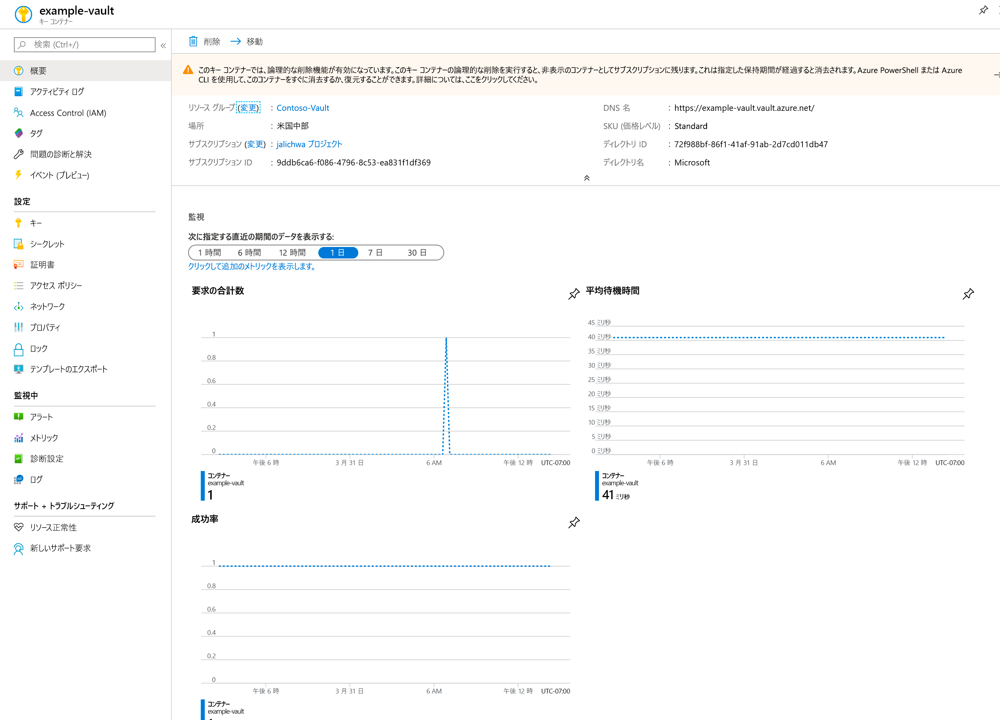
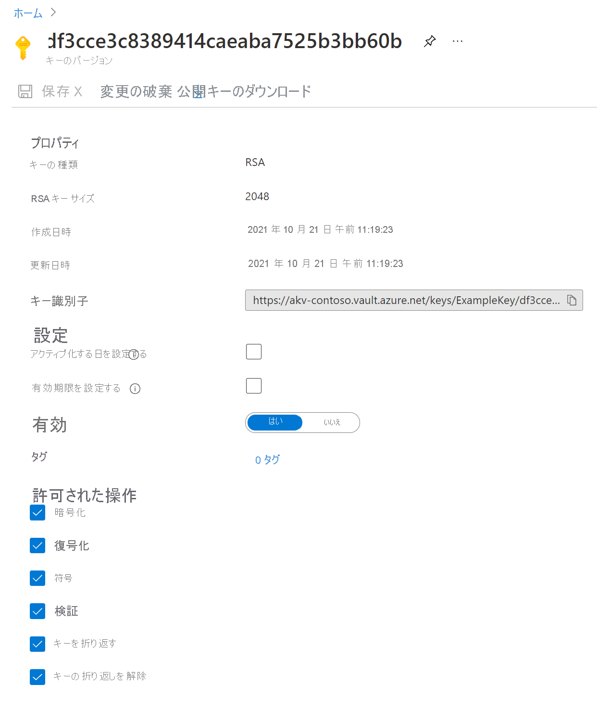

# クイック スタート:Azure portal を使用して Azure Key Vault との間でキーの設定と取得を行う

Azure Key Vault は、シークレットのセキュリティで保護されたストアを提供するクラウド サービスです。 キー、パスワード、証明書、およびその他のシークレットを安全に保管することができます。 Azure Key Vault は、Azure Portal を使用して作成および管理できます。 このクイック スタートでは、キー コンテナーを作成し、それを使用してキーを格納します。 Key Vault の詳細については、[概要](../general/overview.md)に関する記事をご覧ください。

Azure サブスクリプションをお持ちでない場合は、開始する前に [無料アカウント](https://azure.microsoft.com/free/?WT.mc_id=A261C142F) を作成してください。

## Azure へのサインイン

Azure Portal ( https://portal.azure.com ) にサインインします。

## コンテナーの作成

1. Azure portal メニューまたは **[ホーム]** ページで、 **[リソースの作成]** を選択します。
2. 検索ボックスに「**Key Vault**」と入力します。
3. 結果の一覧の **[Key Vault]** を選択します。
4. Key Vault のセクションで、 **[作成]** を選択します。
5. **[キー コンテナーの作成]** セクションで、次の情報を入力します。
    - **Name**:一意の名前が必要です。 このクイックスタートでは、**Example-Vault** を使用します。 
    - **サブスクリプション**:サブスクリプションを選択します。
    - **[リソース グループ]** で、 **[新規作成]** を選択し、リソース グループ名を入力します。
    - **[場所]** プルダウン メニューで場所を選択します。
    - 他のオプションは既定値のままにしておきます。
6. 上記の情報を指定したら、 **[作成]** を選択します。

次の 2 つのプロパティをメモしておきます。

* **Vault Name**:この例では、これは **Example-Vault** です。 この名前は他の手順で使用します。
* **Vault URI (コンテナー URI)** :この例では、これは https://example-vault.vault.azure.net/ です。 その REST API から資格情報コンテナーを使用するアプリケーションは、この URI を使用する必要があります。

この時点で、使用している Azure アカウントが、この新しいコンテナーで操作を実行することを許可されている唯一のアカウントになります。

## Key Vault へのキーの追加

キーをコンテナーに追加するには、いくつかの追加の手順を実行する必要があります。 この例では、アプリケーションが使用できるキーを追加します。 このキーは **ExampleKey** と呼ばれます。

1. Key Vault のプロパティ ページで、 **[キー]** を選択します。
2. **[Generate/Import]\(生成/インポート\)** をクリックします。
3. **[キーの作成]** 画面で、次の値を選択します。
    - **オプション**: 生成。
    - **Name**:ExampleKey。
    - 他の値は既定値のままにしておきます。 **Create** をクリックしてください。

キーが正常に作成されたことを示すメッセージが表示されたら、一覧でそのシークレットをクリックできます。 すると、いくつかのプロパティを確認できます。 現在のバージョンをクリックすると、前の手順で指定した値が表示されます。

## リソースをクリーンアップする

Key Vault に関する他のクイック スタートとチュートリアルは、このクイック スタートに基づいています。 後続のクイック スタートおよびチュートリアルを引き続き実行する場合は、これらのリソースをそのまま残しておくことをお勧めします。
不要になったら、リソース グループを削除します。これにより、Key Vault と関連リソースが削除されます。 ポータルを使用してリソース グループを削除するには:

1. ポータル上部にある検索ボックスにリソース グループの名前を入力します。 このクイック スタートで使用されているリソース グループが検索結果に表示されたら、それを選択します。
2. **[リソース グループの削除]** を選択します。
3. **[リソース グループ名を入力してください:]** ボックスにリソース グループの名前を入力し、 **[削除]** を選択します。

## 次のステップ

このクイックスタートでは、キー コンテナーを作成してキーを格納しました。 Key Vault およびアプリケーションとの統合方法の詳細については、引き続き以下の記事を参照してください。

- [Azure Key Vault の概要](../general/overview.md)を確認する
- 「[Azure Key Vault 開発者ガイド](../general/developers-guide.md)」を参照する
- [Azure Key Vault のベスト プラクティス](../general/best-practices.md)を確認する