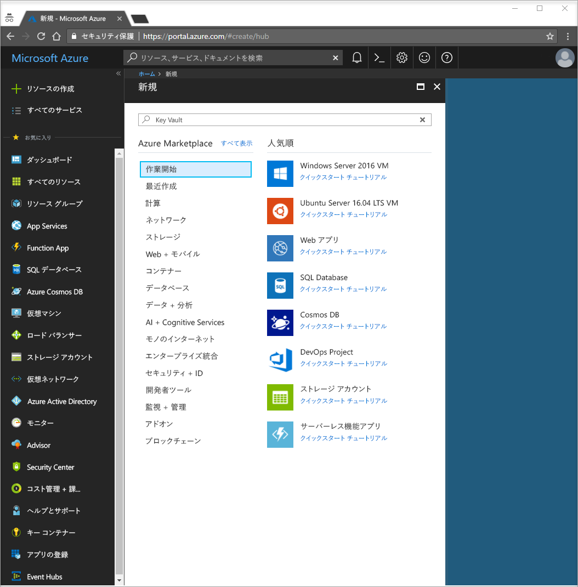
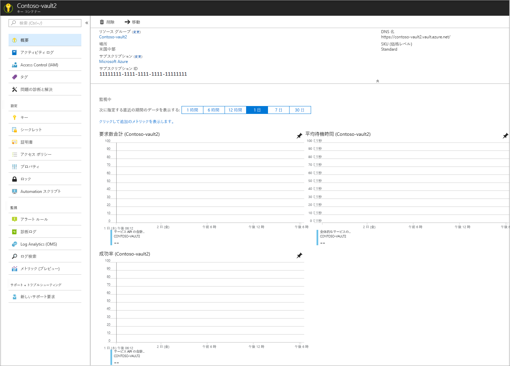

# クイック スタート: Azure portal を使用して Azure Key Vault との間でシークレットの設定と取得を行う

Azure Key Vault は、セキュリティで保護されたシークレット ストアとして機能するクラウド サービスです。 キー、パスワード、証明書、およびその他のシークレットを安全に保管することができます。 Key Vault の詳細については、[概要](key-vault-overview.md)に関するページを参照してください。 Azure Key Vault は、Azure Portal を使用して作成および管理できます。 このクイック スタートでは、キー コンテナーを作成します。 この作業を完了したら、シークレットを格納します。

Azure サブスクリプションをお持ちでない場合は、開始する前に [無料アカウント](https://azure.microsoft.com/free/?WT.mc_id=A261C142F) を作成してください。

## Azure にログインする

Azure Portal (http://portal.azure.com) にログインします。

## コンテナーの作成

1. Azure Portal の左上隅にある **[リソースの作成]** オプションを選択します

    
2. 検索ボックスに「**Key Vault**」と入力します。
3. 結果の一覧の **[Key Vault]** を選択します。
4. Key Vault のセクションで、**[作成]** を選択します。
5. **[キー コンテナーの作成]** セクションで、次の情報を入力します。
    - **[名前]**: このクイック スタートでは、**Contoso-vault2** を使用します。 テストでは一意の名前を指定する必要があります。
    - **[サブスクリプション]**: このクイック スタートに使用するサブスクリプションを選択します。
    - **[リソース グループ]** で、**[新規作成]** を選択し、リソース グループ名を入力します。
    - **[場所]** プルダウン メニューで、場所を選択します。
    - **[ダッシュボードにピン留めする]** チェック ボックスをオンにします。
    - 他のオプションは既定値のままにしておきます。
6. 上記の情報を指定したら、**[作成]** を選択します。

次の 2 つのプロパティをメモしておきます。

* **コンテナーの名前**: この例では、これは **Contoso-Vault2** です。 この名前は他の手順で使用します。
* **Vault URI (コンテナー URI)**: この例では、これは https://contoso-vault2.vault.azure.net/ です。 その REST API から資格情報コンテナーを使用するアプリケーションは、この URI を使用する必要があります。

この時点で、自分の Azure アカウントが唯一、この新しいコンテナーで任意の操作を実行することを許可されています。

## Key Vault にシークレットを追加する

シークレットをコンテナーに追加するには、いくつかの追加の手順を実行する必要があります。 このケースでは、アプリケーションによって使用可能なパスワードを追加します。 パスワードは **ExamplePassword** と呼ばれ、値 **Pa$$w0rd** がその中に格納されます。

1. Key Vault のプロパティ ページで、**[シークレット]** を選択します。
2. **[Generate/Import]\(生成/インポート\)** をクリックします。
3. **[シークレットの作成]** 画面で、次のように選択します。
    - **[アップロード オプション]**: [手動]。
    - **[名前]**: ExamplePassword。
    - **[値]**: Pa$$w0rd。
    - 他の値は既定値のままにしておきます。 **Create** をクリックしてください。

シークレットが正常に作成されたことを示すメッセージが表示されたら、一覧上でそのシークレットをクリックすることができます。 すると、いくつかのプロパティを確認できます。 [現在のバージョン] をクリックすると、前の手順で指定した値が表示されます。

## リソースのクリーンアップ

Key Vault に関する他のクイック スタートとチュートリアルは、このクイック スタートに基づいています。 後続のクイック スタートおよびチュートリアルを引き続き実行する場合は、これらのリソースをそのまま残しておくことをお勧めします。
必要がなくなったら、リソース グループを削除します。これにより、Key Vault と関連リソースが削除されます。 ポータルを使用してリソース グループを削除するには:

1. ポータル上部にある検索ボックスにリソース グループの名前を入力します。 このクイック スタートで使用されているリソース グループが検索結果に表示されたら、それを選択します。
2. **[リソース グループの削除]** を選択します。
3. **[リソース グループ名を入力してください:]** ボックスにリソース グループの名前を入力し、**[削除]** を選択します。

## 次の手順

このクイック スタートでは、Key Vault を作成してシークレットを格納しました。 Key Vault の詳細とアプリケーションでの使用方法については、Key Vault と連携する Web アプリのチュートリアルに進んでください。

> [!div class="nextstepaction"]
> マネージド サービス ID を使用する Web アプリケーションから、Key Vault からのシークレットを読み取る方法を学習するには、[キー コンテナーからシークレットを読み取るように Azure Web アプリを構成する](quick-create-net.md)チュートリアルに進んでください。
