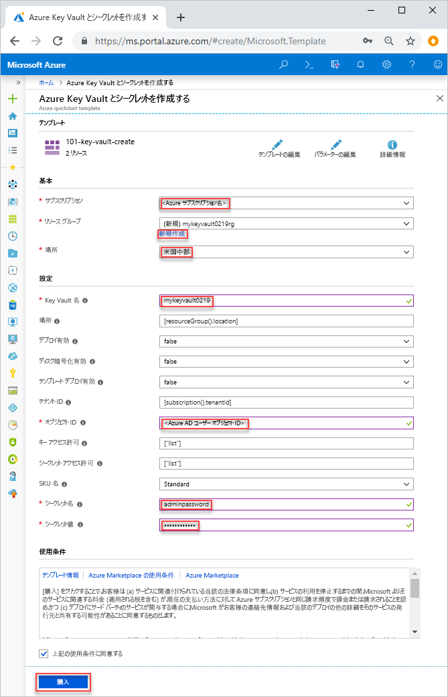
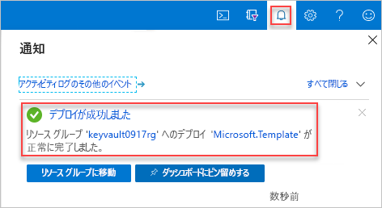

# <a name="quickstart-set-and-retrieve-a-secret-from-azure-key-vault-using-resource-manager-template"></a>クイック スタート:Resource Manager テンプレートを使用した Azure Key Vault からのシークレットの設定と取得

[Azure Key Vault](./key-vault-overview.md) は、キー、パスワード、証明書、その他のシークレットなど、シークレットのための安全な保管場所を提供するクラウド サービスです。 このクイック スタートでは、Resource Manager テンプレートをデプロイしてキー コンテナーとシークレットを作成する過程を中心に取り上げます。

[Resource Manager テンプレート](../azure-resource-manager/template-deployment-overview.md)は JavaScript Object Notation (JSON) ファイルであり、プロジェクトのインフラストラクチャと構成が定義されています。 このテンプレートでは、デプロイしようとしているものを、それを作成する一連のプログラミング コマンドを記述しなくても記述できる、宣言型の構文を使用しています。 Resource Manager テンプレートの開発に関する詳細を学ぶには、[Resource Manager ドキュメント](/azure/azure-resource-manager/)と[テンプレート リファレンス](/azure/templates/microsoft.keyvault/allversions)を参照してください。

Azure サブスクリプションをお持ちでない場合は、開始する前に [無料アカウント](https://azure.microsoft.com/free/?WT.mc_id=A261C142F) を作成してください。

## <a name="prerequisites"></a>前提条件

この記事を完了するには、以下が必要です。

* Azure AD ユーザーオブジェクト ID は、
テンプレートによるアクセス許可の設定で必要です。 次の手順を使用してオブジェクト ID (GUID) を取得します。

    1. **[試してみる]** を選択し、シェル ウィンドウにスクリプトを貼り付けて、次の Azure PowerShell または Azure CLI コマンドを実行します。 スクリプトを貼り付けるには、シェルを右クリックし、 **[貼り付け]** を選択します。

        # <a name="clitabcli"></a>[CLI](#tab/CLI)
        ```azurecli-interactive
        echo "Enter your email address that is used to sign in to Azure:" &&
        read upn &&
        az ad user show --id $upn --query "objectId" &&
        echo "Press [ENTER] to continue ..."
        ```

        # <a name="powershelltabpowershell"></a>[PowerShell](#tab/PowerShell)
        ```azurepowershell-interactive
        $upn = Read-Host -Prompt "Enter your email address used to sign in to Azure"
        (Get-AzADUser -UserPrincipalName $upn).Id
        Write-Host "Press [ENTER] to continue..."
        ```

        ---

    2. オブジェクト ID を書き留めます。 このクイック スタートの次のセクションで必要になります。

## <a name="create-a-vault-and-a-secret"></a>コンテナーとシークレットを作成する

このクイック スタートで使用されるテンプレートは [Azure クイック スタート テンプレート](https://azure.microsoft.com/resources/templates/101-key-vault-create/)からのものです。

[!code-json[<Azure Resource Manager template create key vault>](~/quickstart-templates/101-key-vault-create/azuredeploy.json)]

テンプレートでは、次の 2 つの Azure リソースが定義されています。

* **Microsoft.KeyVault/vaults**: Azure キー コンテナーが作成されます。
* **Microsoft.KeyVault/vaults/secrets**: キー コンテナー シークレットが作成されます。

その他の Azure Key Vault テンプレートのサンプルは[こちら](https://azure.microsoft.com/resources/templates/?resourceType=Microsoft.Keyvault)から入手できます。

1. Azure にサインインし、テンプレートを開くには次のイメージを選択します。 このテンプレートを使用すると、キー コンテナーとシークレットが作成されます。

    <a href="https://portal.azure.com/#create/Microsoft.Template/uri/https%3A%2F%2Fraw.githubusercontent.com%2FAzure%2Fazure-quickstart-templates%2Fmaster%2F101-key-vault-create%2Fazuredeploy.json"></a>

2. 次の値を選択または入力します。

    

    指定がない場合、既定値を使用してキー コンテナーとシークレットを作成してください。

    * **サブスクリプション**: Azure サブスクリプションを選択します。
    * **リソース グループ**: **[新規作成]** を選択し、リソース グループの一意の名前を入力し、 **[OK]** をクリックします。
    * **場所**: 場所を選択します。  たとえば **[米国中部]** です。
    * **Key Vault 名**: キー コンテナーの名前を入力します。この名前は、.vault.azure.net 名前空間内でグローバルに一意である必要があります。 次のセクションでデプロイを検証するときに、その名前が必要です。
    * **テナント ID**: テンプレート関数によって自動的にテナント ID が取得されます。既定値を変更しないでください。
    * **Ad ユーザー ID**: [前提条件](#prerequisites)から取得した Azure AD ユーザー オブジェクト ID を入力します。
    * **シークレット名**: キー コンテナーに格納するシークレットの名前を入力します。  たとえば、**adminpassword** にします。
    * **シークレット値**: シークレットの値を入力します。  パスワードを保管する場合、前提条件で作成したパスワードを使用することをお勧めします。
    * **上記の使用条件に同意する**: 選択。
3. **[購入]** を選択します。 キー コンテナーが正常にデプロイされると、次の通知が表示されます。

    

テンプレートをデプロイするには Azure portal を使用します。 Azure portal だけでなく、Azure PowerShell、Azure CLI、および REST API を使用することもできます。 他のデプロイ方法については、「[テンプレートのデプロイ](../azure-resource-manager/resource-group-template-deploy.md)」を参照してください。

## <a name="validate-the-deployment"></a>デプロイの検証

Azure portal を使用し、キー コンテナーとシークレットを確認するか、次の Azure CLI または Azure PowerShell スクリプトを使用し、作成されたシークレットを一覧表示できます。

# <a name="clitabcli"></a>[CLI](#tab/CLI)

```azurecli-interactive
echo "Enter your key vault name:" &&
read keyVaultName &&
az keyvault secret list --vault-name $keyVaultName &&
echo "Press [ENTER] to continue ..."
```

# <a name="powershelltabpowershell"></a>[PowerShell](#tab/PowerShell)

```azurepowershell-interactive
$keyVaultName = Read-Host -Prompt "Enter your key vault name"
Get-AzKeyVaultSecret -vaultName $keyVaultName
Write-Host "Press [ENTER] to continue..."
```

---

出力は次のようになります。

# <a name="clitabcli"></a>[CLI](#tab/CLI)


# <a name="powershelltabpowershell"></a>[PowerShell](#tab/PowerShell)


---
## <a name="clean-up-resources"></a>リソースをクリーンアップする

Key Vault に関する他のクイック スタートとチュートリアルは、このクイック スタートに基づいています。 後続のクイック スタートおよびチュートリアルを引き続き実行する場合は、これらのリソースをそのまま残しておくことをお勧めします。
不要になったら、リソース グループを削除します。これにより、Key Vault と関連リソースが削除されます。 Azure CLI または Azure PowerShell を使用してリソース グループを削除するには次を実行します。

# <a name="clitabcli"></a>[CLI](#tab/CLI)

```azurecli-interactive
echo "Enter the Resource Group name:" &&
read resourceGroupName &&
az group delete --name $resourceGroupName &&
echo "Press [ENTER] to continue ..."
```

# <a name="powershelltabpowershell"></a>[PowerShell](#tab/PowerShell)

```azurepowershell-interactive
$resourceGroupName = Read-Host -Prompt "Enter the Resource Group name"
Remove-AzResourceGroup -Name $resourceGroupName
Write-Host "Press [ENTER] to continue..."
```

---

## <a name="next-steps"></a>次のステップ

このクイックスタートでは、Azure Resource Manager テンプレートを使用してキー コンテナーとシークレットを作成し、デプロイを検証しました。 Key Vault と Azure Resource Manager の詳細については、引き続き以下の記事を参照してください。

- [Azure Key Vault の概要](key-vault-overview.md)を確認する
- [Azure Resource Manager](../azure-resource-manager/management/overview.md) の詳細を確認する
- [キー、シークレット、証明書](about-keys-secrets-and-certificates.md)についての詳しい情報を入手する
- [Azure Key Vault のベスト プラクティス](key-vault-best-practices.md)を確認する