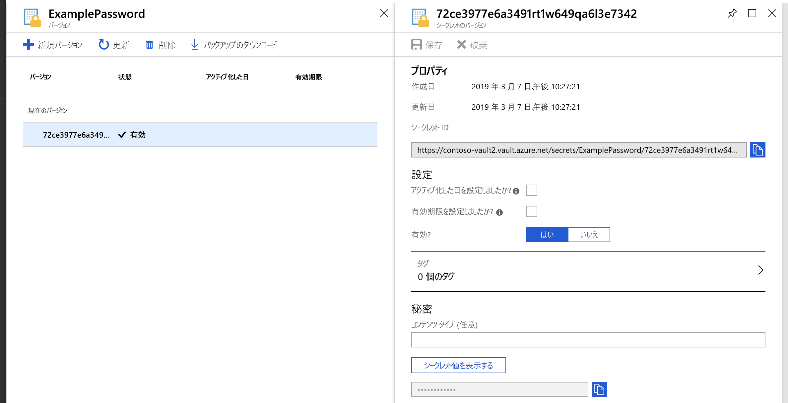
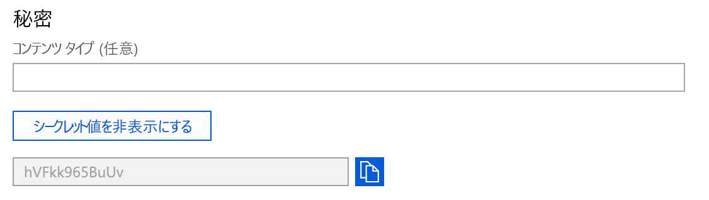

# クイック スタート:Azure portal を使用して Azure Key Vault との間でシークレットの設定と取得を行う

Azure Key Vault は、シークレットのセキュリティで保護されたストアを提供するクラウド サービスです。 キー、パスワード、証明書、およびその他のシークレットを安全に保管することができます。 Azure Key Vault は、Azure Portal を使用して作成および管理できます。 このクイック スタートでは、キー コンテナーを作成し、それを使用してシークレットを格納します。 

詳細については、以下のページを参照してください。 
- [Key Vault の概要](../general/overview.md)
- [シークレットの概要](about-secrets.md)

## 前提条件

Azure Key Vault にアクセスするには、Azure サブスクリプションが必要です。 まだサブスクリプションをお持ちでない場合は、開始する前に[無料アカウント](https://azure.microsoft.com/free/?WT.mc_id=A261C142F)を作成してください。

シークレットへのアクセスはすべて、Azure Key Vault 経由で行われます。 このクイックスタートでは、[Azure portal](../general/quick-create-portal.md)、[Azure CLI](../general/quick-create-cli.md)、または [Azure PowerShell](../general/quick-create-powershell.md) を使用してキー コンテナーを作成します。

## Azure へのサインイン

Azure Portal ( https://portal.azure.com ) にサインインします。

## Key Vault にシークレットを追加する

コンテナーにシークレットを追加するには、次の手順に従います。

1. Azure portal で、新しいキー コンテナーに移動します。
1. Key Vault の設定ページで、 **[シークレット]** を選択します。
1. **[Generate/Import]\(生成/インポート\)** をクリックします。
1. **[シークレットの作成]** 画面で、次の値を選択します。
    - **[アップロード オプション]** :手動。
    - **[名前]** : シークレットの名前を入力します。 シークレットの名前は、キー コンテナー内で一意である必要があります。 名前は、文字で始まり、0 から 9、a から z、A から Z、および - のみを使った 1 から 127 文字の文字列である必要があります。 名前付けの詳細については、[Key Vault のオブジェクト、識別子、バージョン管理](../general/about-keys-secrets-certificates.md#objects-identifiers-and-versioning)に関するセクションを参照してください。
    - **値**: シークレットの値を入力します。 Key Vault API はシークレット値を文字列として受け取って返します。 
    - 他の値は既定値のままにしておきます。 **Create** をクリックしてください。

シークレットが正常に作成されたことを示すメッセージが表示されたら、一覧でそのシークレットをクリックできます。 

シークレットの属性の詳細については、「[Azure Key Vault のシークレットについて](./about-secrets.md)」を参照してください。

## Key Vault からシークレットを取得する

現在のバージョンをクリックすると、前の手順で指定した値が表示されます。

右側のウィンドウで [シークレット値を表示する] ボタンをクリックすると、非表示の値を確認できます。 

以前に作成したシークレットを、[Azure CLI]() または [Azure PowerShell]() を使用して取得することもできます。

## リソースをクリーンアップする

Key Vault に関する他のクイック スタートとチュートリアルは、このクイック スタートに基づいています。 後続のクイック スタートおよびチュートリアルを引き続き実行する場合は、これらのリソースをそのまま残しておくことをお勧めします。
不要になったら、リソース グループを削除します。これにより、Key Vault と関連リソースが削除されます。 ポータルを使用してリソース グループを削除するには:

1. ポータル上部にある検索ボックスにリソース グループの名前を入力します。 このクイック スタートで使用されているリソース グループが検索結果に表示されたら、それを選択します。
2. **[リソース グループの削除]** を選択します。
3. **[リソース グループ名を入力してください:]** ボックスにリソース グループの名前を入力し、 **[削除]** を選択します。

> [!NOTE]
> シークレット、キー、証明書、またはキー コンテナーが削除されると、7 日から 90 日の構成可能な期間にわたって回復可能な状態が維持されることに留意してください。 構成が指定されていない場合、既定の回復期間は 90 日に設定されます。 これにより、ユーザーはシークレットの誤削除に気づき、対応するために十分な時間を確保することができます。 キー コンテナーとキー コンテナー オブジェクトの削除と復旧について詳しくは、「[Azure Key Vault の論理的な削除の概要](../general/soft-delete-overview.md)」を参照してください。

## 次のステップ

このクイックスタートでは、Key Vault を作成してシークレットを格納しました。 Key Vault およびアプリケーションとの統合方法の詳細については、引き続き以下の記事を参照してください。

- [Azure Key Vault の概要](../general/overview.md)を確認する
- 「[キー コンテナーへのアクセスをセキュリティで保護する](../general/secure-your-key-vault.md)」を参照する
- [App Service Web アプリで Key Vault を使用する](../general/tutorial-net-create-vault-azure-web-app.md)方法に関するページを参照する
- [VM にデプロイされたアプリケーションで Key Vault を使用する](../general/tutorial-net-virtual-machine.md)方法に関するページを参照する
- 「[Azure Key Vault 開発者ガイド](../general/developers-guide.md)」を参照する
- [Key Vault のセキュリティの概要](../general/security-overview.md)を確認する