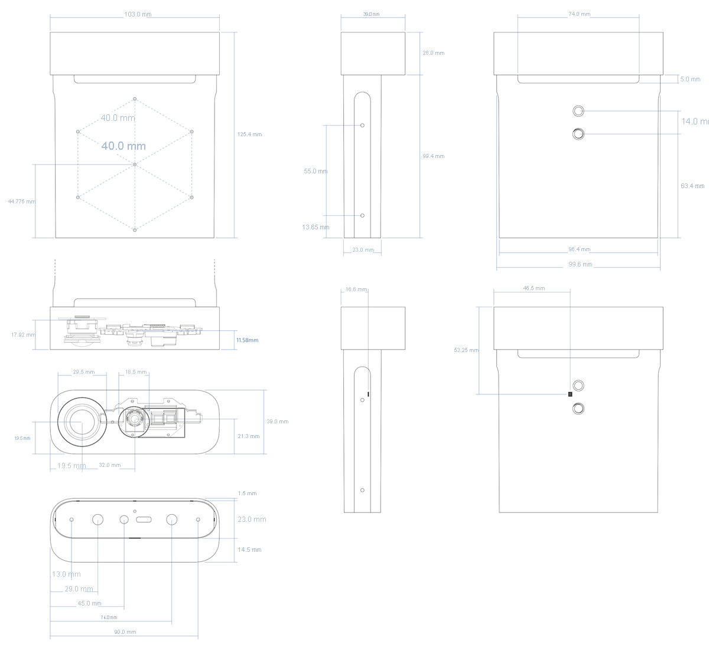

# Azure Kinect DK のハードウェアの仕様

この記事では、Azure Kinect ハードウェアによって Microsoft の最新のセンサー テクノロジが USB 接続の単一のアクセサリにどのように統合されるかについて詳しく説明します。

## Terms

この記事全体で、以下の略語が使用されています。

- NFOV (狭視野深度モード)
- WFOV (広視野深度モード)
- FOV (視野)
- FPS (1 秒あたりのフレーム数)
- IMU (慣性測定装置)
- FoI (対象のフィールド)

## 製品の寸法と重量

Azure Kinect デバイスのサイズと重量は次のとおりです。

- **Dimensions**: 103 x 39 x 126 mm
- **重み**:440 g

## 動作環境

Azure Kinect DK は、次の環境条件下で活動する開発者および営利企業を対象としています。

- **Temperature**:10 から 25°C
- **湿度**: 8 から 90% の相対湿度 (結露がないこと)

> [!NOTE]
> この環境条件を満たさない環境で使用すると、デバイスが故障したり、正常に動作しなくなったりする可能性があります。 これらの環境条件は、あらゆる動作状態おけるデバイス周辺の環境に適用されるものです。 外部エンクロージャ内で使用する場合は、アクティブな温度制御や、その他の冷却ソリューションを使用して、デバイスがこれらの範囲内に保たれるようにすることをお勧めします。 デバイスの設計では、フロント セクションと背面スリーブの間に冷却チャネルが配置されています。 デバイスを導入する場合は、この冷却チャネルを遮らないようにしてください。

製品の[安全に関するその他の情報](https://support.microsoft.com/help/4023454/safety-information)を参照してください。

## 深度カメラでサポートされる動作モード

Azure Kinect DK には、Microsoft が設計した 1 メガピクセルの ToF (Time-of-Flight) 深度カメラが内蔵されています。これには、[ISSCC 2018 で発表された画像センサー](https://docs.microsoft.com/windows/mixed-reality/ISSCC-2018)が使用されています。 この深度カメラは、以下に示すモードをサポートしています。

 | モード            | 解決策 | FoI       | FPS                | 動作範囲* | 露出時間 |
|-----------------|------------|-----------|--------------------|------------------|---------------|
| NFOV Unbinned   | 640 x 576    | 75° x 65°   | 0、5、15、30       | 0.5 から 3.86 m       | 12.8 ミリ秒        |
| NFOV 2x2 Binned (SW) | 320 x 288    | 75° x 65°   | 0、5、15、30       | 0.5 から 5.46 m       | 12.8 ミリ秒        |
| WFOV 2x2 Binned | 512 x 512    | 120° x 120° | 0、5、15、30       | 0.25 から 2.88 m      | 12.8 ミリ秒        |
| WFOV Unbinned   | 1,024 x 1,024  | 120° x 120° | 0、5、15           | 0.25 から 2.21 m      | 20.3 ミリ秒        |
| パッシブ IR      | 1,024 x 1,024  | 該当なし       | 0、5、15、30       | 該当なし              | 1.6 ミリ秒         |

\*850 nm で 15% から 95% の反射率、2.2 μW/cm2/nm、確率的誤差標準偏差 ≤ 17 mm、標準的な系統誤差 < 11 mm + マルチパス干渉のない距離の 0.1%。 オブジェクトの反射率に応じて、指定範囲外の深度が提供されます。

## カラー カメラでサポートされる動作モード

Azure Kinect DK には、OV12A10 12MP CMOS センサー ローリング シャッター センサーが内蔵されています。 ネイティブの動作モードは次のとおりです。

|             RGB カメラ解像度 (H x V)  |          縦横比  |          形式のオプション   |          フレーム レート (FPS)  |          公称 FOV (HxV) (後処理済み)  |
|------------------------------------------|------------------------|---------------------------|-----------------------------|---------------------------------------------|
|       3,840 x 2,160                          |          16:9          |          MJPEG            |          0、5、15、30       |          90° x 59°                              |
|       2,560 x 1,440                          |          16:9          |          MJPEG            |          0、5、15、30       |          90° x 59°                              |
|       1,920 x 1,080                          |          16:9          |          MJPEG            |          0、5、15、30       |          90° x 59°                              |
|       1,280 x 720                           |          16:9          |          MJPEG、YUY2、NV12  |          0、5、15、30       |          90° x 59°                              |
|       4,096 x 3,072                          |          4:3           |          MJPEG             |          0、5、15           |          90° x 74.3°                            |
|       2,048 x 1,536                          |          4:3           |          MJPEG             |          0、5、15、30       |          90° x 74.3°                            |

RGB カメラは、USB ビデオ クラスと互換性があり、Sensor SDK なしで使用できます。 RGB カメラの色空間: BT.601 フル レンジ [0..255]。 

> [!NOTE]
> Sensor SDK は、BGRA ピクセル形式のカラー画像を提供できます。 これはデバイスでサポートされているネイティブ モードではないため、使用すると CPU の負荷が増加します。 ホスト CPU は、デバイスから受信した MJPEG 画像を変換するために使用されます。

## RGB カメラの露出時間の値

許容される RGB カメラの手動露出値のマッピングを次に示します。

| exp| 2^exp | 50 Hz   |60 Hz    |
|----|-------|--------|--------|
| -11|     488|    500|    500 |
| -10|     977|   1250|   1250 |
|  -9|    1,953|   2500|   2500 |
|  -8|    3906|  10000|   8,330 |
|  -7|    7813|  20000|  16,670 |
|  -6|   15625|  30000|  33,330 |
|  -5|   31,250|  40000|  41,670 |
|  -4|   62,500|  50000|  50000 |
|  -3|  125,000|  60000|  66,670 |
|  -2|  250000|  80000|  83,330 |
|  -1|  500000| 100000| 100000 |
|   0| 1000000| 120000| 116,670 |
|   1| 2,000,000| 130,000| 133,330 |

## 深度センサーの生タイミング

深度モード | IR  パルス | パルス  幅  | アイドル  期間| アイドル時間 | 露出   Time
-|-|-|-|-|-
NFOV Unbinned    NFOV 2xx Binned   WFOV 2x2 Binned | 9 | 125 マイクロ秒 | 8 | 1,450 マイクロ秒 | 12.8 ミリ秒 
WFOV Unbinned                                            | 9 | 125 マイクロ秒 | 8 | 2,390 マイクロ秒 | 20.3 ミリ秒

## カメラの視野

次の画像は、深度と RGB カメラの視野、またはセンサーで "見える" 角度を示しています。 この図は、4:3 モードの RGB カメラを示しています。

この画像は、距離 2,000 mm における正面から見たカメラの視野を示しています。

> [!NOTE]
> RGB カメラの深度が NFOV モードの場合、16:9 よりも 4:3 の解像度の方がピクセル オーバーラップが優れています。

## モーション センサー (IMU)

内蔵の慣性測定装置 (IMU) は LSM6DSMUS で、加速度計とジャイロスコープの両方が含まれています。 加速度計とジャイロスコープは、1.6 kHz で同時にサンプリングされます。 サンプルは、208 Hz でホストにレポートされます。

## マイク配列

Azure Kinect DK には、標準の USB オーディオ クラス 2.0 デバイスとして識別される、高品質な 7 台のマイクが円形配列で内蔵されています。 7 つのチャネルすべてにアクセスできます。 パフォーマンス仕様は次のとおりです。

- 感度: -22 dBFS (94 dB SPL、1 kHz)
- 信号対雑音比 > 65 dB
- アコースティック オーバーロード ポイント: 116 dB

## USB

Azure Kinect DK は、次のハードウェア エンドポイントをオペレーティング システムに公開する USB3 複合デバイスです。

ベンダー ID は 0x045E (Microsoft) です。製品 ID の表を次に示します。

|    USB インターフェイス        |    PNP IP    |     Notes            |
|-------------------------|--------------|----------------------|
|    USB 3.1 Gen1 ハブ    |    0x097A    |    メイン ハブ    |
|    USB 2.0 ハブ         |    0x097B    |    HS USB          |
|    深度カメラ       |    0x097C    |    USB 3.0            |
|    カラー カメラ       |    0x097D    |    USB 3.0            |
|    マイク        |    0x097E    |    HS USB          |

## インジケーター

デバイスの前面には、カメラ ストリーミング インジケーターがあります。これは、Sensor SDK を使用してプログラムで無効にできます。

デバイスの背面にある状態 LED は、デバイスの状態を示します。

| ライトの状態     | 意味                                                   |
|-----------------------|------------------------------------------------------------|
| 白で点灯           | デバイスの電源が入っていて、正常に動作しています。                         |
| 白で点滅        | デバイスの電源が入っていますが、USB 3.0 データ接続がありません。   |
| アンバーで点滅        | デバイスが動作するのに十分な電力が供給されていません。               |
| アンバーの後、白で点滅  | ファームウェアの更新または復旧が進行中です                    |

## デバイスへの電力供給

このデバイスには、次の 2 つの方法で電力を供給できます。

1. 付属の電源装置を使用します。 データは、別の USB Type-C to Type-A ケーブルで接続されます。
2. 電源とデータの両方に Type-C to Type-C ケーブルを使用します。

Azure Kinect DK には、Type-C to Type-C ケーブルは付属しません。

> [!NOTE]
> - 付属の電源ケーブルは、USB Type-A からシングル ポスト バレル コネクタに接続します。 付属の壁用電源装置と共にこのケーブルを使用してください。 デバイスは、2 つの標準 USB Type-A ポートで供給できる電力よりも多くの電力を取り出すことができます。
> - USB ケーブルは重要です。高品質のケーブルを使用したうえで、装置をリモートでデプロイする前に機能を確認することをお勧めします。

> [!TIP]
> 適切な Type-C to Type-C ケーブルを選ぶには:
> - [USB 認定ケーブル](https://www.usb.org/products)は、電源とデータの両方をサポートする必要があります。
> - パッシブ ケーブルの長さは 1.5 m 未満でなければなりません。 それよりも長くするには、アクティブ ケーブルを使用してください。 
> - ケーブルでは、1.5 A 以上をサポートする必要があります。 それ以外の場合は、外部電源装置を接続する必要があります。

ケーブルを確認する:

- ケーブルを使用してデバイスをホスト PC に接続します。
- Windows デバイス マネージャーですべてのデバイスが正しく列挙されていることを確認します。 次の例に示すように、深度カメラと RGB カメラが表示されます。

  

- 次の設定を使用して、Azure Kinect ビューアーのすべてのセンサーでケーブルから確実にストリーム配信できることを確認します。

  - 深度カメラ: NFOV Unbinned
  - RGB カメラ: 2160p
  - マイクと IMU が有効

## ライトの意味

電源インジケーターは、お使いの Azure Kinect DK の背面にある LED です。 LED の色は、お使いのデバイスの状態に応じて変化します。

この図では、次のコンポーネントにラベルが付けられています。

1. 電源インジケーター
1. 電源ケーブル (電源に接続)
1. USB-C データ ケーブル (PC に接続)

図のようにケーブルが接続されていることを確認してください。 さらに、次の表で、電源ライトのさまざまな状態が示す意味を確認してください。

|ライトの状態: |意味: |次にすること: |
| ---| --- | --- |
|白で点灯 |デバイスの電源が入っていて、正常に動作しています。 |デバイスを使用します。 |
|消灯 |デバイスが PC に接続されていません。 |丸い電源コネクタ ケーブルがデバイスと USB 電源アダプターに接続されていることを確認します。  USB-C ケーブルがデバイスとお使いの PC に接続されていることを確認します。 |
|白で点滅 |デバイスの電源が入っていますが、USB 3.0 データ接続がありません。 |丸い電源コネクタ ケーブルがデバイスと USB 電源アダプターに接続されていることを確認します。  USB-C ケーブルがデバイスとお使いの PC の USB 3.0 ポートに接続されていることを確認します。  デバイスを PC の別の USB 3.0 ポートに接続します。  お使いの PC でデバイス マネージャー ( **[スタート]**  >  **[コントロール パネル]**  >  **[デバイス マネージャー]** ) を開き、サポートされている USB 3.0 ホスト コントローラーがお使いの PC にあることを確認します。 |
|アンバーで点滅 |デバイスが動作するのに十分な電力が供給されていません。 |丸い電源コネクタ ケーブルがデバイスと USB 電源アダプターに接続されていることを確認します。  USB-C ケーブルがデバイスとお使いの PC に接続されていることを確認します。 |
|アンバーの後、白で点滅 |デバイスの電源が入っていて、ファームウェアの更新プログラムを受信しているか、デバイスの出荷時の設定を復元しています。 |電源インジケーター ライトが白で点灯するまで待ちます。 詳細については、「[Azure Kinect DK をリセットする](reset-azure-kinect-dk.md)」を参照してください。 |

## 電力消費

Azure Kinect DK は最大 5.9 W を消費します。電力消費はユースケースによって変わります。

## 較正

Azure Kinect DK は工場で較正されています。 ビジュアル センサーと慣性センサーの較正パラメーターは、Sensor SDK を使用してプログラムで照会することができます。

## デバイスの復旧

ロック ピンの下にあるボタンを使用して、デバイスのファームウェアを元のファームウェアにリセットできます。

デバイスを復旧するには、[こちらの手順](reset-azure-kinect-dk.md)を参照してください。

## 次のステップ

- [Azure Kinect Sensor SDK を使用する](about-sensor-sdk.md)
- [ハードウェアを設定する](set-up-azure-kinect-dk.md)
