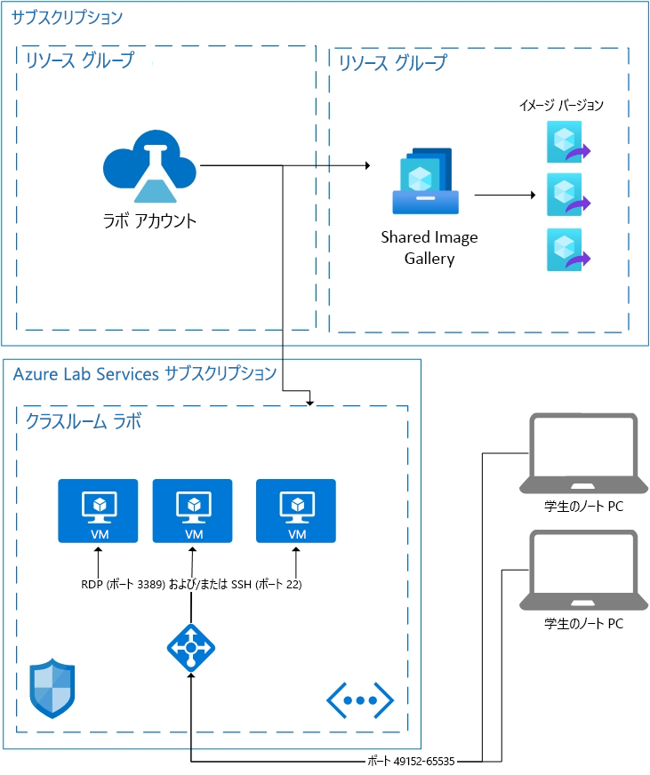

# Azure Lab Services のアーキテクチャの基礎

Azure Lab Services は SaaS (サービスとしてのソフトウェア) ソリューションです。これは、Lab Services に必要なリソースがユーザーに代わって処理されることを意味します。 この記事では、Lab Services で使用される基本的なリソースと、ラボの基本的なアーキテクチャについて説明します。  

Azure Lab Services には、Lab Services と組み合わせて自分独自のリソースを使用できるようにするためのいくつかの領域が用意されています。  独自のネットワーク上で VM を使用する方法について詳しくは、[仮想ネットワークをピアリングする](how-to-connect-peer-virtual-network.md)方法を確認してください。  Shared Image Gallery のイメージを再利用するには、[Shared Image Gallery をアタッチする](how-to-attach-detach-shared-image-gallery.md)方法を確認してください。

次に示すのは、クラスルーム ラボの基本的なアーキテクチャです。  ラボ アカウントはお使いのサブスクリプションでホストされます。 学生用 VM は、VM をサポートするために必要なリソースと共に、Lab Services が所有するサブスクリプションでホストされます。 次に、Lab Services のサブスクリプションの内容について詳しく説明していきます。

## ホストされるリソース

クラスルーム ラボの実行に必要なリソースは、Microsoft によって管理されるいずれかの Azure サブスクリプションでホストされます。  リソースには、講師用のテンプレート仮想マシン、各学生用の仮想マシンのほか、ロード バランサー、仮想ネットワーク、ネットワーク セキュリティ グループなどのネットワーク関連のアイテムがあります。  これらのサブスクリプションは、不審なアクティビティがないか監視されます。  重要なこととして、この監視は VM 拡張機能またはネットワーク パターン監視を通じて仮想マシンの外部で行われることに注意してください。  [切断時のシャットダウン](how-to-enable-shutdown-disconnect.md)が有効な場合、仮想マシンで診断拡張機能が有効になります。 この拡張機能を使用すると、リモート デスクトップ プロトコル (RDP) セッションの切断イベントを Lab Services に通知できます。

## Virtual Network

各ラボは、独自の仮想ネットワークによって分離されています。  ラボに[ピアリングされた仮想ネットワーク](how-to-connect-peer-virtual-network.md)がある場合、各ラボはそれぞれのサブネットによって分離されます。  学生は、ロード バランサーを介して各自の仮想マシンに接続します。  学生の仮想マシンには、パブリック IP アドレスはなく、プライベート IP アドレスのみがあります。  学生用の接続文字列は、ロード バランサーのパブリック IP アドレスと 49152 から 65535 の範囲のランダムなポートの組み合わせになります。  ロード バランサーのインバウンド ルールにより、オペレーティング システムに応じて、適切な仮想マシンのポート 22 (SSH) またはポート 3389 (RDP) に接続が転送されます。 他のポートにおける外部トラフィックは、NSG によって防止されます。

## 仮想マシンに対するアクセス制御

学生が各自の仮想マシンで開始や停止などのアクションを実行する能力は、Lab Services によって管理されます。  また、VM 接続情報へのアクセスも制御されます。

さらに、サービスへの学生の登録も Lab Services によって管理されます。 現在、"制限付き" と "制限なし" という 2 つの異なるアクセス設定があります。 詳細については、[ラボ ユーザーの管理](how-to-configure-student-usage.md#send-invitations-to-users)に関する記事を参照してください。 制限付きアクセスとは、学生にアクセスを許可する前にその学生がユーザーとして追加されていることを Lab Services が確認することを意味します。 "制限なし" とは、登録リンクがあり、ラボに容量がある限り、すべてのユーザーが登録できることを意味します。 "制限なし" はハッカソン イベントに役立ちます。

クラスルーム ラボでホストされる学生の VM には、ラボの作成者によってユーザー名とパスワードが設定されています。  また、ラボの作成者は、登録済みの学生が初めてサインインするときにパスワードを自分で選択できるようにすることも可能です。  

## 次のステップ

Lab Services で使用できる機能の詳細については、[Azure Lab Services の概念](classroom-labs-concepts.md)に関するページと [Azure Lab Services の概要](classroom-labs-overview.md)に関するページを参照してください。
