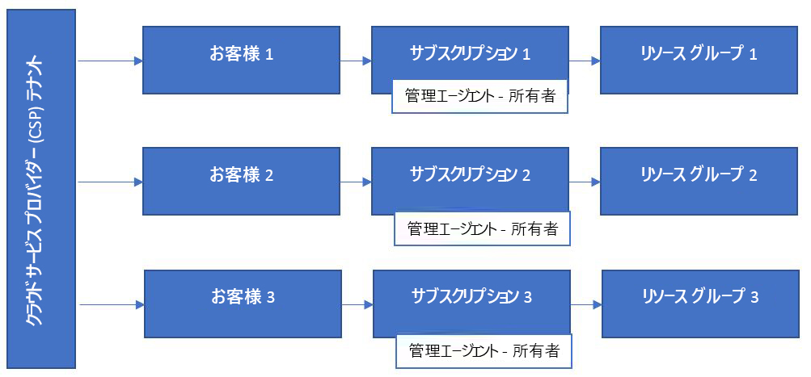
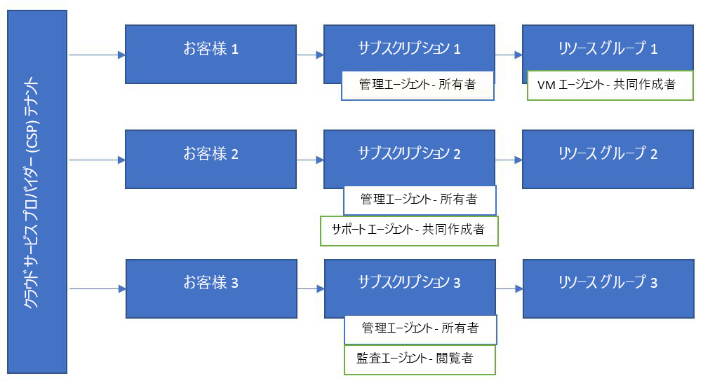

# Azure Lighthouse と Cloud Solution Provider プログラム

[CSP (クラウド ソリューション プロバイダー)](https://docs.microsoft.com/partner-center/csp-overview) パートナーである場合、[代理で管理 (AOBO)](https://channel9.msdn.com/Series/cspdev/Module-11-Admin-On-Behalf-Of-AOBO) 機能を使用して、CSP プログラムを通じて顧客用に作成された Azure サブスクリプションにアクセスできます。 このアクセスにより、顧客のサブスクリプションを直接サポートし、構成し、管理することができます。

AOBO メカニズムにより、顧客環境への完全なアクセス権が付与されます。 Azure の委任されたリソース管理を AOBO と共に使用すると、貴社のユーザー用により詳細なアクセス許可を有効にして不要なアクセスを減らすことで、セキュリティを強化できます。 

## 代理で管理 (AOBO)

AOBO を使用すると、テナント内の[管理エージェント](https://docs.microsoft.com/partner-center/permissions-overview#manage-commercial-transactions-in-partner-center-azure-ad-and-csp-roles) ロールを持つすべてのユーザーが、CSP プログラムを通じて貴社が作成した Azure サブスクリプションへの AOBO アクセス権を持つことになります。 顧客のサブスクリプションにアクセスする必要のあるすべてのユーザーは、このグループのメンバーである必要があります。 AOBO では、異なる顧客と共同作業を行う別々のグループを柔軟に作成したり、グループやユーザーに対して個別のロールを有効にしたりすることはできません。

## Azure の委任されたリソース管理

Azure の委任されたリソース管理を使用すると、次の図に示すように、さまざまなグループをさまざまな顧客またはロールに割り当てることができます。 ユーザーは Azure の委任されたリソース管理によって適切なレベルのアクセス権を持つことになるため、管理エージェント ロールを持つ (つまり、完全な AOBO アクセス権を持つ) ユーザーの数を減らすことができます。 これにより、顧客のリソースへの不要なアクセスを制限することで、セキュリティが大幅に強化されます。 また、より柔軟に、複数の顧客を大規模に管理できます。

CSP プログラムを使用して作成したサブスクリプションをオンボードするには、[Azure の委任されたリソース管理へのサブスクリプションのオンボード](../how-to/onboard-customer.md)に関する記事で説明されている手順を参照してください。 テナント内に管理エージェント ロールを持つすべてのユーザーが、このオンボードを実行できます。

CSP プログラムを使用して作成されたサブスクリプションでは、サポート リクエストは、サービス プロバイダーのテナント内で管理エージェント ロールを持つユーザーのみが生成できます。 Azure の委任されたリソース管理を通じて追加されたユーザーは、これらのサブスクリプションで委任されたリソースに対してサポート リクエストを開くことはできません。

## パートナー管理リンク

オンボードされたサブスクリプションに自分の Microsoft Partner Network (MPN) ID を関連付けると、顧客エンゲージメント全体での影響を追跡できます。

[マネージド サービス オファーを Azure Marketplace に発行](../how-to/publish-managed-services-offers.md)すると、MPN ID が発行者プロファイルに関連付けられ、オファーに自動的に関連付けられます。 このオファーを通じて Azure リソースによって生成された収益が、組織に属性付られます。 パートナーセンターや MPN などのパートナー レポート システム内で、属性はパートナー管理リンク (PAL) として表示されます。

[Azure Resource Manager テンプレートを使用して Azure の委任されたリソース管理のために顧客をオンボーディングする](../how-to/onboard-customer.md)場合も、MPN ID を関連付けて、顧客エンゲージメントへの影響についての認識を得ることができますが、これは手動で行う必要があります。 詳しくは、「[Azure アカウントにパートナー ID をリンクする](https://docs.microsoft.com/azure/billing/billing-partner-admin-link-started)」をご覧ください。 

## 次の手順

- [テナント間の管理エクスペリエンス](cross-tenant-management-experience.md)について学習します。
- [Cloud Solution Provider プログラム](https://docs.microsoft.com/partner-center/csp-overview)について学習します。
