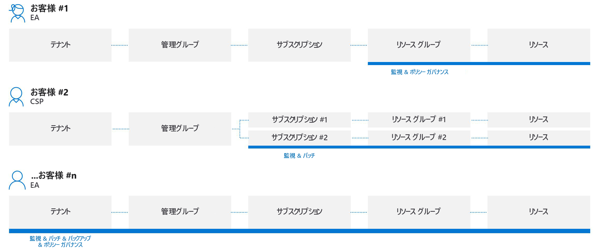
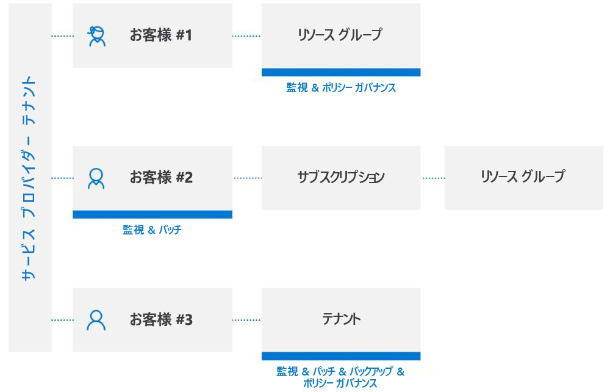

# テナント間の管理エクスペリエンス

サービス プロバイダーは、[Azure portal](https://portal.azure.com) 上で自分のテナント内から複数の顧客の Azure リソースを管理するために、[Azure の委任されたリソース管理](../concepts/azure-delegated-resource-management.md)を使用できます。 ほとんどのタスクとサービスは、委任された Azure リソースに対して、マネージド テナントをまたいで実行できます。 この記事では、Azure の委任されたリソース管理が有効に機能する可能性がある強化されたシナリオの一部について説明します。

> [!NOTE]
> Azure の委任されたリソース管理はまた、[独自の Azure AD テナントが複数存在する企業内で](enterprise.md)使用して、テナントにまたがる管理を簡素化することもできます。

## 顧客のテナントについて

Azure Active Directory (Azure AD) テナントは組織を表したものです。 これは、組織が、Azure、Microsoft 365、またはその他のサービスへのサインアップによって Microsoft との関係を築いたときに提供される Azure AD の専用インスタンスです。 各 Azure AD テナントは、他の Azure AD テナントと区別され分離されており、固有のテナント ID (GUID) があります。 詳細については、「[Azure Active Directory とは](https://docs.microsoft.com/azure/active-directory/fundamentals/active-directory-whatis)」を参照してください。

通常、顧客の Azure リソースを管理するために、サービス プロバイダーは、その顧客のテナントに関連付けられたアカウントを使用して Azure portal にサインインする必要があります。その際、顧客のテナントの管理者は、そのサービス プロバイダー用にユーザー アカウントを作成して管理する必要があります。

Azure の委任されたリソース管理により、オンボード プロセスでは、顧客のテナント内のサブスクリプション、リソース グループ、およびリソースにアクセスして管理できるようにする、サービス プロバイダーのテナント内のユーザーを指定します。 これらのユーザーは、その後、自分の資格情報を使用して Azure portal にサインインできます。 Azure portal 内では、彼らは、アクセスできるすべての顧客に属するリソースを管理できます。 これを行うには、Azure portal の [[マイ カスタマー]](../how-to/view-manage-customers.md) ページにアクセスするか、Azure portal または API を使用してその顧客のサブスクリプションのコンテキスト内で直接作業します。

Azure の委任されたリソース管理を使用すると、テナントによって異なるアカウントにサインインしなくても、複数の顧客のリソースをより柔軟に管理できます。 たとえば、次に示すように、サービス プロバイダーには、役割とアクセス レベルが異なる 3 人の顧客が存在するとします。

Azure の委任されたリソース管理を使用すると、許可されているユーザーは、次に示すように、サービス プロバイダーのテナントにサインインしてこれらのリソースにアクセスすることができます。

## API と管理ツールのサポート

委任されたリソースに対して管理タスクをポータル上で直接実行するか、API および管理ツール (Azure CLI や Azure PowerShell など) を使用して実行することができます。 既存の API はすべて、委任されたリソースを操作するときに使用できます。ただし、テナント間の管理において機能がサポートされており、ユーザーが適切なアクセス許可を持っている必要があります。

また、Microsoft では、Azure の委任されたリソース管理タスクを実行するための API も提供しています。 詳細については、**リファレンス**を参照してください。

## 強化されたサービスとシナリオ

ほとんどのタスクとサービスは、委任されたリソースに対して、マネージド テナントをまたいで実行できます。 テナント間の管理を有効にできる重要なシナリオの一部を以下に示します。

[サーバー向け Azure Arc (プレビュー)](https://docs.microsoft.com/azure/azure-arc/servers/overview):

- Azure 内の委任されたサブスクリプションまたはリソース グループに [Azure外の Windows Server または Linux コンピューターを接続する](https://docs.microsoft.com/azure/azure-arc/servers/quickstart-onboard-portal)
- Azure Policy やタグ付けなどの Azure コンストラクトを使用して接続されたコンピューターを管理する

[Azure Automation](https://docs.microsoft.com/azure/automation/):

- Automation アカウントを使用して、委任された顧客のリソースにアクセスして操作する

[Azure Backup](https://docs.microsoft.com/azure/backup/):

- 顧客のテナントにある顧客データをバックアップおよび復元する

[Azure Kubernetes Service (AKS)](https://docs.microsoft.com//azure/aks/):

- ホストされている Kubernetes 環境を管理し、顧客のテナント内でコンテナー化されたアプリケーションをデプロイして管理する

[Azure Monitor](https://docs.microsoft.com/azure/azure-monitor/):

- すべてのサブスクリプションにわたるアラートを表示する機能を使って、委任されたサブスクリプションに対するアラートを表示する
- 委任されたサブスクリプションのアクティビティ ログの詳細を表示する
- ログ分析: 複数のテナントにあるリモートの顧客ワークスペースからデータを照会する
- 顧客のテナント内に、サービス プロバイダー テナントで Azure Automation Runbook や Azure Functions などの自動化をトリガーするアラートを作成する

[Azure Policy](https://docs.microsoft.com/azure/governance/policy/):

- コンプライアンスのスナップショットで、委任されたサブスクリプション内で割り当てられたポリシーの詳細を表示する
- 委任されたサブスクリプション内でポリシー定義を作成および編集する
- 委任されたサブスクリプション内で顧客が定義したポリシー定義を割り当てる
- 顧客には、サービス プロバイダーが作成したポリシーと顧客自身が作成したポリシーが並べて表示される
- [顧客のテナント内で deployIfNotExists の修復または割り当ての変更を行う](../how-to/deploy-policy-remediation.md)ことができる

[Azure Resource Graph](https://docs.microsoft.com/azure/governance/resource-graph/):

- 返されるクエリ結果にテナント ID が含まれるため、サブスクリプションが顧客のテナントとサービス プロバイダーのテナントのどちらに属しているかを特定できる

[Azure Security Center](https://docs.microsoft.com/azure/security-center/):

- テナント間の表示
  - セキュリティ ポリシーへの準拠を監視し、セキュリティの適用範囲がすべてのテナントのリソースになるようにする
  - 1 つのビューで複数の顧客の規制への順守を継続的に監視する
  - セキュリティ スコアの計算を使用して実行可能なセキュリティの推奨事項の監視、トリアージ、優先度付けを行う
- テナント間のセキュリティ体制の管理
  - セキュリティ ポリシーの管理
  - 実行可能なセキュリティの推奨事項に準拠していないリソースに対処する
  - セキュリティ関連のデータを収集して保存する
- テナント間の脅威の検出と保護
  - テナントのリソース全体で脅威を検出する
  - Just-In-Time (JIT) VM アクセスなど、高度な脅威保護コントロールを適用する
  - アダプティブ ネットワーク強化を使用してネットワーク セキュリティ グループの構成を強化する
  - サーバーで、適応型アプリケーション制御の対象とすべきアプリケーションとプロセスのみが実行されるようにする
  - ファイルの整合性の監視 (FIM) を使用して、重要なファイルとレジストリ エントリに対する変更を監視する

[Azure Sentinel](https://docs.microsoft.com/azure/sentinel/multiple-tenants-service-providers):

- 顧客テナントで Azure Sentinel リソースを管理する

[Azure Service Health](https://docs.microsoft.com/azure/service-health/):

- Azure Resource Health を使用して、顧客のリソースの正常性を監視する
- 顧客が使用している Azure サービスの正常性を追跡する

[Azure Site Recovery](https://docs.microsoft.com/azure/site-recovery/):

- 顧客のテナント内にある Azure 仮想マシンのディザスター リカバリー オプションを管理する (VM 拡張機能のコピーには RunAs アカウントを使用できないことに注意してください)

[Azure Virtual Machines](https://docs.microsoft.com/azure/virtual-machines/):

- 仮想マシン拡張機能を使用して、顧客のテナント内にある Azure VM のデプロイ後の構成と自動タスクを提供する
- ブート診断を使用して、顧客のテナント内にある Azure VM のトラブルシューティングを行う
- 顧客のテナントでシリアルコンソールを使用して VM にアクセスする
- VM へのリモート ログインには Azure Active Directory を使用できないことと、ディスク暗号化用のパスワード、シークレット、暗号化キーのキー コンテナーと VM を統合できないことに注意する

[Azure Virtual Network](https://docs.microsoft.com/azure/virtual-network/):

- 顧客のテナント内で仮想ネットワークと仮想ネットワーク インターフェイス カード (vNIC) をデプロイして管理する

サポート リクエスト:

- Azure portal の **[ヘルプとサポート]** ブレードで、委任されたリソースに対するサポート リクエストを開く (委任されたスコープで利用可能なサポート プランを選択する)

## 現時点での制限事項
すべてのシナリオで、次に示す現在の制限事項に注意してください。

- Azure Resource Manager で処理される要求は、Azure の委任されたリソース管理を使用して実行できます。 これらの要求の操作 URI は、`https://management.azure.com` で始まります。 ただし、リソースの種類のインスタンス (KeyVault のシークレット アクセスやストレージのデータ アクセスなど) によって処理される要求は、Azure の委任されたリソース管理ではサポートされていません。 これらの要求の操作 URI は、通常、`https://myaccount.blob.core.windows.net` や `https://mykeyvault.vault.azure.net/` など、実際のインスタンスに固有のアドレスで始まります。 また、通常、後者は管理操作ではなくデータ操作です。 
- ロールの割り当てでは、ロールベースのアクセス制御 (RBAC) の[組み込みロール](https://docs.microsoft.com/azure/role-based-access-control/built-in-roles)を使用する必要があります。 現在、組み込みロールはすべて、Azure の委任されたリソース管理によってサポートされています。ただし、所有者または [DataActions](https://docs.microsoft.com/azure/role-based-access-control/role-definitions#dataactions) アクセス許可を持つ組み込みロールは除きます。 [マネージド ID へのロールの割り当て](../how-to/deploy-policy-remediation.md#create-a-user-who-can-assign-roles-to-a-managed-identity-in-the-customer-tenant)において、ユーザー アクセス管理者ロールは、限定された用途のみに対してサポートされています。  カスタム ロールと[従来のサブスクリプション管理者ロール](https://docs.microsoft.com/azure/role-based-access-control/classic-administrators)はサポートされていません。
- 現在、サブスクリプションで Azure Databricks が使用されている場合、Azure の委任されたリソース管理用にそのサブスクリプション (またはサブスクリプション内のリソース グループ) をオンボードすることはできません。 同様に、サブスクリプションがオンボードのために **Microsoft.ManagedServices** リソースプロバイダーに登録されている場合、この時点ではそのサブスクリプション用に Databricks ワークスペースを作成することはできなくなります。
- リソース ロックがある Azure の委任されたリソース管理のサブスクリプションとリソース グループをオンボードすることはできますが、このようなロックがあっても、管理テナントのユーザーによるアクションの実行は妨げられません。 Azure マネージド アプリケーションまたは Azure Blueprints (システム割り当ての拒否割り当て) によって作成されたものなど、システムの管理対象リソースを保護する[拒否割り当て](https://docs.microsoft.com/azure/role-based-access-control/deny-assignments)がある場合、管理テナントのユーザーはそれらのリソースを操作できません。ただし、現時点では、顧客テナントのユーザーは自分の拒否割り当て (ユーザー割り当て拒否割り当て) を作成できません。

## 次の手順

- [Azure Resource Manager テンプレートを使用する](../how-to/onboard-customer.md)か[プライベートまたはパブリックのマネージド サービスのオファーを Azure Marketplace に公開する](../how-to/publish-managed-services-offers.md)ことで、Azure の委任されたリソース管理に顧客をオンボードします。
- Azure portal の **[マイ カスタマー]** に移動して、[顧客を表示および管理](../how-to/view-manage-customers.md)します。
