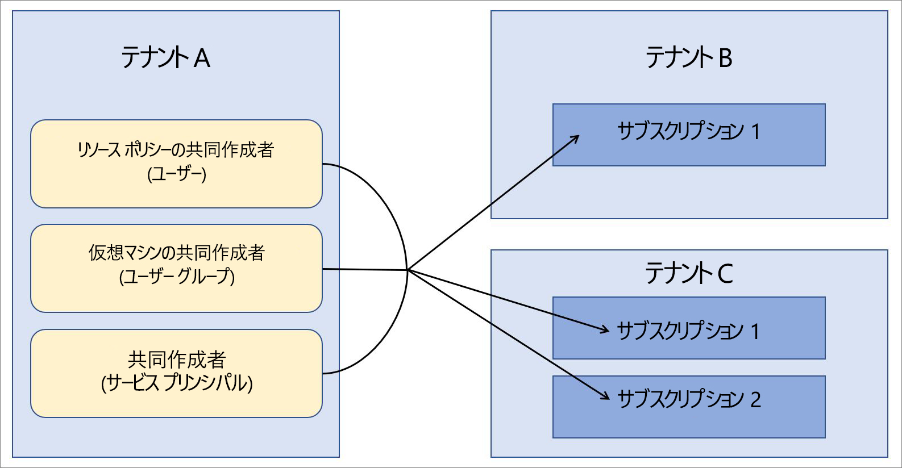

# エンタープライズ シナリオにおける Azure Lighthouse

[Azure Lighthouse](../overview.md) の最も一般的なシナリオは、顧客の Azure Active Directory (Azure AD) テナントのリソースを管理するサービス プロバイダーです。 ただし、Azure Lighthouse の機能を使用して、複数の Azure AD テナントを使用するエンタープライズ内のクロステナント管理を簡略化することもできます。

## シングル テナントと複数テナント

ほとんどの組織では、1 つの Azure AD テナントの方が管理が簡単です。 1 つのテナント内にすべてのリソースを配置することで、そのテナント内の指定されたユーザー、ユーザー グループ、またはサービス プリンシパルによる管理タスクを一元化できます。 可能な場合は、組織で 1 つのテナントを使用することをお勧めします。

同時に、複数の Azure AD テナントを管理する必要がある場合もあります。 場合によっては、これは一時的な状況の可能性があります。買収が行われ、長期的なテナント統合戦略の定義に時間がかかるときなどです。 また、場合によっては、組織が複数のテナントを継続的に管理する必要があります (完全に独立した子会社、地理的または法的な要件などのため)。 マルチテナント アーキテクチャが必要な場合は、Azure の委任されたリソース管理を使用して、管理操作を一元化し、合理化することができます。 [Azure の委任されたリソース管理](azure-delegated-resource-management.md)では、複数のテナントのサブスクリプションをオンボードすることができます。これにより、管理しているテナントの特定のユーザーは、[一元的でスケーラブルな方法で](cross-tenant-management-experience.md)クロステナント管理機能を実行できます。

## テナント管理のアーキテクチャ

複数のテナントにわたって管理操作を一元化する場合は、他のテナントの管理操作を実行するユーザーを含めるテナントを決定する必要があります。 言い換えると、どのテナントが他のテナントの管理テナントであるかを決定する必要があります。

たとえば、組織に 1 つのテナントがあるとします。ここでは、*Tenant A* と呼びます。その後、組織は *Tenant B* と *Tenant C* の 2 つの追加テナントを取得します。これらを個別のテナントとして維持する必要があるビジネス上の理由があります。

組織では、すべてのテナントで同じポリシー定義、バックアップ方法、およびセキュリティ プロセスを使用する必要があります。 テナント A 内でこれらのタスクの実行を担当するユーザー (ユーザー グループとサービス プリンシパルを含む) が既に存在するため、テナント A 内の同じユーザーがこれらのタスクを実行できるように、テナント B とテナント C 内のすべてのサブスクリプションをオンボードできます。

## セキュリティとアクセスに関する考慮事項

ほとんどのエンタープライズ シナリオでは、Azure の委任されたリソース管理には完全なサブスクリプションを委任することをお勧めしますが、サブスクリプション内の特定のリソース グループのみを委任することもできます。

いずれの場合でも、[リソース にアクセスできるユーザーを定義する際には、必ず最小限の特権の原則に従ってください](recommended-security-practices.md#assign-permissions-to-groups-using-the-principle-of-least-privilege)。 こうすることで、ユーザーが必要なタスクを実行するために必要なアクセス許可のみを持ち、不注意によるエラーが発生する可能性を減らすことができます。

Azure Lighthouse と Azure の委任されたリソース管理では、データやリソースを物理的に移動するのではなく、管理側テナントと管理対象テナントの間に論理的なリンクのみを提供します。 さらに、アクセスは、常に管理側テナントから管理対象テナントへの一方向のみです。  管理対象テナントのリソースに対して管理操作を実行する場合は、管理側テナントのユーザーとグループが引き続き多要素認証を使用する必要があります。

内部または外部のガバナンスとコンプライアンスのガードレールを持つ企業の場合、[Azure アクティビティ ログ](../../azure-monitor/platform/platform-logs-overview.md)を使用して透過性の要件を満たすことができます。 企業のテナントが管理側テナントと管理対象テナントのリレーションシップを確立すると、各テナントのユーザーは、ログに記録されたアクティビティを表示することで、他のテナントのユーザーが実行したアクションを監視し、把握することができます。

## オンボード プロセスに関する考慮事項

サブスクリプション (またはサブスクリプション内のリソース グループ) を Azure の委任されたリソース管理にオンボーディングするには、Azure Resource Manager テンプレートをデプロイするか、Azure Marketplace に非公開または公開として発行されたマネージド サービス オファーを使用します。

通常、企業ユーザーは企業のテナントに直接アクセスできます。また、管理オファリングを市場に投入したり宣伝したりする必要がないので、一般に、Azure Resource Manager テンプレートを使用して直接デプロイする方がより高速で簡単です。 [オンボーディング ガイダンス](../how-to/onboard-customer.md)ではサービス プロバイダーと顧客の場合について説明していますが、企業は同じプロセスを使用できます。

必要に応じて、[マネージド サービス オファーを Azure Marketplace に公開](../how-to/publish-managed-services-offers.md)して、企業内のテナントをオンボーディングすることもできます。 オファーが適切なテナントでのみ利用できるようにするには、必ずプランを非公開とマークします。 非公開プランの場合、オンボードする予定の各テナントのサブスクリプション ID を指定できます。また、他のユーザーはプランを取得できなくなります。

## 用語に関する注意事項

企業内でのクロステナント管理の場合、Azure Lighthouse ドキュメント内のサービス プロバイダーに関する説明を理解すると、企業内の管理側テナント (つまり、Azure の委任されたリソース管理を使用して、他のテナント内のリソースを管理するユーザーを含むテナント) に適用することができます。 同様に、顧客に関する説明を理解すると、管理側テナントのユーザーによって管理されるリソースを委任するテナントに適用することができます。

たとえば、上記の例では、テナント A はサービス プロバイダー テナント (管理側テナント)、テナント B とテナント C は顧客テナントと考えることができます。

この例では、適切なアクセス許可を持つテナント A のユーザーは、Azure portal の **[マイ カスタマー]** ページで、[委任されたリソースを表示および管理](../how-to/view-manage-customers.md)できます。 同様に、適切なアクセス許可を持つテナント B とテナント C のユーザーは、Azure portal の **[サービス プロバイダー]** ページで、テナント A に[委任されたリソースを表示および管理](../how-to/view-manage-service-providers.md)できます。

## 次のステップ

- [テナント間の管理エクスペリエンス](cross-tenant-management-experience.md)について学習します。
- [Azure の委任されたリソース管理](azure-delegated-resource-management.md)について学習してください。