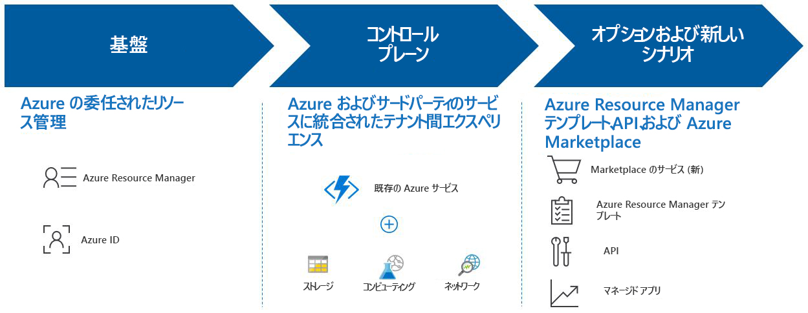

# Azure Lighthouse とは

Azure Lighthouse からは、高度な自動化、拡張、統制機能を利用し、すべての顧客を対象に Azure を表示し、管理するための単一制御プレーンがサービス プロバイダーに与えられます。 Azure Lighthouse を使用すれば、Azure プラットフォームに組み込まれた包括的かつ信頼性の高い管理ツールを使用して、サービス プロバイダーがマネージド サービスを提供できるようになります。 企業の IT 組織が複数のテナントにまたがってリソースを管理する場合にも有益なオファリングとなっています。

## メリット

Azure Lighthouse を使用すると、収益面で有利に、かつ効率よくマネージド サービスを構築し、顧客に提供することができます。 次の利点があります。

- **大規模な管理**: 顧客エンゲージメントとライフサイクル操作によって顧客リソースの管理が容易になり、スケーラビリティが向上します。
- **顧客から見た可視性と精度の向上**: 貴社の知的財産権が損なわれることなく、管理対象リソースの所有者である顧客が、実行された操作をよりよく把握し、管理の委任範囲を細かく制御できるようになります。
- **包括的で一元化されたプラットフォーム ツール**: Microsoft のツールエクスペリエンスは、EA、CSP、従量課金制などの複数のライセンス モデルを含む、サービス プロバイダーの主要なシナリオに対応しています。 その新しい機能は、既存のツールと API、ライセンスモデル、[クラウドソリューションプロバイダープログラム (CSP)](https://docs.microsoft.com/partner-center/csp-overview) などのパートナープログラムと連動します。 選択した Azure Lighthouse オプションは、既存のワークフローとアプリケーションに統合できます。また、[パートナー ID をリンク](https://docs.microsoft.com/azure/billing/billing-partner-admin-link-started)することで、顧客エンゲージメントへの影響を追跡できます。

Azure Lighthouse を使用して顧客の Azure リソースを管理することに関して、追加コストは発生しません。

## 機能

Azure Lighthouse には、顧客エンゲージメントと顧客管理を効率化するさまざまな方法が用意されています。

- **Azure の委任されたリソース管理**: コンテキストやコントロール プレーンを切り替えることなく、貴社独自のテナント内から顧客の Azure リソースを安全に管理できます。 詳細については、「[Azure の委任されたリソース管理](./concepts/azure-delegated-resource-management.md)」を参照してください。
- **新しい Azure portal エクスペリエンス**: [Azure portal](https://portal.azure.com) の新しい **[マイ カスタマー]** ページで、テナント間の情報を確認できます。 それに対応する **[サービス プロバイダー]** ブレードで、顧客はサービス プロバイダーのアクセスを確認し、管理することができます。 詳細については、「[顧客を表示し、管理する](./how-to/view-manage-customers.md)」および「[サービス プロバイダーを表示し、管理する](./how-to/view-manage-service-providers.md)」を参照してください。
- **Azure Resource Manager テンプレート**: Azure の委任されたリソース管理への顧客のオンボーディングを含め、管理タスクを容易に行えます。 詳細については、Microsoft の[サンプル リポジトリ](https://github.com/Azure/Azure-Lighthouse-samples/tree/master/Azure-Delegated-Resource-Management/templates)および「[Azure の委任されたリソース管理に顧客をオンボードする](how-to/onboard-customer.md)」を参照してください。
- **Azure Marketplace のマネージド サービス オファー**: プライベート オファーまたはパブリック オファーを通じて貴社のサービスを顧客に提供できます。Azure Resource Manager テンプレートを使用したオンボードに代わる方法として、Azure の委任されたリソース管理に顧客を自動的にオンボードすることができます。 詳細については、「[Azure Marketplace のマネージド サービス オファー](./concepts/managed-services-offers.md)」を参照してください。
- **Azure マネージド アプリケーション**: 顧客が自身のサブスクリプションに簡単にデプロイして使用できるアプリケーションをパッケージ化して出荷できます。 アプリケーションは、貴社がそのテナントからアクセスできるリソース グループにデプロイされるので、貴社が全体的な Azure Lighthouse エクスペリエンスの一部としてサービスを管理することができます。 詳細については、「[Azure マネージド アプリケーションの概要](https://docs.microsoft.com/azure/managed-applications/overview)」を参照してください。

> [!NOTE]
> ここで説明した機能は現在、パブリック クラウドで提供されています。 各サービスのリージョン別の提供状況については、「[リージョン別の利用可能な製品](https://azure.microsoft.com/global-infrastructure/services/)」を参照してください。