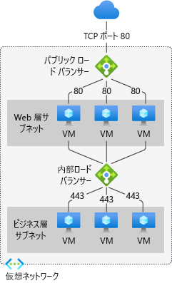
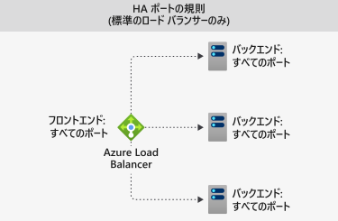

# Azure Load Balancer のコンポーネント

Azure Load Balancer には、重要なコンポーネントがいくつか含まれています。 これらのコンポーネントは次を利用し、自分のサブスクリプション内で構成できます。

* Azure portal
* Azure CLI
* Azure PowerShell
* リソース マネージャーのテンプレート

## フロントエンド IP の構成 

Azure Load Balancer の IP アドレスです。 クライアントにとっての接続点となります。 これらの IP アドレスは、次のいずれかになります。

- **パブリック IP アドレス**
- **プライベート IP アドレス**

IP アドレスの特質によって、作成されるロード バランサーの **種類** が決まります。 プライベート IP アドレスを選択した場合は、内部ロード バランサーが作成されます。 パブリック IP アドレスを選択した場合は、パブリック ロード バランサーが作成されます。

|  | パブリック ロード バランサー  | 内部ロード バランサー |
| ---------- | ---------- | ---------- |
| **フロントエンド IP の構成**| パブリック IP アドレス | プライベート IP アドレス|
| **説明** | パブリック ロード バランサーは、受信トラフィックのパブリック IP およびポートを、VM のプライベート IP およびポートにマップします。 ロード バランサーは、VM からの応答トラフィックについてはその逆にマップします。 負荷分散規則を適用することで、特定の種類のトラフィックを複数の VM やサービスに分散できます。 たとえば、複数の Web サーバー間で Web 要求のトラフィックの負荷を分散できます。| 内部ロード バランサーは、仮想ネットワーク内のリソースにトラフィックを分散させます。 負荷分散の対象となる、仮想ネットワークのフロントエンド IP アドレスは、Azure によってアクセスが制限されます。 フロントエンド IP アドレスと仮想ネットワークは、インターネット エンドポイントに直接公開されることはありません。 社内の基幹業務アプリケーションは Azure で実行され、Azure 内またはオンプレミス リソースからアクセスされます。 |
| **サポートされている SKU** | Basic、Standard | Basic、Standard |

ロード バランサーには、複数のフロントエンド IP を割り当てることができます。 [複数のフロントエンド](load-balancer-multivip-overview.md)の詳細については、こちらをご覧ください。

## バックエンド プール

受信要求を処理する仮想マシンのグループまたは仮想マシン スケール セット内のインスタンスのグループ。 コスト効果に優れた方法でスケーリングして大量の受信トラフィックに対処するために、コンピューティングのガイドラインでは通常、バックエンド プールにインスタンスを追加することが推奨されます。

ロード バランサーは、インスタンスがスケールアップまたはスケールダウンされると、自動再構成を通じてすぐに自身を再構成します。 バックエンド プールの VM を追加または削除すると、追加操作なしに、ロード バランサーが再構成されます。 バックエンド プールのスコープは、仮想ネットワーク内の任意の仮想マシンです。

バックエンド プールの設計方法を検討するときは、個々のバックエンド プール リソースを最小限の数に設計して、管理操作の期間を最適化します。 データ プレーンのパフォーマンスやスケールに違いはありません。

## 正常性プローブ

正常性プローブは、バックエンド プール内のインスタンスの正常性状態を判断するために使用されます。 ロード バランサーの作成中に、ロード バランサーで使用する正常性プローブを構成します。  この正常性プローブによって、インスタンスが正常で、トラフィックを受信できるかどうかが判断されます。

正常性プローブには、異常しきい値を定義できます。 プローブで応答できない場合、ロード バランサーは異常なインスタンスへの新しい接続の送信を停止します。 プローブの失敗は、既存の接続には影響しません。 接続は、アプリケーションが以下を実行するまで続行されます。

- フローを終了する
- アイドル タイムアウトが発生する
- VM がシャットダウンする

ロード バランサーは、エンドポイントにさまざまな種類の正常性プローブを提供します。TCP、HTTP、HTTPS です。 [Load Balancer の正常性プローブの詳細については、こちらをご覧ください](load-balancer-custom-probe-overview.md)。

Basic Load Balancer では、HTTPS プローブはサポートされていません。 Basic Load Balancer は、すべての TCP 接続 (確立済み接続を含む) を終了します。

## 負荷分散規則

負荷分散規則は、バックエンド プール内の **すべて** のインスタンスに受信トラフィックを分散する方法を定義するために使用されます。 負荷分散規則により、フロントエンドの特定の IP 構成およびポートがバックエンドの複数の IP アドレスおよびポートにマップされます。

たとえば、フロントエンド IP からバックエンド インスタンスのポート 80 にトラフィックを送信する負荷分散規則をポート 80 に使用します。

:::image type="content" source="./media/load-balancer-components/lbrules.png" alt-text="負荷分散規則の参照図" border="false":::

*図:負荷分散規則*

## 高可用性ポート

**'protocol - all and port - 0'** で構成されたロード バランサー規則。 

この規則では、内部 Standard Load Balancer のすべてのポートに到着するすべての TCP フローと UDP フローを単一の規則によって負荷分散できます。 

負荷分散の決定は、フローごとに行われます。 このアクションは、次の 5 組の接続に基づいています。 

1. 発信元 IP アドレス
2. 発信元ポート
3. 宛先 IP アドレス
4. 宛先ポート
5. protocol

HA ポート負荷分散規則は、仮想ネットワーク内のネットワーク仮想アプライアンス (NVA) の高可用性と拡張性のような、重要なシナリオで役に立ちます。 この機能は、数多くのポートを負荷分散する必要がある場合に役立ちます。

  

*図:HA ポートの規則*

HA ポートの詳細については[こちら](load-balancer-ha-ports-overview.md)をご覧ください。

## 受信 NAT のルール

インバウンド NAT 規則によって、フロントエンド IP アドレスとポートの組み合わせに送信された受信トラフィックが転送されます。 トラフィックは、バックエンド プール内の **特定** の仮想マシンまたはインスタンスに送信されます。 ポート フォワーディングも、負荷分散と同じハッシュベースの分散によって実行されます。

:::image type="content" source="./media/load-balancer-components/inboundnatrules.png" alt-text="インバウンド NAT 規則の参照図" border="false":::

*図:インバウンド NAT 規則*

Virtual Machine Scale Sets のコンテキストでの受信 NAT 規則は、受信 NAT プールです。 ロード バランサー コンポーネントと仮想マシン スケール セットの詳細については[こちら](../virtual-machine-scale-sets/virtual-machine-scale-sets-networking.md#azure-virtual-machine-scale-sets-with-azure-load-balancer)をご覧ください。

## アウトバウンド規則

すべての仮想マシン、またはバックエンド プールによって識別されたインスタンスを対象とするアウトバウンド ネットワーク アドレス変換 (NAT) は、アウトバウンド規則によって構成します。 この規則により、バックエンド内のインスタンスがインターネットやその他のエンドポイントに通信 (送信) できるようになります。

[送信接続と規則](load-balancer-outbound-connections.md)の詳細については、こちらをご覧ください。

Basic ロード バランサーでは、アウトバウンド規則がサポートされていません。

:::image type="content" source="./media/load-balancer-components/outbound-rules.png" alt-text="アウトバウンド規則の参照図" border="false":::

*図:アウトバウンド規則*

## 制限事項

- ロード バランサーの[制限](../azure-resource-manager/management/azure-subscription-service-limits.md)を確認してください 
- ロード バランサーは特定の TCP または UDP プロトコルに対する負荷分散とポート フォワーディングを行います。 負荷分散規則と受信 NAT 規則は TCP および UDP をサポートしますが、ICMP を含む他の IP プロトコルはサポートしていません。
- 内部 Load Balancer のフロントエンドへのバックエンド VM からのアウトバウンド フローは失敗します。
- ロード バランサーの規則は、2 つの仮想ネットワークにまたがることはできません。  フロントエンドとそのバックエンド インスタンスは、同じ仮想ネットワークに配置されている必要があります。  
- 負荷分散規則では、IP フラグメントの転送はサポートされていません。 UDP パケットと TCP パケットの IP の断片化は負荷分散規則ではサポートされていません。 HA ポートの負荷分散規則を使用すると、既存の IP フラグメントを転送できます。 詳細については、「[高可用性ポートの概要](load-balancer-ha-ports-overview.md)」を参照してください。
- 可用性セットごとに、1 つのパブリック ロード バランサーと 1 つの内部ロード バランサーのみを使用できます

## 次のステップ

- ロード バランサーの使用を開始するには、[パブリックな Standard ロード バランサーの作成](quickstart-load-balancer-standard-public-portal.md)に関する記事を参照してください。
- [Azure Load Balancer](load-balancer-overview.md) についてさらに詳しく学習する。
- [パブリック IP アドレス](../virtual-network/virtual-network-public-ip-address.md)について学習する。
- [プライベート IP アドレス](../virtual-network/private-ip-addresses.md)について学習する。
- [Standard ロード バランサーと可用性ゾーン](load-balancer-standard-availability-zones.md)の使用について学習する。
- [Standard ロード バランサーの診断](load-balancer-standard-diagnostics.md)について学習する。
- [アイドル時の TCP リセット](load-balancer-tcp-reset.md)について学習する。
- [HA ポート負荷分散ルールでの Standard ロード バランサー](load-balancer-ha-ports-overview.md)について学習する。
- [ネットワーク セキュリティ グループ](../virtual-network/network-security-groups-overview.md)の詳細を確認する。
- [ロード バランサーの制限](../azure-resource-manager/management/azure-subscription-service-limits.md#load-balancer)について詳細を確認する。
- [ポート フォワーディング](./tutorial-load-balancer-port-forwarding-portal.md)の使用について学習する。
