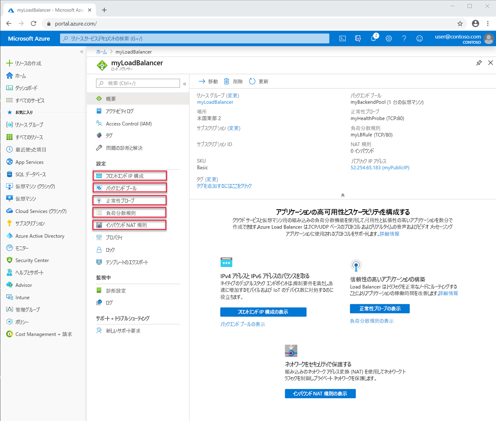

# Load Balancer のコンポーネントと制限事項
Azure Load Balancer には、その操作に必要な重要なコンポーネントがいくつか含まれています。  これらのコンポーネントは、サブスクリプションで、Azure portal、Azure CLI、または Azure PowerShell を使用して構成できます。  

## Load Balancer のコンポーネント

* **フロントエンド IP 構成**: ロード バランサーの IP アドレスです。 クライアントにとっての接続点となります。 これらのアドレスは、次のいずれかになります。 

    - **[パブリック IP アドレス](https://docs.microsoft.com/azure/virtual-network/virtual-network-public-ip-address)**
    - **[プライベート IP アドレス](https://docs.microsoft.com/azure/virtual-network/virtual-network-ip-addresses-overview-arm#private-ip-addresses)**

* **[バックエンド プール]** : 受信要求を処理することになる仮想マシンのグループまたは仮想マシン スケール セット内のインスタンスのグループ。 コスト効果に優れた方法でスケーリングして大量の受信トラフィックに対処するために、コンピューティングのガイドラインでは通常、バックエンド プールにインスタンスを追加することが推奨されます。 Load Balancer は、インスタンスがスケールアップまたはスケールダウンされると、自動再構成を通じてすぐに自身を再構成します。 バックエンド プールの VM を追加または削除すると、追加操作なしに、Load Balancer が再構成されます。 バックエンド プールのスコープは、仮想ネットワーク内の任意の仮想マシンです。 バックエンド プールには、最大 1,000 個のバックエンド インスタンスまたは IP 構成を含めることができます。
Basic Load Balancer ではスコープ (可用性セット) が制限されており、スケールアップは最大 300 個の IP 構成に限定されます。 制限の詳細については、「[Load Balancer の制限](https://docs.microsoft.com/azure/azure-resource-manager/management/azure-subscription-service-limits#load-balancer)」を参照してください。 バックエンド プールの設計方法を検討するときは、個々のバックエンド プール リソースを最小限の数に設計して、管理操作の期間をさらに最適化できます。 データ プレーンのパフォーマンスやスケールに違いはありません。
* **正常性プローブ**: **[正常性プローブ](https://docs.microsoft.com/azure/load-balancer/load-balancer-custom-probe-overview)** は、バックエンド プール内のインスタンスの正常性を判断する目的で使用されます。 正常性プローブには、異常しきい値を定義できます。 プローブで応答できない場合、Load Balancer は異常なインスタンスへの新しい接続の送信を停止します。 プローブの失敗は、既存の接続には影響しません。 
    
    接続は、アプリケーションが以下を実行するまで続行されます。 
    - フローを終了する
    - アイドル タイムアウトが発生する
    - VM がシャットダウンする

    Load Balancer は、エンドポイントにさまざまな種類の正常性プローブを提供します。
    - TCP
    - HTTP
    - HTTPS (トランスポート層セキュリティ (TLS) ラッパーを使用した HTTP プローブ)
     
     Basic Load Balancer では、HTTPS プローブはサポートされていません。 また、Basic Load Balancer は、すべての TCP 接続 (確立済み接続を含む) を終了します。 
    詳細については、「[プローブの種類](load-balancer-custom-probe-overview.md#types)」を参照してください。

* **負荷分散規則**: 負荷分散規則は、いつ何を行うべきかをロード バランサーに伝える規則です。 
* **受信 NAT 規則**:インバウンド NAT 規則により、特定のフロントエンド IP アドレスの特定のポートから、仮想ネットワーク内の特定のバックエンド インスタンスの特定のポートにトラフィックを転送することができます。 **[ポート フォワーディング](https://docs.microsoft.com/azure/load-balancer/tutorial-load-balancer-port-forwarding-portal)** も、負荷分散と同じハッシュベースの分散によって実行されます。 この機能の一般的なシナリオは、Azure Virtual Network 内の個別の VM インスタンスへのリモート デスクトップ プロトコル (RDP) または Secure Shell (SSH) セッションです。 複数の内部エンドポイントを、同じフロントエンド IP アドレスのポートにマップできます。 フロントエンド IP アドレスを使用すると、ジャンプ ボックスを追加しなくても VM をリモート管理できます。
* **アウトバウンド規則**: **[アウトバウンド規則](https://docs.microsoft.com/azure/load-balancer/load-balancer-outbound-rules-overview)** では、Standard Load Balancer のバックエンド プールによって特定されるすべての仮想マシンまたはインスタンスがフロントエンドに変換されるように、アウトバウンド ネットワーク アドレス変換 (NAT) が構成されます。
Basic Load Balancer では、アウトバウンド規則がサポートされていません。

## Load Balancer の概念

ロード バランサーは、TCP および UDP アプリケーションに対して次の基本機能を提供します。

* **負荷分散のアルゴリズム**: Azure Load Balancer では、負荷分散規則を作成して、フロントエンドに到着したトラフィックをバックエンド プールのインスタンスに分散させることができます。 インバウンド フローの分配にはハッシュ アルゴリズムが使われ、バックエンド プール インスタンスへのフローのヘッダーが書き換えられます。 バックエンド エンドポイントが正常であることを正常性プローブが示している場合、サーバーは新しいフローを受信できます。
既定では、Load Balancer は 5 タプル ハッシュを使用します。 

   ハッシュには次のものが含まれます。 

   - **ソース IP アドレス**
   - **ソース ポート**
   - **宛先 IP アドレス**
   - **宛先ポート**
   - **使用可能なサーバーにフローをマップするための IP プロトコル番号** 

特定の規則に 2 または 3 タプルのハッシュを使用することにより、ソース IP アドレスにアフィニティを作成できます。 同じパケット フローのすべてのパケットは、負荷分散されたフロントエンドの背後にある同じインスタンスに到着します。 クライアントが同じソース IP アドレスから新しいフローを開始すると、ソース ポートが変更されます。 その結果、5 タプルのハッシュが原因となって、トラフィックが別のバックエンド エンドポイントに送られることがあります。
詳細については、「[Azure Load Balancer の分散モードを構成する](./load-balancer-distribution-mode.md)」を参照してください。 

次の図は、ハッシュベースの分散を示しています。

  

  *図:ハッシュベースの分散*

* **アプリケーションの独立と透過性**: Load Balancer は、TCP、UDP、またはアプリケーション レイヤーと直接やり取りしません。 TCP または UDP アプリケーションのシナリオがサポートされています。 Load Balancer がフローを終了または開始したり、フローのペイロードと対話したり、アプリケーション レイヤーのゲートウェイ機能を提供したりすることはありません。 プロトコル ハンドシェイクは、常にクライアントとバックエンド プール インスタンスの間で直接発生します。 受信フローへの応答は常に、仮想マシンからの応答です。 仮想マシンにフローが到着するときは、元のソース IP アドレスも保持されます。
  * すべてのエンドポイントは、VM によってのみ応答されます。 たとえば、TCP ハンドシェイクは常に、クライアントと選択されたバックエンド VM の間で行われます。 フロントエンドへの要求に対する応答は、バックエンドの VM によって生成される応答です。 フロントエンドへの接続を正常に検証するときは、少なくとも 1 つのバックエンド仮想マシンへのエンド ツー エンドの接続を検証していることになります。
  * アプリケーション ペイロードは Load Balancer に対して透過的です。 任意の UDP または TCP アプリケーションをサポートできます。
  * Load Balancer は TCP ペイロードとやり取りせず、TLS オフロードを提供しているため、エンドツーエンドの暗号化されたシナリオを構築できます。 Load Balancer を使用すると、VM 自体の TLS 接続が終了されることで、TLS アプリケーションの大規模なスケールアウトを実現できます。 たとえば、TLS セッションのキー容量は、バックエンド プールに追加する VM の数と種類によってのみ制限されます。

* **アウトバウンド接続**: 仮想ネットワーク内のプライベート IP アドレスから、インターネット上のパブリック IP アドレスへのすべての送信フローは、Load Balancer のフロントエンド IP アドレスに変換できます。 パブリック フロントエンドが負荷分散規則によってバックエンドの VM に関連付けられていると、Azure はアウトバウンド接続をパブリック フロントエンドの IP アドレスに変換します。 この構成には次の利点があります。
  * フロントエンドを別のサービス インスタンスに動的にマップできるため、サービスのアップグレードやディザスター リカバリーが簡単にできます。
  * 容易なアクセス制御リスト (ACL) の管理。 フロントエンド IP として表される ACL は、サービスをスケールアップ、スケールダウン、または再デプロイしても変更されません。 送信接続をマシンより少ない数の IP アドレスに変換すると、安全な受信者リストの実装負荷を軽減できます。

  Standard Load Balancer では、[堅牢でスケーラブルで予測可能な SNAT アルゴリズム](load-balancer-outbound-connections.md#snat)が利用されています。Standard Load Balancer を操作するときに覚えておくとよい重要な原則は、次のとおりです。

    - 負荷分散ルールでは、SNAT のプログラミング方法が推測されます。 負荷分散ルールはプロトコルに固有です。 SNAT はプロトコルに固有であり、構成は副作用を作成するのではなくプロトコルを反映する必要があります。

    - **複数のフロントエンド** 複数のフロントエンドが使用可能な場合、すべてのフロントエンドが使われて、各フロントエンドは使用可能な SNAT ポートの数を乗算します。 送信接続の需要が多くなると予想されるため、または既に多くなっているために、SNAT ポートを増やす必要がある場合は、同じ仮想マシン リソースに対してフロントエンド、ルール、およびバックエンド プールを追加構成することにより、増分 SNAT ポート インベントリを追加することもできます。

    - **アウトバウンドに使用されるフロントエンドを制御する** アウトバウンド接続に特定のフロントエンドを使用したくない場合は、フロントエンドを選択して制御できます。 アウトバウンド接続を、特定のフロントエンド IP アドレスからの発信のみに制限したい場合は、必要に応じて、アウトバウンド マッピングを表すルールで送信 SNAT を無効にすることができます。

    - **アウトバウンド接続を制御する** アウトバウンド シナリオは明示的であり、アウトバウンド接続は指定されるまで存在しません。 Standard Load Balancer は、仮想ネットワークのコンテキスト内に存在します。  仮想ネットワークは、分離されたプライベート ネットワークです。  パブリック IP アドレスとの関連付けが存在しない場合、パブリック接続は許可されません。  [VNET サービス エンドポイント](../virtual-network/virtual-network-service-endpoints-overview.md)は、仮想ネットワークの内側にあり、仮想ネットワークに対してローカルであるため、VNET サービス エンドポイントには到達できます。  仮想ネットワークの外部にある宛先への送信接続を確立したい場合は、次の 2 つのオプションがあります。
        - Standard SKU のパブリック IP アドレスを、インスタンスレベル パブリック IP アドレスとして、仮想マシン リソースに割り当てます
        - または、仮想マシン リソースを、パブリック Standard Load Balancer のバックエンド プールに配置します。

        どちらの方法でも、仮想ネットワークから、仮想ネットワークの外部に、送信接続できます。 

        仮想マシン リソースが配置されているバックエンド プールに関連付けられている内部 Standard Load Balancer "_のみ_" がある場合、仮想マシンは仮想ネットワーク リソースと [VNET サービス エンドポイント](../virtual-network/virtual-network-service-endpoints-overview.md)に対してだけ到達できます。  前の段落で説明されている手順に従って、送信接続を作成できます。

        Standard SKU に関連付けられていない仮想マシン リソースの送信接続は前に説明したままです。

        [送信接続の詳細な説明](load-balancer-outbound-connections.md)に関するページをご覧ください。

* **可用性ゾーン**: Standard Load Balancer は、可用性ゾーンを利用できるリージョンでの追加機能をサポートします。 これらの機能は、Standard Load Balancer のすべての機能に追加されます。  可用性ゾーンの構成は、パブリックと内部の両方の種類の Standard Load Balancer で利用できます。
 ゾーン冗長フロントエンドは、ゾーンの障害の影響を受けず、すべてのゾーンで同時に専用のインフラストラクチャによって提供されます。 
さらに、特定のゾーンにフロントエンドを保証することができます。 ゾーンのフロントエンドはそれぞれのゾーンと運命を供にし、1 つのゾーンの専用インフラストラクチャによってのみ提供されます。
バックエンド プールではゾーン間負荷分散を使用でき、仮想ネットワーク内のすべての仮想マシン リソースがバックエンド プールの一部になることができます。
Basic Load Balancer では、ゾーンがサポートされていません。
詳細については、[可用性ゾーン関連の機能の詳細な説明](load-balancer-standard-availability-zones.md)に関するページと、[可用性ゾーンの概要](../availability-zones/az-overview.md)に関するページを参照してください。

* **HA ポート**: アプリケーションがスケーラブルで高信頼性になるように、負荷分散ルールを構成できます。 HA ポートの負荷分散ルールを使うと、Standard Load Balancer は、内部 Standard Load Balancer のフロントエンド IP アドレスのすべてのエフェメラル ポートで、フローごとの負荷分散を提供します。  また、個々のポートを指定するのは実用的ではなかったり、望ましくなかったりするその他のシナリオにも対応できるようになります。 HA ポートの負荷分散ルールでは、ネットワーク仮想アプライアンスおよび大きな範囲の受信ポートを必要とするすべてのアプリケーションに対し、アクティブ/パッシブまたはアクティブ/アクティブの n+1 シナリオを作成することができます。  正常性プローブを使って、新しいフローを受信する必要があるバックエンドを決定できます。  ネットワーク セキュリティ グループを使って、ポート範囲のシナリオをエミュレートできます。 Basic Load Balancer では、HA ポートがサポートされていません。
[HA ポートの詳細な説明](load-balancer-ha-ports-overview.md)に関するページを参照してください
>[!IMPORTANT]
> ネットワーク仮想アプライアンスを使う予定の場合は、製品が HA ポートでテストされているかどうかをベンダーに確認し、実装に関する具体的なガイダンスに従います。 

* **複数のフロントエンド**: Load Balancer は、複数のフロントエンドで複数のルールをサポートします。  Standard Load Balancer は、これを送信シナリオまで広げます。  アウトバウンド シナリオは基本的に、インバウンド負荷分散ルールの逆です。  インバウンド負荷分散ルールも、アウトバウンド接続に対する関連付けを作成します。 Standard Load Balancer は、負荷分散ルールを介して、仮想マシン リソースに関連付けられているすべてのフロントエンドを使います。  さらに、負荷分散ルールのパラメーターにより、アウトバウンド接続のために負荷分散ルールを抑制することができ、特定のフロントエンドを選ぶことが (何も選ばないことも) できます。

これに対し、Basic Load Balancer は単一のフロントエンドをランダムに選び、選ばれるものを制御する機能はありません。
## Load Balancer の種類

### パブリック ロード バランサー

パブリック ロード バランサーは、受信トラフィックパブリック IP アドレスおよびポートを、VM のプライベート IP アドレスおよびポートにマップします。 ロード バランサーは、VM からの応答トラフィックについてはその逆にマップします。 負荷分散規則を適用することで、特定の種類のトラフィックを複数の VM やサービスに分散できます。 たとえば、複数の Web サーバー間で Web 要求のトラフィックの負荷を分散できます。

>[!NOTE]
>可用性セットごとに 1 つのパブリック ロード バランサーと 1 つの内部ロード バランサーのみを実装できます。

次の図は、Web トラフィック用の負荷分散されたエンドポイントを示しています。このエンドポイントでは、3 台の VM でパブリックと TCP ポート 80 が共有されます。 この 3 台の VM は、1 つの負荷分散セット内にあります。

*図:パブリック ロード バランサー を使った Web トラフィックの負荷分散*

インターネット クライアントは Web ページの要求を、TCP ポート 80 の Web アプリのパブリック IP アドレスに送信します。 Azure Load Balancer は、負荷分散セット内の 3 つの VM 全体に要求を分散させます。 Load Balancer のアルゴリズムの詳細については、[Load Balancer の概念](concepts-limitations.md#load-balancer-concepts)に関するページを参照してください。

Azure Load Balancer は、ネットワーク トラフィックを複数の VM インスタンスに均等に分散させます。 セッション アフィニティを構成することもできます。 詳細については、「[Azure Load Balancer の分散モードを構成する](load-balancer-distribution-mode.md)」を参照してください。

###  内部ロード バランサー

パブリック ロード バランサーとは対照的に、内部ロード バランサーは、仮想ネットワーク内のリソースまたは VPN を使って Azure インフラストラクチャにアクセスするリソースにのみトラフィックを送信します。 Azure インフラストラクチャでは、仮想ネットワークの負荷分散フロントエンド IP アドレスへのアクセスが制限されます。 フロントエンド IP アドレスと仮想ネットワークは、インターネット エンドポイントに直接公開されることはありません。 社内の基幹業務アプリケーションは Azure で実行され、Azure 内またはオンプレミス リソースからアクセスされます。

内部ロード バランサーにより、次の種類の負荷分散が可能になります。

* **仮想ネットワーク内**: 仮想ネットワーク内の VM から、同じ仮想ネットワーク内に存在する一連の VM に負荷を分散する。
* **クロスプレミス仮想ネットワークの場合**: オンプレミスのコンピューターから、同じ仮想ネットワーク内に存在する一連の VM に負荷を分散する。
* **多層アプリケーションの場合**: バックエンド層がインターネットに接続しない、インターネットに接続する多層アプリケーションの負荷を分散する。 バックエンド層では、インターネットに接続する層からのトラフィックを負荷分散する必要があります。 次の図を参照してください。
* **基幹業務アプリケーション**: 負荷分散用のハードウェアやソフトウェアの追加を伴わずに、Azure でホストされている基幹業務アプリケーションの負荷を分散する。 このシナリオには、トラフィックが負荷分散されるコンピューターのセットに含まれるオンプレミスのサーバーが含まれます。

*図:パブリック ロード バランサーと内部ロード バランサーの両方を使った、多層アプリケーションの負荷分散*

##  Load Balancer の SKU の比較

Load Balancer は、Basic SKU と Standard SKU の両方をサポートしています。 これらの SKU の間には、シナリオのスケール、機能、および料金の違いがあります。 Basic Load Balancer で可能なシナリオをすべて、Standard Load Balancer でも作成できます。 両方の SKU の API は似ており、SKU を指定することによって呼び出されます。 Load Balancer の SKU とパブリック IP をサポートするための API は、`2017-08-01` API から使用できるようになりました。 一般的な API と構造は、どちらの SKU でも同じです。

SKU によって、完全なシナリオ構成が若干異なる場合があります。 Load Balancer のドキュメントでは、記事が特定の SKU だけに適用される場合は、そのことが示されています。 違いを比較して理解するには、次の表をご覧ください。 詳しくは、「[Azure Standard Load Balancer の概要](load-balancer-standard-overview.md)」を参照してください。

>[!NOTE]
> Microsoft では、Standard Load Balancer を推奨しています。
スタンドアロン VM、可用性セット、および仮想マシン スケール セットは、どちらか一方の SKU にのみ接続でき、両方には接続できません。 パブリック IP アドレスで使うときは、Load Balancer とパブリック IP アドレスの SKU が一致していなければなりません。 Load Balancer とパブリック IP の SKU は変更できません。

[!INCLUDE [comparison table](../../includes/load-balancer-comparison-table.md)]

詳細については、「[Load Balancer の制限](https://docs.microsoft.com/azure/azure-resource-manager/management/azure-subscription-service-limits#load-balancer)」を参照してください。 Standard Load Balancer について詳しくは、[概要](load-balancer-standard-overview.md)、[価格](https://aka.ms/lbpricing)、[SLA](https://aka.ms/lbsla) に関するページもご覧ください。

## 制限事項

- SKU は変更不可です。 既存のリソースの SKU を変更することはできません。
- スタンドアロン仮想マシン リソース、可用性セット リソース、または仮想マシン スケール セット リソースは、1 つの SKU でのみ参照でき、両方では参照できません。
- Load Balancer の規則は、2 つの仮想ネットワークにまたがることはできません。  フロントエンドとその関連するバックエンド インスタンスは、同じ仮想ネットワークに配置されている必要があります。  
- [サブスクリプションの移動操作](../azure-resource-manager/management/move-resource-group-and-subscription.md)は、Standard LB およびパブリック IP リソースではサポートされていません。
- VNet およびその他の Microsoft プラットフォーム サービスなしの Web Worker ロールにアクセスできるのは、内部 Standard Load Balancer の内側にあるインスタンスからのみです。 各サービス自体または基になるプラットフォームは予告なく変更される場合があるため、これに依存しないでください。 内部の Standard Load Balancer のみを使用する場合は、必要に応じて、[送信接続](load-balancer-outbound-connections.md)を明示的に作成する必要があることを常に想定する必要があります。

- Load Balancer は特定の TCP または UDP プロトコルに対する負荷分散とポート フォワーディングを行います。 負荷分散規則と受信 NAT 規則は TCP および UDP をサポートしますが、ICMP を含む他の IP プロトコルはサポートしていません。

  Load Balancer は、UDP または TCP のフローのペイロードを終了したり、それに応答したり、それ以外の対話を行うことはありません。 プロキシではありません。 フロントエンドへの接続の正常な検証は、負荷分散規則または受信 NAT 規則で使用されているプロトコルと同じプロトコルを使用して帯域内で行う必要があります。 フロントエンドからの応答を確認するには、少なくとも 1 つの仮想マシンがクライアントに対して応答を生成する必要があります。

  Load Balancer フロントエンドからの帯域内応答を受け取らない場合は、仮想マシンが応答できないことを示します。 応答できる仮想マシンがない状態で、Load Balancer フロントエンドと対話することはできません。 この原理は、ポート マスカレード SNAT が TCP および UDP に対してのみサポートされている送信接続にも当てはまります。 ICMP などの他の IP プロトコルも失敗します。 この問題を軽減するには、インスタンスレベルのパブリック IP アドレスを割り当てます。 詳細については、「[SNAT と PAT の理解](load-balancer-outbound-connections.md#snat)」を参照してください。

- 内部ロード バランサーは、送信接続を内部ロード バランサーのフロントエンドに変換しません。これは、両方ともプライベート IP アドレス空間にあるためです。 パブリック ロード バランサーは、仮想ネットワーク内のプライベート IP アドレスからパブリック IP アドレスへの[送信接続](load-balancer-outbound-connections.md)を提供します。 内部ロード バランサーの場合、この方法を使用すると、変換が必要ない固有内部 IP アドレス空間内で SNAT ポートの枯渇が発生する可能性が回避されます。

  副作用として、バックエンド プール内の VM からの送信フローが、そのプール内の内部ロード バランサーのフロントエンドへのフローを試み、"_かつ_"、それ自体にマップバックされている場合、フローの 2 つのレッグは一致しません。 これらは一致しないため、フローは失敗します。 フローが、フロントエンドへのフローを作成したバックエンド プール内の同じ VM にマップバックしなかった場合、フローは成功します。

  フローがそれ自体にマップバックする場合、送信フローは VM からフロントエンドに発信されるように見え、対応する受信フローは VM からそれ自体に発信されるように見えます。 ゲスト オペレーティング システムの観点からは、同じフローの受信部分と送信部分は、仮想マシン内と一致しません。 TCP スタックは、同じフローのこれらの半分を、同じフローの一部と認識しません。 送信元と送信先が一致しないためです。 フローがバックエンド プール内の他の VM にマップする場合、フローの半分は一致し、VM はフローに応答できます。

  このシナリオの症状は、フローがその発生元と同じバックエンドに返されるときに発生する断続的な接続のタイムアウトです。 一般的な回避策としては、内部ロード バランサーの背後にプロキシ レイヤーを挿入し、Direct Server Return (DSR) スタイル ルールを使用することなどが挙げられます。 詳細については、「[Azure Load Balancer の複数のフロントエンド](load-balancer-multivip-overview.md)」を参照してください。

  ユーザーは、内部ロード バランサーを任意のサード パーティ製プロキシと組み合わせるか、HTTP/HTTPS を使用したプロキシ シナリオに内部の [Application Gateway](../application-gateway/application-gateway-introduction.md) を使用することができます。 この問題はパブリック ロード バランサーを使って軽減できますが、結果として得られるシナリオでは [SNAT の枯渇](load-balancer-outbound-connections.md#snat)が発生しやすくなります。 慎重に管理しない限り、この 2 番目のアプローチは避けてください。

- 一般に、転送 IP フラグメントは、負荷分散規則ではサポートされていません。 UDP パケットと TCP パケットの IP の断片化は負荷分散規則ではサポートされていません。 高可用性ポートの負荷分散規則を使用すると、既存の IP フラグメントを転送できます。 詳細については、「[高可用性ポートの概要](load-balancer-ha-ports-overview.md)」を参照してください。

## 次のステップ

- Load Balancer の使用を始めるには、[パブリック Standard Load Balancer の作成](quickstart-load-balancer-standard-public-portal.md)に関するページを参考に Load Balancer を 1 つ作成し、カスタム IIS 拡張機能がインストールされている VM を作成して、Web アプリを VM 間で負荷分散します。
- [Azure Load Balancer](load-balancer-overview.md) についてさらに詳しく学習する。
- [Standard Load Balancer と可用性ゾーン](load-balancer-standard-availability-zones.md)の使用について学習する。
- [正常性プローブ](load-balancer-custom-probe-overview.md)について学習する。
- [Standard Load Balancer の診断](load-balancer-standard-diagnostics.md)について学習する。
- [送信接続に対する Load Balancer](load-balancer-outbound-connections.md) の使用について学習する。
- [アウトバウンド規則](load-balancer-outbound-rules-overview.md)について学習する。
- [アイドル時の TCP リセット](load-balancer-tcp-reset.md)について学習する。
- [HA ポート負荷分散ルールでの Standard Load Balancer](load-balancer-ha-ports-overview.md) について学習する。
- [複数のフロントエンドでの Load Balancer](load-balancer-multivip-overview.md) の使用について学習する。
- [ネットワーク セキュリティ グループ](../virtual-network/security-overview.md)の詳細を確認する。