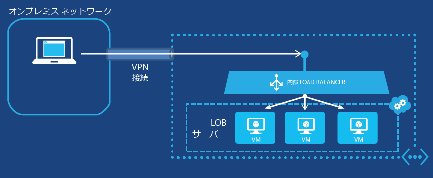

<properties
   pageTitle="内部ロード バランサーの概要 |Microsoft Azure"
   description="内部ロード バランサーの構成と仮想マシンとクラウド デプロイメントでの実装方法"
   services="load-balancer"
   documentationCenter="na"
   authors="joaoma"
   manager="adinah"
   editor="tysonn" />
<tags
   ms.service="load-balancer"
   ms.devlang="na"
   ms.topic="get-started-article"
   ms.tgt_pltfrm="na"
   ms.workload="infrastructure-services"
   ms.date="07/22/2015"
   ms.author="joaoma" />

# 内部ロード バランサーの構成の開始

> [AZURE.SELECTOR]
- [Azure Classic steps](load-balancer-internal-getstarted.md)
- [Resource Manager Powershell steps](load-balancer-internal-arm-powershell.md)

Azure 内部負荷分散 (ILB) は、リージョン スコープを持つクラウド サービスまたは仮想ネットワーク内にある仮想マシン間に負荷分散を提供します。リージョン スコープを持つ仮想ネットワークの使用と構成については、Azure ブログの「[Regional Virtual Networks (リージョン仮想ネットワーク)](../regional-virtual-networks.md)」をご覧ください。アフィニティ グループに構成されている既存の仮想ネットワークは ILB を使用できません。

## 仮想マシンへの内部負荷分散セットの作成

Azure 内部負荷分散セットと、そのトラフィックを送信するサーバーを作成するには、次の操作を実行する必要があります。

1. 負荷分散セットのサーバー間で負荷分散される着信トラフィックのエンドポイントとなる ILB インスタンスを作成します。

1. 着信トラフィックを受信する仮想マシンに対応するエンドポイントを追加します。

1. ILB インスタンスの仮想 IP アドレス (VIP) にトラフィックを送信するように負荷分散されたトラフィックを送信するサーバーを構成します。

### 手順 1. ILB インスタンスを作成する

既存のクラウド サービスまたは地域仮想ネットワークでデプロイされたクラウド サービスでは、次の Windows PowerShell コマンドを使用して ILB インスタンスを作成できます。

	$svc="<Cloud Service Name>"
	$ilb="<Name of your ILB instance>"
	$subnet="<Name of the subnet within your virtual network>"
	$IP="<The IPv4 address to use on the subnet-optional>"

	Add-AzureInternalLoadBalancer -ServiceName $svc -InternalLoadBalancerName $ilb –SubnetName $subnet –StaticVNetIPAddress $IP

これらのコマンドを使用するには、値を入力して < and > を削除します。たとえば次のようになります。

	$svc="WebCloud-NY"
	$ilb="SQL-BE"
	$subnet="Farm1"
	$IP="192.168.98.10"
	Add-AzureInternalLoadBalancer -ServiceName $svc -InternalLoadBalancerName $ilb –SubnetName $subnet –StaticVNetIPAddress $IP

### 手順 2. ILB インスタンスにエンドポイントを追加する

既存の仮想マシンでは、次のコマンドを使用して ILB インスタンスにエンドポイントを追加できます。

	$svc="<Cloud service name>"
	$vmname="<Name of the VM>"
	$epname="<Name of the endpoint>"
	$lbsetname="<Name of the load balancer set>"
	$prot="tcp" or "udp"
	$locport=<local port number>
	$pubport=<public port number>
	$ilb="<Name of your ILB instance>"
	Get-AzureVM –ServiceName $svc –Name $vmname | Add-AzureEndpoint -Name $epname -LbsetName $lbsetname -Protocol $prot -LocalPort $locport -PublicPort $pubport –DefaultProbe -InternalLoadBalancerName $ilb | Update-AzureVM

これらのコマンドを使用するには、値を入力して < and > を削除します。

この [Add-azureendpoint](https://msdn.microsoft.com/library/dn495300.aspx) Windows PowerShell コマンドレットでは、DefaultProbe パラメーター セットを使用します。追加のパラメーター セットの詳細については、「[Add-azureendpoint](https://msdn.microsoft.com/library/dn495300.aspx)」をご覧ください。

たとえば次のようになります。

	$svc="AZ-LOB1"
	$vmname="SQL-LOBAZ1"
	$epname="SQL1"
	$lbsetname="SQL-LB"
	$prot="tcp"
	$locport=1433
	$pubport=1433
	$ilb="SQL ILB"
	Get-AzureVM –ServiceName $svc –Name $vmname | Add-AzureEndpoint -Name $epname -Lbset $lbsetname -Protocol $prot -LocalPort $locport -PublicPort $pubport –DefaultProbe -InternalLoadBalancerName $ilb | Update-AzureVM

### 手順 3. 新しい ILB エンドポイントにトラフィックを送信するようにサーバーを構成する

トラフィックを負荷分散し、ILB インスタンスの新しい IP アドレス (VIP) を使用するようにサーバーを構成する必要があります。このアドレスは、ILB インスタンスがリッスンしているアドレスです。多くの場合は、ILB インスタンスの VIP に対して、単に DNS レコードを追加または変更する必要があります。

ILB インスタンスの作成時に IP アドレスを指定した場合は、既に VIP があります。それ以外の場合は、次のコマンドから VIP を確認できます。

	$svc="<Cloud Service Name>"
	Get-AzureService -ServiceName $svc | Get-AzureInternalLoadBalancer

これらのコマンドを使用するには、値を入力して < and > を削除します。たとえば次のようになります。

	$svc="WebCloud-NY"
	Get-AzureService -ServiceName $svc | Get-AzureInternalLoadBalancer

Get-azureinternalloadbalancer コマンドの表示から IP アドレスをメモし、サーバーまたは DNS レコードに必要な変更を加えて、トラフィックが VIP に送信されることを確認します。

>[AZURE.NOTE]Microsoft Azure Platform は、さまざまな管理シナリオに静的でパブリックにルーティング可能な IPv4 アドレスを使用します。IP アドレスは 168.63.129.16 です。この IP アドレスはファイアウォールによってブロックされないように設定しておく必要があります。ブロックされると、予期しない動作を引き起こす可能性があります。Azure ILB については、この IP アドレスはロード バランサーからの監視プローブによって使用され、負荷が分散されたセットでの VM の正常性状態が判別されます。ネットワーク セキュリティ グループが、内部で負荷が分散されたセットで Azure Virtual Machines へのトラフィックを制限するために使用されている場合、または Virtual Network のサブネットに適用されている場合、168.63.129.16 からのトラフィックを許可するネットワーク セキュリティ ルールが追加されていることを確認します。

## 内部負荷分散のエンド ツー エンドの例

2 つのサンプル構成に負荷分散セットを作成するエンド ツー エンドのプロセスの手順の説明については、次のセクションをご覧ください。

### インターネットに接続された多層アプリケーション

Contoso Corporation は、インターネットに接続された Web サーバー セットと、データベース サーバー セット間で負荷分散を提供したいと考えています。両方のサーバー セットは、1 つの Azure クラウド サービスでホストされます。TCP ポート 1433 への Web サーバーのトラフィックは、データベース層の 3 つの仮想マシンに分散される必要があります。図 1 に、この構成を示します。

図 1: インターネットに接続された多層アプリケーションの例

この構成は次のとおりです。

- 仮想マシンをホストする既存のクラウド サービスの名前は、Contoso-partnersite です。

- 3 つの既存のデータベース サーバーの名前は、PARTNER-SQL-1、PARTNER-SQL-2、PARTNER-SQL-3 です。

- Web 層の Web サーバーは、partner-sql.external.contoso.com というDNS 名でデータベース層のデータベース サーバーに接続します。

次のコマンドは、PARTNER-DBTIER という名前の新しい ILB インスタンスを構成し、3 つのデータベース サーバーに対応する仮想マシンにエンドポイントを追加します。

	$svc="Contoso-PartnerSite"
	$ilb="PARTNER-DBTIER"
	Add-AzureInternalLoadBalancer -ServiceName $svc -InternalLoadBalancerName $ilb

	$prot="tcp"
	$locport=1433
	$pubport=1433
	$epname="DBTIER1"
	$lbsetname="SQL-LB"
	$vmname="PARTNER-SQL-1"
	Get-AzureVM –ServiceName $svc –Name $vmname | Add-AzureEndpoint -Name $epname -LbSetName $lbsetname -Protocol $prot -LocalPort $locport -PublicPort $pubport –DefaultProbe -InternalLoadBalancerName $ilb | Update-AzureVM

	$epname="DBTIER2"
	$vmname="PARTNER-SQL-2"
	Get-AzureVM –ServiceName $svc –Name $vmname | Add-AzureEndpoint -Name $epname -LbSetName $lbsetname -Protocol $prot -LocalPort $locport -PublicPort $pubport –DefaultProbe -InternalLoadBalancerName $ilb | Update-AzureVM

	$epname="DBTIER3"
	$vmname="PARTNER-SQL-3"
	Get-AzureVM –ServiceName $svc –Name $vmname | Add-AzureEndpoint -Name $epname -LbSetName $lbsetname -Protocol $prot -LocalPort $locport -PublicPort $pubport –DefaultProbe -InternalLoadBalancerName $ilb | Update-AzureVM

次に、Contoso は、次のコマンドを使用して PARTNER-DBTIER ILB インスタンスの VIP を判断しました。

	Get-AzureService -ServiceName $svc | Get-AzureInternalLoadBalancer

このコマンドの表示から Contoso は 100.64.65.211 の VIP アドレスをメモし、この新しいアドレスを使用するように partner-sql.external.contoso.com という名前の DNS アドレス (A) レコードを構成しました。

### Azure でホストされる LOB アプリケーション

Contoso Corporation は、Azure の Web サーバー セットで基幹業務 (LOB) アプリケーションをホストしたいと考えています。TCP ポート 80 へのクライアント トラフィックは、クロスプレミス仮想ネットワークで実行されている次の 3 つの仮想マシン間で負荷分散する必要があります。図 2 に、この構成を示します。

図 2: Azure でホストされる LOB アプリケーションの例

この構成は次のとおりです。

- 仮想マシンをホストする既存のクラウド サービスの名前は、Contoso-Legal です。

- LOB サーバーが配置されているサブネットの名前は、LOB-LEGAL です。Contoso は内部ロード バランサーの VIP アドレスとして 198.168.99.145 を選択しています。

- 3 つの既存の LOB サーバーの名前は、legal-1、legal-2、LEGAL-3 です。

- イントラネット Web クライアントは、legalnet.corp.contoso.com という DNS 名を使用して接続します。

次のコマンドは、LEGAL-ILB という名前の ILB インスタンスを構成し、3 つの LOB サーバーに対応する仮想マシンにエンドポイントを追加します。

	$svc="Contoso-Legal"
	$ilb="LEGAL-ILB"
	$subnet="LOB-LEGAL"
	$IP="198.168.99.145"
	Add-AzureInternalLoadBalancer –ServiceName $svc -InternalLoadBalancerName $ilb –SubnetName $subnet –StaticVNetIPAddress $IP

	$prot="tcp"
	$locport=80
	$pubport=80
	$epname="LOB1"
	$lbsetname="LOB-LB"
	$vmname="LEGAL-1"
	Get-AzureVM –ServiceName $svc –Name $vmname | Add-AzureEndpoint -Name $epname-LbSetName $lbsetname -Protocol $prot -LocalPort $locport -PublicPort $pubport –DefaultProbe -InternalLoadBalancerName $ilb | Update-AzureVM

	$epname="LOB2"
	$vmname="LEGAL2"
	Get-AzureVM –ServiceName $svc –Name $vmname | Add-AzureEndpoint -Name $epname -LbSetName $lbsetname -Protocol $prot -LocalPort $locport -PublicPort $pubport –DefaultProbe -InternalLoadBalancerName $ilb | Update-AzureVM

	$epname="LOB3"
	$vmname="LEGAL3"
	Get-AzureVM –ServiceName $svc –Name $vmname | Add-AzureEndpoint -Name $epname -LbSetName $lbsetname -Protocol $prot -LocalPort $locport -PublicPort $pubport –DefaultProbe -InternalLoadBalancerName $ilb | Update-AzureVM

次に、Contoso は 198.168.99.145 を使用するように legalnet.corp.contoso.com という名前の DNS A レコードを構成しました。

## 仮想マシンを ILB に追加する

作成された ILB インスタンスに仮想マシンを追加するには、new-azureinternalloadbalancerconfig コマンドレットと New-azurevmconfig コマンドレットを使用できます。

たとえば次のようになります。

	$svc="AZ-LOB1"
	$ilb="LOB-ILB"
	$vnet="LOBNet_Azure"
	$subnet="LOBServers"
	$vmname="LOB-WEB1"
	$adminuser="Lando"
	$adminpw="Platform327"
	$regionname="North Central US"

	$myilbconfig=New-AzureInternalLoadBalancerConfig -InternalLoadBalancerName $ilb -SubnetName $subnet
	$images = Get-AzureVMImage
	New-AzureVMConfig -Name $vmname -InstanceSize Small -ImageName $images[50].ImageName | Add-AzureProvisioningConfig -Windows -AdminUsername $adminuser -Password $adminpw | New-AzureVM -ServiceName $svc -InternalLoadBalancerConfig $myilbconfig -Location $regionname –VNetName $vnet

## クラウド サービスへの ILB の構成

ILB は仮想マシンとクラウド サービスの両方でサポートされています。地域仮想ネットワークの外部にあるクラウド サービスで作成された ILB エンドポイントは、そのクラウド サービス内でのみアクセスできます。

次の例に示すように、ILB 構成は、クラウド サービスの最初のデプロイメントの作成時に設定する必要があります。

>[AZURE.IMPORTANT]以下の手順の前提条件は、クラウド デプロイメントのために仮想ネットワークを作成しておくことです。ILB を作成するには仮想ネットワークの名前とサブネットの名前が必要です。

### 手順 1.

Visual Studio でクラウド デプロイメントのサービス構成ファイル (.cscfg) を開き、次のセクションを追加して、ネットワーク構成の最後の "`</Role>`" 項目の下に ILB を作成します。

	<NetworkConfiguration>
	  <LoadBalancers>
	    <LoadBalancer name="name of the load balancer">
	      <FrontendIPConfiguration type="private" subnet="subnet-name" staticVirtualNetworkIPAddress="static-IP-address"/>
	    </LoadBalancer>
	  </LoadBalancers>
	</NetworkConfiguration>
 

ネットワーク構成ファイルの値を追加し、どのように見えるか確認しましょう。この例では、「test\_vnet」という名前のサブネットを「test\_subnet」という名前のサブネット 10.0.0.0/24 と静的 IP 10.0.0.4 で作成したと仮定します。ロード バランサーの名前は「testLB」になります。

	<NetworkConfiguration>
	  <LoadBalancers>
	    <LoadBalancer name="testLB">
	      <FrontendIPConfiguration type="private" subnet="test_subnet" staticVirtualNetworkIPAddress="10.0.0.4"/>
	    </LoadBalancer>
	  </LoadBalancers>
	</NetworkConfiguration>

ロード バランサー スキーマの詳細については、「[ロード バランサーの追加](https://msdn.microsoft.com/library/azure/dn722411.aspx)」を参照してください。

### 手順 2.

サービス定義 (.csdef) ファイルを変更し、ILB にエンドポイントを追加します。ロール インスタンスが作成された直後に、サービス定義ファイルによりそのロール インスタンスが ILB に追加されます。

	<WorkerRole name="worker-role-name" vmsize="worker-role-size" enableNativeCodeExecution="[true|false]">
	  <Endpoints>
	    <InputEndpoint name="input-endpoint-name" protocol="[http|https|tcp|udp]" localPort="local-port-number" port="port-number" certificate="certificate-name" loadBalancerProbe="load-balancer-probe-name" loadBalancer="load-balancer-name" />
	  </Endpoints>
	</WorkerRole>

上記の例と同じ値を利用してサービス定義ファイルに値を追加してみましょう。

	<WorkerRole name=WorkerRole1" vmsize="A7" enableNativeCodeExecution="[true|false]">
	  <Endpoints>
	    <InputEndpoint name="endpoint1" protocol="http" localPort="80" port="80" loadBalancer="testLB" />
	  </Endpoints>
	</WorkerRole>

ネットワーク トラフィックの負荷は testLB ロード バランサーで分散されます。受信要求にはポート 80 が使用されます。worker ロール インスタンスへの送信もポート 80 で行われます。

## ILB 構成の削除

ILB インスタンスからエンドポイントとして仮想マシンを削除するには、次のコマンドを使用します。

	$svc="<Cloud service name>"
	$vmname="<Name of the VM>"
	$epname="<Name of the endpoint>"
	Get-AzureVM -ServiceName $svc -Name $vmname | Remove-AzureEndpoint -Name $epname | Update-AzureVM

これらのコマンドを使用するには、値を入力して < and > を削除します。

たとえば次のようになります。

	$svc="AZ-LOB1"
	$vmname="SQL-LOBAZ1"
	$epname="SQL1"
	Get-AzureVM -ServiceName $svc -Name $vmname | Remove-AzureEndpoint -Name $epname | Update-AzureVM

クラウド サービスから ILB インスタンスを削除するには、次のコマンドを使用します。

	$svc="<Cloud service name>"
	Remove-AzureInternalLoadBalancer -ServiceName $svc

これらのコマンドを使用するには、値を入力して < and > を削除します。

たとえば次のようになります。

	$svc="AZ-LOB1"
	Remove-AzureInternalLoadBalancer -ServiceName $svc

## ILB コマンドレットに関する追加情報

ILB コマンドレットに関する追加情報を取得するには、Azure Windows PowerShell プロンプトで、次のコマンドを実行します。

- Get-help New-AzureInternalLoadBalancerConfig -full

- Get-help Add-AzureInternalLoadBalancer -full

- Get-help Get-AzureInternalLoadbalancer -full

- Get-help Remove-AzureInternalLoadBalancer -full

## 関連項目

[ロード バランサー分散モードの構成](load-balancer-distribution-mode.md)

[ロード バランサーのアイドル TCP タイムアウト設定の構成](load-balancer-tcp-idle-timeout.md)
 

<!---HONumber=July15_HO5-->