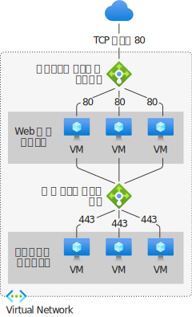

# Azure Load Balancer の概要

"*負荷分散*" とは、負荷 (受信ネットワーク トラフィック) をバックエンド リソースまたはサーバーのグループ全体に均等に分散することです。 

Azure Load Balancer は、開放型システム間相互接続 (OSI) モデルのレイヤー 4 で動作します。 クライアントにとっての単一接続点となります。 Load Balancer は、ロード バランサーのフロントエンドに到着したインバウンド フローを、バックエンド プールのインスタンスに分配します。 これらのフローは、構成された負荷分散規則と正常性プローブに従っています。 バックエンド プール インスタンスには、Azure Virtual Machines か、仮想マシン スケール セット内のインスタンスを使用できます。

**[パブリック ロード バランサー](./components.md#frontend-ip-configurations)** は、仮想ネットワーク内の仮想マシン (VM) にアウトバウンド接続を提供できます。 これらの接続は、プライベート IP アドレスをパブリック IP アドレスに変換することで実現されます。 パブリック ロード バランサーは、インターネット トラフィックを VM に負荷分散する目的で使用されます。

**[内部 (プライベート) ロード バランサー](./components.md#frontend-ip-configurations)** は、フロントエンドのみでプライベート IP が必要な場合に使用されます。 内部ロード バランサーは、仮想ネットワーク内でトラフィックを負荷分散させるために使用されます。 ハイブリッド シナリオでは、オンプレミスのネットワークからロード バランサー フロントエンドにアクセスできます。

  

*図:パブリック ロード バランサーと内部ロード バランサーの両方を使った、多層アプリケーションの負荷分散*

個々のロード バランサー コンポーネントの詳細については、「[Azure Load Balancer のコンポーネント](./components.md)」を参照してください。

## Azure Load Balancer を使用する理由
Standard Load Balancer を使用すると、アプリケーションをスケーリングしたり、高可用性サービスを作成したりすることができます。 ロード バランサーは、インバウンドとアウトバウンドの両方のシナリオをサポートしています。 ロード バランサーは、低遅延と高スループットを実現できるだけでなく、あらゆる TCP アプリケーションと UDP アプリケーションの数百万ものフローにスケールアップできます。

Standard Load Balancer を使用して実現できる主なシナリオは、次のとおりです。

- **[内部](https://docs.microsoft.com/azure/load-balancer/tutorial-load-balancer-standard-manage-portal)** および **[外部](https://docs.microsoft.com/azure/load-balancer/tutorial-load-balancer-standard-internal-portal)** トラフィックを Azure 仮想マシンに負荷分散する。

- ゾーンの **[内部で](https://docs.microsoft.com/azure/load-balancer/tutorial-load-balancer-standard-public-zonal-portal)** 、および複数のゾーンに **[わたって](https://docs.microsoft.com/azure/load-balancer/tutorial-load-balancer-standard-public-zone-redundant-portal)** リソースを分散することによって、可用性を向上させる。

- Azure 仮想マシンの **[アウトバウンド接続](https://docs.microsoft.com/azure/load-balancer/load-balancer-outbound-connections)** を構成する。

- **[正常性プローブ](https://docs.microsoft.com/azure/load-balancer/load-balancer-custom-probe-overview)** を使用して、負荷分散されたリソースを監視する。

- **[ポート転送](https://docs.microsoft.com/azure/load-balancer/tutorial-load-balancer-port-forwarding-portal)** を使用して、仮想ネットワーク内の仮想マシンにパブリック IP アドレスとポートでアクセスする。

- **[IPv6](https://docs.microsoft.com/azure/virtual-network/ipv6-overview)** の **[負荷分散](https://docs.microsoft.com/azure/virtual-network/virtual-network-ipv4-ipv6-dual-stack-standard-load-balancer-powershell)** のサポートを有効にする。

- Standard Load Balancer は [Azure Monitor](https://docs.microsoft.com/azure/azure-monitor/overview) を通じて多次元メトリックを提供します。  これらのメトリックは、フィルター処理し、グループ化し、特定のディメンションに分割することができます。  サービスのパフォーマンスと正常性に関する現在と過去の分析情報を提供します。  リソースの正常性もサポートされます。 詳細については、 **[Standard Load Balancer の診断](load-balancer-standard-diagnostics.md)** に関するページを参照してください。

- **[複数のポート、複数の IP アドレス、またはその両方](https://docs.microsoft.com/azure/load-balancer/load-balancer-multivip-overview)** にサービスを負荷分散する。

- 複数の Azure リージョンにわたる **[内部](https://docs.microsoft.com/azure/load-balancer/move-across-regions-internal-load-balancer-portal)** および **[外部](https://docs.microsoft.com/azure/load-balancer/move-across-regions-external-load-balancer-portal)** のロード バランサー リソースに移動する。

- **[HA ポート](https://docs.microsoft.com/azure/load-balancer/load-balancer-ha-ports-overview)** を使用して、TCP と UDP のフローをすべてのポートに同時に負荷分散する。

### 既定でのセキュリティ保護

Standard Load Balancer は、ゼロ トラスト ネットワーク セキュリティ モデルを中核として構築されています。 既定では Standard Load Balancer はセキュリティで保護され、仮想ネットワークの一部です。 仮想ネットワークは、プライベートの分離されたネットワークです。  つまり、Standard Load Balancer と Standard パブリック IP アドレスは、ネットワーク セキュリティ グループによって開かれない限り、インバウンド フローに閉じられています。 NSG は、トラフィックを明示的に許可するために使用されます。  お使いの仮想マシン リソースのサブネットまたは NIC に NSG がない場合、トラフィックはこのリソースに到達することを許可されません。 NSG と、ネットワーク セキュリティ グループをシナリオに適用する方法の詳細については、[ネットワーク セキュリティ グループ](../virtual-network/security-overview.md)に関する記事をご覧ください。
Basic Load Balancer は、既定ではインターネットに対して公開されています。

## 料金と SLA

Standard Load Balancer の価格の情報については、「[Load Balancer の価格](https://azure.microsoft.com/pricing/details/load-balancer/)」を参照してください。
Basic Load Balancer は無料で提供されます。
[Load Balancer の SLA](https://aka.ms/lbsla) を参照してください。 Basic Load Balancer には SLA がありません。

## 次のステップ
Basic Load Balancer を Standard Load Balancer にアップグレードするには、[Basic Load Balancer のアップグレード](upgrade-basic-standard.md)に関するページをご覧ください。

Load Balancer の使用を開始するには、[パブリック Standard Load Balancer の作成](quickstart-load-balancer-standard-public-portal.md)に関するページを参照してください。

Azure Load Balancer の制限とコンポーネントの詳細については、「[Azure Load Balancer のコンポーネント](./components.md)」と「[Azure Load Balancer の概念](./concepts.md)」を参照してください

Azure の負荷分散オプションの比較については、「[Azure の負荷分散オプションの概要](https://docs.microsoft.com/azure/architecture/guide/technology-choices/load-balancing-overview)」を参照してください。
