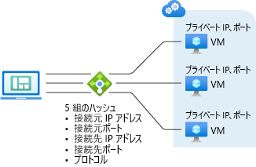
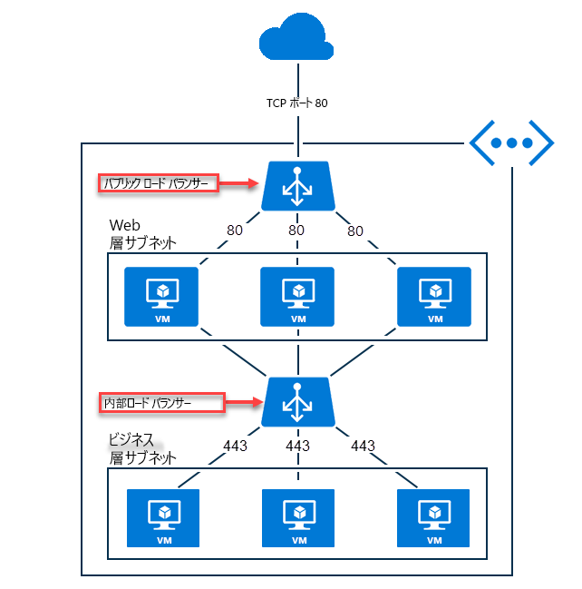

# Azure Load Balancer の概要

Azure Load Balancer を使うと、アプリケーションを拡張し、サービスを高可用性にすることができます。 Load Balancer は受信と送信のどちらのシナリオもサポートし、低遅延と高スループットを実現できるだけでなく、あらゆる TCP アプリケーションと UDP アプリケーションの数百万ものフローにスケールアップできます。  

Load Balancer は、ロード バランサーのフロントエンドで到着した新しい受信フローを、ルールと正常性プローブに従って、バックエンド プールのインスタンスに分配します。 

さらに、パブリック ロード バランサーは、プライベート IP アドレスをパブリック IP アドレスに変換することによって、仮想ネットワーク内の仮想マシン (VM) の送信接続を提供できます。

Azure Load Balancer は、Basic と Standard の 2 種類の SKU で使用できます。 両者の間には、スケール、機能、および料金の違いがあります。 Basic Load Balancer で可能なシナリオをすべて、Standard Load Balancer でも作成できますが、アプローチは若干異なる場合があります。 Load Balancer について学習するときは、基礎および SKU 固有の違いを理解することが重要です。

## ロード バランサーを使用する理由 

Azure Load Balancer を使って次のことができます。

* 受信インターネット トラフィックを VM に負荷分散します。 この構成は、[パブリック ロード バランサー](#publicloadbalancer)と呼ばれます。
* 仮想ネットワーク内の VM 間にトラフィックを負荷分散します。 ハイブリッド シナリオでは、オンプレミスのネットワークからロード バランサー フロントエンドに到達することもできます。 どちらのシナリオでも、[内部ロード バランサー](#internalloadbalancer)と呼ばれる構成が使われます。
* 受信ネットワーク アドレス変換 (NAT) 規則を使って、特定の VM 上の特定のポートに、トラフィックをポート転送します。
* パブリック ロード バランサーを使って、仮想ネットワーク内の VM に[送信接続](load-balancer-outbound-connections.md)を提供します。

>[!NOTE]
> Azure では、ユーザーのシナリオのためにフル マネージドの負荷分散ソリューションのスイートが提供されます。 トランスポート層セキュリティ (TLS) プロトコル終端 ("SSL オフロード") または HTTP/HTTPS 要求によるアプリケーション レイヤーの処理が必要な場合は、「[Application Gateway](../application-gateway/application-gateway-introduction.md)」をご覧ください。 グローバル DNS の負荷分散が必要な場合は、「[Traffic Manager](../traffic-manager/traffic-manager-overview.md)」をご覧ください。 実際のエンド ツー エンドのシナリオでは、必要に応じてこれらのソリューションを組み合わせると役に立つことがあります。

## ロード バランサーのリソース

ロード バランサー リソースは、パブリック ロード バランサーまたは内部ロード バランサーとして存在できます。 ロード バランサー リソースの機能は、フロントエンド、ルール、正常性プローブ、バックエンド プール定義として表されます。 VM からバックエンド プールを指定することにより、VM をバックエンド プールに配置します。

ロード バランサー リソースはオブジェクトであり、その中では、ユーザーが作成したいシナリオを実現するために Azure がそのマルチ テナント インフラストラクチャをプログラミングする方法を表すことができます。 ロード バランサーのリソースと実際のインフラストラクチャの間に直接的な関係はありません。 ロード バランサーを作成してもインスタンスは作成されず、容量は常に利用できます。 

## ロード バランサーの基本機能

ロード バランサーは、TCP および UDP アプリケーションに対して次の基本機能を提供します。

* **負荷分散**

    Azure Load Balancer では、負荷分散規則を作成して、フロントエンドに到着したトラフィックをバックエンド プールのインスタンスに分散させることができます。 受信フローの分配にはハッシュ アルゴリズムが使われ、バックエンド プール インスタンスへのフローのヘッダーが適宜書き換えられます。 バックエンド エンドポイントが正常であることを正常性プローブが示している場合、サーバーは新しいフローを受信できます。
    
    既定では、Load Balancer はソース IP アドレス、ソース ポート、接続先 IP アドレス、接続先ポート、IP プロトコル番号から成る 5 タプル ハッシュを使って、使用可能なサーバーにフローをマップします。 特定の規則に 2 または 3 タプルのハッシュをオプトインすることにより、特定のソース IP アドレスにアフィニティを作成できます。 同じパケット フローのすべてのパケットは、負荷分散されたフロントエンドの背後にある同じインスタンスに到着します。 クライアントが同じソース IP アドレスから新しいフローを開始すると、ソース ポートが変化します。 結果として得られる 5 タプルにより、トラフィックは異なるバックエンド エンドポイントに送られることがあります。

    詳しくは、[ロード バランサーの分散モード](load-balancer-distribution-mode.md)に関するページをご覧ください。 次の図は、ハッシュベースの分散を示しています。

    

    *図; ハッシュベースの分散*

* **ポート フォワーディング**

    Load Balancer では、受信 NAT 規則を作成して、特定のフロントエンド IP アドレスの特定のポートから、仮想ネットワーク内の特定のバックエンド インスタンスの特定のポートに、トラフィックをポート転送できます。 これも、負荷分散と同じハッシュ ベースの分散によって実現されます。 この機能の一般的なシナリオは、Azure Virtual Network 内の個別の VM インスタンスへのリモート デスクトップ プロトコル (RDP) または Secure Shell (SSH) セッションです。 複数の内部エンドポイントを、同じフロントエンド IP アドレスのさまざまなポートにマップできます。 これらを使って、追加のジャンプ ボックスがなくても、インターネット経由で VM をリモート管理できます。

* **アプリケーションに対する独立性と透過性**

    ロード バランサーは、TCP、UDP、またはアプリケーション レイヤーとは直接対話せず、任意の TCP または UDP アプリケーション シナリオをサポートできます。  Load Balancer は、フローを終了または開始することはなく、フローのペイロードとやり取りせず、アプリケーション レイヤーのゲートウェイ機能を提供せず、プロトコルのハンドシェイクは常にクライアントとバックエンド プール インスタンス間で直接行われます。  受信フローへの応答は常に、仮想マシンからの応答です。  仮想マシンにフローが到着するときは、元のソース IP アドレスも保持されます。  以下は透過性を示す他の例です。
    - すべてのエンドポイントは、VM によってのみ応答されます。  たとえば、TCP ハンドシェイクは常に、クライアントと選択されたバックエンド VM の間で行われます。  フロントエンドへの要求に対する応答は、バックエンドの VM によって生成される応答です。 フロントエンドへの接続を正常に検証するときは、少なくとも 1 つのバックエンド仮想マシンへのエンド ツー エンドの接続を検証していることになります。
    - アプリケーション ペイロードは Load Balancer に対して透過的であり、任意の UDP または TCP アプリケーションをサポートすることができます。 HTTP 要求ごとの処理またはアプリケーション レイヤー ペイロードの操作を必要とするワークロードの場合 (たとえば、HTTP URL の解析)、[Application Gateway](https://azure.microsoft.com/services/application-gateway) のようなレイヤー 7 のロード バランサーを使う必要があります。
    - Load Balancer は TCP ペイロードに依存せず、TLS のオフロード ("SSL") は提供されないので、Load Balancer を使ってエンド ツー エンドの暗号化シナリオを構築し、VM 自体において TLS 接続を終了することによって TLS アプリケーションの大規模なスケールアウトを実現できます。  たとえば、TLS セッションのキー容量は、バックエンド プールに追加する VM の数と種類によってのみ制限されます。  "SSL オフロード"、アプリケーション レイヤーの処理、または Azure への証明書管理の委任を必要とする場合は、Azure のレイヤー 7 ロード バランサーである [Application Gateway](https://azure.microsoft.com/services/application-gateway) を代わりに使う必要があります。
        

* **自動再構成**

    Load Balancer は、インスタンスがスケール アップまたはスケール ダウンされると、すぐに自身を再構成します。 バックエンド プールの VM を追加または削除すると、ロード バランサー リソースの追加操作なしに、ロード バランサーが再構成されます。

* **正常性プローブ**

     バックエンド プール内のインスタンスの正常性を判断するため、Load Balancer はユーザーが定義した正常性プローブを使います。 プローブで応答できない場合、ロード バランサーは異常なインスタンスへの新しい接続の送信を停止します。 既存の接続は影響を受けず、アプリケーションがフローを終了するか、アイドル タイムアウトが発生するか、または VM がシャットダウンするまで続けられます。

    次の 3 種類のプローブがサポートされています。

    - **HTTP カスタム プローブ**: ユーザーはこのプローブを使って独自のカスタム ロジックを作成し、バックエンド プール インスタンスの正常性を判断できます。 ロード バランサーは、定期的にエンドポイントを調査します (既定では 15 秒ごと)。 タイムアウト期間内 (既定値は 31 秒) にインスタンスが HTTP 200 で応答した場合は、正常な状態であると見なされます。 HTTP 200 以外のすべての状態では、このプローブは失敗します。 このプローブは、ロード バランサーのローテーションからインスタンスを削除する、ユーザー独自のロジックを実装する場合にも役立ちます。 たとえば、インスタンスが CPU の 90% を超えた場合に 200 以外の状態を返すように、インスタンスを構成できます。  このプローブは、既定のゲスト エージェント プローブをオーバーライドします。

    - **TCP カスタム プローブ:** このプローブは、定義済みプローブ ポートへの正常な TCP セッションの確立に依存します。 VM 上に指定されたリスナーが存在する限り、このプローブは成功します。 接続が拒否されると、プローブは失敗します。 このプローブは、既定のゲスト エージェント プローブをオーバーライドします。

    - **ゲスト エージェント プローブ:** ロード バランサーは、VM 内のゲスト エージェントを使うこともできます。 ゲスト エージェントはリッスンし、インスタンスが準備完了状態になっている場合にのみ、HTTP 200 OK で応答します。 エージェントが HTTP 200 OK で応答できない場合、ロード バランサーは、そのインスタンスを応答不能と見なし、インスタンスへのトラフィックの送信を停止します。 ロード バランサーはインスタンスへの到達を試み続けます。 ゲスト エージェントが HTTP 200 で応答すると、Load Balancer はそのインスタンスへのトラフィックの送信を再開します。 ゲスト エージェント プローブは_最後の手段であり、HTTP または TCP のカスタム プローブを構成できるときは、使わないことをお勧めします_。 
    
* **送信接続 (SNAT)**

    仮想ネットワーク内のプライベート IP アドレスから、インターネット上のパブリック IP アドレスへのすべての送信フローは、ロード バランサーのフロントエンド IP アドレスに変換できます。 パブリック フロントエンドが負荷分散規則によってバックエンドの VM に関連付けられていると、Azure は送信接続がパブリック フロントエンドの IP アドレスに自動的に変換されるようにプログラムします。

    * フロントエンドを別のサービス インスタンスに動的にマップできるため、サービスのアップグレードやディザスター リカバリーが簡単にできます。
    * 容易なアクセス制御リスト (ACL) の管理。 フロントエンド IP で表わされる ACL は、サービスをスケールアップ、スケールダウン、または再デプロイしても変更されません。  送信接続をマシンより少ない数の IP アドレスに変換すると、ホワイトリストの作業負荷を軽減できます。

    詳しくは、[送信接続](load-balancer-outbound-connections.md)に関するページをご覧ください。

Standard Load Balancer には、これらの基礎には含まれない追加の SKU 固有機能があります。 詳しくは、この記事の残りの部分をご覧ください。

##  Load Balancer の SKU の比較

Load Balancer は、Basic と Standard 両方の SKU をサポートし、シナリオのスケール、機能、価格はそれぞれ異なります。 Basic Load Balancer で可能なシナリオをすべて、Standard Load Balancer でも作成できます。 実際、両方の SKU の API は似ており、SKU を指定することによって呼び出されます。 Load Balancer の SKU とパブリック IP をサポートするための API は、2017-08-01 API から使用できるようになりました。 一般的な API と構造は、どちらの SKU でも同じです。

ただし、どちらの SKU を選ぶかにより、完全なシナリオ構成は若干異なる可能性があります。 Load Balancer のドキュメントでは、記事が特定の SKU だけに適用される場合は、そのことが示されています。 違いを比較して理解するには、次の表をご覧ください。 詳しくは、「[Azure Standard Load Balancer の概要](load-balancer-standard-overview.md)」をご覧ください。

>[!NOTE]
> 新しい設計では、Standard Load Balancer の採用をお勧めします。 

スタンドアロン VM、可用性セット、および仮想マシン スケール セットは、どちらか一方の SKU にのみ接続でき、両方には接続できません。 パブリック IP アドレスで使うときは、Load Balancer とパブリック IP アドレスの SKU が一致していなければなりません。 Load Balancer とパブリック IP の SKU は変更できません。

"_まだ必須ではありませんが、SKU を明示的に指定するのが最善の方法です。_"  現時点では、必要な変更は最小限に抑えられています。 SKU を指定しないと、Basic SKU の 2017-08-01 API バージョンを使用する意図があるものと解釈されます。

>[!IMPORTANT]
>Standard Load Balancer は新しい Load Balancer 製品であり、基本的に Basic Load Balancer のスーパーセットです。 2 つの製品の間には重要で意図的な違いがあります。 Basic Load Balancer で可能なエンド ツー エンドのシナリオはすべて、Standard Load Balancer でも作成できます。 Basic Load Balancer を既に使ったことがある場合は、Standard Load Balancer に使い慣れて、Standard と Basic の動作での最新の変更と、その影響を理解する必要があります。 このセクションの内容を慎重に検討してください。

[!INCLUDE [comparison table](../../includes/load-balancer-comparison-table.md)]

詳しくは、[Load Balancer のサービスの制限](https://aka.ms/lblimits)に関する記事をご覧ください。 Standard Load Balancer について詳しくは、[概要](load-balancer-standard-overview.md)、[価格](https://aka.ms/lbpricing)、[SLA](https://aka.ms/lbsla) に関するページもご覧ください。

## 概念

### パブリック ロード バランサー

パブリック ロード バランサーは、着信トラフィックのパブリック IP アドレスとポート番号を VM のプライベート IP アドレスとポート番号にマップし、VM からの応答トラフィックはその逆にマップします。 負荷分散規則を適用することで、特定の種類のトラフィックを複数の VM やサービスに分散できます。 たとえば、複数の Web サーバー間で Web 要求のトラフィックの負荷を分散できます。

次の図は、Web トラフィック用の負荷分散されたエンドポイントを示しています。このエンドポイントは、パブリックとプライベートの TCP ポート 80 である 3 台の VM 間で共有されています。 この 3 台の VM は、1 つの負荷分散セット内にあります。

*図: パブリック ロード バランサーを使った Web トラフィックの負荷分散*

複数のインターネット クライアントが TCP ポート 80 で Web アプリのパブリック IP アドレスに Web ページ要求を送信すると、Azure Load Balancer は負荷分散セット内の 3 台の VM にこれらの要求を分散します。 ロード バランサーのアルゴリズムの詳細については、この記事の[ロード バランサーの機能](load-balancer-overview.md##fundamental-load-balancer-features)に関するセクションをご覧ください。

既定では、Azure Load Balancer は、ネットワーク トラフィックを複数の VM インスタンスに均等に分散させます。 セッション アフィニティを構成することもできます。 詳しくは、[ロード バランサーの分散モード](load-balancer-distribution-mode.md)に関するページをご覧ください。

###  内部ロード バランサー

内部ロード バランサーは、仮想ネットワーク内のリソースまたは VPN を使って Azure インフラストラクチャにアクセスするリソースにのみトラフィックを送信します。 この点で、内部ロード バランサーはパブリック ロード バランサーと異なります。 Azure インフラストラクチャでは、仮想ネットワークの負荷分散フロントエンド IP アドレスへのアクセスが制限されます。 フロントエンド IP アドレスと仮想ネットワークは、インターネット エンドポイントに直接公開されることはありません。 社内の基幹業務アプリケーションは Azure で実行され、Azure 内またはオンプレミス リソースからアクセスされます。

内部ロード バランサーにより、次の種類の負荷分散が可能になります。

* **仮想ネットワーク内**: 仮想ネットワーク内の VM から、同じ仮想ネットワーク内に存在する一連の VM に負荷を分散する。
* **クロスプレミス仮想ネットワークの場合**: オンプレミスのコンピューターから、同じ仮想ネットワーク内に存在する一連の VM に負荷を分散する。 
* **多層アプリケーションの場合**: バックエンド層がインターネットに接続しない、インターネットに接続する多層アプリケーションの負荷を分散する。 バックエンド層では、インターネットに接続する層からのトラフィックを負荷分散する必要があります (次の図を参照)。
* **基幹業務アプリケーションの場合**: ロード バランサーのハードウェアやソフトウェアを追加せずに、Azure でホストされている基幹業務アプリケーションの負荷を分散する。 このシナリオには、トラフィックが負荷分散されるコンピューターのセットに含まれるオンプレミスのサーバーが含まれます。

*図: パブリック ロード バランサーと内部ロード バランサーの両方を使った、多層アプリケーションの負荷分散*

## 価格
Standard Load Balancer の使用には、構成済みの負荷分散規則の数と、処理された受信および送信データの量に基づいて課金されます。 Standard Load Balancer の価格の情報については、[Load Balancer の価格](https://azure.microsoft.com/pricing/details/load-balancer/)に関するページをご覧ください。

Basic Load Balancer は無料で提供されます。

## SLA

Standard Load Balancer の SLA については、[Load Balancer の SLA](https://aka.ms/lbsla) に関するページをご覧ください。 

## 制限事項

- Load Balancer は TCP または UDP 製品であり、これらの特定の IP プロトコルに対する負荷分散とポート フォワーディングを行います。  負荷分散規則と受信 NAT 規則は TCP および UDP についてサポートされており、ICMP を含む他の IP プロトコルについてはサポートされていません。 Load Balancer は、UDP または TCP のフローのペイロードを終了したり、それに応答したり、それ以外の対話を行うことはありません。 プロキシではありません。 フロントエンドへの接続の検証が、負荷分散または受信 NAT 規則 (TCP または UDP) で使用されるのと同じプロトコルの帯域内で成功する必要があり、"_かつ_"、仮想マシンの少なくとも 1 つがクライアントに対するフロントエンドからの応答を生成する必要があります。  Load Balancer フロントエンドからの帯域内応答を受け取らない場合は、仮想マシンが応答できないことを示します。  応答できる仮想マシンがない状態で、Load Balancer フロントエンドと対話することはできません。  これは、[ポート マスカレード SNAT](load-balancer-outbound-connections.md#snat) が TCP および UDP に対してのみサポートされている送信接続にも当てはまります。ICMP などの他の IP プロトコルも失敗します。  軽減のためにインスタンスレベルのパブリック IP アドレスを割り当てます。
- 仮想ネットワーク内のプライベート IP アドレスからパブリック IP アドレスに遷移するときに[送信接続](load-balancer-outbound-connections.md)を提供するパブリック ロード バランサーとは異なり、内部ロード バランサーは、内部ロード バランサーのフロントエンドへの送信発信接続を変換しません (両方ともプライベート IP アドレス空間内にあるため)。  これにより、変換が必要ない固有内部 IP アドレス空間内の SNAT 枯渇が発生する可能性が回避されます。  副作用として、バックエンド プール内の VM からの送信フローが、それが存在するプール内の内部ロード バランサーのフロントエンド サーバーへのフローを試み、"_かつ_"、それ自体にマップバックされている場合、フローの両方のレッグは一致せず、フローは失敗します。  フローが、フロントエンドへのフローを作成したバックエンド プール内の同じ VM にマップバックしなかった場合、フローは成功します。   フローがそれ自体にマップバックする場合、送信フローは VM からフロントエンドに発信されるように見え、対応する受信フローは VM からそれ自体に発信されるように見えます。 ゲスト OS の観点からは、同じフローの受信部分と送信部分は、仮想マシン内と一致しません。 送信元と送信先が一致しないため、TCP スタックは、同じフローのこれらの半分を、同じフローの一部と認識しません。  フローがバックエンド プール内の他の VM にマップする場合、フローの半分は一致し、VM はフローに正常に応答できます。  このシナリオの現象は、断続的な接続のタイムアウトです。 このシナリオを確実に実現するためのいくつかの一般的な回避策があり (バックエンド プールから、バックエンド プールのそれぞれの内部ロード バランサー フロントエンドへの送信フロー)、それには内部ロード バランサーの背後にあるサード パーティ製プロキシの挿入、または [DSR スタイル規則の使用](load-balancer-multivip-overview.md)が含まれます。  パブリック ロード バランサーを使って軽減できますが、結果として得られるシナリオは、[SNAT の枯渇](load-balancer-outbound-connections.md#snat)が発生しやすいでの、慎重に管理されている場合を除き、回避する必要があります。

## 次の手順

これで、Azure Load Balancer の概要の説明が終わりました。 ロード バランサーの使用を始めるには、1 つ作成し、カスタム IIS 拡張機能がインストールされている VM を作成して、Web アプリを VM 間で負荷分散します。 方法については、「[Basic Load Balancer を作成する](quickstart-create-basic-load-balancer-portal.md)」クイック スタートをご覧ください。
