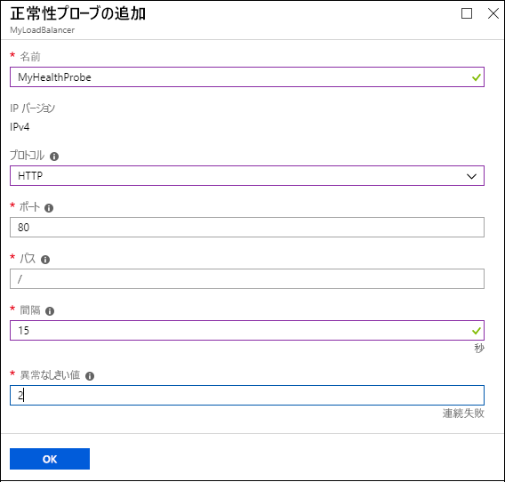
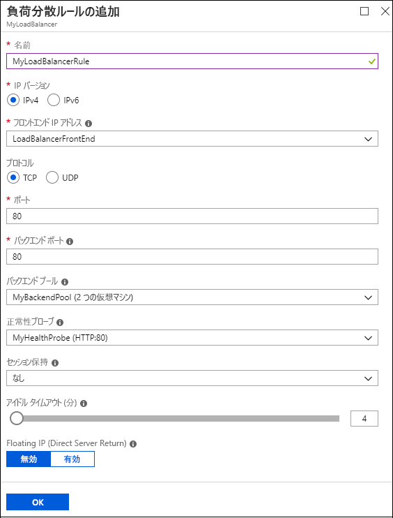

# クイック スタート: Azure portal を使用してパブリック Basic Load Balancer を作成する

負荷分散では、着信要求を仮想マシン (VM) に分散させることで、より高いレベルの可用性とスケールを実現します。 Azure portal を使用して、ロード バランサーを作成し、トラフィックを VM 間で分散させることができます。 このクイック スタートでは、Basic 価格レベルで、ロード バランサー、バックエンド サーバー、およびネットワーク リソースを作成および構成する方法について説明します。

Azure サブスクリプションをお持ちでない場合は、開始する前に [無料アカウント](https://azure.microsoft.com/free/?WT.mc_id=A261C142F) を作成してください。 

このクイック スタートのタスクを実行するには、[Azure portal](http://portal.azure.com) にサインインする必要があります。

## Basic Load Balancer を作成する

最初に、ポータルを使用してパブリック Basic ロード バランサーを作成します。 作成する名前とパブリック IP アドレスは、ロード バランサーのフロント エンドとして自動的に構成されます。

1. ポータルの左上で、**[リソースの作成]** > **[ネットワーキング]** > **[Load Balancer]** の順に選択します。
   
1. **[ロード バランサーの作成]** ウィンドウで次の値を入力または選択します。
   
   - **[名前]**: 「*MyLoadBalancer*」と入力します。
   - **[種類]**: **[パブリック]** を選択します。 
   - **[SKU]**: **[Basic]** を選択します。
   - **[パブリック IP アドレス]**: **[新規作成]** を選択します。 
     - **[パブリック IP アドレス]** フィールド: 「*MyPublicIP*」と入力します。
     - **[パブリック IP アドレスを構成する]** > **[割り当て]**: **[動的]** を選択します。
   - **ResourceGroup**:**[新規作成]** を選択してから「*MyResourceGroupLB*」と入力し、**[OK]** を選択します。 
   
1. **作成**を選択します。
   

## バックエンド サーバーを作成する

次に、仮想ネットワークを作成し、Basic ロード バランサーのバックエンド プール用に 2 つの仮想マシンを作成します。 

### 仮想ネットワークの作成

1. ポータルの画面の左上で、**[リソースの作成]** > **[ネットワーキング]** > **[仮想ネットワーク]** の順に選択します。
   
1. **[仮想ネットワークの作成]** ウィンドウで、以下の値を入力または選択します。
   
   - **[名前]**: 「*MyVnet*」と入力します。
   - **ResourceGroup**:**[既存の選択]** ドロップ ダウンから **[MyResourceGroupLB]** を選択します。 
   - **[サブネット]** > **[名前]**: 「*MyBackendSubnet*」と入力します。
   
1. **作成**を選択します。

   

### 仮想マシンを作成する

1. ポータルの左上で、**[リソースの作成]** > **[Compute]** > **[Windows Server 2016 Datacenter]** の順に選択します。 
   
1. **[仮想マシンの作成]** の **[Basic]** タブに次の値を入力するか選択します。
   - **[サブスクリプション]** > **[リソース グループ]**: ドロップダウンから **[MyResourceGroupLB]** を選択します。
   - **[インスタンスの詳細]** > **[仮想マシン名]**: 「*MyVM1*」と入力します。
   - **[インスタンスの詳細]** > **[可用性オプション]**: 
     1. ドロップダウン メニューから **[可用性セット]** を選択します。 
     2. **[新規作成]** を選択し、「*MyAvailabilitySet*」と入力して **[OK]** を選択します。
  
1. **[ネットワーク]** タブまたは **[次へ: ディスク]** を選択してから **[次へ: ネットワーク]** を選択します。 
   
   以下が選択されていることを確認します。
   - **[仮想ネットワーク]**: **MyVnet**
   - **[サブネット]**: **MyBackendSubnet**
   - **[パブリック IP]**: **MyVM1-ip**
   
   新しいネットワーク セキュリティ グループ (NSG) を作成し、ファイアウォールの種類を選択するには、**[ネットワーク セキュリティ グループ]** で **[Advanced]\(高度\)** を選択します。 
   1. **ネットワーク セキュリティ グループの構成**フィールドで、**[新規作成]** を選択します。 
   1. 「*MyNetworkSecurityGroup*」と入力し、**[OK]** を選択します。 
   
1. **[管理]** タブまたは **[次へ]** > **[管理]** を選択します。 **[監視]** で **[ブート診断]** を **[オフ]** に設定します。
   
1. **[Review + create]\(レビュー + 作成\)** を選択します。
   
1. 設定を確認し、**[作成]** を選択します。 

1. 手順に従って *MyVM2* という名前の 2 つ目の VM を *MyVM2-ip* の**パブリック IP** アドレスで作成します。他のすべての設定は MyVM1 と同じです。 

### VM の NSG ルールを作成する

このセクションでは、VM 用のネットワーク セキュリティ グループ (NSG) ルールを作成して、受信インターネット (HTTP) とリモート デスクトップ (RDP) の接続を許可します。

1. 左側のメニューで、**[すべてのリソース]** を選択します。 リソースの一覧から、**MyResourceGroupLB** リソース グループの **MyNetworkSecurityGroup** を選択します。
   
1. **[設定]** で **[受信セキュリティ規則]** を選択し、**[追加]** を選択します。
   
1. **[受信セキュリティ規則の追加]** ダイアログで、HTTP の規則や種類を選択するか、次を選択します。
   
   - **[ソース]**: **[Service Tag]\(サービス タグ\)** を選択します。  
   - **[ソース サービス タグ]**: **[インターネット]** を選択します。 
   - **[宛先ポート範囲]**: 「*80*」と入力します。
   - **[プロトコル]**: **[TCP]** を選択します。 
   - **[アクション]**: **[許可]** を選択します。  
   - **[優先度]**: 「*100*」と入力します。 
   - **[名前]**: 「*MyHTTPRule*」と入力します。 
   - **説明**:「*HTTP を許可する*」と入力します。 
   
1. **[追加]** を選択します。 
   
   
   
1. 受信 RDP 規則で手順を繰り返します。次の値を入力します。
   - **[宛先ポート範囲]**: 「*3389*」と入力します。
   - **[優先度]**: 「*200*」と入力します。 
   - **[名前]**: 「*MyRDPRule*」と入力します。 
   - **説明**:「*RDP を許可する*」と入力します。 

## ロード バランサーのリソースを作成する

このセクションでは、バックエンド アドレス プール、正常性プローブ、ロード バランサー規則のロード バランサー設定を構成します。

### バックエンド アドレス プールの作成

トラフィックを複数の VM に分散させるために、バックエンド アドレス プールを使用します。 バックエンド アドレス プールに、ロード バランサーに接続される仮想ネットワーク インターフェイス (NIC) の IP アドレスを含めます。 

**VM1 と VM2 を含むバックエンド アドレス プールを作成するには:**

1. 左側のメニューで **[すべてのリソース]** を選択し、リソースの一覧から **[MyLoadBalancer]** を選択します。
   
1. **[設定]** で、**[バックエンド プール]**、**[追加]** の順に選択します。
   
1. **[バックエンド プールの追加]** ページで、以下の値を入力または選択します。
   
   - **[名前]**: 「*MyBackEndPool*」と入力します。
   - **[関連付け先]**: ドロップダウン メニューから **[可用性セット]** を選択します。
   - **[可用性セット]**: **[MyAvailabilitySet]** を選択します。
   
1. **[ターゲット ネットワーク IP 構成の追加]** を選択します。 
   1. 作成した各仮想マシン (**MyVM1** および **MyVM2**) をバックエンド プールに追加します。
   2. 各マシンを追加したら、ドロップダウンメニューから **[ネットワーク IP 構成]** を選択します。 
   
1. **[OK]** を選択します。
   
   
   
1. **[バックエンド プール]** ページで、**[MyBackendPool]** を展開し、**[VM1]** と **[VM2]** の両方が表示されていることを確認します。

### 正常性プローブの作成

ロード バランサーで VM の状態を監視するには、正常性プローブを使用します。 正常性プローブは、ロード バランサーのローテーションに含める VM を、正常性チェックへの応答に基づいて動的に追加したり削除したりする働きをします。 

**正常性プローブを作成して VM の正常性を監視するには:**

1. 左側のメニューで **[すべてのリソース]** を選択し、リソースの一覧から **[MyLoadBalancer]** を選択します。
   
1. **[設定]** で、**[正常性プローブ]**、**[追加]** の順に選択します。
   
1. **[正常性プローブの追加]** ページで、以下の値を入力または選択します。
   
   - **[名前]**: 「*MyHealthProbe*」と入力します。
   - **[プロトコル]**: ドロップダウンから **[HTTP]** を選択します。 
   - **[ポート]**: 「*80*」と入力します。 
   - **[パス]**: 既定の URI の */* を受け入れます。 この値は任意の別の URI に置き換えることができます。 
   - **[間隔]**: 「*15*」と入力します。 [間隔] は、プローブの試行の間隔を示す秒数です。
   - **[異常のしきい値]**: 「*2*」と入力します。 この値は、プローブの連続する失敗回数です (この回数を超えると、VM は異常と見なされます)。
   
1. **[OK]** を選択します。
   
   

### ロード バランサー規則の作成

ロード バランサー規則は、VM に対するトラフィックの分散方法を定義します。 この規則で、着信トラフィック用のフロントエンド IP 構成、トラフィックを受信するためのバックエンド IP プール、必要な発信元ポートと宛先ポートを定義します。 

**MyLoadBalancerRule** という名前のロード バランサー規則は、フロントエンド **LoadBalancerFrontEnd** のポート 80 をリッスンしています。 この規則は、ネットワーク トラフィックをバックエンド アドレス プール **MyBackendPool** に送信し、この送信にもポート 80 が使用されます。 

**ロード バランサー規則を作成するには:**

1. 左側のメニューで **[すべてのリソース]** を選択し、リソースの一覧から **[MyLoadBalancer]** を選択します。
   
1. **[設定]** で、**[負荷分散規則]**、**[追加]** の順に選択します。
   
1. **[負荷分散規則の追加]** ページで、次の値を入力または選択します。
   
   - **[名前]**: 「*MyLoadBalancerRule*」と入力します。
   - **[フロントエンド IP アドレス]**: 「*LoadBalancerFrontEnd*」と入力します。
   - **[プロトコル]**: **[TCP]** を選択します。
   - **[ポート]**: 「*80*」と入力します。
   - **[バックエンド ポート]**: 「*80*」と入力します。
   - **[バックエンド プール]**: **[MyBackendPool]** を選択します。
   - **[正常性プローブ]**: **[MyHealthProbe]** を選択します。 
   
1. **[OK]** を選択します。
   
  

## ロード バランサーをテストする

パブリック IP アドレスを使用して VM 上でロード バランサーをテストします。 

ポータルでは、**MyLoadBalancer** の **[概要]** ページの **[パブリック IP アドレス]** にそのパブリック IP アドレスがあります。 アドレスにカーソルを置き、**[コピー]** アイコンを選択してコピーします。 

### VM に IIS をインストールする

ロード バランサーをテストするために仮想マシンにインターネット インフォメーション サービス (IIS) をインストールします。

**リモート デスクトップ (RDP) から VM に接続するには:**

1. ポータルの左側のメニューで **[すべてのリソース]** を選択します。 リソースの一覧から、**MyResourceGroupLB** リソース グループの **MyVM1** を選択します。
   
1. **[概要]** ページで **[接続]** を選択してから **[RDP ファイルのダウンロード]** を選択します。 
   
1. ダウンロードした RDP ファイルを開き、**[接続]** を選択します。
   
1. [Windows セキュリティ] ウィンドウで、**[その他]**、**[別のアカウントを使用する]** の順に選択します。 
   
   ユーザー名とパスワードを入力し、**[OK]** を選択します。
   
1. 証明書のプロンプトが表示されたら **[はい]** を選択します。 
   
   VM デスクトップが新しいウィンドウに開きます。 
   
**VM に IIS をインストールするには:**

1. **サーバー マネージャー**がサーバーのデスクトップでまだ開いていない場合は、**[Windows 管理ツール]** > **[サーバー マネージャー]** の順に移動します。
   
1. **サーバー マネージャー**で **[役割と機能の追加]** を選択します。
   
   
   
1. **役割と機能の追加ウィザード**で次の操作を実行します。
   1. **[インストールの種類の選択]** ページで、**[役割ベースまたは機能ベースのインストール]** を選択します。
   1. **[対象サーバーの選択]** ページで **[MyVM1]** を選択します。
   1. **[サーバーの役割を選択してください]** ページで、**[Web Server (IIS)]** を選択します。 
   1. 必要なツールをインストールするプロンプトが表示されたら、**[機能の追加]** を選択します。 
   1. 既定値をそのまま使用し、**[インストール]** を選択します。 
   1. 機能のインストールが完了したら、**[閉じる]** を選択します。 
   
1. 仮想マシン **MyVM2** に対しても手順を繰り返します (対象サーバーを **MyVM2** に設定する以外)。

### ロード バランサーをテストする

ブラウザーを開いて、アドレス バーにロード バランサーのパブリック IP アドレスを貼り付けます。 IIS Web サーバーの既定のページがブラウザーに表示されます。

## リソースのクリーンアップ

不要になったときにロード バランサーと関連するすべてのリソースを削除するには、**MyResourceGroupLB** リソース グループを開き、**[リソース グループの削除]** を選択します。

## 次の手順

このクイック スタートでは、Basic レベルのロード バランサーを作成しました。 ロード バランサーで使用するリソース グループ、ネットワーク リソース、バックエンド サーバー、正常性プローブ、および規則を作成および構成しました。 IIS を VM にインストールし、それを使用してロード バランサーをテストしました。 

Azure Load Balancer についてさらに学習するには、チュートリアルに進みます。

> [!div class="nextstepaction"]
> [Azure Load Balancer のチュートリアル](tutorial-load-balancer-basic-internal-portal.md)
