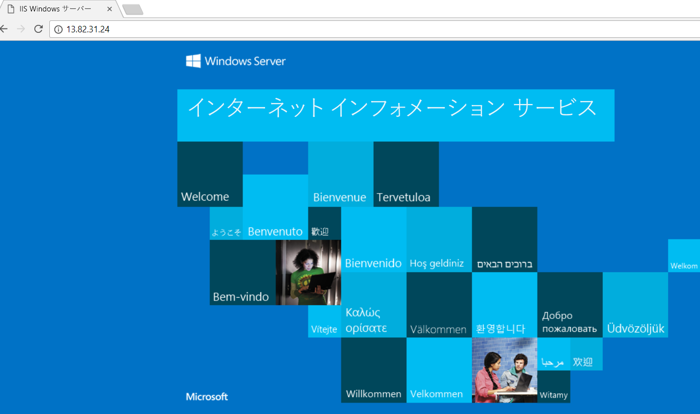

# クイック スタート:Azure Portal を使用して VM の負荷を分散する Standard Load Balancer を作成する

負荷分散では、着信要求を複数の仮想マシンに分散させることで、より高いレベルの可用性とスケールを実現します。 Azure Portal を使用して、仮想マシン (VM) の負荷分散を行うロード バランサーを作成できます。 このクイック スタートでは、Standard Load Balancer を使用して VM に負荷分散する方法を示します。

Azure サブスクリプションをお持ちでない場合は、開始する前に [無料アカウント](https://azure.microsoft.com/free/?WT.mc_id=A261C142F) を作成してください。 

## Azure へのサインイン

Azure Portal ([https://portal.azure.com](https://portal.azure.com)) にサインインします。

## Standard Load Balancer を作成する

このセクションでは、仮想マシンの負荷分散に役立つ Standard Load Balancer を作成します。 Standard Load Balancer では、Standard パブリック IP アドレスだけがサポートされています。 Standard Load Balancer を作成するときに、Standard Load Balancer のフロントエンド (既定では *LoadBalancerFrontend* という名前) として構成される新しい Standard パブリック IP アドレスも作成する必要があります。 

1. 画面の左上で、**[リソースの作成]** > **[ネットワーク]** > **[Load Balancer]** を選択します。
2. **[ロード バランサーの作成]** ページの **[基本]** タブで、次の情報を入力するか選択し、それ以外の設定では既定値をそのまま使用して、**[確認と作成]** を選択します。

    | Setting                 | 値                                              |
    | ---                     | ---                                                |
    | サブスクリプション               | サブスクリプションを選択します。    |    
    | リソース グループ         | **[新規作成]** を選択して、テキスト ボックスに「*myResourceGroupSLB*」と入力します。|
    | Name                   | *myLoadBalancer*                                   |
    | リージョン         | **[西ヨーロッパ]** を選択します。                                        |
    | type          | **[パブリック]** を選択します。                                        |
    | SKU           | **[Standard]** を選択します。                          |
    | パブリック IP アドレス | **[新規作成]** を選択します。 |
    | パブリック IP アドレス名              | テキスト ボックスに「*myPublicIP*」と入力します。   |
    |可用性ゾーン| **[ゾーン冗長]** を選択します。    |
3. **[確認および作成]** タブで、**[作成]** を選択します。   

    

## Load Balancer のリソースを作成する

このセクションでは、バックエンド アドレス プールの Load Balancer 設定と正常性プローブを構成し、バランサーの規則を指定します。

### バックエンド アドレス プールの作成

トラフィックを VM に分散するには、バックエンド アドレス プールに、Load Balancer に接続される仮想 NIC の IP アドレスを含めます。 バックエンド アドレス プール *myBackendPool* を作成し、インターネット トラフィックを負荷分散するために仮想マシンを含めます。

1. 左側のメニューで **[すべてのサービス]**、**[すべてのリソース]** の順に選択し、リソースの一覧で **[myLoadBalancer]** を選択します。
2. **[設定]** で、**[バックエンド プール]**、**[追加]** の順に選択します。
3. **[バックエンド プールの追加]** ページで、バックエンド プールの名前として「*myBackEndPool*」と入力し、**[追加]** を選択します。

### 正常性プローブの作成

Load Balancer でアプリの状態を監視するには、正常性プローブを使用します。 正常性プローブは、Load Balancer のローテーションに含める VM を、正常性チェックへの応答に基づいて動的に追加したり削除したりする働きをします。 正常性プローブ *myHealthProbe* を作成し、VM の正常性を監視します。

1. 左側のメニューで **[すべてのサービス]**、**[すべてのリソース]** の順に選択し、リソースの一覧で **[myLoadBalancer]** を選択します。
2. **[設定]** で、**[正常性プローブ]**、**[追加]** の順に選択します。
    
    | Setting | 値 |
    | ------- | ----- |
    | Name | 「*myHealthProbe*」と入力します。 |
    | Protocol | **[HTTP]** を選択します。 |
    | ポート | 「*80*」と入力します。|
    | interval | プローブの試行の**間隔**を示す秒数として、「*15*」を入力します。 |
    | 異常のしきい値 | **異常しきい値**またはプローブの連続する失敗の回数として *[2]* を選択します。この回数を超えると、VM は異常と見なされます。|
    | 正常性プローブ | *[myHealthProbe]* を選択します。 |
4. **[OK]** を選択します。

### ロード バランサー規則を作成する
ロード バランサー規則の目的は、一連の VM に対するトラフィックの分散方法を定義することです。 着信トラフィック用のフロントエンド IP 構成と、トラフィックを受信するためのバックエンド IP プールを、必要な発信元ポートと宛先ポートと共に定義します。 Load Balancer 規則 *myLoadBalancerRuleWeb* を作成して、フロントエンド *FrontendLoadBalancer* のポート 80 をリッスンし、同じポート 80 を使用して、負荷分散されたネットワーク トラフィックをバックエンド アドレス プール *myBackEndPool* に送信します。 

1. 左側のメニューで **[すべてのサービス]**、**[すべてのリソース]** の順に選択し、リソースの一覧で **[myLoadBalancer]** を選択します。
2. **[設定]** で、**[負荷分散規則]**、**[追加]** の順に選択します。
3. 負荷分散規則の構成には、以下の値を使用します。
    
    | Setting | 値 |
    | ------- | ----- |
    | Name | 「*myHTTPRule*」と入力します。 |
    | Protocol | **[TCP]** を選択します。 |
    | ポート | 「*80*」と入力します。|
    | バックエンド ポート | 「*80*」と入力します。 |
    | バックエンド プール | *[myBackendPool]* を選択します。|
    | 正常性プローブ | *[myHealthProbe]* を選択します。 |
4. 残りの部分は既定値のままにし、**[OK]** を選択します。
4. **[OK]** を選択します。

## バックエンド サーバーの作成

このセクションでは、仮想ネットワークを作成し、Load Balancer のバックエンド プール用に 2 台の仮想マシンを作成して、Load Balancer をテストするために仮想マシンに IIS をインストールします。

### 仮想ネットワークの作成
1. 画面の左上で、**[リソースの作成]** > **[ネットワーキング]** > **[仮想ネットワーク]** の順に選択します。

1. **[仮想ネットワークの作成]** に次の情報を入力または選択します。

    | Setting | 値 |
    | ------- | ----- |
    | Name | 「*myVNet*」と入力します。 |
    | アドレス空間 | 「*10.1.0.0/16*」を入力します。 |
    | サブスクリプション | サブスクリプションを選択します。|
    | リソース グループ | 既存のリソース *[myResourceGroupSLB]* を選択します。 |
    | Location | **[西ヨーロッパ]** を選択します。|
    | サブネット - 名前 | 「*myBackendSubnet*」と入力します。 |
    | サブネット アドレス範囲 | 「*10.1.0.0/24*」と入力します。 |
1. 残りの部分は既定値のままにし、**[作成]** を選択します。

### 仮想マシンを作成する
Standard Load Balancer は、バックエンド プールで Standard IP アドレスを使用する VM のみをサポートします。 このセクションでは、先ほど作成した Standard Load Balancer のバックエンド プールに追加される 2 つの異なるゾーン (*ゾーン 1* と *ゾーン 2*) に、Standard パブリック IP アドレスを持つ 2 台の VM (*myVM1* と *myVM2*) を作成します。

1. ポータルの左上で、**[リソースの作成]** > **[Compute]** > **[Windows Server 2016 Datacenter]** の順に選択します。 
   
1. **[仮想マシンの作成]** の **[Basic]** タブに次の値を入力するか選択します。
   - **[サブスクリプション]** > **[リソース グループ]**: **[myResourceGroupSLB]** を選択します。
   - **[インスタンスの詳細]** > **[仮想マシン名]**: 「*myVM1*」と入力します。
   - **[インスタンスの詳細]** > **[リージョン]** > **[西ヨーロッパ]** を選択します。
   - **[インスタンスの詳細]** > **[可用性オプション]** > **[可用性ゾーン]** を選択します。 
   - **[インスタンスの詳細]** > **[可用性ゾーン]** > **[1]** を選択します。
  
1. **[ネットワーク]** タブまたは **[次へ: ディスク]** を選択してから **[次へ: ネットワーク]** を選択します。 
   
   - 以下が選択されていることを確認します。
       - **[仮想ネットワーク]**: *myVNet*
       - **[サブネット]**: *myBackendSubnet*
       - **[パブリック IP]** > **[新規作成]** を選択し、**[パブリック IP アドレスの作成]** ウィンドウで **[SKU]** に **[Standard]** を選択し、**[可用性ゾーン]** に **[ゾーン冗長]** を選択して、**[OK]** をクリックします。
   - 新しいネットワーク セキュリティ グループ (NSG) を作成し、ファイアウォールの種類を選択するには、**[ネットワーク セキュリティ グループ]** で **[Advanced]\(高度\)** を選択します。 
       1. **ネットワーク セキュリティ グループの構成**フィールドで、**[新規作成]** を選択します。 
       1. 「*myNetworkSecurityGroup*」と入力し、**[OK]** を選択します。
   - VM を Load Balancer のバックエンド プールの一部にするには、次の手順を完了します。
        - **[負荷分散]** の **[この仮想マシンを既存の負荷分散ソリューションの後ろに配置しますか]** で **[はい]** を選択します。
        - **[負荷分散の設定]** の **[負荷分散のオプション]** で **[Azure Load Balancer]** を選択します。
        - **[ロード バランサーを選択します]** で *[myLoadBalancer]* を選択します。 
1. **[管理]** タブまたは **[次へ]** > **[管理]** を選択します。 **[監視]** で **[ブート診断]** を **[オフ]** に設定します。 
1. **[Review + create]\(レビュー + 作成\)** を選択します。   
1. 設定を確認し、**[作成]** を選択します。
1. 手順に従って、*myVM2* という名前の 2 つ目の VM を *myVM2-ip* という Standard SKU パブリック IP アドレスおよび **[可用性ゾーン]** 設定の **2** で作成します。他のすべての設定は *myVM1* と同じです。 

### NSG 規則の作成

このセクションでは、HTTP を使用する受信接続を許可するためのネットワーク セキュリティ グループの規則を作成します。

1. 左側のメニューで **[すべてのサービス]**、**[すべてのリソース]** の順に選択し、リソースの一覧で **[myResourceGroupSLB]** リソース グループにある **[myNetworkSecurityGroup]** を選択します。
2. **[設定]** で **[受信セキュリティ規則]** を選択し、**[追加]** を選択します。
3. *myHTTPRule* という名前の受信セキュリティ規則のために以下の値を入力し、ポート 80 を使用する受信 HTTP 接続を許可します。
    - "*サービス タグ*" - **ソース**。
    - "*インターネット*" - **ソース サービス タグ**
    - *80* - **宛先ポート範囲**
    - *TCP* - **プロトコル**
    - "*許可*" - **アクション**
    - *100* - **優先度**
    - *myHTTPRule* - 名前
    - "*HTTP を許可する*" - 説明
4. **[OK]** を選択します。
 
### IIS のインストール

1. 左側のメニューで **[すべてのサービス]**、**[すべてのリソース]** の順に選択し、リソースの一覧で *[myResourceGroupSLB]* リソース グループにある **[myVM1]** を選択します。
2. **[概要]** ページで **[接続]** を選択して、RDP で VM に接続します。
3. ユーザー名 *azureuser* で VM にログインします。
4. サーバーのデスクトップで、**[Windows 管理ツール]**>**[サーバー マネージャー]** の順に移動します。
5. サーバー マネージャーで **[役割と機能の追加]** を選択します。
6. **役割と機能の追加ウィザード**で、次の値を指定します。
    - **[インストールの種類の選択]** ページで、**[役割ベースまたは機能ベースのインストール]** を選択します。
    - **[対象サーバーの選択]** ページで **[myVM1]** を選択します。
    - **[サーバーの役割を選択してください]** ページで、**[Web Server (IIS)]** を選択します。
    - 指示に従って、ウィザードの残りの部分を完了します 
7. 仮想マシン *myVM2* に対して、手順 1. から 6. を繰り返します。

## Load Balancer をテストする
1. **[概要]** 画面で、ロード バランサーのパブリック IP アドレスを見つけます。 左側のメニューで **[すべてのサービス]**、**[すべてのリソース]**、**[myPublicIP]** の順に選択します。

2. そのパブリック IP アドレスをコピーし、ブラウザーのアドレス バーに貼り付けます。 IIS Web サーバーの既定のページがブラウザーに表示されます。

      

アプリを実行している 3 つの VM すべての間で、ロード バランサーがトラフィックを負荷分散していることを確認するには、Web ブラウザーを強制的に最新の情報に更新します。

## リソースのクリーンアップ

リソース グループ、Load Balancer、および関連するすべてのリソースは、不要になったら削除します。 これを行うには、Load Balancer を含むリソース グループ (*myResourceGroupSLB*) を選択し、**[削除]** をクリックします。

## 次の手順

このクイック スタートでは、Standard Load Balancer を作成し、それに VM をアタッチして、ロード バランサー トラフィック規則と正常性プローブを構成してから、ロード バランサーをテストしました。 Azure Load Balancer についてさらに学習するには、Azure Load Balancer のチュートリアルに進みます。

> [!div class="nextstepaction"]
> [Azure Load Balancer のチュートリアル](tutorial-load-balancer-standard-public-zone-redundant-portal.md)
