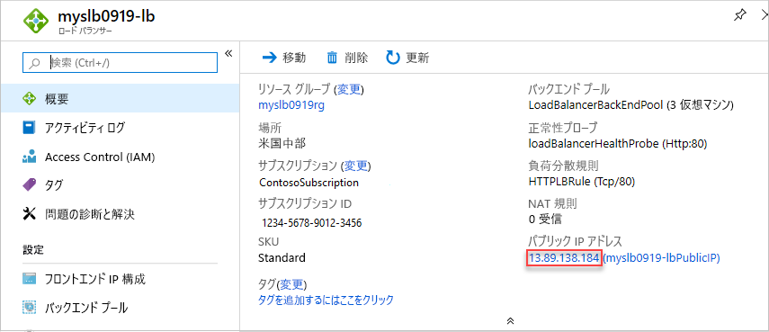

# <a name="quickstart-create-a-standard-load-balancer-to-load-balance-vms-by-using-azure-resource-manager-template"></a>クイック スタート:VM の負荷を分散する Standard ロード バランサーを Azure Resource Manager テンプレートを使って作成する

負荷分散では、着信要求を複数の仮想マシン (VM) に分散させることで、より高いレベルの可用性とスケールを実現します。 このクイックスタートでは、VM を負荷分散する Standard ロード バランサーを作成する Azure Resource Manager テンプレートを展開する方法を説明します。 Resource Manager テンプレートを使用すると、他のデプロイ方法より手順が減ります。

[Resource Manager テンプレート](../azure-resource-manager/templates/overview.md)は JavaScript Object Notation (JSON) ファイルであり、プロジェクトのインフラストラクチャと構成が定義されています。 このテンプレートでは、デプロイしようとしているものを、それを作成する一連のプログラミング コマンドを記述しなくても記述できる、宣言型の構文を使用しています。 Resource Manager テンプレートの開発に関する詳細を学ぶには、[Resource Manager ドキュメント](/azure/azure-resource-manager/)と[テンプレート リファレンス](/azure/templates/microsoft.network/loadbalancers)を参照してください。

Azure サブスクリプションをお持ちでない場合は、開始する前に [無料アカウント](https://azure.microsoft.com/free/?WT.mc_id=A261C142F) を作成してください。

## <a name="create-a-standard-load-balancer"></a>Standard ロード バランサ―を作成する

Standard ロード バランサーでサポートされるのは Standard パブリック IP アドレスだけです。 Standard ロード バランサーを作成するときに、Standard ロード バランサーのフロントエンドとして構成されている新しい Standard パブリック IP アドレスも作成する必要があります。

このクイックスタートで使用するテンプレートは、[クイックスタート テンプレート](https://raw.githubusercontent.com/Azure/azure-quickstart-templates/master/101-load-balancer-standard-create/azuredeploy.json)です。

[!code-json[<Azure Resource Manager template create standard load balancer>](~/quickstart-templates/101-load-balancer-standard-create/azuredeploy.json)]

テンプレートでは、複数の Azure リソースが定義されています。

- **Microsoft.Network/loadBalancers**
- **Microsoft.Network/publicIPAddresses**: ロード バランサー用。
- **Microsoft.Network/networkSecurityGroups**
- **Microsoft.Network/virtualNetworks**
- **Microsoft.Compute/virutalMachines** (そのうちの 3 つ)
- **Microsoft.Network/publicIPAddresses** (そのうちの 3 つ): 3 台の各仮想マシン用。
- **Microsoft.Network/networkInterfaces** (そのうちの 3 つ)
- **Microsoft.Compute/virtualMachine/extensions** (そのうちの 3 つ): IIS と Web ページの構成に使用

Azure Load Balancer に関連するテンプレートをさらに探すには、「[Azure クイックスタート テンプレート](https://azure.microsoft.com/resources/templates/?resourceType=Microsoft.Network&pageNumber=1&sort=Popular)」を参照してください。

1. 次のコード ブロックの **[試してみる]** を選択して Azure Cloud Shell を開き、指示に従って Azure にサインインします。

   ```azurepowershell-interactive
   $projectName = Read-Host -Prompt "Enter a project name with 12 or less letters or numbers that is used to generate Azure resource names"
   $location = Read-Host -Prompt "Enter the location (i.e. centralus)"
   $adminUserName = Read-Host -Prompt "Enter the virtual machine administrator account name"
   $adminPassword = Read-Host -Prompt "Enter the virtual machine administrator password" -AsSecureString

   $resourceGroupName = "${projectName}rg"
   $templateUri = "https://raw.githubusercontent.com/Azure/azure-quickstart-templates/master/101-load-balancer-standard-create/azuredeploy.json"

   New-AzResourceGroup -Name $resourceGroupName -Location $location
   New-AzResourceGroupDeployment -ResourceGroupName $resourceGroupName -TemplateUri $templateUri -projectName $projectName -location $location -adminUsername $adminUsername -adminPassword $adminPassword

   Write-Host "Press [ENTER] to continue."
   ```

   コンソールからプロンプトが表示されるまで待ちます。

1. 前のコード ブロックから **[コピー]** を選択して、PowerShell スクリプトをコピーします。

1. シェル コンソール ウィンドウを右クリックし、 **[貼り付け]** を選択します。

1. 値を入力します。

   テンプレートのデプロイによって、3 つの可用性ゾーンが作成されます。 可用性ゾーンは[特定のリージョン](../availability-zones/az-overview.md)でのみサポートされています。 サポートされているリージョンのいずれかを使用します。 よくわからない場合は、「**centralus**」と入力します。

   リソース グループの名前は、**rg** が付加されたプロジェクト名です。 次のセクションでリソース グループ名が必要になります。

テンプレートのデプロイには約 10 分かかります。 完了すると、次のように出力されます。


テンプレートをデプロイするには Azure PowerShell を使用します。 Azure PowerShell だけでなく、Azure portal、Azure CLI、および REST API を使用することもできます。 他のデプロイ方法については、「[テンプレートのデプロイ](../azure-resource-manager/templates/deploy-portal.md)」を参照してください。

## <a name="test-the-load-balancer"></a>ロード バランサーをテストする

1. [Azure portal](https://portal.azure.com) にサインインする

1. 左側のウィンドウから **[リソース グループ]** を選択します。

1. 前のセクションで作成したリソース グループを選択します 既定のリソース グループ名は、プロジェクト名に **rg** が追加されたものです。

1. ロード バランサーを選択します。 既定の名前は、プロジェクト名に **-lb** が追加されたものです。

1. パブリック IP アドレスの IP アドレス部分のみをコピーして、ブラウザーのアドレス バーに貼り付けます。

   

    ブラウザーにはインターネット インフォメーション サービス (IIS) Web サーバーの既定ページが表示されます。

   

ロード バランサーが 3 つの VM すべての間でトラフィックを分散していることを確認するには、クライアント マシンから Web ブラウザーを強制的に最新の情報に更新します。

## <a name="clean-up-resources"></a>リソースをクリーンアップする

不要になったら、リソース グループ、ロード バランサー、およびすべての関連リソースを削除します。 これを行うには、Azure portal に移動し、ロード バランサーを含むリソース グループを選択し、 **[リソース グループの削除]** を選択します。

## <a name="next-steps"></a>次のステップ

このクイックスタートでは、Standard Load Balancer を作成し、それに VM をアタッチして、ロード バランサー トラフィック規則と正常性プローブを構成してから、ロード バランサーをテストしました。

さらに学習するには、Load Balancer に関するチュートリアルに進みます。

> [!div class="nextstepaction"]
> [Azure Load Balancer のチュートリアル](tutorial-load-balancer-standard-public-zone-redundant-portal.md)
