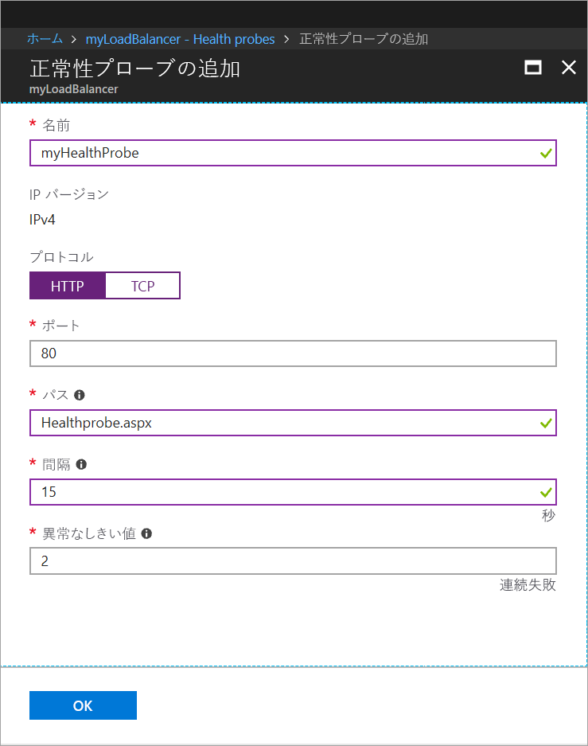

# <a name="tutorial-load-balance-internet-traffic-to-vms-using-the-azure-portal"></a>チュートリアル:Azure portal を使用してインターネット トラフィックを VM に負荷分散する

負荷分散では、着信要求を複数の仮想マシンに分散させることで、より高いレベルの可用性とスケールを実現します。 このチュートリアルでは、インターネット トラフィックを VM に分散して高可用性を提供する、Azure Standard Load Balancer のさまざまなコンポーネントについて説明します。 学習内容は次のとおりです。


> [!div class="checklist"]
> * Azure Load Balancer を作成する
> * 仮想マシンを作成し、IIS サーバーをインストールする
> * ロード バランサーのリソースを作成する
> * 動作中のロード バランサーを表示する
> * ロード バランサーに VM を追加または削除する

Azure サブスクリプションをお持ちでない場合は、開始する前に [無料アカウント](https://azure.microsoft.com/free/?WT.mc_id=A261C142F) を作成してください。 

## <a name="sign-in-to-the-azure-portal"></a>Azure ポータルにサインインします。

Azure Portal ([http://portal.azure.com](http://portal.azure.com)) にサインインします。

## <a name="create-a-standard-load-balancer"></a>Standard Load Balancer を作成する

このセクションでは、仮想マシンの負荷分散に役立つパブリック ロード バランサーを作成します。 Standard Load Balancer では、Standard パブリック IP アドレスだけがサポートされています。 Standard Load Balancer を作成するときに、Standard Load Balancer のフロントエンド (既定では *LoadBalancerFrontend* という名前) として構成される新しい Standard パブリック IP アドレスも作成する必要があります。 

1. 画面の左上で、**[リソースの作成]** > **[ネットワーキング]** > **[ロード バランサー]** の順にクリックします。
2. **[ロード バランサーの作成]** ページで、次の情報を入力するか選択し、それ以外の設定では既定値をそのまま使用して、**[作成]** を選択します。
    
    | Setting                 | 値                                              |
    | ---                     | ---                                                |
    | Name                   | *myLoadBalancer*                                   |
    | type          | パブリック                                        |
    | SKU           | 標準                          |
    | パブリック IP アドレス | **[新規作成]** を選択して、テキスト ボックスに「*myPublicIP*」と入力します。 既定では、パブリック IP アドレスの Standard SKU が選択されます。 **[可用性ゾーン]** で、**[ゾーン冗長]** を選択します。 |
    | サブスクリプション               | サブスクリプションを選択します。    |
    |リソース グループ | **[新規作成]** を選択して、「*myResourceGroupSLB*」と入力します。    |
    | 場所           | **[西ヨーロッパ]** を選択します。                          |
    


   
## <a name="create-backend-servers"></a>バックエンド サーバーの作成

このセクションでは、仮想ネットワークを作成し、ロード バランサーのバックエンド プール用に 3 台の仮想マシンを作成して、ロード バランサーをテストするために仮想マシンに IIS をインストールします。

### <a name="create-a-virtual-network"></a>仮想ネットワークの作成
1. Azure portal の左上で **[リソースの作成]** > **[ネットワーク]** > **[仮想ネットワーク]** の順に選択して、仮想ネットワークの以下の値を入力します。
    |Setting|値|
    |---|---|
    |Name|「*myVNet*」と入力します。|
    |サブスクリプション| サブスクリプションを選択します。|
    |リソース グループ| **[既存のものを使用]**、*[myResourceGroupSLB]* の順に選択します。|
    |サブネット名| 「*myBackendSubnet*」と入力します。|
    
2. **[作成]** をクリックして、仮想ネットワークを作成します。

### <a name="create-virtual-machines"></a>仮想マシンを作成する

1. Azure portal の左上で **[リソースの作成]** > **[コンピューティング]** > **[Windows Server 2016 Datacenter]** の順に選択して、仮想マシンの以下の値を入力します。
    1. 仮想マシンの名前として、「*myVM1*」と入力します。        
    2. **[リソース グループ]** で、**[既存のものを使用]** を選択してから、*[myResourceGroupSLB]* を選択します。
2. Click **OK**.
3. 仮想マシンのサイズとして **[DS1_V2]** を選択し、**[選択]** をクリックします。
4. VM の設定に以下の値を入力します。
    1. *myVNet* が仮想ネットワークとして選択され、*myBackendSubnet* がサブネットとして選択されていることを確認します。
    2. **[パブリック IP アドレス]** の **[パブリック IP アドレスの作成]** ウィンドウで、**[Standard]** を選択してから **[OK]** を選択します。
    3. **[ネットワーク セキュリティ グループ]** で **[詳細設定]** を選択して、以下を実行します。
        1. *[ネットワーク セキュリティ グループ (ファイアウォール)] を選択し、**[ネットワーク セキュリティ グループの選択]** ページで **[新規作成]** を選択します。 
        2. **[ネットワーク セキュリティ グループの選択]** ページで、新しいネットワーク セキュリティ グループの名前として **[名前]** に「*myNetworkSecurityGroup*」と入力し、**[OK]** を選択します。
5. **[無効]** をクリックして、ブート診断を無効にします。
6. **[OK]** をクリックし、概要ページの設定を確認して、**[作成]** をクリックします。
7. 手順 1. から 6. を使用して、名前が *VM2* および *VM3*、仮想ネットワークが *myVnet*、サブネットが *myBackendSubnet*、ネットワーク セキュリティ グループが *myNetworkSecurityGroup* である、さらに 2 つの VM を作成します。 

### <a name="create-network-security-group-rule"></a>ネットワーク セキュリティ グループ規則を作成する

このセクションでは、HTTP を使用する受信接続を許可するための NSG 規則を作成します。

1. 左側のメニューで **[すべてのリソース]** をクリックし、リソースの一覧で **[myResourceGroupSLB]** リソース グループにある **[myNetworkSecurityGroup]** をクリックします。
2. **[設定]** で **[受信セキュリティ規則]** をクリックし、**[追加]** をクリックします。
3. *myHTTPRule* という名前の受信セキュリティ規則のために以下の値を入力し、ポート 80 を使用する受信 HTTP 接続を許可します。
    - "*サービス タグ*" - **ソース**。
    - "*インターネット*" - **ソース サービス タグ**
    - *80* - **宛先ポート範囲**
    - *TCP* - **プロトコル**
    - "*許可*" - **アクション**
    - *100* - **優先度**
    - *myHTTPRule* - 名前
    - "*HTTP を許可する*" - 説明
4. **[追加]** を選択します。

### <a name="install-iis-on-vms"></a>VM に IIS をインストールする

1. 左側のメニューで **[すべてのリソース]** をクリックし、リソースの一覧で *myResourceGroupSLB* リソース グループにある **myVM1** をクリックします。
2. **[概要]** ページで **[接続]** をクリックして、RDP で VM に接続します。
3. **[Connect to virtual machine]\(仮想マシンへの接続\)** ポップアップ ウィンドウで、**[RDP ファイルのダウンロード]** を選択して、ダウンロードされた RDP ファイルを開きます。
4. **[リモート デスクトップ接続]** ウィンドウで **[接続]** をクリックします。
5. VM の作成中に指定した資格情報を使用して、この VM にログインします。 これで、仮想マシン *myVM1* とのリモート デスクトップ セッションが起動されます。
6. サーバーのデスクトップで、**[Windows 管理ツール]**>**[Windows PowerShell]** の順に移動します。
7. PowerShell ウィンドウで、以下のコマンドを実行して IIS サーバーをインストールし、既定の iisstart.htm ファイルを削除して、VM の名前を表示する新しい iisstart.htm ファイルを追加します。

   ```azurepowershell-interactive
    
    # install IIS server role
    Install-WindowsFeature -name Web-Server -IncludeManagementTools
    
    # remove default htm file
     remove-item  C:\inetpub\wwwroot\iisstart.htm
    
    # Add a new htm file that displays server name
     Add-Content -Path "C:\inetpub\wwwroot\iisstart.htm" -Value $("Hello World from " + $env:computername)
   ```
6. *myVM1* で RDP セッションを閉じます。
7. 手順 1. から 6. を繰り返して、IIS と更新済み iisstart.htm ファイルを *myVM2* と *myVM3* にインストールします。

## <a name="create-load-balancer-resources"></a>ロード バランサーのリソースを作成する

このセクションでは、バックエンド アドレス プールのロード バランサー設定と正常性プローブを構成し、バランサーの規則を指定します。

### <a name="create-a-backend-address-pool"></a>バックエンド アドレス プールの作成

トラフィックを VM に分散するには、バックエンド アドレス プールに、ロード バランサーに接続される仮想 NIC の IP アドレスを含めます。 バックエンド アドレス プール *myBackendPool* を作成し、*VM1* および *VM2* を含めます。

1. 左側のメニューで **[すべてのリソース]** をクリックし、リソースの一覧で **[myLoadBalancer]** をクリックします。
2. **[設定]** で **[バックエンド プール]** をクリックし、**[追加]** をクリックします。
3. **[バックエンド プールの追加]** ページで、以下の操作を行います。
   - バックエンド プールの名前として、[名前] に「*myBackendPool*」と入力します。
   - **[仮想ネットワーク]** で *[myVNet]* を選択します。
   - **[仮想マシン]** で、対応する IP アドレスと共に *myVM1*、*myVM2*、*my VM3* を追加して、**[追加]** を選択します。
4. ロード バランサー バックエンド プール設定に、*myVM1*、*myVM2*、*myVM3* すべての VM が表示されることを確認してから、**[OK]** をクリックします。

### <a name="create-a-health-probe"></a>正常性プローブの作成

ロード バランサーでアプリの状態を監視するには、正常性プローブを使用します。 正常性プローブは、ロード バランサーのローテーションに含める VM を、正常性チェックへの応答に基づいて動的に追加したり削除したりする働きをします。 正常性プローブ *myHealthProbe* を作成し、VM の正常性を監視します。

1. 左側のメニューで **[すべてのリソース]** をクリックし、リソースの一覧で **[myLoadBalancer]** をクリックします。
2. **[設定]** で **[正常性プローブ]** をクリックし、**[追加]** をクリックします。
3. 正常性プローブの作成では、以下の値を使用します。
    - *myHealthProbe* - 正常性プローブの名前。
    - **HTTP** - プロトコルの種類。
    - *80* - ポート番号。
    - *15* - プローブの試行の**間隔**を示す秒数。
    - *2* - **異常しきい値**またはプローブの連続する失敗の回数。この回数を超えると、VM は異常と見なされます。
4. Click **OK**.

   

### <a name="create-a-load-balancer-rule"></a>ロード バランサー規則の作成

ロード バランサー規則の目的は、一連の VM に対するトラフィックの分散方法を定義することです。 着信トラフィック用のフロントエンド IP 構成と、トラフィックを受信するためのバックエンド IP プールを、必要な発信元ポートと宛先ポートと共に定義します。 ロード バランサー規則 *myLoadBalancerRuleWeb* を作成して、フロントエンド *FrontendLoadBalancer* のポート 80 をリッスンし、同じポート 80 を使用して、負荷分散されたネットワーク トラフィックをバックエンド アドレス プール *myBackEndPool* に送信します。 

1. 左側のメニューで **[すべてのリソース]** をクリックし、リソースの一覧で **[myLoadBalancer]** をクリックします。
2. **[設定]** で **[負荷分散規則]** をクリックし、**[追加]** をクリックします。
3. 負荷分散規則の構成には、以下の値を使用します。
    - *myHTTPRule* - 負荷分散規則の名前。
    - **TCP** - プロトコルの種類。
    - *80* - ポート番号。
    - *80* - バックエンド ポート。
    - *myBackendPool* - バックエンド プールの名前。
    - *myHealthProbe* - 正常性プローブの名前。
4. Click **OK**.

## <a name="test-the-load-balancer"></a>ロード バランサーをテストする
1. **[概要]** 画面で、ロード バランサーのパブリック IP アドレスを見つけます。 **[すべてのリソース]** をクリックし、**[myPublicIP]** をクリックします。

2. そのパブリック IP アドレスをコピーし、ブラウザーのアドレス バーに貼り付けます。 IIS Web サーバーの既定のページがブラウザーに表示されます。

      

アプリを実行している 3 つの VM の間で、ロード バランサーがトラフィックを負荷分散していることを確認するには、Web ブラウザーを強制的に最新の情報に更新します。

## <a name="remove-or-add-vms-from-the-backend-pool"></a>バックエンド プールの VM を追加または削除する
アプリを実行している VM には、OS の更新プログラムをインストールするなどメンテナンスが必要になることもあります。 また、アプリのトラフィックが増大すれば、それに対処するために、新たに VM を追加しなければなりません。 このセクションでは、ロード バランサーから VM を除外したりロード バランサーに対して VM を追加したりする方法について説明します。

1. 左側のメニューで **[すべてのリソース]** をクリックし、リソースの一覧で **[myLoadBalancer]** をクリックします。
2. **[設定]** で **[バックエンド プール]** をクリックし、バックエンド プールの一覧で **myBackendPool** をクリックします。
3. **myBackendPool** のページの **[ターゲット ネットワーク IP 構成]** で、バックエンドから *VM1* を削除するには、**仮想マシン:myVM1** の横にある削除アイコンをクリックします。

*myVM1* がバックエンド アドレス プールに存在しなくなると、ソフトウェア更新プログラムのインストールなど、*myVM1* に対するメンテナンス タスクを実行できます。 *VM1* がなくなると、負荷は *myVM2* と *myVM3* の間で分散されるようになります。 

*myVM1* を再びバックエンド プールに追加するには、この記事の「*バックエンド アドレス プールに VM を追加する*」セクションの手順に従います。

## <a name="clean-up-resources"></a>リソースのクリーンアップ

リソース グループ、ロード バランサー、および関連するすべてのリソースは、不要になったら削除します。 これを行うには、ロード バランサーを含むリソース グループを選択し、**[削除]** をクリックします。

## <a name="next-steps"></a>次の手順

このチュートリアルでは、Standard Load Balancer を作成し、それに VM をアタッチして、ロード バランサー トラフィック規則と正常性プローブを構成してから、ロード バランサーをテストしました。 また、負荷分散セットから VM を削除し、バックエンド アドレス プールに VM を追加して戻しました。 Azure Load Balancer についてさらに学習するには、Azure Load Balancer のチュートリアルに進みます。

> [!div class="nextstepaction"]
> [Azure Load Balancer のチュートリアル](tutorial-load-balancer-standard-public-zone-redundant-portal.md)
