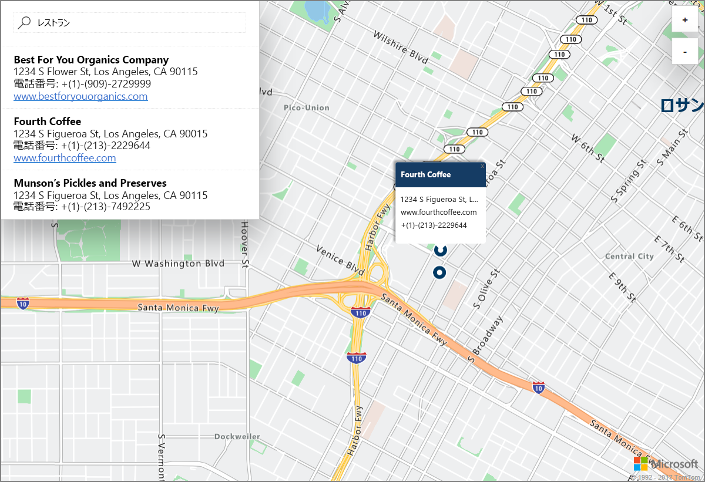

# Azure Location Based Services (プレビュー) によるデモ版対話型マップ検索を開始する

この記事では、Azure Location Based Services (LBS) のデモ版対話型マップ検索機能について説明します。 また、デモ版の Web アプリケーションで使用する LBS アカウントを作成し、キーを取得する基本的な手順についても説明します。 

Azure サブスクリプションをお持ちでない場合は、開始する前に [無料アカウント](https://azure.microsoft.com/free/?WT.mc_id=A261C142F) を作成してください。

## Azure Portal にログインする

[Azure Portal](https://portal.azure.com/) にログインします。

## Location Based Services アカウントを作成し、アカウント キーを取得する

1. [Azure ポータル](https://portal.azure.com)の左上隅にある **[リソースの作成]** をクリックします。
2. *[Marketplace を検索]* ボックスに「**location based services**」と入力します。
3. *[結果]* で **[Location Based Services (プレビュー)]** をクリックします。 マップの下に表示される **[作成]** ボタンをクリックします。 
4. **[Create Location Based Services アカウントの作成]** ページで、新しいアカウントの *[名前]* を入力し、使用する *[サブスクリプション]* を選択し、新規または既存の *[リソース グループ]* の名前を入力します。 リソース グループの場所を選択し、*[プレビューの使用条件]* に同意して、**[作成]** をクリックします。

    

5. アカウントが正常に作成されたら、アカウントを開いて、アカウントの **[設定]** に移動します。 **[キー]** をクリックして、Azure Location Based Services アカウントの主キーとセカンダリ キーを取得します。 次のセクションで使用する **[主キー]** の値をローカルのクリップボードにコピーします。 

## Azure Maps のデモ アプリケーションをダウンロードする

1. [interactiveSearch.html](https://github.com/Azure-Samples/location-based-services-samples/blob/master/src/interactiveSearch.html) ファイルの内容をコピーまたはダウンロードします。
2. このファイルの内容を **AzureMapDemo.html** としてローカルに保存し、テキスト エディターで開きます。
3. 文字列 `<insert-key>` を検索し、前のセクションで取得した、**主キー**の値で置換します。 

## Azure Maps のデモ アプリケーションを起動する

1. **AzureMapDemo.html** ファイルを任意のブラウザーで開きます。
2. 表示されるロサンゼルス市の地図を見てください。 市は、*AzureMapDemo.html* の **center** という名前の JavaScript 変数に指定された `[longitude, latitude]` の組で規定されます。 これらの座標は、任意の他の市に変更できます。 たとえば、ニューヨーク市の座標は *[-74.0060, 40.7128]* です。
3. デモの Web アプリケーションの左上隅にある検索ボックスに、検索する場所の種類または住所を入力します。 
4. 検索ボックスの下に表示された住所/場所のリストにマウスをのせると、対応するピンがマップに現れ、その場所に関する情報がポップアップに表示されます。 たとえば、この Web アプリケーション サンプルを起動して、「*レストラン*」を検索すると次の結果が表示されます。 民間事業のプライバシー保護のための架空の名前と住所が表示されています。 

    

## リソースのクリーンアップ

チュートリアルでは、Azure Location Based Services アカウントの使用と構成について詳しく説明します。 チュートリアルを続ける場合は、このクイックスタートで作成したリソースを消去しないでください。 使用する予定がない場合は、次の手順を使用して、このクイックスタートで作成したすべてのリソースを削除してください。

1. **AzureMapDemo.html** Web アプリケーションを実行しているブラウザーを閉じます。
2. Azure ポータルの左側のメニューにある **[すべてのリソース]** をクリックし、LBS アカウントを選択します。 **[すべてのリソース]** ブレードの上部にある **[削除]** をクリックします。

## 次の手順

このクイック スタートでは、Azure LBS アカウントを作成し、そのアカウントを使用してデモ アプリを起動しました。 Azure Location Based Services API を使用して、独自のアプリケーションを作成する方法を学習するには、次のチュートリアルにお進みください。

> [!div class="nextstepaction"]
> [Azure のマップと検索の使用についてのチュートリアル](./tutorial-search-location.md)
