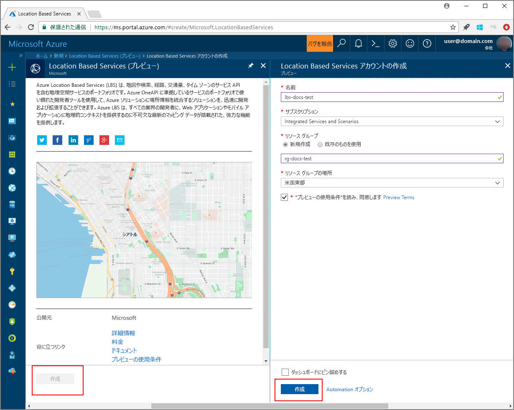

# <a name="search-nearby-points-of-interest-using-azure-location-based-services"></a>Azure Location Based Services を使用して近くの目的地を検索する

このチュートリアルでは、Azure Location Based Services でアカウントを設定してから、提供されている API を使って目的地を検索する方法を示します。 このチュートリアルで学習する内容は次のとおりです。

> [!div class="checklist"]
> * Azure Location Based Services でアカウントを作成する
> * Azure Location Based Services アカウントの主キーを確認する
> * マップ コントロール API を使用して Web ページを作成する
> * Search Service を使って近くの目的地を検索する

Azure サブスクリプションをお持ちでない場合は、開始する前に [無料アカウント](https://azure.microsoft.com/free/) を作成してください。

## <a name="log-in-to-the-azure-portal"></a>Azure Portal にログインする
[Azure Portal](https://portal.azure.com) にログインします。

<a id="createaccount"></a>

## <a name="create-an-account-with-azure-location-based-services"></a>Azure Location Based Services でアカウントを作成する

新しい Location Based Services アカウントを作成するには、次の手順のようにします。

1. [Azure Portal](https://portal.azure.com) の左上隅にある **[リソースの作成]** をクリックします。
2. *[Marketplace を検索]* ボックスに「**location based services**」と入力します。
3. *[結果]* で **[Location Based Services (プレビュー)]** をクリックします。 マップの下に表示される **[作成]** ボタンをクリックします。 
4. **[Location Based Services アカウントの作成]** ページで、次の値を入力します。
    - 新しいアカウントの "*名前*"。 
    - このアカウントで使う "*サブスクリプション*"。
    - このアカウントの "*リソース グループ*" の名前。 *[新規作成]* を選んで新しく作成することも、*[既存のものを使用]* を選んで既存のリソース グループを使うこともできます。
    - "*リソース グループの場所*" を選びます。
    - "*プレビューの使用条件*" を読んで、条件に同意するチェック ボックスをオンにします。 
    - 最後に、**[作成]** ボタンをクリックします。
   
    


<a id="getkey"></a>

## <a name="get-the-primary-key-for-your-account"></a>アカウントの主キーを取得する

Location Based Services アカウントが正常に作成された後、次の手順のようにしてアカウントをマップ検索 API にリンクします。

1. ポータルで Location Based Services アカウントを開きます。
2. アカウントの **[設定]** に移動し、**[キー]** を選びます。
3. **[主キー]** をクリップボードにコピーします。 後の手順で使うためにローカルに保存します。 

    


<a id="createmap"></a>

## <a name="create-new-web-page-using-azure-map-control-api"></a>Azure マップ コントロール API を使って新しい Web ページを作成する
Azure マップ コントロール API は、Azure Location Based Services を Web アプリケーションに簡単に統合できる便利なクライアント ライブラリです。 ベア REST サービスの呼び出しの複雑さを隠ぺいし、スタイルの設定とカスタマイズが可能なコンポーネントにより生産性を高めます。 次の手順では、Location Based Services のマップ コントロール API で埋め込まれる静的な HTML ページを作成する方法を示します。 

1. ローカル コンピューターに新しいファイルを作成し、名前を **MapSearch.html** にします。 
2. 次の HTML コンポーネントをファイルに追加します。

    ```HTML
    <!DOCTYPE html>
    <html lang="en">

    <head>
        <meta charset="utf-8" />
        <meta name="viewport" content="width=device-width, user-scalable=no" />
        <title>Map Search</title>

        <link rel="stylesheet" href="https://atlas.microsoft.com/sdk/css/atlas.min.css?api-version=1.0" type="text/css" />
        <script src="https://atlas.microsoft.com/sdk/js/atlas.min.js?api-version=1.0"></script>

        <style>
            html,
            body {
                width: 100%;
                height: 100%;
                padding: 0;
                margin: 0;
            }

            #map {
                width: 100%;
                height: 100%;
            }
        </style>
    </head>

    <body>
        <div id="map"></div>
        <script>
            // Embed Map Control JavaScript code here
        </script>
    </body>

    </html>
    ``` 
    HTML ヘッダーに、Azure マップ コントロール ライブラリによってホストされる CSS および JavaScript のリソース ファイルが含まれることに注意してください。 HTML ファイルの *body* に追加された *script* セグメントに注意してください。 このセグメントには、Azure Location Based Service の API にアクセスするためのインライン JavaScript コードが含まれます。
 
3.  次の JavaScript コードを、HTML ファイルの *script* ブロックに追加します。 Location Based Services アカウントの主キーをスクリプトで使用します。 

    ```JavaScript
    // Instantiate map to the div with id "map"
    var LBSAccountKey = "<_your account key_>";
    var map = new atlas.Map("map", {
        "subscription-key": LBSAccountKey
    });
    ```
    このセグメントは、Azure Location Based Services アカウント キーに対するマップ コントロール API を開始します。 **atlas** は、Azure マップ コントロール API および関連するビジュアル コンポーネントを含む名前空間です。 **atlas.Map** は、ビジュアルと対話型 Web マップに対するコントロールを提供します。 ブラウザーで HTML ページを開くと、マップの表示を確認できます。 

4. 次の JavaScript コードを *script* ブロックに追加して、検索ピンのレイヤーをマップ コントロールに追加します。

    ```JavaScript
    // Initialize the pin layer for search results to the map
    var searchLayerName = "search-results";
    map.addPins([], {
        name: searchLayerName,
        cluster: false,
        icon: "pin-round-darkblue"
    });
    ```

5. お使いのコンピューターのファイルを保存します。 


<a id="usesearch"></a>

## <a name="use-search-service-to-find-nearby-point-of-interest"></a>Search Service を使って近くの目的地を検索する

このセクションでは、Azure Location Based Services の Search Service API を使って、マップ上で目的地を検索する方法を示します。 これは、開発者向けに設計された、住所、目的地、その他の地理的な情報を検索するための RESTful API です。 Search Service は、指定された住所に緯度と経度の情報を割り当てます。 

1. 前のセクションで作成した **MapSearch.html** ファイルを開き、Search Service を示すための次の JavaScript コードを *script* ブロックに追加します。 
    ```JavaScript
    // Perform a request to the search service and create a pin on the map for each result
    var xhttp = new XMLHttpRequest();
    xhttp.onreadystatechange = function () {
        var searchPins = [];

        if (this.readyState === 4 && this.status === 200) {
            var response = JSON.parse(this.responseText);

            var poiResults = response.results.filter((result) => { return result.type === "POI" }) || [];

            searchPins = poiResults.map((poiResult) => {
                var poiPosition = [poiResult.position.lon, poiResult.position.lat];
                return new atlas.data.Feature(new atlas.data.Point(poiPosition), {
                    name: poiResult.poi.name,
                    address: poiResult.address.freeformAddress,
                    position: poiResult.position.lat + ", " + poiResult.position.lon
                });
            });

            map.addPins(searchPins, {
                name: searchLayerName
            });

            var lons = searchPins.map((pin) => { return pin.geometry.coordinates[0] });
            var lats = searchPins.map((pin) => { return pin.geometry.coordinates[1] });

            var swLon = Math.min.apply(null, lons);
            var swLat = Math.min.apply(null, lats);
            var neLon = Math.max.apply(null, lons);
            var neLat = Math.max.apply(null, lats);

            map.setCameraBounds({
                bounds: [swLon, swLat, neLon, neLat],
                padding: 50
            });
        }
    };
    ```
    このコード スニペットは、[XMLHttpRequest](https://xhr.spec.whatwg.org/) を作成し、受信した応答を解析するためのイベント ハンドラーを追加します。 応答が正常な場合、返された各場所の住所、名前、緯度、経度の情報を、`searchPins` 変数に収集します。 最後に、この場所のコレクションをピンとして `map` コントロールに追加します。 

2. 次のコードを *script* ブロックに追加します。このコードは、XMLHttpRequest を Azure Location Based Services の Search Service に送信します。

    ```JavaScript
    var url = "https://atlas.microsoft.com/search/fuzzy/json?";
    url += "&api-version=1.0";
    url += "&query=gasoline%20station";
    url += "&subscription-key=" + LBSAccountKey;
    url += "&lat=47.6292";
    url += "&lon=-122.2337";
    url += "&radius=100000";

    xhttp.open("GET", url, true);
    xhttp.send();
    ``` 
    このスニペットは、**あいまい検索**と呼ばれる、Search Service の基本的な検索 API を使います。 住所または *POI* トークンの任意の組み合わせを扱う入力のほとんどのあいまいさを処理します。 特定の緯度と経度の住所、および指定した半径内で、近くにある**ガソリン スタンド**を検索します。 前にサンプル ファイルで提供されたお使いのアカウントの主キーを使って、Location Based Services への呼び出しを行います。 結果は、見つかった場所の緯度/経度のペアとして返されます。 ブラウザーで HTML ページを開くと、検索ピンの表示を確認できます。 

3. 次の行を *script* ブロックに追加して、Search Service によって返される目的地のポップアップを作成します。

    ```JavaScript
    // Add a popup to the map which will display some basic information about a search result on hover over a pin
    var popup = new atlas.Popup();
    map.addEventListener("mouseover", searchLayerName, (e) => {
        var popupContentElement = document.createElement("div");
        popupContentElement.style.padding = "5px";

        var popupNameElement = document.createElement("div");
        popupNameElement.innerText = e.features[0].properties.name;
        popupContentElement.appendChild(popupNameElement);

        var popupAddressElement = document.createElement("div");
        popupAddressElement.innerText = e.features[0].properties.address;
        popupContentElement.appendChild(popupAddressElement);

        var popupPositionElement = document.createElement("div");
        popupPositionElement.innerText = e.features[0].properties.position;
        popupContentElement.appendChild(popupPositionElement);

        popup.setPopupOptions({
            position: e.features[0].geometry.coordinates,
            content: popupContentElement
        });

        popup.open(map);
    });
    ```
    API **atlas.Popup** は、マップ上の目的の位置に固定された情報ウィンドウを提供します。 このコード スニペットは、ポップアップの内容と位置を設定するだけでなく、"_マウス_" がポップアップをロールオーバーするのを待機するイベント リスナーを `map` コントロールに追加します。 

4. ファイルを保存した後、**MapSearch.html** ファイルを任意の Web ブラウザーで開いて、結果を確認します。 次のように、この時点でブラウザーのマップに示されているいずれかの検索ピンをポイントすると、情報ポップアップが表示されます。 

    


## <a name="next-steps"></a>次の手順
このチュートリアルで学習した内容は次のとおりです。

> [!div class="checklist"]
> * Azure Location Based Services でアカウントを作成する
> * アカウントの主キーを取得する
> * マップ コントロール API を使って新しい Web ページを作成する
> * Search Service を使って近くの目的地を検索する

チュートリアル「[Azure Location Based Services を使用して目的地までのルートを検索する](./tutorial-route-location.md)」に進み、Azure Location Based Services を使って目的地までのルートを表示する方法を学習してください。 
