# Log Analytics ワークスペースを使って作業を開始する
Azure Log Analytics は、IT インフラから運用に関する詳細情報を収集して評価できるサービスで、短時間で導入して使い始めることができます。 この記事で説明されている内容に従って、収集したデータの調査、分析、操作を "*無料で*" 簡単に始めることができます。

この記事では、Log Analytics の入門編として、サービスの使用を開始できるよう Azure への最小限のデプロイを行う手順について簡単に説明します。 Azure の管理データが保存された論理的なコンテナーを、ワークスペースと呼びます。 情報を確認し、評価を完了した後は、評価に使用したワークスペースを削除できます。 この記事はチュートリアルであるため、ビジネス要件、計画、アーキテクチャのガイダンスには触れていません。

>[!NOTE]
>Microsoft Azure Government Cloud を使用している場合は、この記事の代わりに [Azure Government 監視 + 管理に関するドキュメント](https://docs.microsoft.com/azure/azure-government/documentation-government-services-monitoringandmanagement#log-analytics)を参照してください。

ワークスペースの使用を開始するプロセスの概要は、次のようになります。

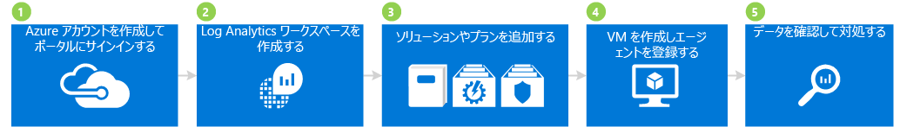

## 1 Azure アカウントを作成してサインインする

まだ Azure アカウントを持っていない場合は、Log Analytics を使用するために作成する必要があります。 すべての Azure サービスにアクセスできる、30 日間有効な[無料アカウント](https://azure.microsoft.com/free/)を作成できます。

### 無料アカウントを作成してサインインするには
1. 「[無料の Azure アカウントを今すぐ作成しましょう](https://azure.microsoft.com/free/)」の手順に従います。
2. [Azure Portal](https://portal.azure.com) にアクセスしてサインインします。

## 2 ワークスペースを作成する

次の手順に従って、ワークスペースを作成します。

1. Azure Portal の Marketplace のサービスの一覧で「*Log Analytics*」を検索し、**[Log Analytics]** を選択します。  
    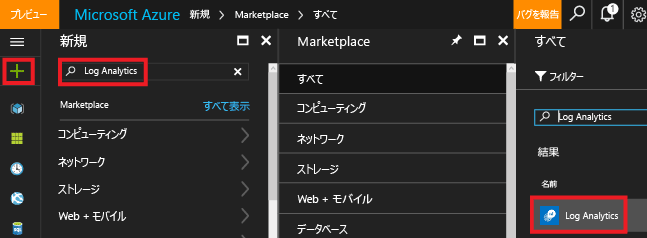
2. **[作成]**をクリックし、次の項目について選択します。
   * **OMS ワークスペース** - ワークスペースの名前を入力します。
   * **[サブスクリプション]** - 複数のサブスクリプションがある場合は、新しいワークスペースに関連付けるサブスクリプションを 1 つ選択します。
   * **[リソース グループ]**
   * **場所**
   * **[価格レベル]**  
       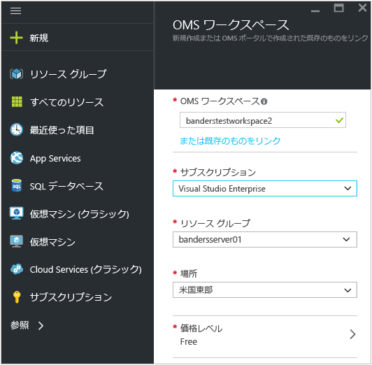
3. **[OK]** をクリックするとワークスペースの一覧が表示されます。
4. ワークスペースを選択すると、その詳細が Azure Portal に表示されます。       
    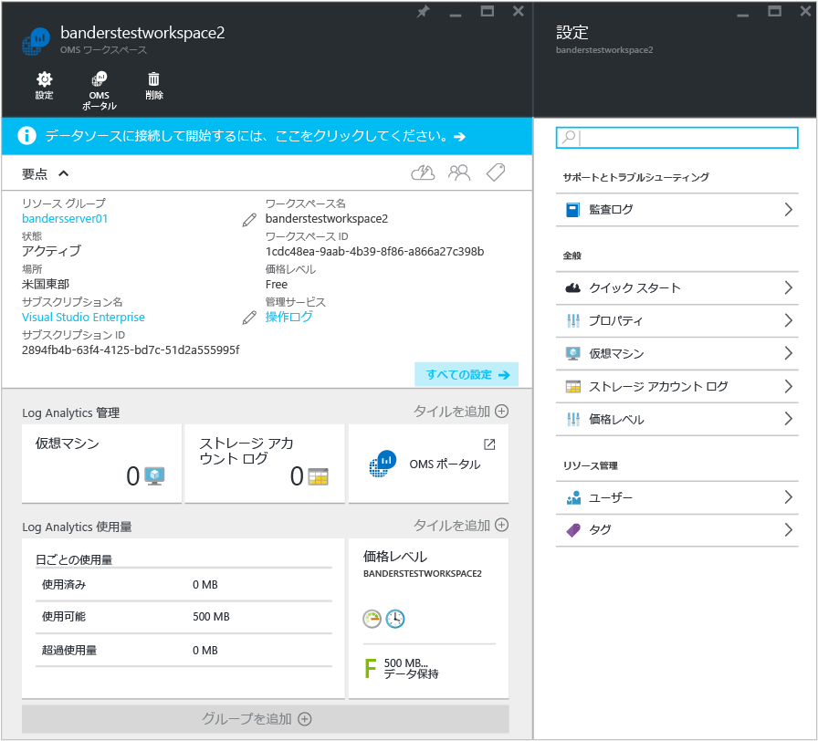         

## 3 ソリューションとソリューション オファリングを追加する

次に、管理ソリューションとソリューション オファリングを追加します。 管理ソリューションには、特定の問題点に関するメトリックを提供するロジックや視覚化、データ取得規則が集約されています。 ソリューション オファリングとは、複数の管理ソリューションを組み合わせたものです。

ワークスペースにソリューションを追加すると、エージェントを使用してワークスペースに接続されたコンピューターからさまざまな種類のデータを収集できます。 エージェントのオンボードについては後ほど説明します。

### ソリューションとソリューション オファリングを追加するには

1. Azure Portal で **[新規]** をクリックし、**[Marketplace を検索]** ボックスに「**Activity Log Analytics**」と入力し、Enter キーを押します。
2. [すべて] ブレードで、**[Activity Log Analytics (アクティビティ ログ分析)]**、**[作成]** の順にクリックします。  
      
3. "*管理ソリューション名*" のブレードで、管理ソリューションに関連付けるワークスペースを選択します。
4. **[作成]**をクリックします。  
    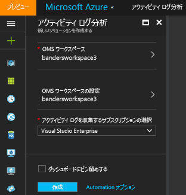  
5. 手順 1 ～ 4 を繰り返して、次のサービス オファリングを追加します。
    - [Antimalware Assessment (マルウェア対策評価)] ソリューションと [Security and Audit (セキュリティと監査)] ソリューションが含まれた **[Security & Compliance (セキュリティとコンプライアンス)]** サービス オファリング。
    - [Automation Hybrid Worker (Automation ハイブリッド worker)] ソリューション、[Change Tracking (変更の追跡)] ソリューション、および [System Update Assessment (システムの更新の評価)] \(別名 Update Management [更新管理]) ソリューションが含まれた **[Automation & Control (オートメーションと制御)]** サービス オファリング。 ソリューション オファリングを追加する際に Automation アカウントを作成する必要があります。  
        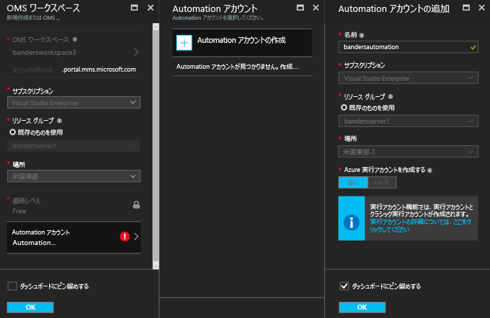  
6. ワークスペースに追加した管理ソリューションを表示するには、**[Log Analytics]** > **[サブスクリプション]** > ***ワークスペース名*** > **[概要]** の順に選択します。 追加した管理ソリューションのタイルが表示されます。  
    >[!NOTE]
    >まだエージェントをワークスペースに接続していないため、追加したソリューションのデータは表示されません。  

    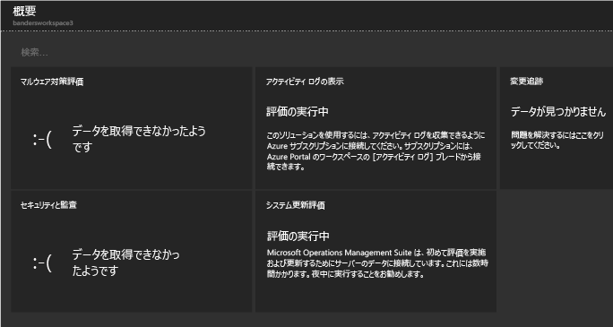

## 4 VM を作成し、エージェントをオンボードする

次に、Azure にシンプルな仮想マシンを作成します。 VM を作成したら、OMS エージェントをオンボードして有効にします。 エージェントを有効にすると、VM からのデータ収集が開始され、Log Analytics にデータが送信されます。

### 仮想マシンを作成するには

- 「[Azure ポータルで初めての Windows 仮想マシンを作成する](../virtual-machines/virtual-machines-windows-hero-tutorial.md)」に記載された手順に従って、新しい仮想マシンを作成します。

### 仮想マシンを Log Analytics に接続するには

- 「[Azure 仮想マシンを Log Analytics に接続する](log-analytics-azure-vm-extension.md)」に記載された手順に従って、Azure Portal で VM を Log Analytics に接続します。

## 5 データを表示して操作する

前の手順で、Activity Log Analytics ソリューション、Security & Compliance サービス オファリング、および Automation & Control サービス オファリングを有効にしました。 続いては、ソリューションによって収集されたデータとログ検索の結果を確認します。

まず、ソリューションの内部から表示されるデータを確認します。 次に、ログ検索機能でアクセスするログ検索の結果を確認します。 ユーザーはログの検索を通じて、環境内のさまざまなソースから収集したコンピューター データを組み合わせて相互の関係を比較することができます。 詳細については、「[Log Analytics におけるログの検索](log-analytics-log-searches.md)」を参照してください。 最後に、Azure Portal の外部にある OMS ポータルでデータを操作します。

### マルウェア対策に関するデータを表示するには

1. Azure Portal で**[Log Analytics]** > ***対象のワークスペース***に移動します。
2. ワークスペースのブレードで、**[全般]** にある **[概要]** をクリックします。  
    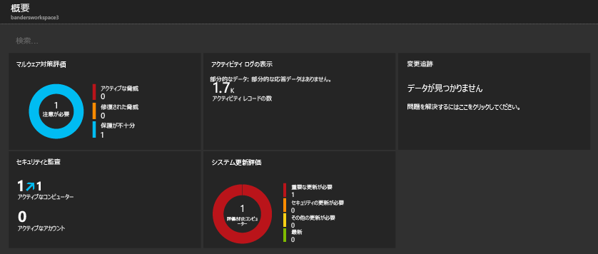
3. **[Antimalware Assessment (マルウェア対策評価)]** タイルをクリックします。 この例では、あるコンピューターに Windows Defender がインストールされているものの、定義ファイルが最新でないことがわかります。  
    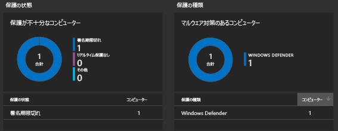
4. この例の場合は、**[保護の状態]** の **[Signature out of date (古い定義ファイル)]** をクリックすると、[ログ検索] 画面が開き、定義ファイルが更新されていないコンピューターに関する詳細情報が表示されます。 この例では、コンピューターの名前が *getstarted* となっています。 定義ファイルが更新されていないコンピューターが複数ある場合は、ログ検索の結果にすべて表示されます。  
    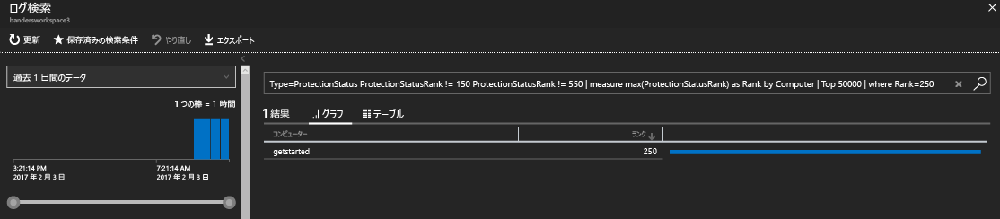

### セキュリティと監査に関するデータを表示するには

1. ワークスペースのブレードで、**[全般]** にある **[概要]** をクリックします。  
2. **[Security and Audit (セキュリティと監査)]** タイルをクリックします。 この例では、注目すべき問題が 2 つあることがわかります。1 つは重要な更新プログラムが適用されていないコンピューターが 1 台あること、もう 2 つは保護が不十分なコンピューターが 1 台あることです。  
    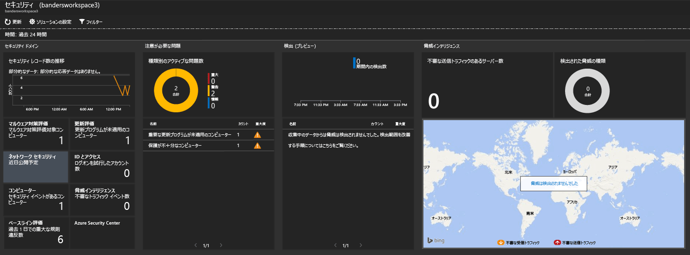
3. この例の場合は、**[Notable Issues (注目すべき問題)]** の **[Computers missing critical updates (重要な更新プログラムが適用されていないコンピューター)]** をクリックすると、[ログ検索] 画面が開き、重要な更新プログラムが適用されていないコンピューターに関する詳細情報が表示されます。 この例では、重要な更新プログラムが適用されていないコンピューターが 1 台ある以外に、他の更新プログラムが適用されていないコンピューターが 63 台あります。  
    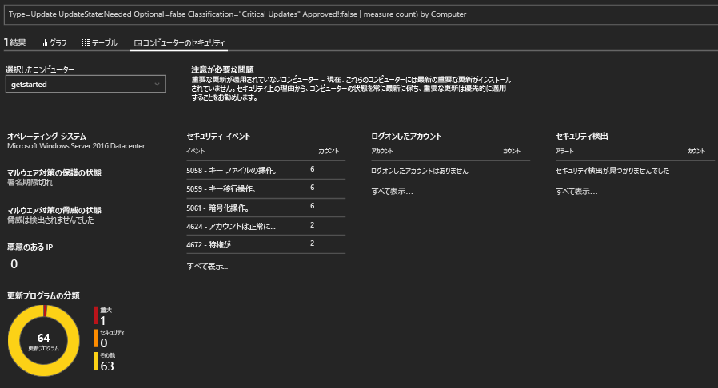

### システム更新に関するデータを表示して操作するには

1. ワークスペースのブレードで、**[全般]** にある **[概要]** をクリックします。  
2. **[System Update Assessment (システムの更新の評価)]** タイルをクリックします。 この例では、*getstarted* という名前の Windows コンピューターに重要な更新プログラムを適用する必要があることと、定義ファイルの更新が必要なコンピューターが 1 台あることがわかります。  
    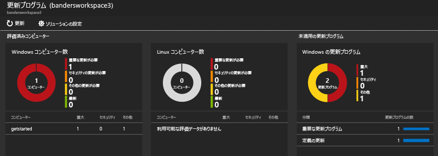
3. この例では、**[Missing Updates (更新プログラムが適用されていない)]** の **[重要な更新プログラム]** をクリックすると、[ログ検索] 画面が開き、重要な更新プログラムが適用されていないコンピューターに関する詳細情報が表示されます。 この例では、更新プログラムが適用されていないコンピューターが 1 台と、必要な更新が適用されていないコンピューターが 1 台あることがわかります。  
    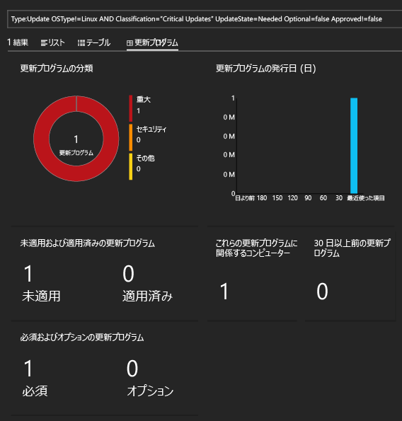
4. [Operations Management Suite](http://microsoft.com/oms) の Web サイトにアクセスし、Azure アカウントを使用してサインインします。 サインインすると、Azure Portal で表示されるのと同様のソリューション情報が表示されます。  
    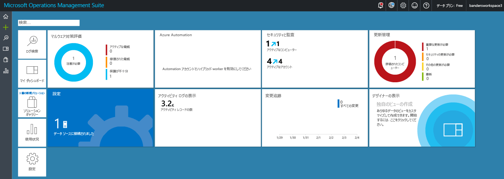
5. **[Update Management (更新管理)]** タイルをクリックします。
6. [Update Management (更新管理)] ダッシュボードに、Azure Portal で表示されるシステム更新に関する情報と同様の情報が表示されます。 ただし、**[Manage Update Deployments (更新プログラムのデプロイの管理)]** タイルは、新たに追加されたタイルです。 ただし、**[Manage Update Deployments (更新プログラムのデプロイの管理)]** タイルは新たに追加されたタイルです。  
    ![[Update Management (更新管理)] タイル](./media/log-analytics-get-started/update-management.png)
7. **[Update Deployments (更新プログラムのデプロイ)]** ページで、**[追加]** をクリックすると、*更新実行*が作成されます。  
    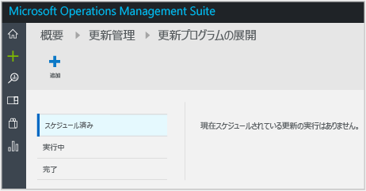
8.  **[New Update Deployment (新しい更新プログラムのデプロイ)]** ページで、更新プログラムのデプロイの名前を入力し、更新するコンピューター (この例では、*getstarted*) を選択して、スケジュールを選択した後、**[保存]** をクリックします。  
    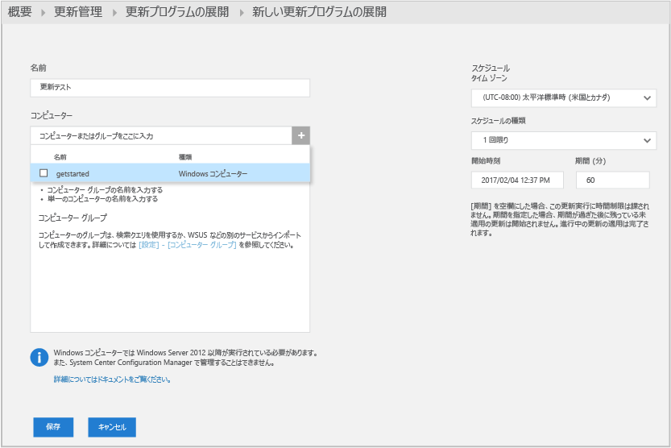  
    更新プログラムのデプロイを保存すると、スケジュール設定された更新が表示されます。  
    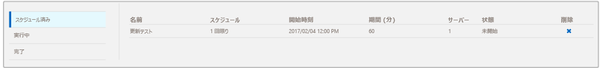  
    更新実行が完了すると、状態が **[完了]** と表示されます。
    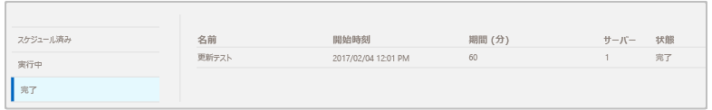
9. 更新実行が終わると、実行が正常に行われたかどうかが表示され、適用された更新プログラムの詳細を確認できます。

## 評価の終了後

このチュートリアルでは、仮想マシンにエージェントをインストールし、短時間で作業を開始しました。 ここで実施した手順は、単純なものでした。 一方で、規模の大きい組織や企業には、たいてい、複雑なオンプレミスの IT インフラストラクチャがあります。 そのような複雑な環境からデータを収集する際には、このチュートリアルで取り上げた内容よりも詳細な計画と追加の作業が必要になります。 この情報については、以下の「次のステップ」セクションに記載された役立つ記事へのリンクを使用して確認してください。

このチュートリアルで作成したワークスペースは、必要に応じて削除できます。

## 次のステップ
* [Windows エージェント](log-analytics-windows-agents.md)を Log Analytics に接続する方法を確認してください。
* [Operations Manager エージェント](log-analytics-om-agents.md)を Log Analytics に接続する方法を確認してください。
* [ソリューション ギャラリーから Log Analytics ソリューションを追加する](log-analytics-add-solutions.md) 」を参照してください。
* [ログ検索](log-analytics-log-searches.md) について理解を深め、ソリューションによって収集された情報の詳細を確認します。

