# Log Analytics の起動と開始
Log Analytics は、Microsoft Operations Management Suite (OMS) からほんの数分で起動して開始できます。 OMS ワークスペース (アカウントに類似) を作成するには、2 つの方法があります。

* Microsoft Operations Management Suite の Web サイト
* Microsoft Azure サブスクリプション

無料の OMS ワークスペースは、OMS の Web サイトで作成できます。 または、Microsoft Azure サブスクリプションを使用して OMS ワークスペースを作成できます。 機能的にはどちらのワークスペースもほぼ同じですが、無料の OMS ワークスペースの場合、OMS サービスに送信できるデータ量が 1 日 500 MB までとなります。 Azure サブスクリプションを使用する場合、そのサブスクリプションを使用して他の Azure サービスにもアクセスできます。 ワークスペースは、作成方法に関係なく、Microsoft アカウントまたは組織アカウントのいずれかを使用して作成します。

プロセスは次のようになります。

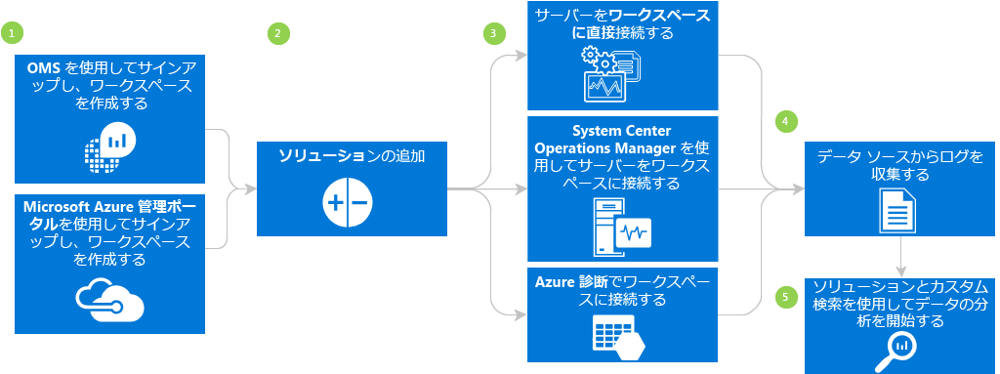

## Log Analytics の前提条件とデプロイに関する考慮事項
* Log Analytics の機能をすべて利用するには、有料の Microsoft Azure サブスクリプションが必要です。 Azure サブスクリプションがない場合は、すべての Azure サービスにアクセスできる [無料アカウント](https://azure.microsoft.com/free/) を作成します。 または、 [Operations Management Suite](http://microsoft.com/oms) の Web サイトで **[無料で試す]**をクリックして、無料の OMS アカウントを作成します。
* OMS ワークスペース。
* データを収集する各 Windows コンピューターで、Windows Server 2008 SP1 以降が実行されている必要があります。
* [ファイアウォール](log-analytics-proxy-firewall.md) 経由のアクセス。
* コンピューターがインターネットに接続できない場合、サーバーから OMS にトラフィックを転送するための [OMS Log Analytics フォワーダー](https://blogs.technet.microsoft.com/msoms/2016/03/17/oms-log-analytics-forwarder) (ゲートウェイ) サーバー。
* Operations Manager を使用する場合、Log Analytics は Operations Manager 2012 SP1 UR6 以降、Operations Manager 2012 R2 UR2 以降をサポートします。 プロキシ サポートは、Operations Manager 2012 SP1 UR7 と Operations Manager 2012 R2 UR3 に追加されています。 OMS との統合方法を調べます。
* コンピューターがインターネットに直接アクセスできるかどうかを調べます。 コンピューターがインターネットに直接アクセスできない場合は、OMS Web サービス サイトにアクセスするためのゲートウェイ サーバーが必要です。 すべてのアクセスは HTTPS で行われます。
* OMS にデータを送信するテクノロジとサーバーを調べます。 たとえば、ドメイン コント ローラー、SQL Server などです。
* OMS と Azure のユーザーに権限を付与します。
* データ使用量に懸念がある場合は、他のソリューションを追加する前に、各ソリューションを個別にデプロイし、パフォーマンスへの影響をテストします。
* ソリューションと機能を Log Analytics に追加する際に、データ使用量とパフォーマンスを確認します。 これには、イベントの収集、ログの収集、パフォーマンス データの収集などが含まれます。データ使用量やパフォーマンスへの影響が特定されるまでは、収集量を最小限にすることをお勧めします。
* Windows エージェントも Operations Manager を使用して管理されていないことを確認します。Windows エージェントも管理されている場合、重複データが発生します。 これは、Azure 診断が有効になっている Azure ベース エージェントにも当てはまります。
* エージェントをインストールした後で、エージェントが正しく動作していることを確認します。 エージェントが正しく動作していない場合、グループ ポリシーを使用して Cryptography API: Next Generation (CNG) キー分離が無効にされていないことを確認してください。
* 一部の Log Analytics ソリューションには、これ以外にも要件があります。

## Operations Management Suite を使用した 3 ステップでのサインアップ手順
1. [Operations Management Suite](http://microsoft.com/oms) の Web サイトに進み、 **[無料試用版]**をクリックします。 Outlook.com などの Microsoft アカウント、または Office 365 または他の Microsoft サービスで使用する会社またはや教育機関の組織アカウントを使用してサインインします。
2. 一意のワークスペース名を指定します。 ワークスペースは、管理データを保存する論理的なコンテナーです。 ワークスペースのデータはそれに限定されたデータなので、これでは、組織のチームごとにデータを分割できるようになります。 電子メール アドレスとデータを格納する領域を指定します。  
    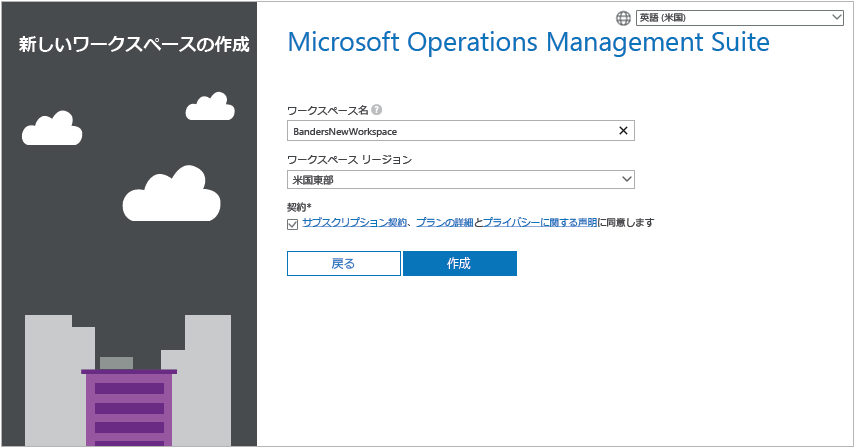
3. 次いで、新しい Azure サブスクリプションを作成するか、既存の Azure サブスクリプションにリンクします。 無料評価版を使用して実行するには、 **[後で]**をクリックします。  
   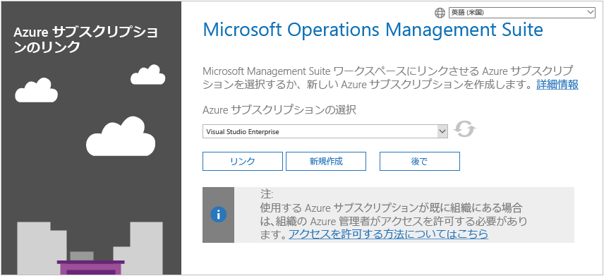

これで Operations Management Suite ポータルを使用開始する準備が整いました。

Operations Management Suite で作成したワークスペースを設定して、ワークスペースに既存の Azure アカウントをリンクする方法の詳細については、「 [Log Analytics へのアクセスを管理する](log-analytics-manage-access.md)」を参照してください。

## Microsoft Azure を使用した迅速なサインアップ
1. [Azure ポータル](https://portal.azure.com) に移動してサインインし、サービスの一覧から **Log Analytics (OMS)**を選択します。  
    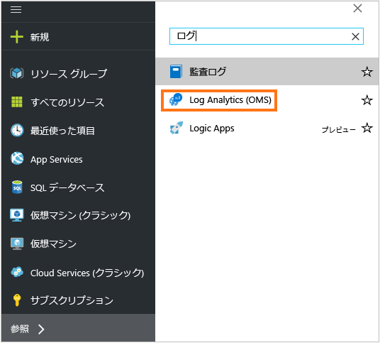
2. **[追加]**をクリックし、次の項目について選択します。
   * **[OMS ワークスペース]** の名前
   * **[サブスクリプション]** - 複数のサブスクリプションがある場合は、新しいワークスペースに関連付けるサブスクリプションを 1 つ選択します。
   * **[リソース グループ]**
   * **場所**
   * **[価格レベル]**  
       
3. **[作成]** をクリックすると、Azure ポータルにワークスペースの詳細が表示されます。       
             
4. **[OMS Portal]** (OMS ポータル) のリンクをクリックすると、Operations Management Suite の Web サイトに新しく作成したワークスペースが表示されます。

これで Operations Management Suite ポータルの使用を開始する準備が整いました。

Operations Management Suite で作成したワークスペースを設定して、既存のワークスペースを Azure サブスクリプションとリンクする方法の詳細については、「 [Log Analytics へのアクセスを管理する](log-analytics-manage-access.md)」を参照してください。

## Operations Management Suite ポータルの起動と開始
ソリューションを選択し、管理するサーバーに接続するには、 **[設定]** タイルをクリックし、このセクションの次の手順に従います。  

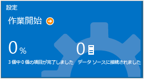  

1. **ソリューションの追加** - インストールしたソリューションを表示します。  
    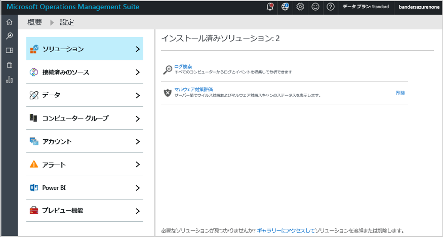  
    ソリューションをさらに追加するために **[ギャラリーへ移動]** をクリックします。  
    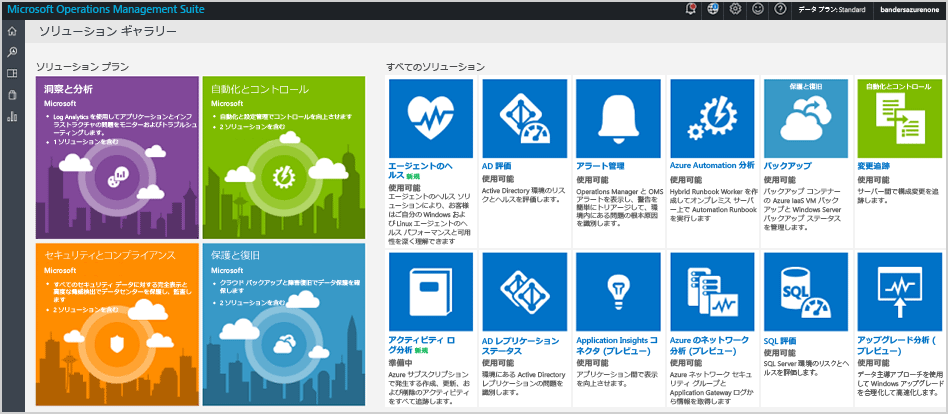  
    ソリューションを選択して **[追加]** をクリックします。
2. **ソースの接続** - サーバー環境に接続してデータを収集する方法を選択します。
   
   * エージェントをインストールして、任意の Windows サーバーまたはクライアントに直接接続します。
   * Linux サーバーを OMS Agent for Linux と接続します。
   * Windows または Linux の VM 拡張機能の Azure 診断に構成されている Azure のストレージ アカウントを使用します。
   * System Center Operations Manager を使用して、管理グループまたは Operations Manager デプロイメント全体をアタッチします。
   * Windows テレメトリを有効にして Upgrade Analytics を使用します。
       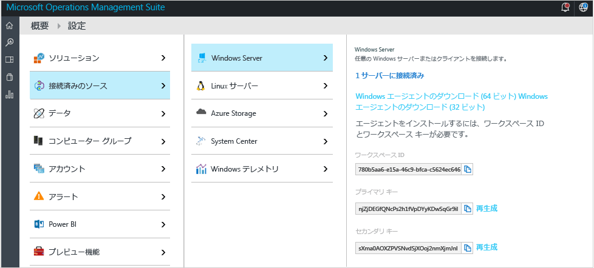    
3. **データの収集** - 少なくとも 1 つのデータ ソースを構成し、ワークスペースにデータを入力します。 完了したら、**[保存]** をクリックします。    
   
    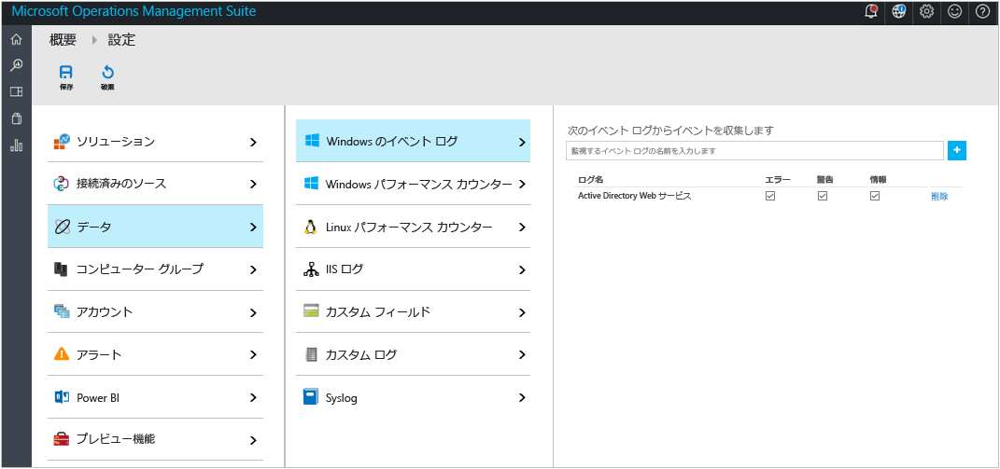    

## 必要に応じて、エージェントをインストールして、サーバーを直接 Operations Management Suite に接続します。
次の例は、Windows エージェントをインストールする方法を示しています。

1. **[設定]** タイル、**[接続されたソース]** タブ、追加するソースの種類のタブを順にクリックします。その後、エージェントをダウンロードするか、エージェントを有効にする方法について確認します。 たとえば、**[Windows エージェントのダウンロード (64 ビット)]** をクリックします。 Windows エージェントは、Windows Server 2008 SP 1 以降または Windows 7 SP1 以降にのみインストールできます。
2. エージェントを 1 つ以上のサーバーにインストールします。 エージェントは 1 つずつインストールすることも、 [カスタム スクリプト](log-analytics-windows-agents.md)を使用した自動化された方法または所持している既存のソフトウェア配布ソリューションを使用する方法でインストールすることもできます。
3. 使用許諾契約書に同意しインストール フォルダーを選択したら、**[Connect the agent to Azure Log Analytics (OMS) (Azure Log Analytics (OMS) にエージェントを接続する)]** を選択します。   
    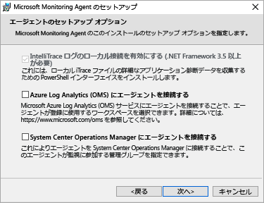
4. 次のページでは、ワークスペースの ID とワークスペース キーを求められます。 エージェント ファイルをダウンロードした画面に、ワークスペース ID とキーが表示されます。  
    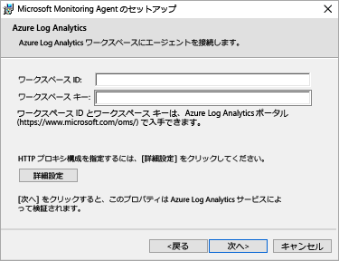  
   
    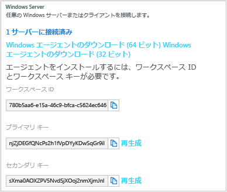
5. 必要に応じて、プロキシ サーバーを設定し、認証情報を指定するには、インストール中に **[詳細設定]** をクリックします。 **[次へ]** ボタンをクリックして、ワークスペースの情報画面に戻ります。
6. **[次へ]** をクリックし、ワークスペース ID およびキーを検証します。 エラーが検出された場合は、 **[戻る]** で修正できます。 ワークスペース ID とキーが検証されたら、 **[インストール]** をクリックして、エージェントのインストールを完了します。
7. [コントロール パネル] で [Microsoft Monitoring Agent]、[Azure Log Analytics (OMS)] タブの順にクリックします。 エージェントが Operations Management Suite サービスと通信している際には、緑のチェック マーク アイコンが表示されます。 初期状態で、これには 5 ～ 10 分かかります。

> [!NOTE]
> Operations Management Suite に直接接続されているサーバーの容量管理および構成の査定ソリューションは現在はサポートされていません。
> 
> 

エージェントを System Center Operations Manager 2012 SP1 以降に接続することもできます。 これを行うには、 **[エージェントを System Center Operations Manager に接続する]**を選択します。 このオプションを選択すると、追加のハードウェアなしに、または管理グループをロードせずに、サービスにデータを送信できます。

Operations Management Suite にエージェントを接続する方法の詳細については、「 [Windows コンピューターを Log Analytics に接続する](log-analytics-windows-agents.md)」を参照してください。

## オプションでの System Center Operations Manager を使用したサーバーの接続
1. Operations Manager コンソールで、 **[管理]**をクリックします。
2. **[オペレーション インサイト]** ノードを展開して、**[オペレーション インサイトの接続]** を選択します。
   
   > [!NOTE]
   > 使用している SCOM の更新プログラム ロールアップによって、*System Center Advisor*、*Operational Insights*、*Operations Management Suite* のいずれかのノードが表示されます。
   > 
   > 
3. 右上の **[Operational Insights に登録する]** リンクをクリックして、指示に従います。
4. 登録ウィザードを完了したら、 **[コンピューター/グループの追加]** リンクをクリックします。
5. **[コンピューターの検索]** ダイアログ ボックスでは、Operations Manager で監視するコンピューターまたはグループを検索できます。 Log Analytics に追加するコンピューターまたはグループを選択し、**[追加]**、**[OK]** の順にクリックします。 Operations Management Suite ポータルの **[使用状況]** タイルに移動すると、OMS サービスがデータを受信していることを確認できます。 データは 5 ～ 10 分で表示されます。

Operations Manager を Operations Management Suite に接続する方法の詳細については、「[Operations Manager を Log Analytics に接続する](log-analytics-om-agents.md)」を参照してください。

## オプションで Microsoft Azure でクラウド サービスのデータを分析する
Operations Management Suite では、Azure Cloud Services の診断を有効にすることで、クラウド サービスや仮想マシンのイベントおよび IIS ログを迅速に検索できます。 また、Microsoft Monitoring Agent をインストールすることによって、Azure Virtual Machines の情報を追加で得ることもできます。 Operations Management Suite を使用するように Azure 環境を構成する方法の詳細については、「 [Azure Storage を Log Analytics に接続する](log-analytics-azure-storage.md)」を参照してください。

## 次のステップ
* [ソリューション ギャラリーから Log Analytics ソリューションを追加する](log-analytics-add-solutions.md) 」を参照してください。
* [ログ検索](log-analytics-log-searches.md) について理解を深め、ソリューションによって収集された情報の詳細を確認します。
* カスタム検索結果を保存および表示するには、 [ダッシュボード](log-analytics-dashboards.md) を使用します。

<!--HONumber=Oct16_HO2-->

