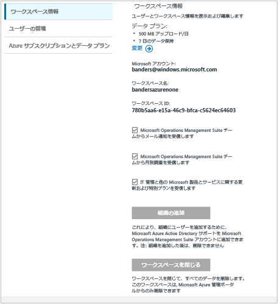
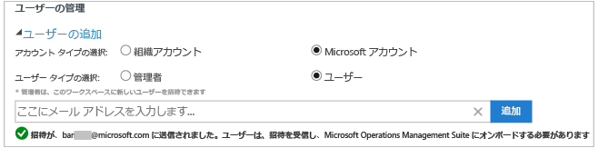
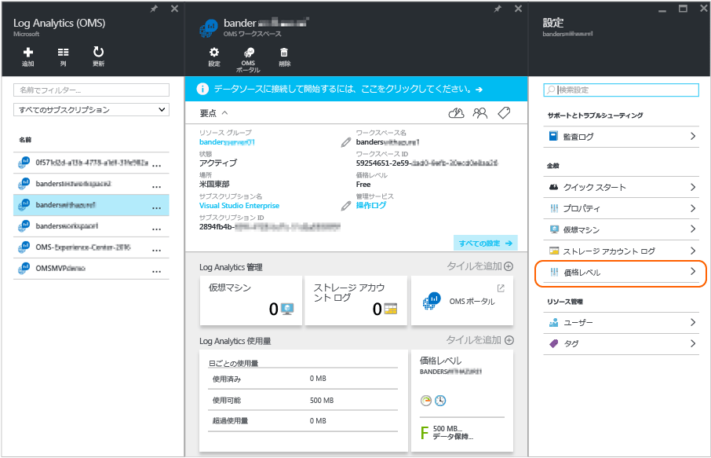

# Log Analytics へのアクセスを管理する
Log Analytics へのアクセスを管理するには、ユーザー、アカウント、OMS ワークスペース、Azure アカウントに対してさまざまな管理タスクを使用します。 Operations Management Suite (OMS) で新しいワークスペースを作成するには、ワークスペース名を選択して、アカウントと関連付け、地理的な場所を選択します。 ワークスペースは基本的にはアカウント情報とアカウントの単純な構成情報が含まれるコンテナーです。 組織のメンバーは、複数の OMS ワークスペースを使用して、 IT インフラストラクチャの一部またはすべてから収集されるデータのさまざまなセットを管理する場合があります。

「 [ログ分析を使ってみる](log-analytics-get-started.md) 」では、すばやく稼働させる方法について紹介していますが、この記事では、OMS へのアクセスの管理に必要ないくつかの操作について、より詳しく説明します。

最初にすべての管理タスクを実行する必要はないかもしれませんが、後続のセクションで頻繁に使用されるタスクをすべて取り上げます。

* 必要なワークスペースの数を決定する
* アカウントとユーザーの管理
* 既存のワークスペースにグループを追加する
* 既存のワークスペースを Azure サブスクリプションへリンクする
* ワークスペースを有料データ プランにアップグレードする
* データ プランの種類を変更する
* 既存のワークスペースに Azure Active Directory の組織を追加する
* OMS ワークスペースを閉じる

## 必要なワークスペースの数を決定する
ワークスペースは、Azure のリソースであり、収集、集計、分析され、OMS ポータルに表示されるデータのコンテナーです。

複数の OMS Log Analytics ワークスペースを作成して、ユーザーが 1 つまたは複数のワークスペースにアクセスできるようにすることができます。 一般的には、最小限の数のワークスペースを使用します。これで、ほとんどのデータに対してクエリを実行し、データを関連付けることができます。 このセクションでは、複数のワークスペースを作成すると便利な状況について説明します。

現在の Log Analytics ワークスペースには次の情報が示されます。

* データ ストレージの地理的な場所
* 課金の粒度
* データの分離

上記の特性に基づき、次の条件に当てはまる場合は複数のワークスペースを作成すると便利です。

* 世界規模の企業が、データ主権またはコンプライアンス上の理由から特定のリージョンにデータを格納する必要がある。
* Azure を使用しているときに、管理対象の Azure リソースと同じリージョンに Log Analytics ワークスペースを配置することによって送信データ転送の料金が生じるのを回避したい。
* 請求金額を使用量に基づいて異なる部門またはビジネス グループに割り当てたい。 それぞれの部門またはビジネス グループ用のワークスペースを作成すると、Azure の明細と使用量明細書に、各ワークスペースの料金が個別に表示されます。
* マネージ サービス プロバイダーが、管理する各顧客のログ分析データを他の顧客のデータから切り離しておく必要がある。
* 管理している複数の顧客、部門、ビジネス グループが (他の顧客、部門、ビジネス グループではなく) 各自のデータを確認できるようにしたい。

エージェントを使用してデータを収集する場合は、必要なワークスペースにレポートを生成するように各エージェントを構成できます。

System Center Operations Manager を使用している場合、各 Operations Manager 管理グループを 1 つのワークスペースのみに接続できます。 Operations Manager を使って管理するコンピューターに Microsoft Monitoring Agent をインストールし、Operations Manager と別の Log Analytics ワークスペースの両方にレポートを生成するようにエージェントを構成できます。

### ワークスペース情報
OMS ポータルでは、ワークスペース情報を表示できるほか、マイクロソフトから情報を受け取るかどうかを選択できます。

#### ワークスペース情報の表示
1. OMS で、 **[設定]** タイルをクリックします。
2. **[アカウント]** タブをクリックします。
3. **[Workspace Information (ワークスペース情報)]** タブをクリックします。  
   

## アカウントとユーザーの管理
各ワークスペースは、ワークスペースごとに複数の Microsoft アカウントと組織アカウントを関連付けることができます。また、各ユーザー アカウントは複数の OMS ワークスペースを持つことができます。

既定では、ワークスペースを作成するために使用した Microsoft アカウントや組織アカウントはワークスペースの管理者になります。 管理者は、追加の Microsoft アカウントを招待したり、Azure Active Directory からユーザーを選択したりできます。

OMS ワークスペースへのアクセスは 2 か所で管理できます。

* Azure では、ロールベースのアクセス制御を使って、Azure サブスクリプションとそれに関連する Azure リソースにアクセス権を付与できます。 この方法は、PowerShell と REST API へのアクセスにも使用されます。
* OMS ポータルでは、Azure サブスクリプションに関連しない、OMS ポータルのみへのアクセスを管理します。

OMS ポータルへのアクセス権はユーザーに付与しているが、それがリンクされている Azure サブスクリプションへのアクセス権は付与していない場合、ユーザーが OMS ポータルにサインインしたとき、Automation、Backup、Site Recovery ソリューションのタイルにはユーザーのデータが表示されません。

すべてのユーザーがこれらのソリューションでデータを参照できるようにするには、OMS ワークスペースにリンクされている Automation アカウント、Backup コンテナー、Site Recovery コンテナーについて、少なくとも **読み取り** アクセス権を与えます。   

### Azure ポータルを使用した Log Analytics へのアクセスの管理
(Azure Portal などで) Azure のアクセス許可を使用して Log Analytics ワークスペースへのアクセス権をユーザーに付与すると、そのユーザーは Log Analytics ポータルにもアクセスできるようになります。 このユーザーが Azure Portal で操作している場合、Log Analytics ワークスペース リソースを表示しているときに **[OMS Portal (OMS ポータル)]** タスクをクリックすると、OMS ポータルに移動できます。

Azure Portal に関して留意が必要ないくつかの点:

* これは "*ロールベースのアクセス制御*" ではありません。 Azure Portal で Log Analytics ワークスペースに対する "*閲覧者*" アクセス許可がある場合は、OMS ポータルを使用してデータを変更できます。 OMS ポータルには、管理者、共同作成者、読み取り専用ユーザーの概念があります。 サインインに使用したアカウントが Azure Active Directory 内でワークスペースにリンクされている場合、このユーザーは OMS ポータルにおいて "管理者" になります。それ以外の場合、このユーザーは "共同作成者" になります。
* http://mms.microsoft.com を使用して OMS ポータルにサインインした場合、既定では **[ワークスペースの選択]** 一覧が表示されます。 一覧には OMS ポータルを使用して追加されたワークスペースのみ表示されます。 Azure サブスクリプションを使用してアクセスするワークスペースを表示するには、URL の一部としてテナントを指定する必要があります。 次に例を示します。
  
  `mms.microsoft.com/?tenant=contoso.com` テナント ID は多くの場合、サインインに使用される電子メール アドレスの最後の部分です。
* サインインに使用するアカウントが Azure Active Directory テナントのアカウントの場合 (CSP としてサインインしている場合を除き、よくあるケースです)、このユーザーは OMS ポータルにおいて "*管理者*" になります。 アカウントがテナントの Azure Active Directory に含まれていない場合、このユーザーは OMS ポータルにおいて "*ユーザー*" になります。
* Azure のアクセス許可を使用してアクセスできるポータルに直接移動する場合は、URL の一部としてリソースを指定する必要があります。 この URL は PowerShell を使用して取得できます。
  
  たとえば、`(Get-AzureRmOperationalInsightsWorkspace).PortalUrl` を使用します。
  
  URL は次のようになります: `https://eus.mms.microsoft.com/?tenant=contoso.com&resource=%2fsubscriptions%2faaa5159e-dcf6-890a-a702-2d2fee51c102%2fresourcegroups%2fdb-resgroup%2fproviders%2fmicrosoft.operationalinsights%2fworkspaces%2fmydemo12`

### OMS ポータルでのユーザーの管理
[設定] ページの **[アカウント]** タブにある **[ユーザーの管理]** タブでユーザーとグループを管理します。 ここでは、後続セクションのタスクを実行できます。  

#### 既存のワークスペースへのユーザーの追加
次の手順で OMS ワークスペースにユーザーやグループを追加します。 ユーザーやグループは、このワークスペースに関連付けられているすべてのアラートを表示し、操作することができます。

> [!NOTE]
> Azure Active Directory の組織アカウントから、ユーザーやグループを追加する場合は、まず、OMS アカウントが Active Directory ドメインと関連付けられていることを確認する必要があります。 [既存のワークスペースに Azure Active Directory の組織を追加する](#add-an-azure-active-directory-organization-to-an-existing-workspace)をご覧ください。
> 
> 

1. OMS で、 **[設定]** タイルをクリックします。
2. **[アカウント]** タブ、**[ユーザーの管理]** タブの順にクリックします。
3. **[ユーザーの管理]** セクションで、追加するアカウントの種類を **[組織アカウント]**、**[Microsoft アカウント]**、または **[Microsoft サポート]** から選択します。
   
   * Microsoft アカウントを選択する場合は、Microsoft アカウントに関連付けられているユーザーのメール アドレスを入力します。
   * 組織アカウントを選択する場合は、ユーザー、グループ名、メール エイリアスのどれか一部を入力すると、ユーザーとグループの一覧が表示されます。 ユーザーまたはグループを選択します。
   * [Microsoft サポート] は、Microsoft サポート エンジニアがトラブルシューティングのためにユーザーのワークスペースに一時的にアクセスすることを許可するために使用します。
     
     > [!NOTE]
     > 最適なパフォーマンスの結果を得るには、単一の OMS アカウントに関連付けられている Active Directory グループの数を 3 つ (1 つは管理者用に、1 つは共同作成者、もう 1 つは読み取り専用ユーザー用) に制限します。 それ以上のグループを使用すると、Log Analytics のパフォーマンスに影響を与える可能性があります。
     > 
     > 
4. 追加するユーザーまたはグループの種類を **[管理者]**、**[共同作成者]**、**[読み取り専用ユーザー]** の中から選択します。  
5. **[追加]**をクリックします。
   
   Microsoft アカウントを追加する場合は、指定したメールに、ワークスペースへの招待が送信されます。 招待の指示に従って OMS に加入すると、ユーザーはこの OMS アカウントのアラートとアカウント情報を表示できます。また、**[設定]** ページの **[アカウント]** タブでユーザー情報を表示できます。
   組織のアカウントを追加すると、ユーザーは Log Analytics にすぐにアクセスできるようになります。  
   

#### 既存のユーザーの種類を編集する
OMS アカウントに関連付けられているユーザーのアカウント ロールを変更することができます。 次のオプションがあります。

* *管理者*: ユーザーの管理、すべてのアラートの表示と操作、サーバーの追加、削除を行うことができます
* *Contributor*(共同作成者): すべてのアラートの表示と操作、サーバーの追加、削除を行うことができます
* *ReadOnly User*(読み取り専用ユーザー): 読み取り専用とマークされているユーザーは、次の操作を行うことはできません。
  
  1. ソリューションの追加と削除。 ソリューション ギャラリーは表示されません。
  2. **[マイ ダッシュボード]** 上のタイルの追加、変更、削除。
  3. **[設定]** ページの表示。 このページは表示されません。
  4. 検索ビュー。PowerBI 構成、保存した検索条件、アラート タスクは表示されません。

#### アカウントを編集するには
1. OMS で、 **[設定]** タイルをクリックします。
2. **[アカウント]** タブ、**[ユーザーの管理]** タブの順にクリックします。
3. 変更するユーザーのロールを選択します。
4. 確認のダイアログ ボックスで **[はい]** をクリックします。

### OMS ワークスペースからユーザーを削除する
次の手順で OMS ワークスペースからユーザーを削除します。 この操作では、ユーザーのワークスペースは閉じられないことに注意してください。 ユーザーとワークスペース間の関連付けが削除されます。 1 人のユーザーが複数のワークスペースに関連付けられている場合、そのユーザーは、OMS にサインインして、他のワークスペースを表示することができます。

1. OMS で、 **[設定]** タイルをクリックします。
2. **[アカウント]** タブ、**[ユーザーの管理]** タブの順にクリックします。
3. 削除するユーザー名の横にある **[削除]** をクリックします。
4. 確認のダイアログ ボックスで **[はい]** をクリックします。

### 既存のワークスペースにグループを追加する
1. 上の “既存のワークスペースにユーザーを追加するには” の手順 1-4 を実行します。
2. **[ユーザー/グループの選択]** で **[グループ]** を選択します。
   
3. 追加するグループの表示名または電子メール アドレスを入力します。
4. 一覧結果でグループを選択し、 **[追加]**をクリックします。

## 既存のワークスペースを Azure サブスクリプションへリンクする
[microsoft.com/oms](https://microsoft.com/oms) Web サイトからワークスペースを作成することができます。  ただし、これらのワークスペースには、特定の制限が存あり、無料のアカウントを使用している場合に最も注意すべきなのは、データのアップロードが 500 MB/日に制限されていることです。 このワークスペースを変更するには、"*既存のワークスペースを Azure サブスクリプションにリンクする*" 必要があります。

> [!IMPORTANT]
> ワークスペースをリンクするためには、リンクするワークスペースに Azure アカウントが既にアクセスしていることが必要です。  つまり、Azure ポータルへのアクセスに使用するアカウントは、OMS ワークスペースへのアクセスに使用するアカウントと **同じ** アカウントである必要があります。 そうでない場合は、 [既存のワークスペースへのユーザーの追加](#add-a-user-to-an-existing-workspace)をご覧ください。
> 
> 

### OMS ポータルでワークスペースを Azure サブスクリプションにリンクするには
OMS ポータルでワークスペースを Azure サブスクリプションにリンクするには、サインインしているユーザーが既に Azure アカウントへの支払いを済ませている必要があります。 現在使用しているワークスペースが Azure アカウントにリンクされます。

1. OMS で、 **[設定]** タイルをクリックします。
2. **[アカウント]** タブをクリックしてから、**[Azure Subscription & Data Plan (Azure サブスクリプションとデータ プラン)]** タブをクリックします。
3. 使用するデータ プランをクリックします。
4. [ **Save**] をクリックします。  
   

新しいデータ プランは、Web ページの上部にある OMS ポータル リボンに表示されます。

### Azure Portal でワークスペースを Azure サブスクリプションにリンクするには
1. [Azure ポータル](http://portal.azure.com)にサインインします。
2. **[Log Analytics (OMS)]** を見つけ、選択します。
3. 既存ワークスペースの一覧が表示されます。 **[追加]**をクリックします。  
   
4. **[OMS Workspace (OMS ワークスペース)]** で、**[Or link existing (または既存のリンク)]** をクリックします。  
   
5. **[必要な設定の構成]**をクリックします。  
   
6. ユーザーの Azure アカウントにまだリンクされていないワークスペースの一覧が表示されます。 ワークスペースを選択します。  
   
7. 必要に応じて、次の項目の値を変更できます。
   * [サブスクリプション]
   * リソース グループ
   * Location (場所)
   * [価格レベル]   
       
8. **[作成]**をクリックします。 これでワークスペースがユーザーの Azure アカウントにリンクされました。

> [!NOTE]
> リンクするワークスペースが表示されない場合、OMS Web サイトで作成した OMS ワークスペースにアクセスする許可がユーザーの Azure サブスクリプションにありません。  OMS Web サイトを利用し、OMS ワークスペース内からこのアカウントにアクセスする許可を与える必要があります。 その方法については、「 [既存のワークスペースへのユーザーの追加](#add-a-user-to-an-existing-workspace)」をご覧ください。
> 
> 

## ワークスペースを有料データ プランにアップグレードする
OMS のワークスペース データ プランには、**Free**、**Standard**、**Premium** の 3 つの種類があります。  *Free* プランの場合は、500 MB のデータの上限に達する場合があります。  この制限を超えるデータを収集するには、ワークスペースを "***従量課金制プラン***" にアップグレードする必要があります。 いつでもプランの種類を変更できます。  OMS の価格の詳細については、[価格の詳細](https://www.microsoft.com/en-us/server-cloud/operations-management-suite/pricing.aspx)に関する記述を参照してください。

> [!IMPORTANT]
> ワークスペース プランは、Azure サブスクリプションに *リンク* されている場合にのみ変更できます。  Azure でワークスペースを作成した場合や、 *既に* ワークスペースをリンクしている場合は、このメッセージを無視してください。  [OMS Web サイト](http://www.microsoft.com/oms)でワークスペースを作成した場合、「[既存のワークスペースを Azure サブスクリプションへリンクする](#link-an-existing-workspace-to-an-azure-subscription)」の手順に従う必要があります。
> 
> 

### OMS Add On for System Center の資格を使用する
System Center 用 OMS アドオンでは、OMS Log Analytics の Premium プランの資格が付与されます。詳細については、[OMS の価格](https://www.microsoft.com/en-us/server-cloud/operations-management-suite/pricing.aspx)に関するページを参照してください。

System Center 用 OMS アドオンを購入すると、OMS アドオンは、System Center 契約上の権利として追加されます。 この契約に基づいて作成された Azure サブスクリプションであれば、この権利を使用できます。 たとえば、複数の OMS ワークスペースで OMS アドオンの資格を利用できます。

OMS ワークスペースの使用を OMS アドオンからの資格に適用するには、次の作業が必要になります。

1. OMS アドオン購入と Azure サブスクリプション使用の両方を含むエンタープライズ契約に含まれる Azure サブスクリプションに OMS ワークスペースをリンクする
2. ワークスペースの Premium プランを選択する

Azure または OMS のポータルで使用状況を確認するとき、OMS アドオン資格は表示されません。 ただし、エンタープライズ ポータルで資格を確認できます。  

OMS ワークスペースがリンクされている Azure サブスクリプションを変更する必要がある場合は、Azure PowerShell の [Move-AzureRmResource](https://msdn.microsoft.com/library/mt652516.aspx) コマンドレットを使用します。

### エンタープライズ契約の Azure コミットメントを使用する
OMS コンポーネントのスタンドアロン価格を使用する場合、OMS のコンポーネント別に支払います。使用状況は Azure 請求書に表示されます。

Azure サブスクリプションがリンクされているエンタープライズ登録に Azure の金銭的コミットがある場合、Log Analytics のすべての使用料金が残りの金銭的コミットから自動的に引き落とされます。

OMS ワークスペースがリンクされている Azure サブスクリプションを変更する必要がある場合は、Azure PowerShell の [Move-AzureRmResource](https://msdn.microsoft.com/library/mt652516.aspx) コマンドレットを使用します。  

### ワークスペースを有料データ プランに変更する
1. [Azure ポータル](http://portal.azure.com)にサインインします。
2. **[Log Analytics (OMS)]** を見つけ、選択します。
3. 既存ワークスペースの一覧が表示されます。 ワークスペースを選択します。  
   
4. **[設定]** で **[価格レベル]** をクリックします。  
   
5. **[価格レベル]** でデータ プランを選択し、**[選択]** をクリックします。  
   
6. Azure ポータルでビューを更新すると、選択したプランの **価格レベル** が更新されます。  
   

これで "無料" のデータ上限を超えてデータを収集できます。

## 既存のワークスペースに Azure Active Directory の組織を追加する
Log Analytics (OMS) ワークスペースを Azure Active Directory ドメインに関連付けることができます。 これにより、Active Directory からユーザーを OMS ワークスペースに直接追加することができます。別の Microsoft アカウントは必要ありません。

Azure ポータルからワークスペースを作成するか、Azure サブスクリプションにワークスペースをリンクすると、Azure Active Directory は組織のアカウントとしてリンクされます。

OMS ポータルからワークスペースを作成するときに、Azure サブスクリプションと組織のアカウントにリンクするよう求められます。

### 既存のワークスペースに Azure Active Directory の組織を追加するには
1. OMS の [設定] ページで、**[アカウント]** をクリックし、**[Workspace Information (ワークスペース情報)]** タブをクリックします。  
2. 組織のアカウントに関する情報を確認し、 **[組織の追加]**をクリックします。  
    
3. Azure Active Directory ドメインの管理者の ID 情報を入力します。 その後、ワークスペースが Azure Active Directory ドメインにリンクされたことを示す確認が表示されます。
    

> [!NOTE]
> いったんアカウントを組織のアカウントにリンクすると、後でそのリンクを削除したり変更したりすることはできません。
> 
> 

## OMS ワークスペースを閉じる
OMS ワークスペースを閉じると、ワークスペースを閉じて 30 日以内に、ワークスペースに関連するすべてのデータが OMS サービスから削除されます。

ユーザーが管理者で、ワークスペースに関連付けられている複数のユーザーが存在する場合は、それらのユーザーとワークスペースの間の関連付けがなくなります。 ユーザーが他のワークスペースに関連付けられている場合は、その他のワークスペースを使用して OMS を継続して使用できます。 ただし、他のワークスペースに関連付けられていない場合は、OMS を使用するには、新しいワークスペースを作成する必要があります。

### OMS ワークスペースを閉じるには
1. OMS で、 **[設定]** タイルをクリックします。
2. **[アカウント]** タブ、**[Workspace Information (ワークスペース情報)]** タブの順にクリックします。
3. **[Close Workspace (ワークスペースを閉じる)]** をクリックします。
4. ワークスペースを閉じる理由の 1 つを選ぶか、テキスト ボックスに、別の理由を入力します。
5. **[ワークスペースを閉じる]**をクリックします。

## 次のステップ
* エージェントを追加し、データを収集する方法については、「 [Windows コンピューターを Log Analytics に接続する](log-analytics-windows-agents.md) 」を参照してください。
* [ソリューション ギャラリーから Log Analytics ソリューションを追加する](log-analytics-add-solutions.md) 」を参照してください。
* [Configure proxy and firewall settings in Log Analytics (Log Analytics のプロキシとファイアウォールの設定を構成する) (Log Analytics のプロキシとファイアウォールの設定を構成する)](log-analytics-proxy-firewall.md) 」を参照してください。

<!--HONumber=Oct16_HO2-->

