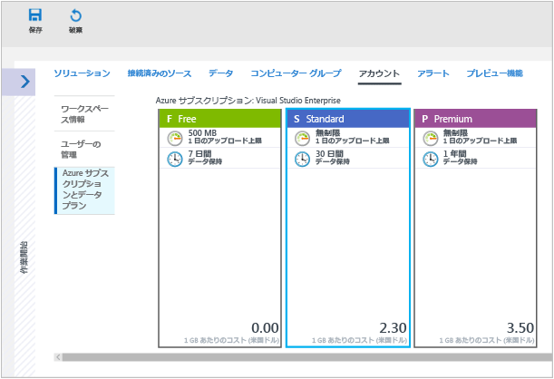

# ワークスペースを管理する

Log Analytics へのアクセスを管理するには、ワークスペースに関するさまざまな管理タスクを実行する必要があります。 この記事では、ワークスペースを管理するためのアドバイスと手順について説明します。 ワークスペースは基本的にはアカウント情報とアカウントの単純な構成情報が含まれるコンテナーです。 組織のメンバーは、複数のワークスペースを使用して、IT インフラストラクチャの一部またはすべてから収集されるデータのさまざまなセットを管理する場合があります。

ワークスペースを作成するには、次のことを実行する必要があります。

1. Azure サブスクリプションを取得する。
2. ワークスペース名を選択する。
3. ワークスペースをサブスクリプションおよびリソース グループのいずれかに関連付ける。
4. 地理的な場所を選択する。

## 必要なワークスペースの数を決定する
ワークスペースは、Azure のリソースであり、収集、集計、分析され、Azure Portal に表示されるデータのコンテナーです。

Azure サブスクリプションごとに複数のワークスペースを用意できるほか、複数のワークスペースにアクセスして、容易にクエリを実行できます。 このセクションでは、複数のワークスペースを作成すると便利な状況について説明します。

現時点では、ワークスペースに次の情報が示されます。

* データ ストレージの地理的な場所
* 異なるユーザー アクセス権を定義するためのデータの分離
* 保有期間およびデータ キャッピングなどの設定の構成のスコープ

消費の観点から、作成するワークスペースの数はできるだけ少なくすることをお勧めします。 これにより、管理とクエリのエクスペリエンスがより簡単かつ迅速になります。 ただし、上記の特性に基づき、次の条件に当てはまる場合は複数のワークスペースを作成してみてください。

* 世界規模の企業が、データ主権またはコンプライアンス上の理由から特定のリージョンにデータを格納する必要がある。
* Azure を使用しているときに、管理対象の Azure リソースと同じリージョンにワークスペースを配置することによって送信データ転送の料金が生じるのを回避したい。
* 独自の Azure サブスクリプション内の部門またはビジネス グループごとにワークスペースを作成することで、請求金額を使用量に基づいて異なる部門またはビジネス グループに割り当てたい。
* マネージド サービス プロバイダーが、管理する各顧客の Log Analytics データを他の顧客のデータから切り離しておく必要がある。
* 管理している複数の顧客、部門、ビジネス グループが (他の顧客、部門、ビジネス グループではなく) 各自のデータを確認できるようにしたい。

Windows エージェントを使用してデータを収集する場合は、[1 つ以上のワークスペースにレポートを生成するように各エージェントを構成](log-analytics-windows-agents.md)できます。

System Center Operations Manager を使用している場合、各 Operations Manager 管理グループを 1 つのワークスペースのみに接続できます。 Operations Manager を使って管理するコンピューターに Microsoft Monitoring Agent をインストールし、Operations Manager と別の Log Analytics ワークスペースの両方にレポートを生成するようにエージェントを構成できます。

## ワークスペース情報

ワークスペースに関する詳細情報は Azure Portal で表示できます。 

1. まだサインインしていない場合は、 [Azure ポータル](https://portal.azure.com)にサインインします。

2. Azure Portal で、**[すべてのサービス]** をクリックします。 リソースの一覧で、「**Log Analytics**」と入力します。 入力を始めると、入力内容に基づいて、一覧がフィルター処理されます。 **[Log Analytics]** を選択します。  

      

3. Log Analytics サブスクリプション ウィンドウで、ワークスペースを選択します。

4. ワークスペースのページに、作業開始と構成に関する詳細と、その他の情報へのリンクが表示されます。  

      

## アカウントとユーザーの管理
各ワークスペースには、複数のアカウントを関連付けることができます。また、各アカウントは、複数のワークスペースにアクセスできます。 アクセスは、[Azure のロールベースのアクセス](../active-directory/role-based-access-control-configure.md)によって管理されます。 これらのアクセス権は、Azure portal と API アクセスの両方に適用されます。

次のアクティビティにも、Azure のアクセス許可が必要です。

| アクションを表示します。                                                          | 必要とされる Azure のアクセス許可 | メモ |
|-----------------------------------------------------------------|--------------------------|-------|
| 管理ソリューションの追加と削除                        | `Microsoft.Resources/deployments/*`   `Microsoft.OperationalInsights/*`   `Microsoft.OperationsManagement/*`   `Microsoft.Automation/*`   `Microsoft.Resources/deployments/*/write` | これらのアクセス許可は、リソース グループまたはサブスクリプション レベルで付与する必要があります。 |
| 価格レベルの変更                                       | `Microsoft.OperationalInsights/workspaces/*/write` | |
| *Backup* ソリューション タイルと *Site Recovery* ソリューション タイルのデータの表示 | 管理者/共同管理者 | クラシック デプロイ モデルを使用してデプロイされたリソースにアクセスします |
| Azure Portal でのワークスペースの作成                        | `Microsoft.Resources/deployments/*`   `Microsoft.OperationalInsights/workspaces/*` ||

### Azure のアクセス許可を使用した Log Analytics へのアクセスの管理
Azure のアクセス許可を使用して Log Analytics ワークスペースへのアクセス権を付与するには、「[Azure サブスクリプション リソースへのアクセスをロールの割り当てによって管理する](../active-directory/role-based-access-control-configure.md)」の手順に従ってください。

Azure には、Log Analytics 用に、次の 2 つの組み込みユーザー ロールがあります。
- Log Analytics 閲覧者
- Log Analytics 共同作成者

"*Log Analytics 閲覧者*" ロールのメンバーは、以下の操作を行うことができます。
- すべての監視データを表示および検索する 
- 監視設定を表示する。これには、すべての Azure リソースに対する Azure 診断の構成の表示などが含まれます。

Log Analytics 閲覧者ロールには、次の Azure アクションが含まれています。

| Type    | アクセス許可 | 説明 |
| ------- | ---------- | ----------- |
| アクションを表示します。 | `*/read`   | すべての Azure リソースとリソース構成を表示する機能。 次のものを表示できます。   仮想マシン拡張機能の状態   リソースに対する Azure 診断の構成   すべてのリソースのすべてのプロパティと設定 |
| アクションを表示します。 | `Microsoft.OperationalInsights/workspaces/analytics/query/action` | ログ検索 v2 クエリを実行する機能 |
| アクションを表示します。 | `Microsoft.OperationalInsights/workspaces/search/action` | ログ検索 v1 クエリを実行する機能 |
| アクションを表示します。 | `Microsoft.Support/*` | サポート ケースを開く機能 |
|非アクション | `Microsoft.OperationalInsights/workspaces/sharedKeys/read` | データ コレクション API の使用とエージェントのインストールに必要なワークスペース キーの読み取りを防ぎます。 これにより、ユーザーは新しいリソースをワークスペースに追加できなくなります |

"*Log Analytics 共同作成者*" ロールのメンバーは、以下の操作を行うことができます。
- すべての監視データの読み取り (Log Analytics 閲覧者と同様)  
- Automation アカウントの作成と構成  
- 管理ソリューションの追加と削除    
    > [!NOTE] 
    > 最後の 2 つのアクションを正常に実行するには、このアクセス許可をリソース グループまたはサブスクリプション レベルで付与する必要があります。  

- ストレージ アカウント キーの読み取り   
- Azure Storage からのログの収集の構成  
- 次のような、Azure リソースの監視設定の編集
  - VM への VM 拡張機能の追加
  - すべての Azure リソースに対する Azure 診断の構成

> [!NOTE] 
> 仮想マシンに仮想マシン拡張機能を追加する機能を使用して、仮想マシンに対するフル コントロールを取得することができます。

Log Analytics 共同作成者ロールには、次の Azure アクションが含まれています。

| アクセス許可 | 説明 |
| ---------- | ----------- |
| `*/read`     | すべてのリソースとリソース構成を表示する機能。 次のものを表示できます。   仮想マシン拡張機能の状態   リソースに対する Azure 診断の構成   すべてのリソースのすべてのプロパティと設定 |
| `Microsoft.Automation/automationAccounts/*` | Runbook の追加と編集など、Azure Automation アカウントを作成および構成する機能 |
| `Microsoft.ClassicCompute/virtualMachines/extensions/*`   `Microsoft.Compute/virtualMachines/extensions/*` | Microsoft Monitoring Agent 拡張機能、OMS Agent for Linux 拡張機能など、仮想マシン拡張機能を追加、更新、および削除する |
| `Microsoft.ClassicStorage/storageAccounts/listKeys/action`   `Microsoft.Storage/storageAccounts/listKeys/action` | ストレージ アカウント キーを表示する。 Azure Storage アカウントからログを読み取るように Log Analytics を構成するために必要です |
| `Microsoft.Insights/alertRules/*` | アラート ルールを追加、更新、および削除する |
| `Microsoft.Insights/diagnosticSettings/*` | Azure リソースに対する診断設定を追加、更新、および削除する |
| `Microsoft.OperationalInsights/*` | Log Analytics ワークスペースの構成を追加、更新、および削除する |
| `Microsoft.OperationsManagement/*` | 管理ソリューションを追加および削除する |
| `Microsoft.Resources/deployments/*` | デプロイを作成および削除する。 ソリューション、ワークスペース、および Automation アカウントを追加および削除するために必要です |
| `Microsoft.Resources/subscriptions/resourcegroups/deployments/*` | デプロイを作成および削除する。 ソリューション、ワークスペース、および Automation アカウントを追加および削除するために必要です |

ユーザー ロールに対してユーザーの追加と削除を行うには、`Microsoft.Authorization/*/Delete` および `Microsoft.Authorization/*/Write` アクセス許可が必要です。

これらのロールを使用すると、次のようなさまざまなスコープでユーザーにアクセスを許可することができます。
- サブスクリプション - サブスクリプション内のすべてのワークスペースへのアクセス
- リソース グループ - リソース グループ内のすべてのワークスペースへのアクセス
- リソース - 指定されたワークスペースのみへのアクセス

正確なアクセス制御を行うために、割り当てをリソース レベル (ワークスペース) で実行することをお勧めします。  必要な特定のアクセス許可を持つロールを作成するには、[カスタム ロール](../active-directory/role-based-access-control-custom-roles.md)を使用します。

## 既存のワークスペースを Azure サブスクリプションへリンクする
2016 年 9 月 26 日より後に作成されたすべてのワークスペースは、作成時に Azure サブスクリプションにリンクする必要があります。 この日付より前に作成されたワークスペースは、サインインするときにワークスペースにリンクする必要があります。 Azure Portal からワークスペースを作成するか、Azure サブスクリプションにワークスペースをリンクすると、Azure Active Directory は組織のアカウントとしてリンクされます。

### Azure Portal でワークスペースを Azure サブスクリプションにリンクするには
1. Azure Portal で、**[すべてのサービス]** をクリックします。 リソースの一覧で、「**Log Analytics**」と入力します。 入力を始めると、入力内容に基づいて、一覧がフィルター処理されます。 **[Log Analytics]** を選択します。  

2. Log Analytics サブスクリプション ウィンドウで、**[追加]** をクリックします。  

    

3. **[Log Analytics ワークスペース]** ウィンドウで、**[既存のものをリンクする]** をクリックします。  

4. **[必要な設定の構成]** をクリックします。  

5. ユーザーの Azure アカウントにまだリンクされていないワークスペースの一覧が表示されます。 ワークスペースを選択します。  
   
6. 必要に応じて、次の項目の値を変更できます。
   * [サブスクリプション]
   * リソース グループ
   * Location
   * [価格レベル]   

7. Click **OK**. これでワークスペースがユーザーの Azure アカウントにリンクされました。

> [!NOTE]
> リンクするワークスペースが表示されない場合、OMS ポータルで作成したワークスペースにアクセスする許可がユーザーの Azure サブスクリプションにありません。  OMS ポータルからこのアカウントへのアクセスを許可するには、「[既存のワークスペースへのユーザーの追加](#add-a-user-to-an-existing-workspace)」を参照してください。
>
>

## 有料プランへワークスペースをアップグレードする
OMS のワークスペースには、**Free**、**Standalone**、**OMS** の 3 種類のプランがあります。  *Free* プランを利用している場合、Log Analytics に送信できるデータは 1 日あたり 500 MB が上限となります。  この量を超える場合は、この上限を超えるデータの収集漏れを防ぐためにワークスペースを有料プランに変更する必要があります。 プランの種類はいつでも変更できます。  OMS の価格の詳細については、[価格の詳細](https://www.microsoft.com/en-us/cloud-platform/operations-management-suite-pricing)に関する記述を参照してください。

### OMS サブスクリプションに付属する資格の使用
OMS E1、OMS E2 OMS、OMS Add-On for System Center のいずれかを購入することによって得られる資格を使用するには、OMS Log Analytics の *OMS* プランを選択します。

OMS サブスクリプションを購入すると、マイクロソフト エンタープライズ契約に資格が追加されます。 追加された資格は、この契約下で作成されたすべての Azure サブスクリプションで使用できます。 これらのサブスクリプションでは、すべてのワークスペースに OMS の資格が使用されます。

ワークスペースの使用を OMS サブスクリプションからの資格に適用するには、次の作業が必要になります。

1. OMS サブスクリプションを含むエンタープライズ契約に含まれる Azure サブスクリプションにワークスペースを作成する

2. ワークスペースの *OMS* プランを選択する

> [!NOTE]
> ご利用のワークスペースが 2016 年 9 月 26 日より前に作成されており、かつ Log Analytics の料金プランが *Premium* である場合、このワークスペースには System Center 用 OMS アドオンの資格が使用されます。 *OMS* 料金レベルに変更することによって資格を使用することもできます。
>
>

OMS サブスクリプションの資格は、Azure portal には表示されません。 資格と使用状況は、エンタープライズ ポータルで確認できます。  

ワークスペースがリンクされている Azure サブスクリプションを変更する必要がある場合は、Azure PowerShell の [Move-AzureRmResource](https://msdn.microsoft.com/library/mt652516.aspx) コマンドレットを使用します。

### エンタープライズ契約の Azure コミットメントを使用する
OMS サブスクリプションがない場合、料金は OMS のコンポーネントごとに発生し、その使用状況が Azure の請求書に記載されます。

Azure サブスクリプションがリンクされているエンタープライズ登録に Azure の年額コミットメントがある場合、Log Analytics の使用料金が残りの年額コミットメントから自動的に引き落とされます。

ワークスペースがリンクされている Azure サブスクリプションを変更する必要がある場合は、Azure PowerShell の [Move-AzureRmResource](https://msdn.microsoft.com/library/mt652516.aspx) コマンドレットを使用します。  

### Azure Portal でワークスペースを有料の価格レベルに変更する
1. Azure portal の Log Analytics サブスクリプション ウィンドウで、ワークスペースを選択します。

2. ワークスペース ウィンドウで、**[全般]** の **[価格レベル]** を選択します。  

3. **[価格レベル]** で価格レベルを選択し、**[選択]** をクリックします。  
    

> [!NOTE]
> ワークスペースが Automation アカウントにリンクされている場合は、"*スタンドアロン (GB 単位)*" 価格レベルを選択できるように、**Automation and Control** ソリューションをすべて削除し、Automation アカウントのリンクを解除しておく必要があります。 ワークスペース ブレードの **[全般]** で **[ソリューション]** をクリックし、ソリューションを表示して削除します。 Automation アカウントのリンクを解除するには、**[価格レベル]** ブレードで Automation アカウントの名前をクリックします。
>
>

### OMS ポータルでワークスペースを有料の価格レベルに変更する

OMS ポータルを使用して価格レベルを変更するには、Azure サブスクリプションが必要です。

1. OMS ポータルで、**[設定]** タイルをクリックします。

2. **[アカウント]** タブをクリックしてから、**[Azure Subscription & Data Plan (Azure サブスクリプションとデータ プラン)]** タブをクリックします。

3. 使用する価格レベルをクリックします。

4. **[Save]** をクリックします。  

    

新しいデータ プランは、Web ページの上部にある OMS ポータル リボンに表示されます。

## 次の手順
* 「[Azure Log Analytics を使用して環境内のコンピューターからデータを収集する](log-analytics-concept-hybrid.md)」を参照して、ご自身のデータセンターまたはその他のクラウド環境のコンピューターからデータを収集します。
* 「[Azure Virtual Machines に関するデータの収集](log-analytics-quick-collect-azurevm.md)」を参照して、Azure VM からのデータ コレクションを構成します。  
* [Add Log Analytics solutions from the Solutions Gallery](log-analytics-add-solutions.md) 」 (ソリューションギャラリーから Log Analytics ソリューションを追加する) を参照してください。

