# ワークスペースを管理する

Log Analytics へのアクセスを管理するには、ワークスペースに関するさまざまな管理タスクを実行する必要があります。 この記事では、ワークスペースを管理するためのベスト プラクティス アドバイスと手順について説明します。 ワークスペースは基本的にはアカウント情報とアカウントの単純な構成情報が含まれるコンテナーです。 組織のメンバーは、複数のワークスペースを使用して、IT インフラストラクチャの一部またはすべてから収集されるデータのさまざまなセットを管理する場合があります。

ワークスペースを作成するには、次のことを実行する必要があります。

1. Azure サブスクリプションを取得する。
2. ワークスペース名を選択する。
3. ワークスペースとサブスクリプションを関連付ける。
4. 地理的な場所を選択する。

## 必要なワークスペースの数を決定する
ワークスペースは、Azure のリソースであり、収集、集計、分析され、Azure Portal に表示されるデータのコンテナーです。

Azure サブスクリプションごとに複数のワークスペースを用意できるほか、複数のワークスペースにアクセスできます。 ワークスペースの数を最小限に抑えることで、ほとんどのデータをまたいだクエリと関連付けが可能になります。これは、複数のワークスペースをまたいだクエリの実行ができないためです。 このセクションでは、複数のワークスペースを作成すると便利な状況について説明します。

現時点では、ワークスペースに次の情報が示されます。

* データ ストレージの地理的な場所
* 課金の粒度
* データの分離
* 構成のスコープ

上記の特性に基づき、次の条件に当てはまる場合は複数のワークスペースを作成してみてください。

* 世界規模の企業が、データ主権またはコンプライアンス上の理由から特定のリージョンにデータを格納する必要がある。
* Azure を使用しているときに、管理対象の Azure リソースと同じリージョンにワークスペースを配置することによって送信データ転送の料金が生じるのを回避したい。
* 請求金額を使用量に基づいて異なる部門またはビジネス グループに割り当てたい。 それぞれの部門またはビジネス グループ用のワークスペースを作成すると、Azure の明細と使用量明細書に、各ワークスペースの料金が個別に表示されます。
* マネージ サービス プロバイダーが、管理する各顧客のログ分析データを他の顧客のデータから切り離しておく必要がある。
* 管理している複数の顧客、部門、ビジネス グループが (他の顧客、部門、ビジネス グループではなく) 各自のデータを確認できるようにしたい。

エージェントを使用してデータを収集する場合は、[1 つ以上のワークスペースにレポートを生成するように各エージェントを構成](log-analytics-windows-agents.md)できます。

System Center Operations Manager を使用している場合、各 Operations Manager 管理グループを&1; つのワークスペースのみに接続できます。 Operations Manager を使って管理するコンピューターに Microsoft Monitoring Agent をインストールし、Operations Manager と別の Log Analytics ワークスペースの両方にレポートを生成するようにエージェントを構成できます。

### ワークスペース情報

ワークスペースに関する詳細情報は Azure Portal で表示できます。 また、OMS ポータルでも詳細情報を表示できます。

#### Azure Portal でワークスペース情報を表示する

1. まだサインインしていない場合は、Azure サブスクリプションを使用して [Azure Portal](https://portal.azure.com) にサインインします。
2. **ハブ** メニューで **[その他のサービス]** をクリックし、リソースの一覧で「**Log Analytics**」と入力します。 入力を始めると、入力内容に基づいて、一覧がフィルター処理されます。 **[Log Analytics]** をクリックします。  
    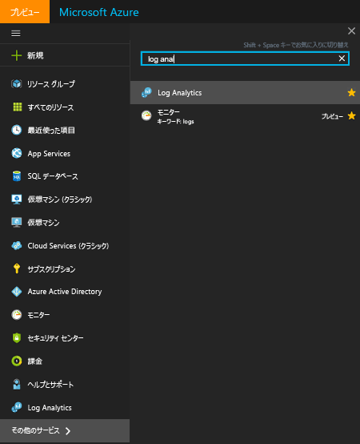  
3. Log Analytics サブスクリプションのブレードで、ワークスペースを選択します。
4. ワークスペースのブレードに、ワークスペースに関する詳細と、その他の情報へのリンクが表示されます。  
    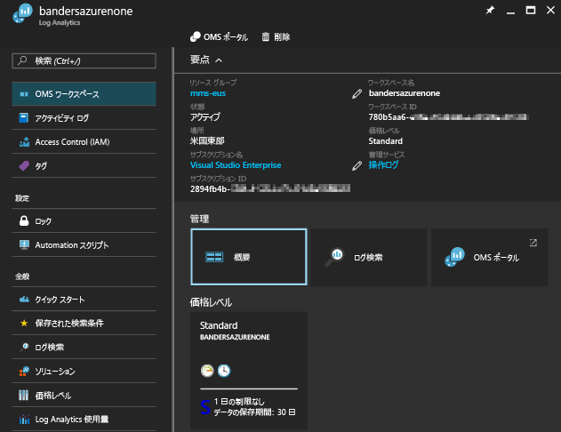  

## アカウントとユーザーの管理
各ワークスペースには、複数のアカウントを関連付けることができます。また、各アカウント (Microsoft アカウントまたは組織アカウント) は、複数のワークスペースへのアクセス権を備えることができます。

既定では、ワークスペースを作成した Microsoft アカウントまたは組織アカウントは、そのワークスペースの管理者になります。

Log Analytics ワークスペースへのアクセスを制御するアクセス許可モデルは&2; 種類あります。

1. 従来の Log Analytics ユーザー ロール
2. [Azure のロールベースのアクセス](../active-directory/role-based-access-control-configure.md) 

次の表には、各アクセス許可モデルを使用して設定できるアクセス権がまとめてあります。

|                          | Log Analytics ポータル | Azure ポータル | API (PowerShell を含む) |
|--------------------------|----------------------|--------------|----------------------------|
| Log Analytics ユーザー ロール | はい                  | なし           | いいえ                         |
| Azure のロールベースのアクセス  | はい                  | あり          | はい                        |

> [!NOTE]
> Log Analytics で使用されるアクセス許可モデルは、Log Analytics ユーザー ロールから Azure のロールベースのアクセスに移行しつつあります。
>
>

従来の Log Analytics ユーザー ロールでは、[Log Analytics ポータル](https://mms.microsoft.com)で実行されたアクティビティへのアクセスしか制御できません。

Log Analytics ポータルの次のアクティビティにも、Azure のアクセス許可が必要です。

| アクション                                                          | 必要とされる Azure のアクセス許可 | メモ |
|-----------------------------------------------------------------|--------------------------|-------|
| 管理ソリューションの追加と削除                        | リソース グループの書き込み   `Microsoft.OperationalInsights/*`   `Microsoft.OperationsManagement/*`   `Microsoft.Automation/*`   `Microsoft.Resources/deployments/*/write` | |
| 価格レベルの変更                                       | `Microsoft.OperationalInsights/workspaces/*/write` | |
| *Backup* ソリューション タイルと *Site Recovery* ソリューション タイルのデータの表示 | 管理者/共同管理者 | クラシック デプロイメント モデルを使用してデプロイされたリソースにアクセスします |
 
### Azure のアクセス許可を使用した Log Analytics へのアクセスの管理
Azure のアクセス許可を使用して Log Analytics ワークスペースへのアクセス権を付与するには、「[Azure サブスクリプション リソースへのアクセスをロールの割り当てによって管理する](../active-directory/role-based-access-control-configure.md)」の手順に従ってください。

少なくとも Log Analytics ワークスペースに対する Azure の読み取りアクセス許可があれば、Log Analytics ワークスペースを表示する際に **[OMS ポータル]** タスクをクリックして、OMS ポータルを開くことができます。

Log Analytics ポータルを開く場合は、従来の Log Analytics ユーザー ロールの使用に切り替えます。 Log Analytics ポータルのロールが割り当てられていない場合、サービスによって、[ワークスペースに対する Azure のアクセス許可があるかどうかがチェックされます](https://docs.microsoft.com/rest/api/authorization/permissions#Permissions_ListForResource)。 Log Analytics ポータルのロールの割り当ては、次のように決まります。

| 条件                                                   | 割り当て済みの Log Analytics ユーザー ロール | メモ |
|--------------------------------------------------------------|----------------------------------|-------|
| アカウントが従来の Log Analytics ユーザー ロールに属している     | 指定された Log Analytics ユーザー ロール | |
| アカウントが従来の Log Analytics ユーザー ロールに属していない   ワークスペースに対する Azure の完全なアクセス許可 (`*` アクセス許可 1) | 管理者 ||
| アカウントが従来の Log Analytics ユーザー ロールに属していない   ワークスペースに対する Azure の完全なアクセス許可 (`*` アクセス許可 1)   `Microsoft.Authorization/*/Delete` と `Microsoft.Authorization/*/Write` の "*操作は除く*" | 共同作成者 ||
| アカウントが従来の Log Analytics ユーザー ロールに属していない   Azure の読み取りアクセス許可 | 読み取り専用 ||
| アカウントが従来の Log Analytics ユーザー ロールに属していない   Azure アクセス許可が認識されない | 読み取り専用 ||
| クラウド ソリューション プロバイダー (CSP) が管理するサブスクリプションの場合   サインインに使用したアカウントが、ワークスペースに関連付けられた Azure Active Directory 内にある | 管理者 | 通常は CSP の顧客 |
| クラウド ソリューション プロバイダー (CSP) が管理するサブスクリプションの場合   サインインに使用したアカウントが、ワークスペースに関連付けられた Azure Active Directory 内にない | 共同作成者 | 通常は CSP |

1 ロール定義の詳細については、[Azure のアクセス許可](../active-directory/role-based-access-control-custom-roles.md)に関するページを参照してください。 ロールの評価時に `*` の操作は `Microsoft.OperationalInsights/workspaces/*` と同等ではありません。 

Azure Portal に関して留意が必要ないくつかの点:

* http://mms.microsoft.com を使用して OMS ポータルにサインインした場合、**[ワークスペースの選択]** 一覧が表示されます。 この一覧には、Log Analytics ユーザー ロールを付与されているワークスペースのみが表示されます。 Azure サブスクリプションを使用してアクセスするワークスペースを表示するには、URL の一部としてテナントを指定する必要があります。 たとえば、「`mms.microsoft.com/?tenant=contoso.com`」のように入力します。 テナント ID は多くの場合、サインインに使用される電子メール アドレスの最後の部分です。
* Azure のアクセス許可を使用してアクセスできるポータルに直接移動する場合は、URL の一部としてリソースを指定する必要があります。 この URL は PowerShell を使用して取得できます。

  たとえば、「 `(Get-AzureRmOperationalInsightsWorkspace).PortalUrl`」のように入力します。

  URL は、`https://eus.mms.microsoft.com/?tenant=contoso.com&resource=%2fsubscriptions%2faaa5159e-dcf6-890a-a702-2d2fee51c102%2fresourcegroups%2fdb-resgroup%2fproviders%2fmicrosoft.operationalinsights%2fworkspaces%2fmydemo12` のようになります。

### OMS ポータルでのユーザーの管理
[設定] ページの **[アカウント]** タブにある **[ユーザーの管理]** タブでユーザーとグループを管理します。   

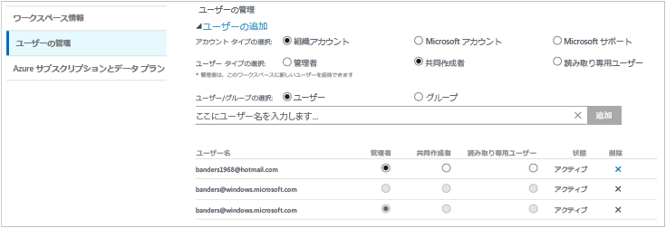

#### 既存のワークスペースへのユーザーの追加
次の手順でワークスペースにユーザーやグループを追加します。

1. OMS ポータルで、**[設定]** タイルをクリックします。
2. **[アカウント]** タブ、**[ユーザーの管理]** タブの順にクリックします。
3. **[ユーザーの管理]** セクションで、追加するアカウントの種類を **[組織アカウント]**、**[Microsoft アカウント]**、または **[Microsoft サポート]** から選択します。

   * Microsoft アカウントを選択する場合は、Microsoft アカウントに関連付けられているユーザーのメール アドレスを入力します。
   * 組織アカウントを選択する場合は、ユーザー名、グループ名、電子メール エイリアスのどれか一部を入力すると、それに該当するユーザーとグループの一覧がドロップダウン ボックスに表示されます。 ユーザーまたはグループを選択します。
   * [Microsoft サポート] は、Microsoft サポート エンジニアなど Microsoft の従業員がトラブルシューティングのためにユーザーのワークスペースに一時的にアクセスすることを許可するために使用します。

     > [!NOTE]
     > 最適なパフォーマンスを発揮するには、単一の OMS アカウントに関連付けられている Active Directory グループの数を&3; つ (1 つは管理者用に、1 つは共同作成者、もう&1; つは読み取り専用ユーザー用) に制限します。 それ以上のグループを使用すると、Log Analytics のパフォーマンスに影響を与える可能性があります。
     >
     >
4. 追加するユーザーまたはグループの種類を **[管理者]**、**[共同作成者]**、**[読み取り専用ユーザー]** の中から選択します。  
5. **[追加]**をクリックします。

   Microsoft アカウントを追加する場合は、指定したメールに、ワークスペースへの招待が送信されます。 ユーザーは招待に記載されている手順に従って OMS に参加すると、そのワークスペースにアクセスできるようになります。
   組織のアカウントを追加すると、ユーザーは Log Analytics にすぐにアクセスできます。  

#### 既存のユーザーの種類を編集する
OMS アカウントに関連付けられているユーザーのアカウント ロールを変更することができます。 次のオプションがあります。

* *管理者*: ユーザーの管理、すべてのアラートの表示と操作、サーバーの追加、削除を行うことができます
* *Contributor*(共同作成者): すべてのアラートの表示と操作、サーバーの追加、削除を行うことができます
* *ReadOnly User* (読み取り専用ユーザー): 読み取り専用とマークされているユーザーは、次の操作を行うことはできません。

  1. ソリューションの追加と削除。 ソリューション ギャラリーは表示されません。
  2. **[マイ ダッシュボード]** 上のタイルの追加、変更、削除。
  3. **[設定]** ページの表示。 このページは表示されません。
  4. 検索ビュー。PowerBI 構成、保存した検索条件、アラート タスクは表示されません。

#### アカウントを編集するには
1. OMS ポータルで、**[設定]** タイルをクリックします。
2. **[アカウント]** タブ、**[ユーザーの管理]** タブの順にクリックします。
3. 変更するユーザーのロールを選択します。
4. 確認のダイアログ ボックスで **[はい]** をクリックします。

### ワークスペースからユーザーを削除する
次の手順でワークスペースからユーザーを削除します。 ユーザーを削除しても、ワークスペースは閉じません。 ユーザーとワークスペース間の関連付けが削除されます。 1 人のユーザーが複数のワークスペースに関連付けられている場合、そのユーザーは、OMS にサインインして、他のワークスペースを表示することができます。

1. OMS ポータルで、**[設定]** タイルをクリックします。
2. **[アカウント]** タブ、**[ユーザーの管理]** タブの順にクリックします。
3. 削除するユーザー名の横にある **[削除]** をクリックします。
4. 確認のダイアログ ボックスで **[はい]** をクリックします。

### 既存のワークスペースにグループを追加する
1. 前のセクション「既存のワークスペースへのユーザーの追加」の手順 1. ～ 4. を実行します。
2. **[ユーザー/グループの選択]** で **[グループ]** を選択します。  
   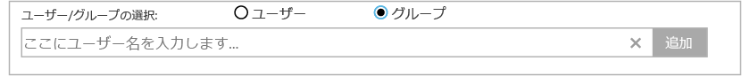
3. 追加するグループの表示名または電子メール アドレスを入力します。
4. 一覧結果でグループを選択し、 **[追加]**をクリックします。

## 既存のワークスペースを Azure サブスクリプションへリンクする
2016 年 9 月 26 日より後に作成されたすべてのワークスペースは、作成時に Azure サブスクリプションにリンクする必要があります。 この日付より前に作成されたワークスペースは、次回サインインしたときにワークスペースにリンクする必要があります。 Azure Portal からワークスペースを作成するか、Azure サブスクリプションにワークスペースをリンクすると、Azure Active Directory は組織のアカウントとしてリンクされます。

### OMS ポータルでワークスペースを Azure サブスクリプションにリンクするには

- OMS ポータルにサインインすると、Azure サブスクリプションを選択するよう求められます。 ワークスペースにリンクするサブスクリプションを選択し、**[リンク]** をクリックします。  
    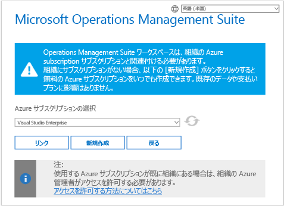

    > [!IMPORTANT]
    > ワークスペースをリンクするためには、リンクするワークスペースに Azure アカウントが既にアクセスしていることが必要です。  つまり、Azure Portal へのアクセスに使用するアカウントは、ワークスペースへのアクセスに使用するアカウントと **同じ** アカウントである必要があります。 それ以外の場合は、「[既存のワークスペースへのユーザーの追加](#add-a-user-to-an-existing-workspace)」をご覧ください。

### Azure Portal でワークスペースを Azure サブスクリプションにリンクするには
1. [Azure ポータル](http://portal.azure.com)にサインインします。
2. **[Log Analytics]** を探して選択します。
3. 既存のワークスペースの一覧が表示されます。 **[追加]**をクリックします。  
   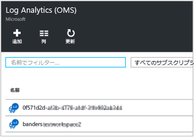
4. **[OMS Workspace (OMS ワークスペース)]** で、**[Or link existing (または既存のリンク)]** をクリックします。  
   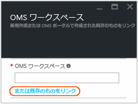
5. **[必要な設定の構成]**をクリックします。  
   
6. ユーザーの Azure アカウントにまだリンクされていないワークスペースの一覧が表示されます。 ワークスペースを選択します。  
   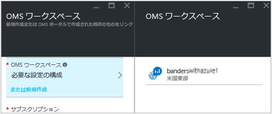
7. 必要に応じて、次の項目の値を変更できます。
   * [サブスクリプション]
   * リソース グループ
   * Location (場所)
   * [価格レベル]   
     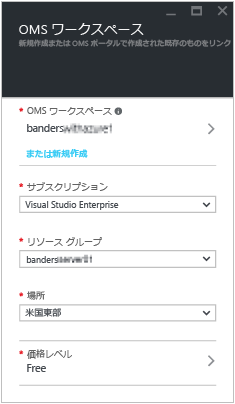
8. **[OK]**をクリックします。 これでワークスペースがユーザーの Azure アカウントにリンクされました。

> [!NOTE]
> リンクするワークスペースが表示されない場合、OMS Web サイトで作成したワークスペースにアクセスする許可がユーザーの Azure サブスクリプションにありません。  OMS ポータルからこのアカウントへのアクセスを許可するには、「[既存のワークスペースへのユーザーの追加](#add-a-user-to-an-existing-workspace)」を参照してください。
>
>

## 有料プランへワークスペースをアップグレードする
OMS のワークスペースには、**Free**、**Standalone**、**OMS** の&3; 種類のプランがあります。  *Free* プランを利用している場合、Log Analytics に送信できるデータは 1 日あたり 500 MB が上限となります。  この量を超える場合は、この上限を超えるデータの収集漏れを防ぐためにワークスペースを有料プランに変更する必要があります。 プランの種類はいつでも変更できます。  OMS の価格の詳細については、[価格の詳細](https://www.microsoft.com/en-us/cloud-platform/operations-management-suite-pricing)に関する記述を参照してください。

### OMS サブスクリプションに付属する資格の使用
OMS E1、OMS E2 OMS、OMS Add-On for System Center のいずれかを購入することによって得られる資格を使用するには、OMS Log Analytics の *OMS* プランを選択します。

OMS サブスクリプションを購入すると、マイクロソフト エンタープライズ契約に資格が追加されます。 追加された資格は、この契約下で作成されたすべての Azure サブスクリプションで使用できます。 これらのサブスクリプションでは、すべてのワークスペースに OMS の資格が使用されます。

ワークスペースの使用を OMS サブスクリプションからの資格に適用するには、次の作業が必要になります。

1. OMS サブスクリプションを含むエンタープライズ契約に含まれる Azure サブスクリプションにワークスペースを作成する
2. ワークスペースの *OMS* プランを選択する

> [!NOTE]
> ご利用のワークスペースが 2016 年 9 月 26 日より前に作成されており、かつ Log Analytics の料金プランが *Premium* である場合、このワークスペースには System Center 用 OMS アドオンの資格が使用されます。 *OMS* 料金レベルに変更することによって資格を使用することもできます。
>
>

OMS サブスクリプションの資格は、Azure Portal にも OMS ポータルにも表示されません。 資格と使用状況は、エンタープライズ ポータルで確認できます。  

ワークスペースがリンクされている Azure サブスクリプションを変更する必要がある場合は、Azure PowerShell の [Move-AzureRmResource](https://msdn.microsoft.com/library/mt652516.aspx) コマンドレットを使用します。
to
### エンタープライズ契約の Azure コミットメントを使用する
OMS サブスクリプションがない場合、料金は OMS のコンポーネントごとに発生し、その使用状況が Azure の請求書に記載されます。

Azure サブスクリプションがリンクされているエンタープライズ登録に Azure の年額コミットメントがある場合、Log Analytics の使用料金が残りの年額コミットメントから自動的に引き落とされます。

ワークスペースがリンクされている Azure サブスクリプションを変更する必要がある場合は、Azure PowerShell の [Move-AzureRmResource](https://msdn.microsoft.com/library/mt652516.aspx) コマンドレットを使用します。  

### Azure Portal でワークスペースを有料の価格レベルに変更する
1. [Azure ポータル](http://portal.azure.com)にサインインします。
2. **[Log Analytics]** を探して選択します。
3. 既存のワークスペースの一覧が表示されます。 ワークスペースを選択します。  
4. ワークスペース ブレードの **[全般]** で、**[価格レベル]** をクリックします。  
5. **[価格レベル]** で価格レベルを選択し、**[選択]** をクリックします。  
    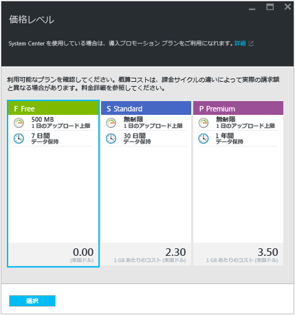
6. Azure Portal でビューを更新すると、選択したレベルの **[価格レベル]** が更新されます。  
    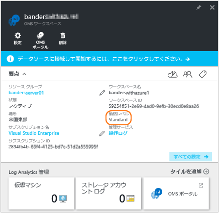

> [!NOTE]
> ワークスペースが Automation アカウントにリンクされている場合は、"*スタンドアロン (GB 単位)*" 価格レベルを選択できるように、**Automation and Control** ソリューションをすべて削除し、Automation アカウントのリンクを解除しておく必要があります。 ワークスペース ブレードの **[全般]** で **[ソリューション]** をクリックし、ソリューションを表示して削除します。 Automation アカウントのリンクを解除するには、**[価格レベル]** ブレードで Automation アカウントの名前をクリックします。
>
>

### OMS ポータルでワークスペースを有料の価格レベルに変更する

OMS ポータルを使用して価格レベルを変更するには、Azure サブスクリプションが必要です。

1. OMS ポータルで、**[設定]** タイルをクリックします。
2. **[アカウント]** タブをクリックしてから、**[Azure Subscription & Data Plan (Azure サブスクリプションとデータ プラン)]** タブをクリックします。
3. 使用する価格レベルをクリックします。
4. **[保存]**をクリックします。  
   

新しいデータ プランは、Web ページの上部にある OMS ポータル リボンに表示されます。

## Log Analytics でのデータの保持期間を変更する

Free 価格レベルでは、Log Analytics によって直近の&7; 日間のデータが保持されます。
Standard 価格レベルでは、Log Analytics によって直近の 30 日間のデータが保持されます。
Premium 価格レベルでは、Log Analytics によって直近の 365 日間のデータが保持されます。
Standalone および OMS 価格レベルでは、Log Analytics によって既定で直近の 31 日間のデータが保持されます。

Standalone および OMS 価格レベルをご利用の場合、データは最長 2 年間 (730 日間) 保持できます。 既定の 31 日間を超えてデータを保存した場合は、データ保持の料金が発生します。 価格の詳細については、[超過料金](https://azure.microsoft.com/pricing/details/log-analytics/)に関するセクションをご覧ください。

データ保持の期間を変更するには、次の手順に従います。

1. [Azure ポータル](http://portal.azure.com)にサインインします。
2. **[Log Analytics]** を探して選択します。
3. 既存のワークスペースの一覧が表示されます。 ワークスペースを選択します。  
4. ワークスペース ブレードの **[全般]** で、**[リテンション期間]** をクリックします。  
5. スライダーを使用してリテンション期間の日数を増減し、**[保存]** をクリックします。  
    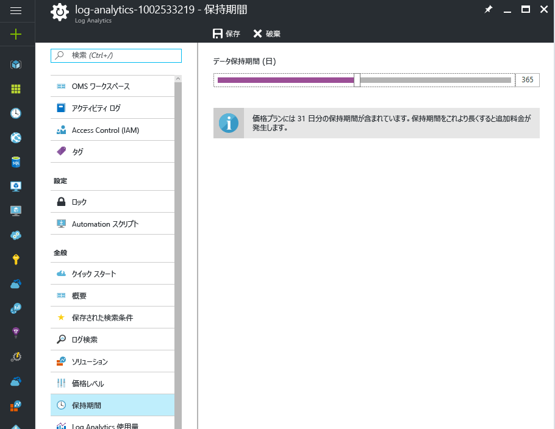

## ワークスペースの Azure Active Directory 組織を変更する

ワークスペースの Azure Active Directory 組織を変更できます。 Azure Active Directory の組織を変更すると、そのディレクトリに存在するユーザーとグループをワークスペースに追加できます。

### ワークスペースの Azure Active Directory 組織を変更するには

1. OMS ポータルの [設定] ページで、**[アカウント]**、**[ユーザーの管理]** タブの順にクリックします。  
2. 組織のアカウントに関する情報を確認し、**[組織の変更]** をクリックします。  
    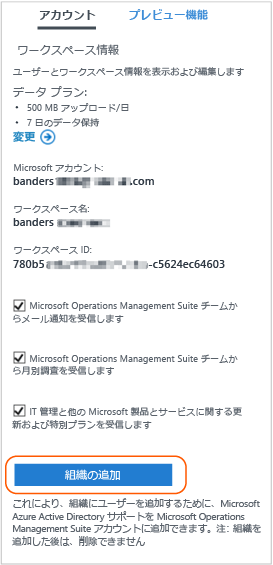
3. Azure Active Directory ドメインの管理者の ID 情報を入力します。 その後、ワークスペースが Azure Active Directory ドメインにリンクされたことを示す確認が表示されます。  
    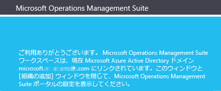

## Log Analytics ワークスペースを削除する
Log Analytics ワークスペースを削除すると、そのワークスペースに関連するすべてのデータが 30 日以内に OMS サービスから削除されます。

ユーザーが管理者で、ワークスペースに関連付けられている複数のユーザーが存在する場合は、それらのユーザーとワークスペースの間の関連付けがなくなります。 ユーザーが他のワークスペースに関連付けられている場合は、その他のワークスペースを使用して OMS を継続して使用できます。 ただし、他のワークスペースに関連付けられていない場合は、OMS を使用するには、ワークスペースを作成する必要があります。

### ワークスペースを削除するには
1. [Azure ポータル](http://portal.azure.com)にサインインします。
2. **[Log Analytics]** を探して選択します。
3. 既存のワークスペースの一覧が表示されます。 削除するワークスペースを選択します。
4. ワークスペース ブレードで、**[削除]** をクリックします。  
    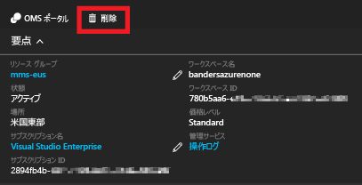
5. ワークスペースの削除を確認するダイアログで **[はい]** をクリックします。

## 次のステップ
* エージェントを追加し、データを収集する方法については、「 [Windows コンピューターを Log Analytics に接続する](log-analytics-windows-agents.md) 」を参照してください。
* [ソリューション ギャラリーから Log Analytics ソリューションを追加する](log-analytics-add-solutions.md) 」を参照してください。
* [Configure proxy and firewall settings in Log Analytics (Log Analytics のプロキシとファイアウォールの設定を構成する) (Log Analytics のプロキシとファイアウォールの設定を構成する)](log-analytics-proxy-firewall.md) 」を参照してください。

