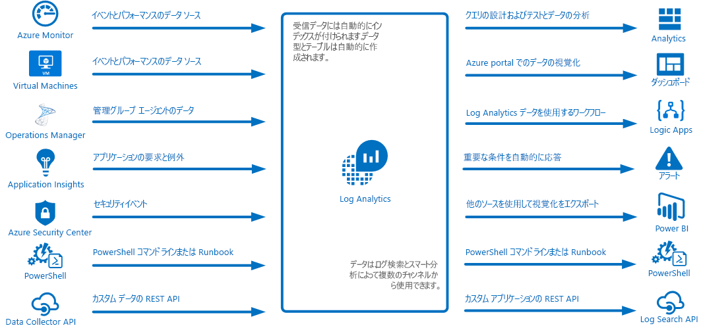
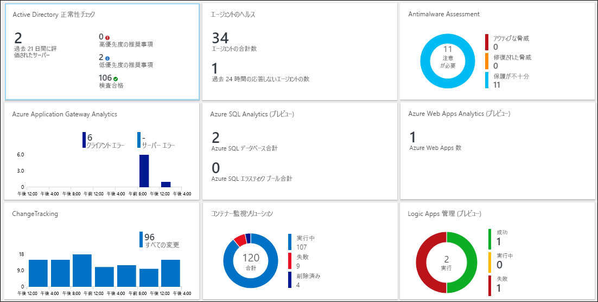
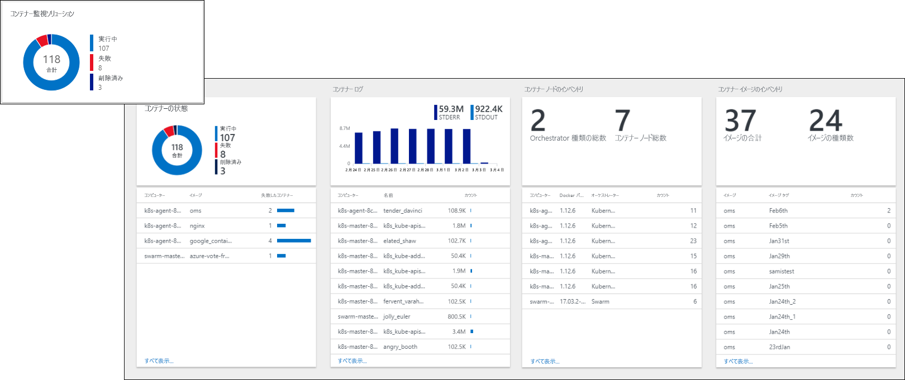
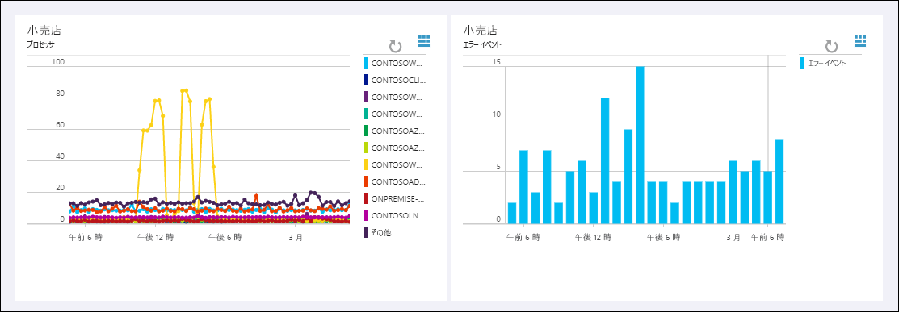
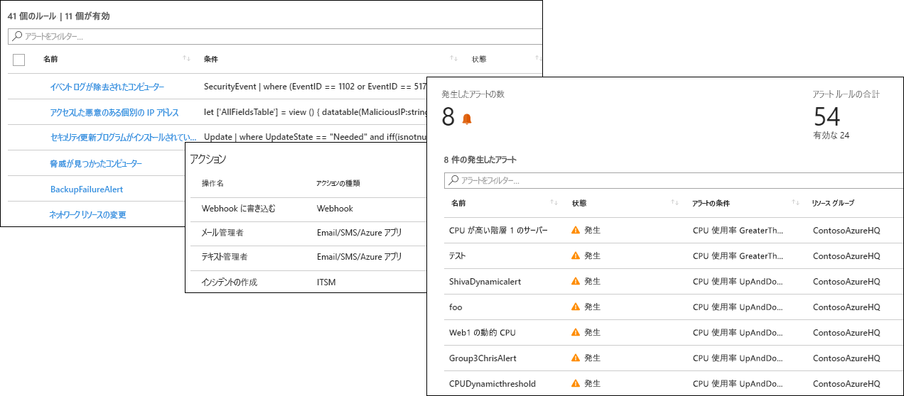
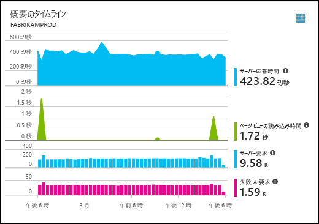
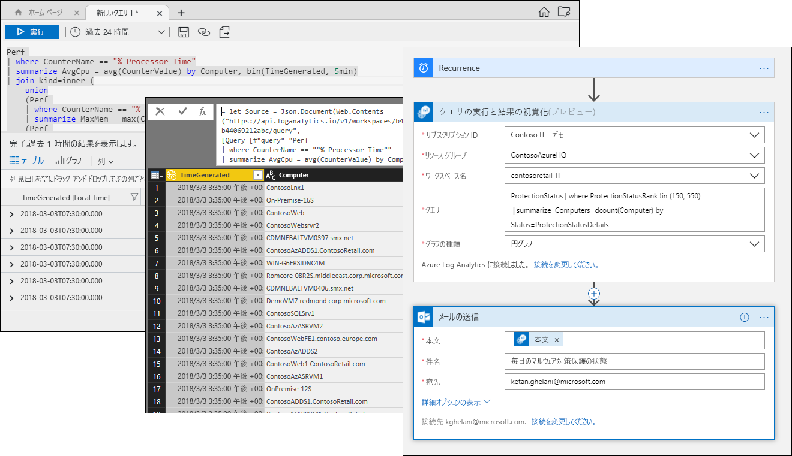

# Azure Log Analytics とは
Log Analytics は、Azure の管理において中心的役割を果たします。たとえば、さまざまなソースからテレメトリなどのデータを収集します。また、アプリケーションやリソースの運用に欠かせない分析情報を得る手段としてクエリ言語や分析エンジンを備えていることも、そうした役割の 1 つです。  Log Analytics のデータは、ログの検索やビューを通じて直接、対話操作することができるほか、Log Analytics にデータを格納する他の Azure サービス (Application Insights、Azure Security Center など) の分析ツールを使用することもできます。  

Log Analytics は最小限の構成さえ行えば、他の Azure サービスと連携します。  データを収集するために必要なことは、ワークスペースを作成するだけです。  その後、仮想マシンにエージェントをインストールしてそれをワークスペースに追加したり、各種のアプリケーションにさまざまな分析情報を提供するロジックが備わった管理ソリューションを有効にしたりすることができます。  私たちから見えないところで、データ型はあらかじめ定義されているか、またはデータの収集時に自動的に作成されます。

## 監視における役割

Azure に用意されている各種の監視サービスについては、「[Azure のアプリケーションおよびリソースの監視](../monitoring-and-diagnostics/monitoring-overview.md)」で説明されています。  Log Analytics が果たしている中心的役割とは、具体的には、さまざまなソースから収集された監視データを統合すること、また統合と分析のための強力なクエリ言語を提供することです。  

とはいえ、Log Analytics による監視の範囲は Azure リソースに限定されません。  オンプレミスや他のクラウド上にあるリソースからデータを収集してハイブリッドな監視環境を形成したり、System Center Operations Manager に直接接続して既存のエージェントからテレメトリを収集したりすることができます。  ログ検索、ビュー、管理ソリューションなどの Log Analytics の解析ツールには、収集されたすべてのデータに対して作用し、対象の環境全体を一元的に分析する機能が備わっています。

## データ収集
Log Analytics はさまざまなソースからデータを収集します。  収集されたデータは、その型ごとに別個のテーブルにまとめられ、すべてのデータがその収集元にかかわらず一斉に分析できる状態になります。

Log Analytics へのデータ収集には、次のような方法があります。

- Azure Monitor で Azure リソースから収集する[メトリックとログ](../monitoring/monitoring-data-collection.md#types-of-monitoring-data)をコピーするように構成します。
- [Azure Storage](log-analytics-azure-storage-iis-table.md) に書き込まれたテレメトリを収集します。
- [Windows](log-analytics-windows-agent.md) 仮想マシンと [Linux](log-analytics-linux-agents.md) 仮想マシン上のエージェントが、構成された[データ ソース](log-analytics-data-sources.md)に応じて、ゲスト オペレーティング システムやアプリケーションから Log Analytics にテレメトリを送信します。 エージェントは直接接続できるほか、[OMS ゲートウェイ](log-analytics-oms-gateway.md)経由で接続したり (ファイアウォール アクセスがない場合)、[System Center Operations Manager の管理グループ](log-analytics-om-agents.md)経由で接続したりすることもできます。
- [Application Insights](https://docs.microsoft.com/azure/application-insights/) や [Azure Security Center](https://docs.microsoft.com/azure/security-center/) などの Azure サービスは、何も構成されていなくても、そのデータを直接 Log Analytics に格納します。
- PowerShell コマンド ラインまたは [Azure Automation Runbook](../automation/automation-runbook-types.md) から Log Analytics のコマンドレットを使用してデータを書き込みます。
- カスタムの要件がある場合は、[HTTP データ コレクター API](log-analytics-data-collector-api.md) を使用して REST API クライアントから Log Analytics にデータを書き込んだり、[Azure Logic Apps](https://docs.microsoft.com/azure/logic-apps/) を使用してカスタム ワークフローからデータを書き込んだりすることもできます。

## 管理ソリューションによる機能の追加
[管理ソリューション](log-analytics-add-solutions.md)は、特定の製品やシナリオを想定して事前にパッケージされたロジックを備えています。  通常では得られないデータを Log Analytics に収集したり、収集済みのデータを加工したりすることができます。  一般に、そうした特別なデータを分析することのできるビューが含まれています。  ソリューションはさまざまな機能に対応し、その数も増え続けています。  Azure Marketplace で利用可能なソリューションを簡単に参照し、[ワークスペースに追加](log-analytics-add-solutions.md)できます。  

## クエリ言語

Log Analytics には、収集されたデータを高速に検索し、統合して、分析する[多機能なクエリ言語](http://docs.loganalytics.io)が備わっています。  クエリの作成とテストは、[ログ検索ポータルまたは高度な分析ポータル](log-analytics-log-search-portals.md)を使って行うことができます。それらのツールを使って直接データを分析できるほか、クエリを保存して、Power BI や Excel などさまざまなツールでの視覚化やアラート、それらのツールへのエクスポートに利用することができます。

Log Analytics クエリ言語は、単純なログ検索に適している一方で、集計、結合、スマート分析など高度な機能も備えています。 提供されている[さまざまなチュートリアル](https://docs.loganalytics.io/docs/Learn/Tutorials)を利用すれば、クエリ言語はすぐに覚えることができます。  既に [SQL](https://docs.loganalytics.io/docs/Learn/References/SQL-to-Azure-Log-Analytics) や [Splunk](https://docs.loganalytics.io/docs/Learn/References/Splunk-to-Azure-Log-Analytics) に習熟しているユーザーには、別途ガイダンスが用意されています。

## Log Analytics データの視覚化

ログ検索から得られたデータは、[Log Analytics ](log-analytics-view-designer.md) のビューで視覚的に表示されます。  それぞれのビューは、重要なデータを集約したリストのほか、棒グラフや折れ線グラフなど、さまざまな視覚化要素で構成されます。  [管理ソリューション](#add-functionality-with-management-solutions)には、特定の用途向けにデータを集計したビューが含まれているほか、Log Analytics のログ検索から得たデータを表示する独自のビューを作成することもできます。

さまざまな Azure サービスのタイルをまとめることのできる [Azure ダッシュボード](../azure-portal/azure-portal-dashboards.md)に Log Analytics クエリの結果をピン留めすることもできます。  Log Analytics ビューをダッシュボードにピン留めすることも可能です。

## Log Analytics のデータからアラートを作成する

自分にとって重要な条件を満たした Log Analytics データについては、[Azure アラート](../monitoring-and-diagnostics/monitoring-overview-unified-alerts.md)を使用して能動的に通知を受け取ることができます。  スケジュールされた間隔でクエリが自動的に実行され、その結果が特定の条件を満たした場合にアラートが生成されます。  これにより、ほぼリアルタイムのアラート ([Azure Monitor](../monitoring-and-diagnostics/monitoring-near-real-time-metric-alerts.md)) やアプリケーション例外([Application Insights](../application-insights/app-insights-alerts.md)) など他のソースと Log Analytics のアラートとを結合し、[アクション グループ](../monitoring-and-diagnostics/monitoring-action-groups.md)を共有してアラートの条件に対応することができます。

## Log Analytics のデータを他のサービスで使用する
Application Insights や Azure Security Center といったサービスは、そのデータを Log Analytics に格納します。  通常は、それらのサービスに備わっている多機能な分析ツールを対話的に操作することになりますが、Log Analytics のクエリを使ってデータにアクセスし、必要に応じて、他のサービスから得たデータと結合することができます。  

たとえば、次に示したのは Application Insights のビューです。  右上のアイコンをクリックすると、そのグラフで使用されているクエリと共に Log Analytics の分析コンソールが起動します。

## Log Analytics データのエクスポート

Log Analytics のデータは、Azure の外部で利用することもできます。  スケジュールした間隔でクエリの結果をインポートするように [Power BI](log-analytics-powerbi.md) を構成すれば、さまざまなソースのデータを結合したり、Web やモバイル デバイスでレポートを共有したりするなど、その機能を最大限に活用することができます。  [ログ検索 API](log-analytics-log-search-api.md) を利用して、Log Analytics データを活用するカスタム ソリューションを作成するか、その他のシステムと統合することもできます。

Azure の [Logic Apps](../logic-apps/logic-apps-overview.md) を使用すると、Log Analytics のデータに基づくカスタム ワークフローを作成することができます。  PowerShell を使った、より複雑なロジックについては、[Azure Automation の Runbook](../automation/automation-runbook-types.md) を使用することができます。

## 次の手順
- [Azure VM からデータを収集](log-analytics-quick-collect-azurevm.md)してみる。
- [単純なクエリを使った Log Analytics データの分析に関するチュートリアル](log-analytics-tutorial-viewdata.md)の手順を体験する。
* [利用可能なソリューションを参照](log-analytics-add-solutions.md)し、Log Analytics に機能を追加する。

