# <a name="configure-proxy-and-firewall-settings-in-log-analytics"></a>Log Analytics のプロキシ設定とファイアウォール設定の構成
Log Analytics のプロキシとファイアウォール設定の構成に必要なアクションは、使用しているエージェントのタイプによって異なります。 使用するエージェントの種類については、以下のセクションを確認してください。

## <a name="settings-for-the-oms-gateway"></a>OMS ゲートウェイの設定

エージェントがインターネットにアクセスできない場合は、代わりに独自のネットワーク リソースを使用して OMS ゲートウェイにデータを送信できます。 ゲートウェイがエージェントに代わってそれらのデータを収集し、OMS サービスに送信します。

OMS ゲートウェイと通信するエージェントは、完全修飾ドメイン名とカスタム ポート番号を使用して構成します。

OMS ゲートウェイはインターネットにアクセスできる必要があります。 使用しているエージェントのタイプと同じプロキシ サーバーまたはファイアウォールの設定を OMS ゲートウェイに使用します。 OMS ゲートウェイについて詳しくは、「[OMS ゲートウェイを使って OMS にコンピューターとデバイスを接続する](log-analytics-oms-gateway.md)」をご覧ください。

## <a name="configure-settings-with-the-microsoft-monitoring-agent"></a>Microsoft Monitoring Agent で設定を構成する
OMS サービスに Microsoft Monitoring Agent を接続して登録するには、ドメインのポート番号と URL へのアクセスが必要になります。 エージェントと OMS サービス間の通信にプロキシ サーバーを使用する場合、適切なリソースにアクセスできることを確認する必要があります。 インターネットへのアクセスを制限するためにファイアウォールを使用する場合は、OMS へのアクセスを許可するようにファイアウォールを構成する必要があります。 次の表には、OMS で必要なポートの一覧を示しています。

| **エージェントのリソース** | **ポート** | **バイパス HTTPS 検査** |
| --- | --- | --- |
| \*.ods.opinsights.azure.com |443 |はい |
| \*.oms.opinsights.azure.com |443 |はい |
| \*.blob.core.windows.net |443 |はい |
| \*.azure-automation.net |443 |はい |
| ods.systemcenteradvisor.com |443 | |

コントロール パネルから Microsoft Monitoring Agent のプロキシ設定を構成する際には、以下の手順を使用してください。 この手順は、各サーバーに対して行う必要があります。 構成が必要なサーバーの数が多い場合には、このプロセスを自動化するスクリプトを使った方が作業が簡単に済むことも考えられます。 そのような場合は、1 つ先の手順の「 [スクリプトを使って Microsoft Monitoring Agent のプロキシ設定を構成するには](#to-configure-proxy-settings-for-the-microsoft-monitoring-agent-using-a-script)」をご覧ください。

### <a name="to-configure-proxy-settings-for-the-microsoft-monitoring-agent-using-control-panel"></a>コントロール パネルを使って Microsoft Monitoring Agent のプロキシ設定を構成するには
1. **[コントロール パネル]**を開きます。
2. **[Microsoft Monitoring Agent]**を開きます。
3. **[プロキシ設定]** タブをクリックします。<br>  
   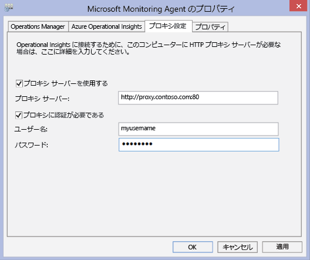
4. 例に示したように、 **[プロキシ サーバーを使用する]** をオンにして、URL と (必要に応じて) ポート番号を入力します。 プロキシ サーバーで認証が必要な場合には、プロキシ サーバーにアクセスするためのユーザー名とパスワードを入力します。

次の手順に従って PowerShell スクリプトを作成し、プロキシ設定を設定して各エージェントがサーバーに直接接続できるようにします。

### <a name="to-configure-proxy-settings-for-the-microsoft-monitoring-agent-using-a-script"></a>スクリプトを使って Microsoft Monitoring Agent のプロキシ設定を構成するには
次の例をコピーして、使用する環境にあった情報を使って更新します。PS1 ファイル名の拡張子で保存して、OMS サービスに直接接続する各コンピューターでスクリプトを実行します。

    param($ProxyDomainName="http://proxy.contoso.com:80", $cred=(Get-Credential))

    # First we get the Health Service configuration object.  We need to determine if we
    #have the right update rollup with the API we need.  If not, no need to run the rest of the script.
    $healthServiceSettings = New-Object -ComObject 'AgentConfigManager.MgmtSvcCfg'

    $proxyMethod = $healthServiceSettings | Get-Member -Name 'SetProxyInfo'

    if (!$proxyMethod)
    {
         Write-Output 'Health Service proxy API not present, will not update settings.'
         return
    }

    Write-Output "Clearing proxy settings."
    $healthServiceSettings.SetProxyInfo('', '', '')

    $ProxyUserName = $cred.username

    Write-Output "Setting proxy to $ProxyDomainName with proxy username $ProxyUserName."
    $healthServiceSettings.SetProxyInfo($ProxyDomainName, $ProxyUserName, $cred.GetNetworkCredential().password)


## <a name="configure-settings-with-operations-manager"></a>Operations Manager で設定を構成する
OMS サービスに Operations Manager 管理グループを接続し登録するには、ドメインのポート番号と URL へのアクセスが必要になります。 Operations Manager 管理サーバーと OMS サービス間の通信にプロキシ サーバーを使用する場合、適切なリソースにアクセスできることを確認する必要があります。 インターネットへのアクセスを制限するためにファイアウォールを使用する場合は、OMS へのアクセスを許可するようにファイアウォールを構成する必要があります。 Operations Manager 管理サーバーがプロキシ サーバーの背後にない場合でも、そのエージェントは存在する可能性があります。 この場合、セキュリティとログの管理ソリューションのデータを OMS Web サービスに送信することを許可するには、プロキシ サーバーをエージェントと同じように構成する必要があります。

Operations Manager エージェントが OMS サービスと通信するには、Operations Manager インフラストラクチャ (エージェントを含む) に適切なプロキシ設定とバージョンが必要です。 エージェントのプロキシ設定は、Operations Manager コンソールで指定します。 バージョンは次のいずれかにする必要があります。

* Operations Manager 2012 SP1 更新プログラム ロールアップ 7 以降
* Operations Manager 2012 R2 更新プログラム ロールアップ 3 以降

次の表では、これらのタスクに関連するポートを一覧を示します。

> [!NOTE]
> 次の一部のリソースは、OMS の旧バージョンである Advisor と Operational Insights を指しています。 表示されたリソースは、今後変更される予定です。
>
>

エージェントのリソースとポートの一覧は次のとおりです。<br>

| **エージェントのリソース** | **ポート** |
| --- | --- |
| \*.ods.opinsights.azure.com |443 |
| \*.oms.opinsights.azure.com |443 |
| \*.blob.core.windows.net/\* |443 |
| ods.systemcenteradvisor.com |443 |

<br>
管理サーバーのリソースとポートの一覧は次のとおりです。<br>

| **管理サーバーのリソース** | **ポート** | **バイパス HTTPS 検査** |
| --- | --- | --- |
| service.systemcenteradvisor.com |443 | |
| \*.service.opinsights.azure.com |443 | |
| \*.blob.core.windows.net |443 |はい |
| data.systemcenteradvisor.com |443 | |
| ods.systemcenteradvisor.com |443 | |
| \*.ods.opinsights.azure.com |443 |はい |
| \*.azure-automation.net |443 |はい |

<br>
OMS と Operations Manager コンソールのリソースとポートの一覧は次のとおりです。<br>

| **OMS と Operations Manager コンソールのリソース** | **ポート** |
| --- | --- |
| service.systemcenteradvisor.com |443 |
| \*.service.opinsights.azure.com |443 |
| \*.live.com |ポート 80 と 443 |
| \*.microsoft.com |ポート 80 と 443 |
| \*.microsoftonline.com |ポート 80 と 443 |
| \*.mms.microsoft.com |ポート 80 と 443 |
| login.windows.net |ポート 80 と 443 |

<br>

次の手順に従って Operations Manager 管理グループを OMS サービスに登録します。 管理グループと OMS サービス間で通信の問題が発生する場合、検証手順を使用して OMS サービスへのデータ送信のトラブルシューティングを行います。

### <a name="to-request-exceptions-for-the-oms-service-endpoints"></a>OMS サービス エンドポイントの例外を要求するには
1. 前述の最初のテーブルからの情報を使用して、Operations Manager 管理サーバーに必要なリソースが、ファイアウォール経由でアクセスできることを確認します。
2. 前述の最初のテーブルからの情報を使用して、Operations Manager の Operations コンソールと OMS に必要なリソースが、ファイアウォール経由でアクセスできることを確認します。
3. Internet Explorer でプロキシ サーバーを使用する場合は、正しく構成され、機能していることを確認します。 確認するには、セキュリティで保護された Web 接続 (HTTPS) を開きます ( [https://bing.com](https://bing.com)など)。 セキュリティで保護された Web 接続がブラウザーで動作しない場合は、クラウドに Web サービスがある Operations Manager 管理コンソールでもおそらく作動しません。

### <a name="to-configure-the-proxy-server-in-the-operations-manager-console"></a>Operations Manager コンソールでプロキシ サーバーを構成するには
1. Operations Manager コンソールを開き、 **[Administration (管理)]** ワークスペースを選択します。
2. **[オペレーション インサイト]** を展開して、**[オペレーション インサイトの接続]** を選択します。<br>  
   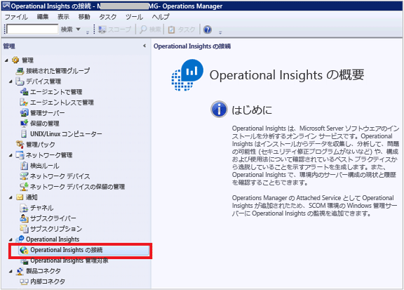
3. [OMS の接続] ビューで、 **[プロキシ サーバーの構成]**をクリックします。<br>  
   ![Operations Manager OMS 接続の [プロキシ サーバーの構成]](./media/log-analytics-proxy-firewall/proxy-om02.png)
4. [Operational Insights 設定ウィザード: プロキシ サーバー] で **[Operational Insights Web サービスへのアクセスにプロキシ サーバーを使用する]** を選択して、ポート番号と URL を入力します (例: **http://myproxy:80**)。<br>  
   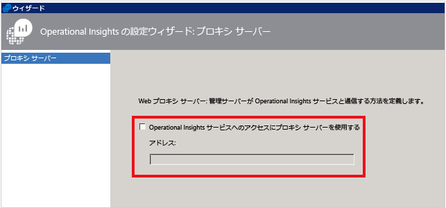

### <a name="to-specify-credentials-if-the-proxy-server-requires-authentication"></a>プロキシ サーバーで認証が必要な場合の資格情報を指定するには
 プロキシ サーバーの資格情報と設定は、OMS にデータを送信する管理対象コンピューターに反映する必要があります。 これらのサーバーは、 *Microsoft System Center Advisor Monitoring Server Group*にある必要があります。 資格情報は、グループ内の各サーバーのレジストリに暗号化されます。

1. Operations Manager コンソールを開き、 **[Administration (管理)]** ワークスペースを選択します。
2. **[RunAs Configuration (RunAs の構成)]** で **[Profiles (プロファイル)]** を選択します。
3. **System Center Advisor Run As Profile Proxy** というプロファイルを開きます。<br>  
   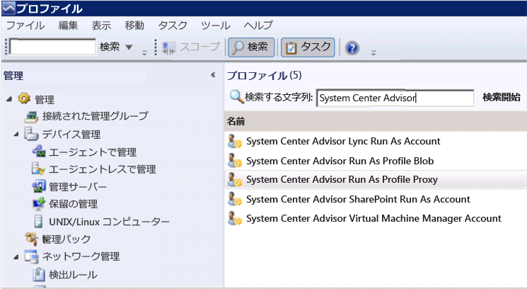
4. Run As Profile (Run As プロファイル) ウィザードで **[追加]** をクリックして Run As アカウント (実行アカウント) を使用します。 新しい Run As アカウント(実行アカウント) を作成するか、既存のアカウントを使用できます。 このアカウントには、プロキシ サーバーを通過するための十分な権限を持たせる必要があります。<br>   
   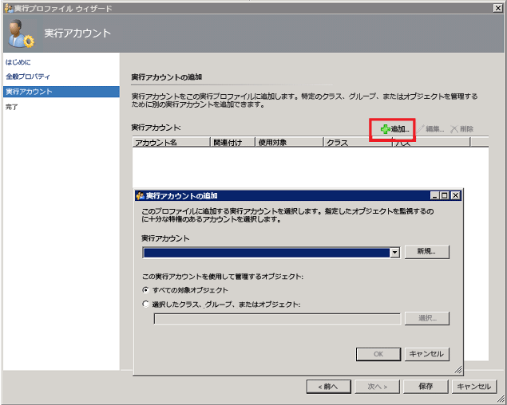
5. 管理するアカウントを設定するには、 **[選択したクラス、グループ、またはオブジェクト]** をクリックして、[オブジェクトの検索] ボックスを開きます。<br>  
   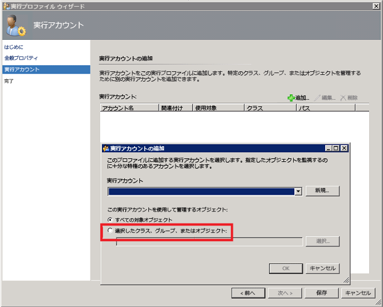
6. **Microsoft System Center Advisor Monitoring Server Group**を検索して選択します。<br>  
   ![[オブジェクトの検索] ボックスのイメージ](./media/log-analytics-proxy-firewall/proxy-proxyacct3.png)
7. **[OK]** をクリックして、[実行アカウントの追加] ボックスを閉じます。<br>  
   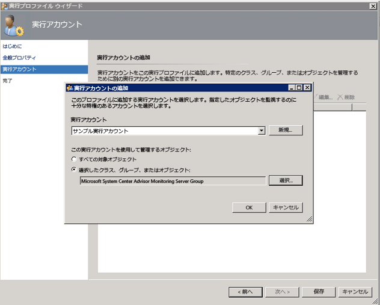
8. ウィザードを完了し、変更を保存します。<br>  
   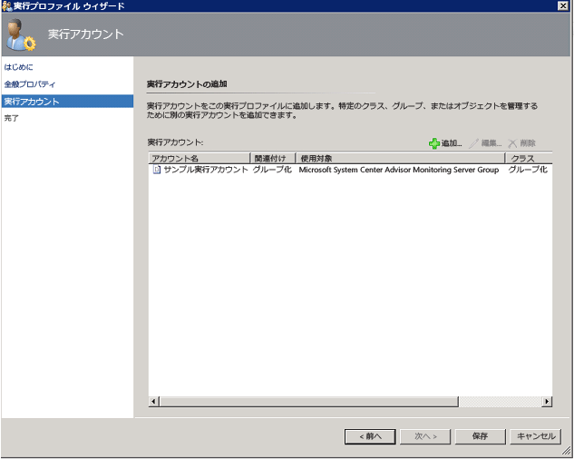

### <a name="to-validate-that-oms-management-packs-are-downloaded"></a>OMS の管理パックがダウンロードされることを確認するには
OMS にソリューションを追加した場合、ソリューションは Operations Manager コンソールの **[Administration]**(管理) で管理パックとして表示されます。 「 *System Center Advisor* 」と入力して検索すると、早く見つけることができます。<br>  
   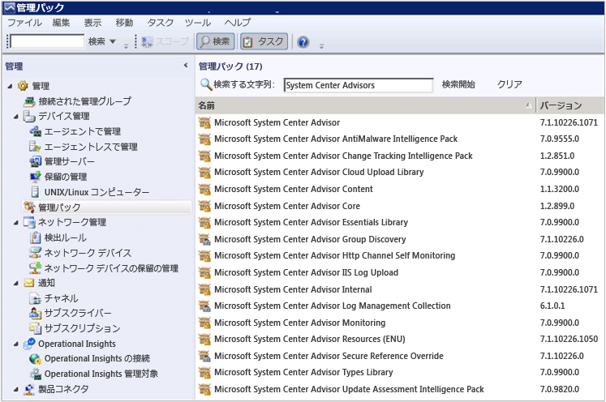  <br>  
また、Operations Manager 管理サーバーで次の Windows PowerShell コマンドを使用する方法でも、OMS の管理パックを確認できます。

   ```  
    Get-ScomManagementPack | where {$_.DisplayName -match 'Advisor'} | select Name,DisplayName,Version,KeyToken
   ```  

### <a name="to-validate-that-operations-manager-is-sending-data-to-the-oms-service"></a>Operations Manager が OMS サービスにデータを送信していることを確認するには
1. Operations Manager 管理サーバーで、パフォーマンス モニター (perfmon.exe) を開き、 **[Performance Monitor (パフォーマンス モニター)]**を選択します。
2. **[追加]** をクリックして、**[Health Service Management Groups]** を選択します。
3. **HTTP**から始まるすべてのカウンターを追加します。<br>  
   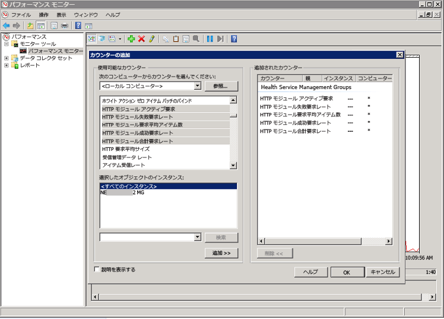
4. Operations Manager の構成が適切であれば、OMS と構成済みのログ収集ポリシーで追加した、管理パックに基づく Health Service Management カウンターのイベントやその他のデータ アイテムにおけるアクティビティが表示されます。<br>  
   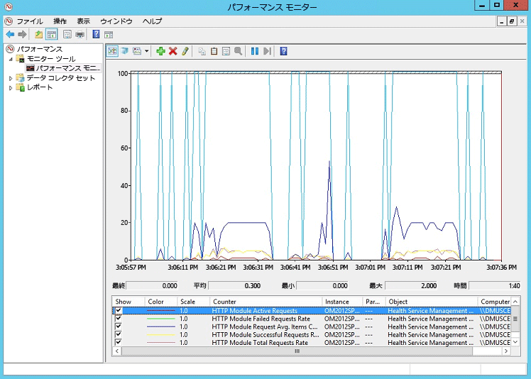

## <a name="next-steps"></a>次のステップ
* [ソリューション ギャラリーから Log Analytics ソリューションを追加する](log-analytics-add-solutions.md) 」を参照してください。
* [ログ検索](log-analytics-log-searches.md) について理解を深め、ソリューションによって収集された情報の詳細を確認します。

