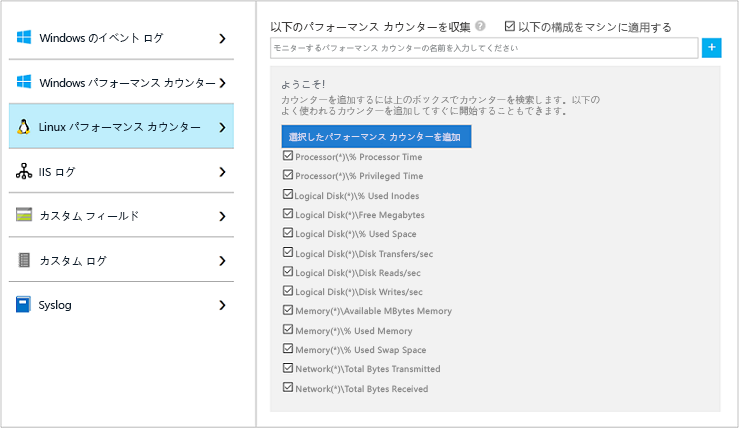
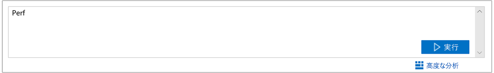
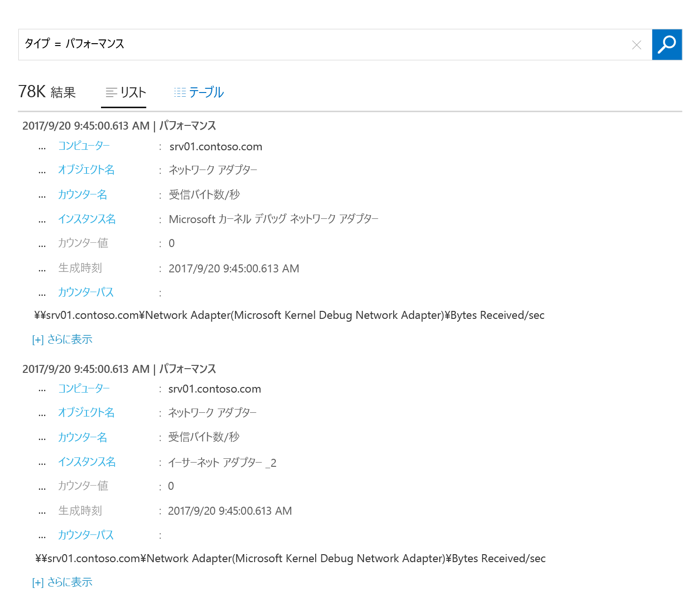

# Azure Virtual Machines に関するデータの収集
[Azure Log Analytics](log-analytics-overview.md) は、詳細な分析と相関のために、Azure Virtual Machines およびその他の環境内のリソースから直接データを 1 つのリポジトリに収集することができます。  このクイック スタートでは、いくつかの簡単な手順で、Azure Linux または Windows VM を構成し、データを収集する方法を示します。  
 
このクイック スタートでは、既存の Azure Virtual Machines があることを前提とします。 ない場合は、VM のクイック スタートに従って、[Windows VM を作成](../virtual-machines/windows/quick-create-portal.md)するか、[Linux VM を作成](../virtual-machines/linux/quick-create-cli.md)できます。

## Azure Portal へのログイン
Azure Portal ([https://portal.azure.com](https://portal.azure.com)) にログインします。 

## ワークスペースの作成
1. Azure Portal で、**[すべてのサービス]** をクリックします。 リソースの一覧で、「**Log Analytics**」と入力します。 入力を始めると、入力内容に基づいて、一覧がフィルター処理されます。 **[Log Analytics]** を選択します。

       

2. **[作成]** をクリックし、次の項目について選択します。

  * 新しい **OMS ワークスペース**の名前 (*DefaultLAWorkspace* など) を指定します。 
  * 関連付ける**サブスクリプション**をドロップダウン リストから選択します (既定値が適切でない場合)。
  * **[リソース グループ]** では、1 つ以上の Azure Virtual Machines を含む既存のリソース グループを選択します。  
  * VM のデプロイ先となる**場所**を選択します。  詳細については、[Log Analytics を使用できるリージョン](https://azure.microsoft.com/regions/services/)に関するページを参照してください。
  * 2018 年 4 月 2 日より後に作成された新しいサブスクリプションでワークスペースを作成した場合は、自動的に "*1 GB あたり*" の価格プランが使用され、価格レベルを選択するためのオプションは利用できなくなります。  4 月 2 日より前に作成された既存のサブスクリプションのワークスペースを作成している場合、または既存の EA 登録に関連付けられたサブスクリプションに対してワークスペースを作成している場合は、希望の価格レベルを選択します。  特定のレベルの詳細については、[Log Analytics の価格の詳細](https://azure.microsoft.com/pricing/details/log-analytics/)に関するページを参照してください。
  
         

3. **[OMS ワークスペース]** ウィンドウに必要な情報を入力したら、**[OK]** をクリックします。  

情報が検証され、ワークスペースが作成されている間、メニューの **[通知]** でその進行状況を追跡することができます。 

## Log Analytics VM 拡張機能を有効にする
Azure に既にデプロイされている Windows および Linux の仮想マシンでは、Log Analytics VM 拡張機能を使用して Log Analytics エージェントをインストールします。  この拡張機能を使用すると、インストール プロセスが簡略化され、指定した Log Analytics ワークスペースにデータを送信するようにエージェントが自動的に構成されます。 また、エージェントは自動的にアップグレードされるため、最新の機能と修正プログラムを利用できます。

>[!NOTE]
>Linux 用 OMS エージェントは、複数の Log Analytics ワークスペースにレポートするように構成することはできません。 

1. Azure Portal の左上隅にある **[すべてのサービス]** をクリックします。 リソースの一覧で、「**Log Analytics**」と入力します。 入力を始めると、入力内容に基づいて、一覧がフィルター処理されます。 **[Log Analytics]** を選択します。
2. Log Analytics ワークスペースの一覧で、前の手順で作成した *DefaultLAWorkspace* を選択します。
3. 左側のメニューの [ワークスペースのデータ ソース] で **[仮想マシン]** をクリックします。  
4. **[仮想マシン]** の一覧で、エージェントをインストールする仮想マシンを選択します。 VM の **OMS 接続の状態**が **[未接続]** になっていることに注意してください。
5. 仮想マシンの詳細で **[接続]** を選択します。 エージェントが自動的にインストールされ、Log Analytics のワークスペース用に構成されます。 このプロセスは数分かかります。その間、**[状態]** は **[接続中]** になります。
6. エージェントをインストールして接続した後、**OMS 接続の状態**は**このワークスペース**で更新されます。

## イベントとパフォーマンス データを収集する
Log Analytics は、イベントを Windows イベント ログまたは Linux Syslog から収集でき、長期分析およびレポートのために指定されたパフォーマンス カウンターからも収集できます。また、特定の条件が検出された場合はアクションを実行できます。  まず、以下の手順に従って、Windows システム ログと Linux Syslog、およびいくつかの一般的なパフォーマンス カウンターからのイベント収集を構成します。  

### Windows VM からのデータ収集
1. **[詳細設定]** を選択します。

    ![Log Analytics の [詳細設定]](media/log-analytics-quick-collect-azurevm/log-analytics-advanced-settings-01.png)

3. **[データ]** を選択してから、**[Windows イベント ログ]** を選択します。  
4. イベント ログを追加するには、ログの名前を入力します。  「**System**」と入力し、プラス記号 **+** をクリックします。  
5. テーブルで、重大度の **[エラー]** と **[警告]** のチェック ボックスをオンにします。   
6. ページの上部にある **[保存]** をクリックして構成を保存します。
7. **[Windows パフォーマンス データ]** を選択して、Windows コンピューターでのパフォーマンス カウンターの収集を有効にします。 
8. 新しい Log Analytics ワークスペースの Windows パフォーマンス カウンターを初めて構成する場合は、いくつかの一般的なカウンターをすばやく作成するためのオプションが表示されます。 それぞれのオプションの横には、チェック ボックスが表示されます。

    が必要です。

    **[選択したパフォーマンス カウンターを追加する]** をクリックします。  カウンターが追加され、10 秒間の収集サンプル間隔でプリセットされます。
  
9. ページの上部にある **[保存]** をクリックして構成を保存します。

### Linux VM からのデータ収集

1. **[Syslog]** を選択します。  
2. イベント ログを追加するには、ログの名前を入力します。  「**Syslog**」と入力し、プラス記号 **+** をクリックします。  
3. テーブルで、重大度の **[情報]**、**[通知]** および **[デバッグ]** の各チェック ボックスをオフにします。 
4. ページの上部にある **[保存]** をクリックして構成を保存します。
5. **[Linux パフォーマンス データ]** を選択して、Linux コンピューターでのパフォーマンス カウンターの収集を有効にします。 
6. 新しい Log Analytics ワークスペースの Linux パフォーマンス カウンターを初めて構成する場合は、いくつかの一般的なカウンターをすばやく作成するためのオプションが表示されます。 それぞれのオプションの横には、チェック ボックスが表示されます。

    が必要です。

    **[選択したパフォーマンス カウンターを追加する]** をクリックします。  カウンターが追加され、10 秒間の収集サンプル間隔でプリセットされます。  

7. ページの上部にある **[保存]** をクリックして構成を保存します。

## 収集されたデータを表示する
これでデータ収集は有効になりました。次は、簡単なログ検索の例を実行して、ターゲット VM のデータを表示してみましょう。  

1. Azure Portal で Log Analytics に移動し、前の手順で作成したワークスペースを選択します。
2. **[ログ検索]** タイルをクリックし、[ログ検索] ウィンドウのクエリ フィールドに「`Perf`」と入力してから Enter キーを押すか、クエリ フィールドの右側にある検索ボタンをクリックします。

     

たとえば、次の画像のクエリでは、735 個のパフォーマンス レコードが返されています。  実際の結果はかなり少なくなります。 

## リソースのクリーンアップ
不要になった場合は、Log Analytics ワークスペースを削除します。 そのためには、作成した Log Analytics ワークスペースを選択し、リソース ページで **[削除]** をクリックします。

## 次の手順
次は Windows または Linux の仮想マシンからオペレーションおよびパフォーマンス データを収集し、*無料*で収集するデータの調査と分析、およびデータに対するアクションの実行を簡単に開始することができます。  

データの表示および分析方法を学習する場合は、次のチュートリアルに進んでください。   

> [!div class="nextstepaction"]
> [Log Analytics でのデータの表示と分析](log-analytics-tutorial-viewdata.md)
