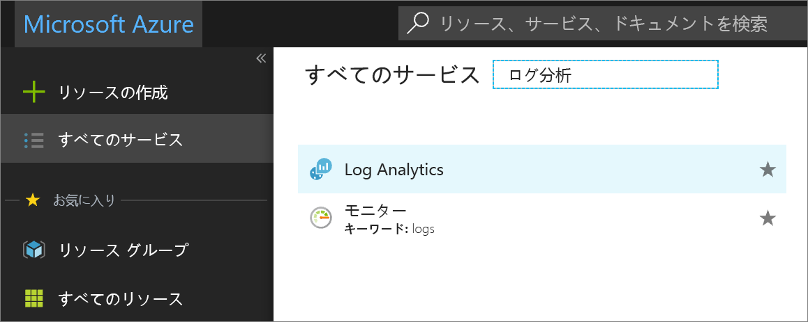
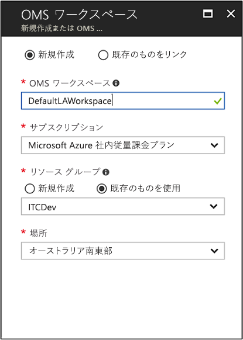
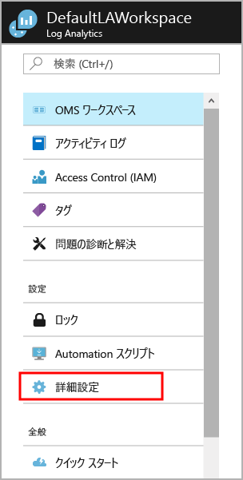
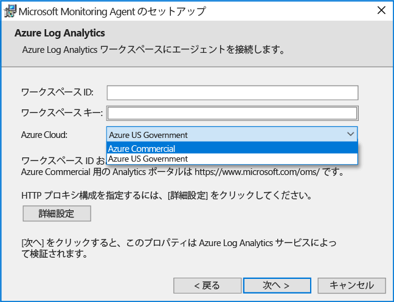
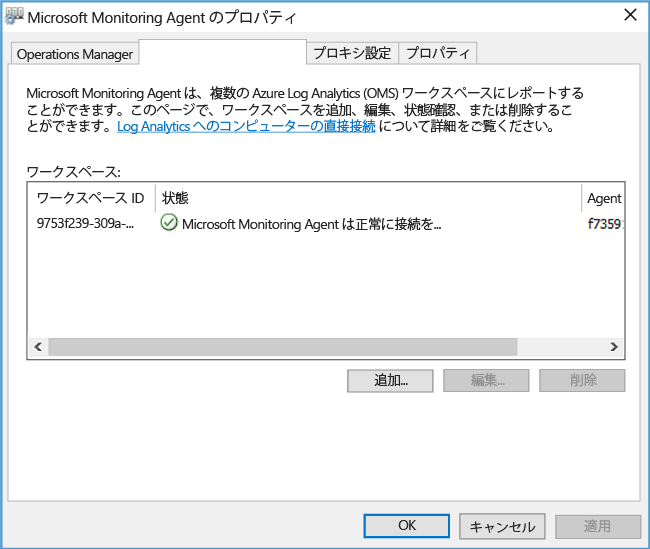
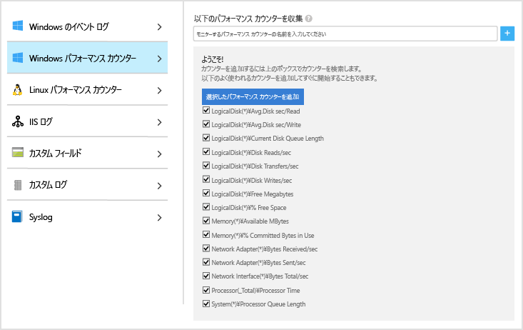
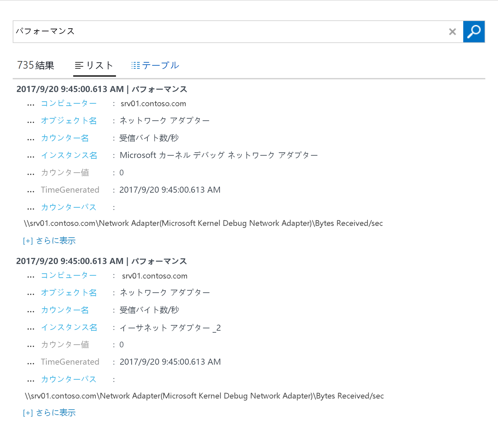
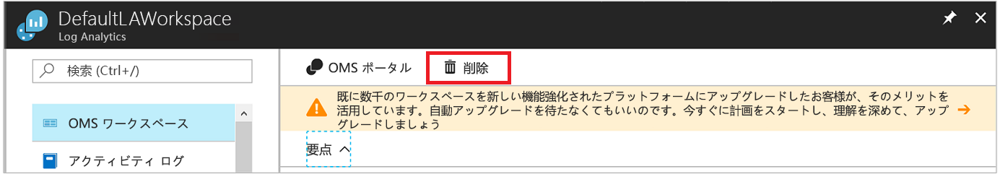

# ハイブリッド環境の Windows コンピューターを対象とした Log Analytics エージェントの構成
[Azure Log Analytics](log-analytics-overview.md) は、詳細な分析と相関のために、データセンターやその他のクラウド環境内の物理的または仮想的な Windows コンピューターから直接データを 1 つのリポジトリに収集することができます。  このクイック スタートでは、いくつかの簡単な手順で、Windows コンピューターを構成し、データを収集する方法を示します。  Azure Windows VM の場合は、「[Azure Virtual Machines に関するデータの収集](log-analytics-quick-collect-azurevm.md)」を参照してください。  

サポートされている構成を確認するには、「[サポートされている Windows オペレーティング システム](log-analytics-concept-hybrid.md#supported-windows-operating-systems)」と「[ネットワーク ファイアウォールの構成](log-analytics-concept-hybrid.md#network-firewall-requirements)」をご覧ください。
 
Azure サブスクリプションをお持ちでない場合は、開始する前に [無料アカウント](https://azure.microsoft.com/free/?WT.mc_id=A261C142F) を作成してください。

## Azure Portal へのログイン
Azure Portal ([https://portal.azure.com](https://portal.azure.com)) にログインします。 

## ワークスペースの作成
1. Azure Portal で、**[すべてのサービス]** をクリックします。 リソースの一覧で、「**Log Analytics**」と入力します。 入力を始めると、入力内容に基づいて、一覧がフィルター処理されます。 **[Log Analytics]** を選択します。       
2. **[作成]** をクリックし、次の項目について選択します。

  * 新しい **OMS ワークスペース**の名前 (*DefaultLAWorkspace* など) を指定します。 
  * 関連付ける**サブスクリプション**をドロップダウン リストから選択します (既定値が適切でない場合)。
  * **[リソース グループ]** では、1 つ以上の Azure Virtual Machines を含む既存のリソース グループを選択します。  
  * VM のデプロイ先となる**場所**を選択します。  詳細については、[Log Analytics を使用できるリージョン](https://azure.microsoft.com/regions/services/)に関するページを参照してください。  
  * 2018 年 4 月 2 日より後に作成された新しいサブスクリプションでワークスペースを作成した場合は、自動的に "*1 GB あたり*" の価格プランが使用され、価格レベルを選択するためのオプションは利用できなくなります。  4 月 2 日より前に作成された既存のサブスクリプションのワークスペースを作成している場合、または既存の EA 登録に関連付けられたサブスクリプションに対してワークスペースを作成している場合は、希望の価格レベルを選択します。  特定のレベルの詳細については、[Log Analytics の価格の詳細](https://azure.microsoft.com/pricing/details/log-analytics/)に関するページを参照してください。

           

3. **[OMS ワークスペース]** ウィンドウに必要な情報を入力したら、**[OK]** をクリックします。  

情報が検証され、ワークスペースが作成されている間、メニューの **[通知]** でその進行状況を追跡することができます。 

## ワークスペース ID とキーを取得する
Microsoft Monitoring Agent for Windows をインストールする前に、Log Analytics ワークスペースのワークスペース ID とキーが必要です。  この情報は、設定ウィザードがエージェントを適切に構成し、そのエージェントを Log Analytics と正常に通信できるようにするために必要です。  

1. Azure Portal の左上隅にある **[すべてのサービス]** をクリックします。 リソースの一覧で、「**Log Analytics**」と入力します。 入力を始めると、入力内容に基づいて、一覧がフィルター処理されます。 **[Log Analytics]** を選択します。
2. Log Analytics ワークスペースの一覧で、前の手順で作成した *DefaultLAWorkspace* を選択します。
3. **[詳細設定]** を選択します。       
4. **[接続されたソース]**、**[Windows サーバー]** の順に選択します。   
5. **[ワークスペース ID]** と **[主キー]** の右側に値が表示されます。 両方をコピーしてお使いのエディターに貼り付けます。   

## Windows 用エージェントをインストールする
次の手順に従って、コンピューターで Microsoft Monitoring Agent の設定を使用する Azure クラウドと Azure Government クラウドに Log Analytics のエージェントをインストールして構成します。  

1. **[Windows サーバー]** ページの **[Windows エージェントのダウンロード]** で、Windows オペレーティング システムのプロセッサ アーキテクチャに応じた適切なバージョンを選択します。
2. セットアップを実行して、コンピューターにエージェントをインストールします。
2. **[ようこそ]** ページで **[次へ]** をクリックします。
3. **[ライセンス条項]** ページの記述内容を確認し、**[同意する]** をクリックします。
4. **[インストール先フォルダー]** ページで、既定のインストール フォルダーを変更するか、変更せずに **[次へ]** をクリックします。
5. **[エージェントのセットアップ オプション]** ページで、エージェントを接続する Azure Log Analytics (OMS) をクリックし、**[次へ]** をクリックします。   
6. **[Azure Log Analytics]** ページで、次の手順を実行します。
   1. **[ワークスペース ID]** と **[ワークスペース キー (主キー)]** に、先ほどコピーした値を貼り付けます。  コンピューターが Azure Government クラウド内の Log Analytics ワークスペースに報告する必要がある場合は、**[Azure クラウド]** ドロップダウン リストから **[Azure US Government]** を選択します。  
   2. コンピューターがプロキシ サーバーを介して Log Analytics サービスと通信する必要がある場合は、**[詳細]** をクリックし、プロキシ サーバーの URL とポート番号を指定します。  プロキシ サーバーで認証が必要な場合には、プロキシ サーバーにアクセスするためのユーザー名とパスワードを入力し、**[次へ]** をクリックします。  
7. 必要な構成設定をしたら、**[次へ]** をクリックします。     
8. **[インストールの準備完了]** ページで、設定内容を確認し、**[インストール]** をクリックします。
9. **[構成は正常に終了しました]** ページで **[完了]** をクリックします。

完了すると、**コントロール パネル**に **Microsoft Monitoring Agent** が表示されます。 構成を検証して、エージェントが Log Analytics に接続されていることを確認できます。 接続されていれば、**[Azure Log Analytics (OMS)]** タブに、エージェントにより、**Microsoft Monitoring Agent が Microsoft Operations Management Suite サービスに正常に接続している**ことを示すメッセージが表示されます。   

## イベントとパフォーマンス データを収集する
Log Analytics は、イベントを Windows イベント ログから収集でき、長期分析およびレポートのために指定されたパフォーマンス カウンターからも収集できます。また、特定の条件が検出された場合はアクションを実行できます。  以下の手順に従って、Windows イベント ログと、手始めとしていくつかの一般的なパフォーマンス カウンターからのイベントの収集を構成します。  

1. Azure ポータルで、左下隅にある **[その他のサービス]** をクリックします。 リソースの一覧で、「**Log Analytics**」と入力します。 入力を始めると、入力内容に基づいて、一覧がフィルター処理されます。 **[Log Analytics]** を選択します。
2. **[詳細設定]** を選択します。      
3. **[データ]** を選択してから、**[Windows イベント ログ]** を選択します。  
4. イベント ログを追加するには、ログの名前を入力します。  「**System**」と入力し、プラス記号 **+** をクリックします。  
5. テーブルで、重大度の **[エラー]** と **[警告]** のチェック ボックスをオンにします。   
6. ページの上部にある **[保存]** をクリックして構成を保存します。
7. **[Windows パフォーマンス データ]** を選択して、Windows コンピューターでのパフォーマンス カウンターの収集を有効にします。 
8. 新しい Log Analytics ワークスペースの Windows パフォーマンス カウンターを初めて構成する場合は、いくつかの一般的なカウンターをすばやく作成するためのオプションが表示されます。 それぞれのオプションの横には、チェック ボックスが表示されます。  。  **[選択したパフォーマンス カウンターを追加する]** をクリックします。  カウンターが追加され、10 秒間の収集サンプル間隔でプリセットされます。  
9. ページの上部にある **[保存]** をクリックして構成を保存します。

## 収集されたデータを表示する
これでデータ収集は有効になりました。次は、簡単なログ検索の例を実行して、ターゲット コンピューターのデータを表示してみましょう。  

1. Azure ポータルで、選択したワークスペースの **[ログ検索]** タイルをクリックします。  
2. [ログ検索] ウィンドウのクエリ フィールドに「`Perf`」と入力し、Enter キーを押すか、クエリ フィールドの右側にある検索ボタンをクリックします。      たとえば、次の画像のクエリでは、735 個のパフォーマンス レコードが返されています。   

## リソースのクリーンアップ
エージェントが不要になったら、Windows コンピューターから削除し、Log Analytics ワークスペースを削除できます。  

エージェントを削除するには、次の手順を実行します。

1. **[コントロール パネル]** を開きます。
2. **[プログラムと機能]** を開きます。
3. **[プログラムと機能]** で、**[Microsoft Monitoring Agent]** をクリックし、**[アンインストール]** をクリックします。

ワークスペースを削除するには、作成した Log Analytics ワークスペースを選択し、リソース ページで **[削除]** をクリックします。   

## 次の手順
これでオンプレミスの Linux コンピューターからオペレーション データとパフォーマンス データが収集されているので、収集したデータの調査と分析、およびデータに対するアクションの実行を*無料*で簡単に開始することができます。  

データの表示および分析方法を学習する場合は、次のチュートリアルに進んでください。   

> [!div class="nextstepaction"]
> [Log Analytics でのデータの表示と分析](log-analytics-tutorial-viewdata.md)
