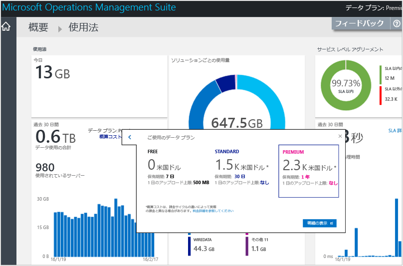
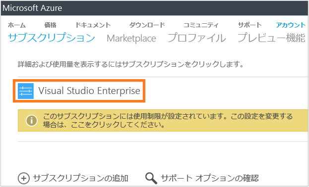
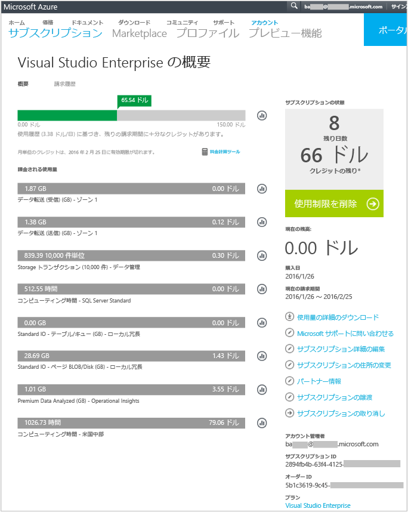
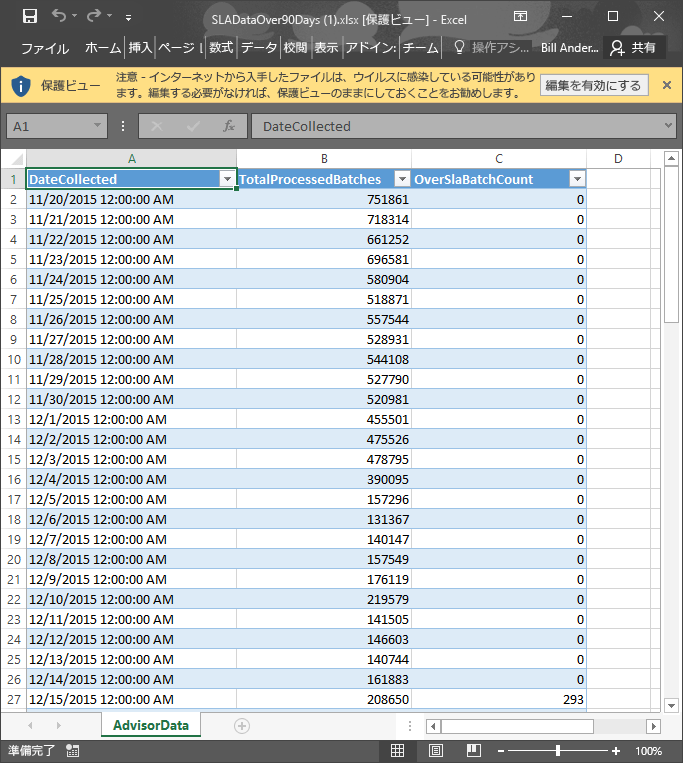

<properties
    pageTitle="Log Analytics でのデータ使用状況の分析 | Microsoft Azure"
    description="OMS サービスに送信されているデータの量は、Log Analytics の [使用量] ページで確認できます。"
    services="log-analytics"
    documentationCenter=""
    authors="bandersmsft"
    manager="jwhit"
    editor=""/>

<tags
    ms.service="log-analytics"
    ms.workload="na"
    ms.tgt_pltfrm="na"
    ms.devlang="na"
    ms.topic="get-started-article"
    ms.date="08/11/2016"
    ms.author="banders"/>

# Log Analytics でのデータ使用状況の分析

Operations Management Suite (OMS) の Log Analytics は、データを収集して OMS サービスに定期的に送信します。  OMS サービスに送信されているデータの量は、 **[使用量]** ページで確認できます。 **[使用量]** ページには、ソリューションから 1 日に送信されているデータの量や、サーバーからデータが送信される頻度も表示されます。

>[AZURE.NOTE] [OMS の Web サイト](http://www.microsoft.com/oms)を使用して無料のアカウントを作成した場合、OMS サービスに送信できるデータの上限は、1 日あたり 500 MB です。 1 日の上限に達した場合、データの分析は停止し、翌日の初めに再開されます。 また、OMS によって受け付けられなかったデータや処理されなかったデータは再送する必要があります。

使用量を表示するには、OMS の **[概要]** ダッシュボードにある **[使用量]** タイルを使用します。

![[使用量] タイル](./media/log-analytics-usage/usage-tile.png)

1 日あたりの使用量の上限を超えたか、上限に近づいている場合、必要に応じてソリューションを削除し、OMS サービスに送信されるデータの量を減らすことができます。 ソリューションの削除の詳細については、「 [Add Log Analytics solutions from the Solutions Gallery](log-analytics-add-solutions.md)」 (ソリューション ギャラリーから Log Analytics ソリューションを追加する) を参照してください。

![[使用量] ダッシュボード](./media/log-analytics-usage/usage-dashboard.png)

**[使用量]** ページには、次の情報が表示されます。

- 1 日あたりの平均使用量
- 過去 30 日間の各ソリューションのデータ使用量
- 過去 30 日間に環境内のサーバーが OMS サービスにデータを送信した量
- データ プランの価格レベルと概算コスト
- サービス レベル アグリーメント (SLA) に関する情報 (OMS によるデータの処理にかかる時間など)

## 使用量データを扱うには

1. **[概要]** ページの **[使用量]** タイルをクリックします。
2. **[使用量]** ページで、関心のある使用量カテゴリを確認します。
3. 日別のアップロード クォータのうち、あまりにも多くの割合を占めるソリューションがある場合は、そのソリューションを削除することをお勧めします。

## 概算コストと課金情報を表示するには
1. **[概要]** ページの **[使用量]** タイルをクリックします。
2. **[使用量]** の下の **[使用量]** ページで、**[推定コスト]** の横にある不等号 (**>**) をクリックします。
3. 展開済みの **[Your data plan]** (お客様のデータ プラン) の詳細で、毎月の概算コストを確認できます。  
    
4. 課金情報を確認するには、 **[明細の表示]** をクリックしてサブスクリプション情報を表示します。
    - [サブスクリプション] ページで、サブスクリプションをクリックして使用状況の詳細と明細項目一覧を確認します。  
        
    - サブスクリプションの [概要] ページで、サブスクリプションに関する詳細情報を管理および表示するさまざまなタスクを実行できます。  
        

## SLA のデータ バッチを表示するには
1. **[概要]** ページの **[使用量]** タイルをクリックします。
2. **[サービス レベル アグリーメント]** で、**[SLA の詳細をダウンロード]** をクリックします。
3. Excel の XLSX ファイルがダウンロードされ、そこで内容を確認できます。  
    

## 次のステップ

- [Log Analytics でのログ検索](log-analytics-log-searches.md) を参照し、ソリューションによって収集された情報の詳細を確認します。

<!--HONumber=Oct16_HO2-->

