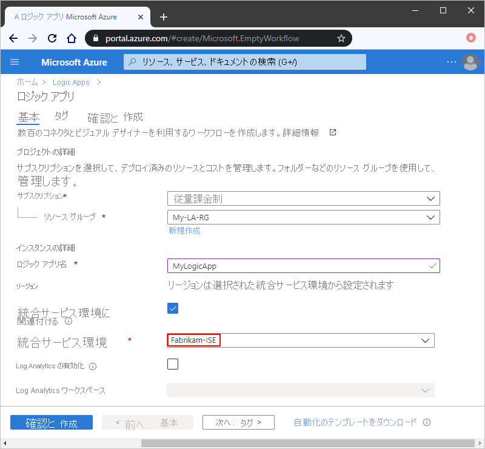

# 統合サービス環境 (ISE) を使用して、Azure Logic Apps から Azure Virtual Network リソースにアクセスする

場合によっては、ご利用のロジック アプリと統合アカウントで、[Azure 仮想ネットワーク](../virtual-network/virtual-networks-overview.md)内の仮想マシン (VM) や他のシステムまたはサービスなど、セキュリティで保護されたリソースにアクセスする必要が生じます。 このアクセスを設定するために、["*統合サービス環境*" (ISE) を作成して](../logic-apps/connect-virtual-network-vnet-isolated-environment.md)、そこで自分のロジック アプリを実行したり統合アカウントを作成したりすることができます。

ISE を作成すると、Azure は Logic Apps サービスの分離したプライベート インスタンスを Azure 仮想ネットワークにデプロイします。 このプライベート インスタンスは、ストレージなどの専用のリソースを使用し、パブリックで "グローバル" な Logic Apps サービスとは別に実行されます。 分離したプライベート インスタンスとパブリック グローバル インスタンスを分けることで、他の Azure テナントが自分のアプリのパフォーマンスに与える可能性がある影響 (["うるさい隣人" エフェクト](https://en.wikipedia.org/wiki/Cloud_computing_issues#Performance_interference_and_noisy_neighbors)とも呼ばれる) を減らすことができます。

ISE の作成後は、ロジック アプリや統合アカウントを作成するときに、以下のように ISE をロジック アプリまたは統合アカウントの場所として選択することができます。

これで、ロジック アプリは、以下のいずれかの項目を使用して、仮想ネットワーク内のシステム、または仮想ネットワークに接続されているシステムに直接アクセスできるようになりました。

* **ISE** とラベル付けされた、そのシステム (例: SQL Server) のコネクタ
* **Core** とラベル付けされた組み込みトリガーまたは組み込みアクション (例: HTTP トリガーまたは HTTP アクション)
* カスタム コネクタ

この概要では、ISE によってロジック アプリと統合アカウントに Azure 仮想ネットワークへの直接アクセスが提供される方法を詳しく説明し、ISE とグローバルな Logic Apps サービスとの違いを比較します。

> [!NOTE]
> ISE 内で実行されるロジック アプリ、組み込みトリガー、組み込みアクション、およびコネクターでは、使用量ベースの価格プランとは異なる価格プランが使用されます。 詳細については、「[Logic Apps の価格](../logic-apps/logic-apps-pricing.md)」をご覧ください。 また、ISE では、実行継続時間、ストレージのリテンション期間、スループット、HTTP の要求と応答のタイムアウト、メッセージのサイズ、およびカスタム コネクタの要求の上限も引き上げられました。 詳細については、[Azure Logic Apps の制限と構成](logic-apps-limits-and-config.md)に関するページを参照してください。

## 分離とグローバル

Azure で統合サービス環境 (ISE) を作成するときは、ISE を "*挿入*" する Azure 仮想ネットワークを選択することができます。 それにより、Azure は、Logic Apps サービスのプライベート インスタンスを仮想ネットワークに挿入、またはデプロイします。 このアクションにより、専用リソースでロジック アプリを作成して実行できる分離環境が作成されます。 ロジック アプリを作成するときにアプリの場所として ISE を選択すると、ロジック アプリは仮想ネットワークとそのネットワーク内のリソースに直接アクセスできるようになります。

ISE のロジック アプリはグローバルな Logic Apps サービスとユーザー操作が同じで、同様の機能を提供しています。 グローバルな Logic Apps サービスで同じ組み込みトリガー、組み込みアクション、コネクタを使用できるだけでなく、ISE 固有のコネクタも使用できます。 たとえば、次のような標準コネクタでは ISE で動作するバージョンが提供されています。

* Azure Blob Storage、Azure File Storage、Azure Table Storage
* Azure キュー、Azure Service Bus、Azure Event Hubs、IBM MQ
* FTP、SFTP-SSH
* SQL Server、SQL Data Warehouse、Azure Cosmos DB
* AS2、X12、EDIFACT

ISE と ISE 以外のコネクタには、トリガーとアクションが実行される場所に違いがあります。

* ISE では、HTTP などの組み込みトリガーおよび組み込みアクションは、常にロジック アプリと同じ ISE 内で実行され、**Core** のラベルが表示されます。

  

* ISE 内で実行されるコネクタには、グローバルな Logic Apps サービスで使用可能な、パブリックにホストされるバージョンがあります。 2 つのバージョンが提供されているコネクタの場合、**ISE** のラベルがあるコネクタは、常に、ご利用のロジック アプリと同じ ISE で動作します。 **ISE** ラベルがないコネクタはグローバルな Logic Apps サービスで実行されます。

  

また、ISE では、実行継続時間、ストレージのリテンション期間、スループット、HTTP の要求と応答のタイムアウト、メッセージのサイズ、およびカスタム コネクタの要求の上限も引き上げられます。 詳細については、[Azure Logic Apps の制限と構成](logic-apps-limits-and-config.md)に関するページを参照してください。

### オンプレミス データ ソースにアクセスする

Azure 仮想ネットワークに接続されているオンプレミス システムの場合は、ロジック アプリからそのシステムに直接アクセスできるように、次の項目のいずれかを使用してそのネットワークに ISE を挿入します。

* そのシステム (例: SQL Server) の ISE バージョンのコネクタ
* HTTP アクション
* カスタム コネクタ

  * オンプレミス データ ゲートウェイを必要とするカスタム コネクタを ISE の外部で作成した場合は、ISE 内のロジック アプリでもそれらのコネクタを使用できます。
  
  * ISE 内で作成されたカスタム コネクタは、オンプレミス データ ゲートウェイでは動作しません。 ただし、これらのコネクタでは、ISE をホストしている仮想ネットワークに接続されているオンプレミス データ ソースに直接アクセスできます。 そのため、ISE 内のロジック アプリでは、ほとんどの場合、それらのリソースと通信するときにデータ ゲートウェイは不要です。

仮想ネットワークに接続されていない、または ISE バージョンのコネクタがないオンプレミス システムの場合は、ロジック アプリからこれらのシステムに接続する前に、まず[オンプレミスのデータ ゲートウェイを設定する](../logic-apps/logic-apps-gateway-install.md)必要があります。

## ISE での統合アカウント

統合サービス環境 (ISE) の内部のロジック アプリで統合アカウントを使用できます。 ただし、これらの統合アカウントでは、リンクされているロジック アプリと "*同じ ISE*" を使用する必要があります。 ISE のロジック アプリは、同じ ISE にある統合アカウントのみを参照できます。 統合アカウントを作成すると、ご利用の統合アカウントの場所として、自分の ISE を選択できます。

## 次の手順

* [分離されたロジック アプリから Azure Virtual Network に接続する](../logic-apps/connect-virtual-network-vnet-isolated-environment.md)方法を理解する
* [Azure Virtual Network](../virtual-network/virtual-networks-overview.md) の詳細を理解する
* [Azure サービスの仮想ネットワーク統合](../virtual-network/virtual-network-for-azure-services.md)について理解する
