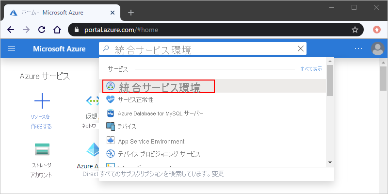
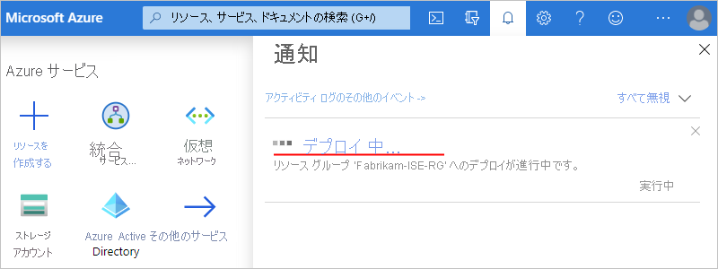

# 統合サービス環境 (ISE) を介して Azure Logic Apps から Azure Virtual Network に接続する

> [!NOTE]
> この機能は*プライベート プレビュー*段階です。 アクセスを要求するには、[参加要求をここで作成](https://aka.ms/iseprivatepreview)します。

ロジック アプリと統合アカウントが [Azure 仮想ネットワーク](../virtual-network/virtual-networks-overview.md)にアクセスする必要があるシナリオでは、"[*統合サービス環境*" (ISE)](../logic-apps/connect-virtual-network-vnet-isolated-environment-overview.md) を作成します。 ISE は、専用のストレージと、パブリックまたは "*グローバル*" の Logic Apps サービスとは別に保存されている他のリソースを使用するプライベートな分離環境です。 この分離で、他の Azure テナントがご利用のアプリのパフォーマンスに与える可能性がある影響も軽減されます。 ISE が Azure 仮想ネットワークに "*挿入*" され、Logic Apps サービスが仮想ネットワークにデプロイされます。 ロジック アプリまたは統合アカウントを作成するときに、この ISE を場所として選択します。 ロジック アプリまたは統合アカウントは、仮想ネットワーク内の仮想マシン (VM)、サーバー、システム、サービスなどのリソースに直接アクセスできます。 

この記事では、次のタスクの実行方法について説明します。

* プライベートな Logic Apps インスタンスが仮想ネットワークにアクセスできるように、Azure 仮想ネットワークに対するアクセス許可を設定します。

* 統合サービス環境 (ISE) を作成します。 

* ISE で実行できるロジック アプリを作成します。 

* ISE のロジック アプリ用に統合アカウントを作成します。

統合サービス環境の詳細については、[Azure Logic Apps から Azure Virtual Network リソースにアクセスする方法](../logic-apps/connect-virtual-network-vnet-isolated-environment-overview.md)に関する記事を参照してください。

## 前提条件

* Azure サブスクリプション。 Azure サブスクリプションがない場合は、<a href="https://azure.microsoft.com/free/" target="_blank">無料の Azure アカウントにサインアップ</a>してください。 

* [Azure 仮想ネットワーク](../virtual-network/virtual-networks-overview.md)。 仮想ネットワークがない場合は、[Azure 仮想ネットワークの作成](../virtual-network/quick-create-portal.md)方法について学んでください。 

* ロジック アプリに Azure 仮想ネットワークへの直接アクセスを許可するには、Logic Apps サービスに仮想ネットワークにアクセスするアクセス許可が付与されるように、[ロールベースのアクセス制御 (RBAC) アクセス許可を設定](#vnet-access)します。 

* [ロジック アプリの作成方法](../logic-apps/quickstart-create-first-logic-app-workflow.md)に関する基本的な知識

## 仮想ネットワークのアクセス許可を設定する

統合サービス環境 (ISE) を作成する場合、ご利用の環境を "*挿入する*" 場所として Azure 仮想ネットワークを選択することができます。 ただし、環境を挿入する仮想ネットワークを選択する前に、仮想ネットワークでロールベースのアクセス制御 (RBAC) のアクセス許可を設定する必要があります。 アクセス許可を設定するには、これらの特定のロールを Azure Logic Apps サービスに割り当てます。

1. [Azure portal](https://portal.azure.com) で、仮想ネットワークを探して選択します。 

1. 仮想ネットワークのメニューで **[アクセス制御 (IAM)]** を選択します。 

1. **[アクセス制御 (IAM)]** の **[ロール割り当ての追加]** を選択します。 

   

1. **[ロール割り当ての追加]** ウィンドウで、説明に従って必要なロールを Azure Logic Apps サービスに追加します。 

   1. **[ロール]** で **[ネットワーク共同作成者]** を選択します。 
   
   1. **[アクセスの割り当て先]** で **[Azure AD user, group, or service principal]\(Azure AD のユーザー、グループ、またはサービス プリンシパル\)** を選択します。

   1. **[選択]** に「**Azure Logic Apps**」と入力します。 

   1. メンバー一覧が表示されたら、**[Azure Logic Apps]** を選択します。 

      > [!TIP]
      > このサービスが見つからない場合は、Logic Apps サービスのアプリ ID `7cd684f4-8a78-49b0-91ec-6a35d38739ba` を入力します。 
   
   1. 完了したら、**[保存]** を選択します。

   例: 

   

詳細については、[仮想ネットワーク アクセスのアクセス許可](../logic-apps/connect-virtual-network-vnet-isolated-environment-overview.md)に関する記事を参照してください。

## ISE を作成する

統合サービス環境 (ISE) を作成するには、次の手順を実行します。

1. [Azure portal](https://portal.azure.com) の Azure メイン メニューで、**[リソースの作成]** を選択します。

   

1. 検索ボックスに、フィルターとして「統合サービス環境」と入力します。
結果リストで **[統合サービス環境 (プレビュー)]** を選択し、**[作成]** を選択します。

   ![[統合サービス環境] を選択する](./media/connect-virtual-network-vnet-isolated-environment/select-integration-service-environment.png)

   ![[作成] を選択する](./media/connect-virtual-network-vnet-isolated-environment/create-integration-service-environment.png)

1. 次の例のように、環境について次の詳細を指定してから **[確認と作成]** を選択します。

   

   | プロパティ | 必須 | 値 | 説明 |
   |----------|----------|-------|-------------|
   | **サブスクリプション** | [はい] | <*Azure サブスクリプション名*> | 環境に使用する Azure サブスクリプション | 
   | **[リソース グループ]** | [はい] | <*Azure-resource-group-name*> | 環境を作成する Azure リソース グループ |
   | **統合サービス環境の名前** | [はい] | <*environment-name*> | 環境を示す名前 | 
   | **場所** | [はい] | <*Azure-datacenter-region*> | 環境をデプロイする Azure データセンター リージョン | 
   | **Capacity** | [はい] | 0、1、2、3 | この ISE に使用する処理ユニットの数 | 
   | **Virtual Network** | [はい] | <*Azure-virtual-network-name*> | 環境内のロジック アプリが仮想ネットワークにアクセスできるように、その環境を挿入する Azure 仮想ネットワーク。 ネットワークがない場合は、ここで作成することができます。 
**重要**:ISE を作成するときに "*のみ*"、この挿入を実行することができます。 ただし、この関係を作成する前に、必ず [Azure Logic Apps 用に仮想ネットワークにロールベースのアクセス制御を設定しておきます](#vnet-access)。 | 
   | **サブネット** | [はい] | <*IP-address-range*> | ISE には 4 つの "*空の*" サブネットが必要です。 これらのサブネットはどのサービスにも委任されず、環境内にリソースを作成するために使用されます。 環境の作成後に、これらの IP 範囲を "*変更することはできません*"。 

各サブネットを作成するには、[この表の下の手順に従います](#create-subnet)。 各サブネットは、次の基準を満たしている必要があります。 
- 選択した仮想ネットワークと同じアドレス範囲内にも、仮想ネットワークが接続されている他のプライベート IP アドレスにも存在していない。  - 数字やハイフンで始まらない名前を使用する。  - [Classless Inter-Domain Routing (CIDR) 形式](https://en.wikipedia.org/wiki/Classless_Inter-Domain_Routing)を使用する。  - クラス B アドレス空間を必要とする。  - `/27` を含める。 たとえば、`10.0.0.0/27`、`10.0.0.32/27`、`10.0.0.64/27`、`10.0.0.96/27` のように 32 ビット アドレスの範囲を各サブネットに指定します。  - 必ず空にする。 |
   |||||

   

   **サブネットを作成する**

   1. **[サブネット]** 一覧で **[サブネット構成の管理]** を選択します。

      

   1. **[サブネット]** ウィンドウで **[サブネット]** を選択します。

      

   1. **[サブネットの追加]** ウィンドウで次の情報を指定します。

      * **名前**:サブネットの名前
      * **アドレス範囲 (CIDR ブロック)**:仮想ネットワークのサブネットの範囲 (CIDR 形式)

      

   1. 完了したら、**[OK]** を選びます。

   1. さらに 3 つのサブネットについてこれらの手順を繰り返します。

1. Azure で ISE 情報の検証が正常に完了したら、次の例のように **[作成]** を選択します。

   ![検証が完了したら [作成] を選択します](./media/connect-virtual-network-vnet-isolated-environment/ise-validation-success.png)

   Azure で環境のデプロイが開始されますが、このプロセスが完了するまでに最長 2 時間かかる "*可能性があります*"。 
   展開の状態を確認するには、Azure ツールバーで通知アイコンを選択します。これで通知ウィンドウが開きます。

   

   デプロイが正常に完了すると、Azure に次の通知が表示されます。

   

   > [!NOTE]
   > デプロイが失敗するか、ISE を削除した場合、サブネットがリリースされるまでに最長 1 時間かかる "*可能性があります*"。 そのため、状況に応じて、このようなサブネットを他の ISE で再利用できるようになるまで待つ必要があります。

1. 展開の完了後に Azure で環境が自動的に表示されない場合は、環境を表示するために **[リソースに移動]** を選択します。  

## ロジック アプリを作成する - ISE

統合サービス環境 (ISE) を使用するロジック アプリを作成するには、[ロジック アプリの作成方法](../logic-apps/quickstart-create-first-logic-app-workflow.md)に関するページに記載されている手順に従いますが、次の違いがあります。 

* ロジック アプリを作成したら、次の例のように **[場所]** プロパティの **[統合サービス環境]** セクションから使用する ISE を選択します。

  

* HTTP など、同じ組み込みトリガーとアクションを使用できます。これらは、ロジック アプリと同じ ISE 内で動作します。 **ISE** ラベルがあるコネクタも、ロジック アプリと同じ ISE 内で動作します。 **ISE** ラベルがないコネクタはグローバルな Logic Apps サービスで実行されます。

  

* Azure 仮想ネットワークに ISE を挿入した後は、ISE のロジック アプリからその仮想ネットワーク内のリソースに直接アクセスできます。 仮想ネットワークに接続されているオンプレミス システムの場合は、そのネットワークに ISE を挿入し、次のいずれかの項目を使用することで、ロジック アプリからそれらのシステムに直接アクセスできるようになります。 

  * そのシステムの ISE コネクタ (SQL Server など)
  
  * HTTP アクション 
  
  * カスタム コネクタ

  仮想ネットワーク内にない、または ISE コネクタがないオンプレミス システムの場合は、まず[オンプレミスのデータ ゲートウェイを設定します](../logic-apps/logic-apps-gateway-install.md)。

## 統合アカウントを作成する - ISE

統合サービス環境 (ISE) でロジック アプリに統合アカウントを使用するには、その統合アカウントでロジック アプリと*同じ環境*を使用する必要があります。 ISE のロジック アプリは、同じ ISE 内の統合アカウントのみを参照できます。 

ISE を使用する統合アカウントを作成するには、[統合アカウントの作成方法](../logic-apps/logic-apps-enterprise-integration-create-integration-account.md)に関する記事の手順を実行します。ただし、**[統合サービス環境]** セクションが表示されるようになった **[場所]** プロパティを除きます。 次の例のように、リージョンではなく ISE を選択します。

## サポートを受ける

* 質問がある場合は、<a href="https://social.msdn.microsoft.com/Forums/en-US/home?forum=azurelogicapps" target="_blank">Azure Logic Apps フォーラム</a>にアクセスしてください。
* 機能のアイデアについて投稿や投票を行うには、<a href="https://aka.ms/logicapps-wish" target="_blank">Logic Apps のユーザー フィードバック サイト</a>にアクセスしてください。

## 次の手順

* [Azure Virtual Network](../virtual-network/virtual-networks-overview.md) の詳細を理解する
* [Azure サービスの仮想ネットワーク統合](../virtual-network/virtual-network-for-azure-services.md)について理解する
