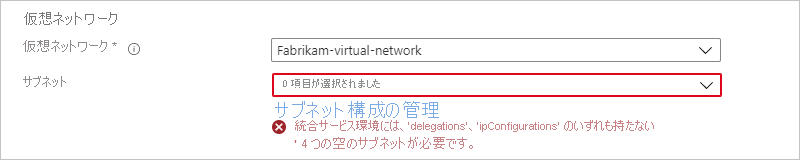
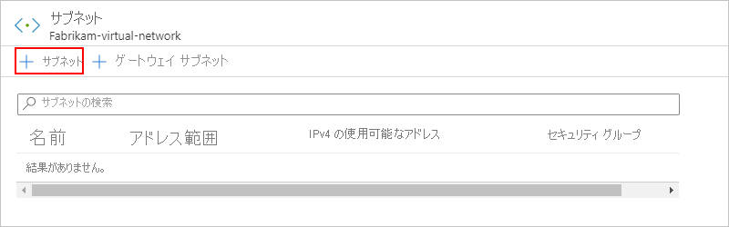
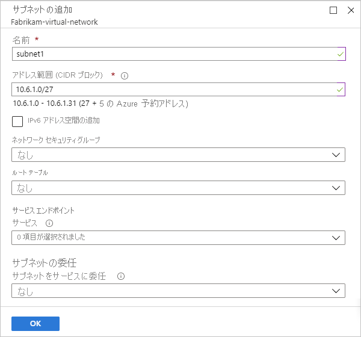
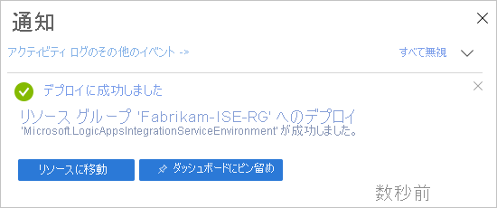

# 統合サービス環境 (ISE) を使用して Azure Logic Apps から Azure Virtual Network に接続する

ロジック アプリと統合アカウントが [Azure 仮想ネットワーク](../virtual-network/virtual-networks-overview.md)にアクセスする必要があるシナリオでは、"[*統合サービス環境*" (ISE)](../logic-apps/connect-virtual-network-vnet-isolated-environment-overview.md) を作成します。 ISE は、専用のストレージなど、"グローバル" なマルチテナント Logic Apps サービスとは別に確保されているリソースを使用する分離環境です。 この分離で、他の Azure テナントがご利用のアプリのパフォーマンスに与える可能性がある影響も軽減されます。 ISE には、独自の静的 IP アドレスも用意されています。 これらの IP アドレスは、パブリックのマルチテナント サービスのロジック アプリによって共有される静的 IP アドレスとは別のものです。

ISE を作成すると、Azure によってその ISE が Azure 仮想ネットワークに "*挿入*" され、その仮想ネットワークに Logic Apps サービスがデプロイされます。 ロジック アプリまたは統合アカウントを作成するときに、お使いの ISE を場所として選択します。 ロジック アプリまたは統合アカウントは、仮想ネットワーク内の仮想マシン (VM)、サーバー、システム、サービスなどのリソースに直接アクセスできます。

> [!IMPORTANT]
> ISE でロジック アプリと統合アカウントを連携させるには、両方とも "*同じ ISE*" を場所として使用する必要があります。

ISE では、実行継続時間、ストレージのリテンション期間、スループット、HTTP の要求と応答のタイムアウト、メッセージのサイズ、およびカスタム コネクタの要求の上限が引き上げられました。 詳細については、[Azure Logic Apps の制限と構成](../logic-apps/logic-apps-limits-and-config.md)に関するページを参照してください。 ISE の詳細については、[Azure Logic Apps から Azure Virtual Network リソースへのアクセス](../logic-apps/connect-virtual-network-vnet-isolated-environment-overview.md)に関する記事を参照してください。

この記事では、Azure Portal を使ってこれらのタスクを完了する方法について説明します。

* ISE のアクセスを有効にします。
* ISE を作成します。
* ISE に容量を追加します。

カスタマー マネージド キーの設定も含め、ISE は、[サンプル Azure Resource Manager クイックスタート テンプレート](https://github.com/Azure/azure-quickstart-templates/tree/master/201-integration-service-environment)を使用するか、Logic Apps REST API を使用して作成することもできます。

* [Logic Apps REST API を使用して統合サービス環境 (ISE) を作成する](../logic-apps/create-integration-service-environment-rest-api.md)
* [ISE の保存データを暗号化するためにカスタマー マネージド キーを設定する](../logic-apps/customer-managed-keys-integration-service-environment.md)

## 前提条件

* Azure サブスクリプション。 Azure サブスクリプションがない場合は、[無料の Azure アカウントにサインアップ](https://azure.microsoft.com/free/)してください。

  > [!IMPORTANT]
  > ISE 内で実行されるロジック アプリ、組み込みトリガー、組み込みアクション、およびコネクターでは、使用量ベースの価格プランとは異なる価格プランが使用されます。 ISE の価格と課金のしくみについては、「[固定価格モデル](../logic-apps/logic-apps-pricing.md#fixed-pricing)」を参照してください。 価格については、[Logic Apps の価格](../logic-apps/logic-apps-pricing.md)に関する記事を参照してください。

* [Azure 仮想ネットワーク](../virtual-network/virtual-networks-overview.md)。 仮想ネットワークがない場合は、[Azure 仮想ネットワークの作成](../virtual-network/quick-create-portal.md)方法について学んでください。

  * 仮想ネットワークには、ISE 内にリソースを作成およびデプロイするため、*空の*サブネットが 4 つ必要です。 各サブネットでは、ISE で使用されるさまざまな Logic Apps コンポーネントがサポートされます。 このようなサブネットは、事前に作成するか、同時にサブネットを作成できる ISE を作成するまで待つことができます。 [サブネット要件](#create-subnet)の詳細を参照してください。

  * サブネット名の最初の文字はアルファベット文字かアンダースコアにする必要があります。`<`、`>`、`%`、`&`、`\\`、`?`、`/` はいずれも使用できません。 
  
  * Azure Resource Manager テンプレートを使用して ISE をデプロイする場合は、最初に空のサブネットを Microsoft.Logic/integrationServiceEnvironment に委任していることを確認します。 Azure portal を使用してデプロイする場合、この委任を行う必要はありません。

  * ISE が正常に動作し、アクセス可能な状態を維持できるように、仮想ネットワークで [ISE アクセスが有効になっている](#enable-access)ことを確認します。

  * 接続プロバイダーが提供する Microsoft クラウド サービスにプライベート接続を提供する [ExpressRoute](../expressroute/expressroute-introduction.md) を使用する場合、次のルートを持つ[ルート テーブルを作成](../virtual-network/manage-route-table.md)し、ISE によって使用される各サブネットにそのテーブルをリンクします。

    **名前**: <*route-name*> 
    **アドレス プレフィックス**:0.0.0.0/0 
    **次ホップ**:インターネット

* Azure 仮想ネットワークでカスタム DNS サーバーを使用する場合は、ISE を仮想ネットワークにデプロイする前に、[次の手順に従ってそのようなサーバーを設定します](../virtual-network/virtual-networks-name-resolution-for-vms-and-role-instances.md)。 DNS サーバー設定の管理方法に関する詳細については、「[仮想ネットワークの作成、変更、削除](../virtual-network/manage-virtual-network.md#change-dns-servers)」を参照してください。

  > [!NOTE]
  > DNS サーバーまたはその設定に変更を加えた場合は、それらの変更を ISE が取得できるよう、ISE を再起動する必要があります。 詳細については、「[ISE を再起動する](../logic-apps/ise-manage-integration-service-environment.md#restart-ISE)」を参照してください。

## ISE のアクセスを有効にする

Azure 仮想ネットワークで ISE を使用した場合、一般的な設定の問題はブロックされたポートが 1 つ以上あることです。 ISE と宛先システムとの間の接続を作成するために使用するコネクタにも、独自のポート要件がある可能性があります。 たとえば、FTP コネクタを使用して FTP システムと通信する場合、FTP システム上で使用するポート (コマンド送信用のポート 21 など) が使用可能である必要があります。

ISE にアクセスできること、および ISE 内のロジック アプリが仮想ネットワーク内のサブネット間で通信できることを確認するには、[各サブネットについてこの表に記載されたポートを開きます](#network-ports-for-ise)。 いずれかの必要なポートが使用できなった場合、ISE は正常に機能しません。

* IP 制限がある他のエンドポイントへのアクセスを必要とする ISE インスタンスが複数ある場合は、[Azure Firewall](../firewall/overview.md) または[ネットワーク仮想アプライアンス](../virtual-network/virtual-networks-overview.md#filter-network-traffic)を仮想ネットワークにデプロイし、そのファイアウォールまたはネットワーク仮想アプライアンスを経由して送信トラフィックをルーティングします。 その後、送信先システムとの通信のために仮想ネットワーク内のすべての ISE インスタンスで使用可能な、[静的かつ予測可能な 1 つの送信パブリック IP アドレスを設定](connect-virtual-network-vnet-set-up-single-ip-address.md)できます。 このようにすると、それらの送信先システムで ISE ごとに追加のファイアウォールを設定する必要はありません。

   > [!NOTE]
   > アクセスする必要がある IP アドレスの数をシナリオで制限する必要がある場合は、1 つの ISE に対してこの方法を使用できます。 ファイアウォールまたは仮想ネットワーク アプライアンスの追加コストが、シナリオにとって妥当かどうかを検討してください。 [Azure Firewall の価格](https://azure.microsoft.com/pricing/details/azure-firewall/)の詳細を確認してください。

* 新しい Azure 仮想ネットワークとサブネットを制約なしで作成した場合、サブネット間のトラフィックを制御する目的で仮想ネットワーク内に[ネットワーク セキュリティ グループ (NSG)](../virtual-network/security-overview.md#network-security-groups) を設定する必要はありません。

* 既存の仮想ネットワークでは、*必要に応じて*、[サブネット間のネットワーク トラフィックをフィルター処理](../virtual-network/tutorial-filter-network-traffic.md)して NSG を設定できます。 このルートを選択した場合または NSG を既に使用している場合、NSG のある、または NSG を設定する仮想ネットワークで、必ず[この表のポートを開きます](#network-ports-for-ise)。

  > [!NOTE]
  > [NSG セキュリティ規則](../virtual-network/security-overview.md#security-rules)を使用する場合、TCP プロトコルと UDP プロトコルの "*両方*" が必要です。 NSG セキュリティ規則では、これらのポートへのアクセスが必要な IP アドレスに対して開く必要があるポートが記述されています。 すべてのファイアウォール、ルーター、またはこれらのエンドポイント間に存在するその他の項目で、これらのポートがこれらの IP アドレスにアクセスできる状態になっていることも確認してください。

### ISE で使用されるネットワーク ポート

次の表は、ISE で使用される Azure 仮想ネットワーク内のポートと、それらのポートが使用される場所を説明したものです。 セキュリティ規則をもっと簡単に作成できるように、テーブルの[サービス タグ](../virtual-network/service-tags-overview.md)は、特定の Azure サービスの IP アドレス プレフィックス グループを表わします。

> [!IMPORTANT]
> ソース ポートは一時的なものです。そのため、すべての規則に対して `*` に設定してください。 明記されている場合、内部 ISE および外部 ISE は、[ISE の作成で選択されたエンドポイント](connect-virtual-network-vnet-isolated-environment.md#create-environment)を意味します。 詳細については、「[エンドポイント アクセス](../logic-apps/connect-virtual-network-vnet-isolated-environment-overview.md#endpoint-access)」を参照してください。 

| 目的 | Direction | 宛先ポート | 発信元サービス タグ | 宛先サービス タグ | Notes |
|---------|-----------|-------------------|--------------------|-------------------------|-------|
| 仮想ネットワーク内のサブネット間通信 | 受信および送信 | * | ISE のサブネットがある仮想ネットワークのアドレス空間 | ISE のサブネットがある仮想ネットワークのアドレス空間 | トラフィックが仮想ネットワーク内のサブネットの "*間*" を通過するために必要です。 

**重要**:トラフィックが各サブネット内の "*コンポーネント*" 間を通過するには、各サブネット内のすべてのポートを開いていることを確認します。 |
| ロジック アプリへの通信 | 受信 | 443 | 内部 ISE:  VirtualNetwork 

外部 ISE:  インターネット  ( **[メモ]** 列を参照) | VirtualNetwork | **インターネット** サービス タグを使用せず、ロジック アプリ内の任意の要求トリガーまたは Webhook を呼び出すコンピューターまたはサービスの発信元 IP アドレスを指定できます。 

**重要**:このポートを閉じるかブロックすると、要求トリガーを持つロジック アプリへの HTTP 呼び出しができなくなります。 |
| ロジック アプリの実行履歴 | 受信 | 443 | 内部 ISE:  VirtualNetwork 

外部 ISE:  インターネット  ( **[メモ]** 列を参照) | VirtualNetwork | **インターネット** サービス タグを使用せず、ロジック アプリの実行履歴を表示するコンピューターまたはサービスの発信元 IP アドレスを指定できます。 

**重要**:このポートを閉じたりブロックしたりしても実行履歴を表示できますが、その実行履歴に含まれる各ステップの入出力は表示されなくなります。 |
| Logic Apps デザイナー - 動的プロパティ | 受信 | 454 | LogicAppsManagement | VirtualNetwork | 要求は、そのリージョンの[受信](../logic-apps/logic-apps-limits-and-config.md#inbound) IP アドレスに対して Logic Apps アクセス エンドポイントから送信されます。 |
| コネクタのデプロイ | 受信 | 454 | AzureConnectors | VirtualNetwork | コネクタのデプロイと更新に必要。 このポートを閉じたりブロックしたりすると、ISE のデプロイが失敗し、コネクタの更新や修正ができなくなります。 |
| ネットワーク正常性チェック | 受信 | 454 | LogicApps | VirtualNetwork | 要求は、そのリージョンの[受信](../logic-apps/logic-apps-limits-and-config.md#inbound)と[送信](../logic-apps/logic-apps-limits-and-config.md#outbound)の両方の IP アドレスに対して Logic Apps アクセス エンドポイントから送信されます。 |
| App Service の管理の依存関係 | 受信 | 454、455 | AppServiceManagement | VirtualNetwork | |
| Azure Traffic Manager からの通信 | 受信 | 内部 ISE:454 

外部 ISE:443 | AzureTrafficManager | VirtualNetwork | |
| API Management - 管理エンドポイント | 受信 | 3443 | APIManagement | VirtualNetwork | |
| コネクタ ポリシーのデプロイ | 受信 | 3443 | APIManagement | VirtualNetwork | コネクタのデプロイと更新に必要。 このポートを閉じたりブロックしたりすると、ISE のデプロイが失敗し、コネクタの更新や修正ができなくなります。 |
| ロジック アプリからの通信 | 送信 | 80、443 | VirtualNetwork | 宛先によって異なる | ロジック アプリが通信する必要がある外部サービスのエンドポイント。 |
| Azure Active Directory | 送信 | 80、443 | VirtualNetwork | AzureActiveDirectory | |
| 接続管理 | 送信 | 443 | VirtualNetwork  | AppService | |
| 診断ログとメトリックの発行 | 送信 | 443 | VirtualNetwork  | AzureMonitor | |
| Azure Storage の依存関係 | 送信 | 80、443、445 | VirtualNetwork | ストレージ | |
| Azure SQL 依存関係 | 送信 | 1433 | VirtualNetwork | SQL | |
| Azure Resource Health | 送信 | 1886 | VirtualNetwork | AzureMonitor | 正常性の状態を Resource Health に公開するために必要 |
| ログから Event Hub ポリシーおよび監視エージェントへの依存関係 | 送信 | 5672 | VirtualNetwork | EventHub | |
| ロール インスタンス間での Azure Cache for Redis インスタンスへのアクセス | 受信  送信 | 6379 - 6383 | VirtualNetwork | VirtualNetwork | また、Azure Cache for Redis で動作する ISE の場合は、[「Azure Cache for Redis の FAQ」で説明されている送信ポートと受信ポート](../azure-cache-for-redis/cache-how-to-premium-vnet.md#outbound-port-requirements)を開く必要があります。 |
||||||

## ISE を作成する

1. [Azure portal](https://portal.azure.com) で、Azure のメイン検索ボックスに、フィルターとして「`integration service environments`」と入力し、 **[統合サービス環境]** を選択します。

   ![[統合サービス環境] を探して選択](./media/connect-virtual-network-vnet-isolated-environment/find-integration-service-environment.png)

1. **[統合サービス環境]** ペインで、 **[追加]** を選択します。

   ![[統合サービス環境] を探して選択](./media/connect-virtual-network-vnet-isolated-environment/add-integration-service-environment.png)

1. 次の例のように、環境について次の詳細を指定してから **[確認と作成]** を選択します。

   

   | プロパティ | 必須 | 値 | 説明 |
   |----------|----------|-------|-------------|
   | **サブスクリプション** | はい | <*Azure サブスクリプション名*> | 環境に使用する Azure サブスクリプション |
   | **リソース グループ** | はい | <*Azure-resource-group-name*> | 環境を作成する新しいまたは既存の Azure リソース グループ |
   | **統合サービス環境の名前** | はい | <*environment-name*> | ISE 名。英字、数字、ハイフン (`-`)、アンダースコア (`_`)、ピリオド (`.`) のみを含めることができます。 |
   | **場所** | はい | <*Azure-datacenter-region*> | 環境をデプロイする Azure データセンター リージョン |
   | **SKU** | はい | **Premium** または **Developer (SLA なし)** | 作成および使用する ISE SKU。 これらの SKU の違いについては、[ISE SKU](../logic-apps/connect-virtual-network-vnet-isolated-environment-overview.md#ise-level) に関する記事を参照してください。 

**重要**:このオプションは、ISE 作成時にのみ使用できます。後で変更することはできません。 |
   | **追加容量** | Premium:  はい 

Developer:  適用なし | Premium:  0 から 10 

Developer:  適用なし | この ISE リソースに使用する追加の処理ユニット数。 作成後に容量を追加する場合は、「[ISE の容量を追加する](../logic-apps/ise-manage-integration-service-environment.md#add-capacity)」を参照してください。 |
   | **アクセス エンドポイント** | はい | **内部**または**外部** | ISE に使用するアクセス エンドポイントの種類。 これらのエンドポイントにより、ISE 内のロジック アプリ上で要求または Webhook トリガーが仮想ネットワークの外からの呼び出しを受信できるかどうかが決まります。 

選択した内容は、ロジック アプリの実行履歴の入力と出力の表示やアクセスの方法にも影響します。 詳細については、「[ISE エンドポイント アクセス](../logic-apps/connect-virtual-network-vnet-isolated-environment-overview.md#endpoint-access)」を参照してください。 

**重要**:このオプションは、ISE 作成時にのみ使用できます。後で変更することはできません。 |
   | **Virtual Network** | はい | <*Azure-virtual-network-name*> | 環境内のロジック アプリが仮想ネットワークにアクセスできるように、その環境を挿入する Azure 仮想ネットワーク。 ネットワークがない場合は、[まず Azure 仮想ネットワークを作成](../virtual-network/quick-create-portal.md)します。 

**重要**:ISE を作成するときに "*のみ*"、この挿入を実行することができます。 |
   | **サブネット** | はい | <*subnet-resource-list*> | ISE では、環境内にリソースを作成およびデプロイするために "*空の*" サブネットが 4 つ必要です。 各サブネットを作成するには、[この表の下の手順に従います](#create-subnet)。 |
   |||||

   

   **サブネットを作成する**

   環境内にリソースを作成およびデプロイする場合、どのサービスにも委任されていない*空の*サブネットが 4 つ ISE に必要です。 各サブネットでは、ISE で使用されるさまざまな Logic Apps コンポーネントがサポートされます。 環境の作成後に、これらのサブネット アドレスを変更することは*できません*。 各サブネットは、次の要件を満たしている必要があります。

   * 名前の先頭がアルファベット文字かアンダースコア (数字ではない) で、名前に `<`、`>`、`%`、`&`、`\\`、`?`、`/` の文字が使用されていない。

   * [Classless Inter-Domain Routing (CIDR) 形式](https://en.wikipedia.org/wiki/Classless_Inter-Domain_Routing)とクラス B アドレス空間を使用する。

   * 各サブネットには "*最小*" で 32 個のアドレスが必要なため、アドレス空間で少なくとも `/27` を使用する。 次に例を示します。

     * 2(32-28) は 24 (つまり 16) なので、`10.0.0.0/28` には 16 個のアドレスしかなく、これでは少なすぎます。

     * 2(32-27) は 25 (つまり 32) なので、`10.0.0.0/27` には 32 個のアドレスがあります。

     * 2(32-24) は 28 (つまり 256) なので、`10.0.0.0/24` には 256 個のアドレスがあります。 ただし、アドレスが増加しても追加の利点はありません。

     アドレス計算の詳細については、「[IPv4 CIDR blocks (IPv4 CIDR ブロック)](https://en.wikipedia.org/wiki/Classless_Inter-Domain_Routing#IPv4_CIDR_blocks)」を参照してください。

   * [ExpressRoute](../expressroute/expressroute-introduction.md) を使用する場合、次のルートを持つ[ルート テーブルを作成](../virtual-network/manage-route-table.md)し、ISE によって使用される各サブネットにそのテーブルをリンクする必要があります。

     **名前**: <*route-name*> 
     **アドレス プレフィックス**:0.0.0.0/0 
     **次ホップ**:インターネット

   1. **[サブネット]** 一覧で **[サブネット構成の管理]** を選択します。

      

   1. **[サブネット]** ペインで **[サブネット]** を選択します。

      

   1. **[サブネットの追加]** ウィンドウで次の情報を指定します。

      * **Name**:サブネットの名前
      * **アドレス範囲 (CIDR ブロック)** :仮想ネットワークのサブネットの範囲 (CIDR 形式)

      

   1. 終了したら、 **[OK]** を選択します。

   1. さらに 3 つのサブネットについてこれらの手順を繰り返します。

      > [!NOTE]
      > 作成しようとしているサブネットが有効でない場合、Azure portal にメッセージが表示されますが、作業の進行は中断されません。

   サブネットの作成の詳細については、[仮想ネットワーク サブネットの追加](../virtual-network/virtual-network-manage-subnet.md)に関する記事を参照してください。

1. Azure で ISE 情報の検証が正常に完了したら、次の例のように **[作成]** を選択します。

   ![検証が完了したら、[作成] を選択](./media/connect-virtual-network-vnet-isolated-environment/ise-validation-success.png)

   Azure によって、環境のデプロイが開始されます。通常は、2 時間以内に完了します。 状況によっては、最大でデプロイに 4 時間かかる場合があります。 デプロイの状態を確認するには、Azure ツールバーで通知アイコンを選択します。これで通知ペインが開きます。

   

   デプロイが正常に完了すると、Azure に次の通知が表示されます。

   

   表示されない場合は、デプロイのトラブルシューティングに関する Azure portal の手順に従います。

   > [!NOTE]
   > デプロイが失敗するか、ISE を削除する場合、サブネットがリリースされるまでに最長 1 時間かかる可能性があります。 この遅延のため、このようなサブネットを他の ISE で再利用できるようになるまで待たなければならない場合があります。
   >
   > 仮想ネットワークを削除すると、通常、サブネットがリリースされるまでに最長 2 時間かかる可能性があり、この操作にさらに時間がかかる場合があります。 
   > 仮想ネットワークを削除する場合は、まだ接続されているリソースがないことを確認してください。 
   > 「[仮想ネットワークの削除](../virtual-network/manage-virtual-network.md#delete-a-virtual-network)」を参照してください。

1. デプロイの完了後に Azure で環境が自動的に表示されない場合は、環境を表示するために **[リソースに移動]** を選択します。

1. ISE のネットワーク正常性を確認するには、[統合サービス環境の管理](../logic-apps/ise-manage-integration-service-environment.md#check-network-health)に関する記事を参照してください。

1. ISE 内でロジック アプリやその他の成果物の作成を開始するには、「[統合サービス環境にリソースを追加する](../logic-apps/add-artifacts-integration-service-environment-ise.md)」を参照してください。

   > [!IMPORTANT]
   > ISE の作成後に使用可能になるマネージド ISE コネクタは、ロジック アプリ デザイナーのコネクタ ピッカーに自動的には表示されません。 これらの ISE コネクタを使用するには、手動で[これらのコネクタを ISE に追加](../logic-apps/add-artifacts-integration-service-environment-ise.md#add-ise-connectors-environment)し、ロジック アプリ デザイナーに表示されるようにする必要があります。

## 次のステップ

* [統合サービス環境にリソースを追加する](../logic-apps/add-artifacts-integration-service-environment-ise.md)
* [統合サービス環境を管理する](../logic-apps/ise-manage-integration-service-environment.md#check-network-health)
* [Azure Virtual Network](../virtual-network/virtual-networks-overview.md) の詳細を理解する
* [Azure サービスの仮想ネットワーク統合](../virtual-network/virtual-network-for-azure-services.md)について理解する
