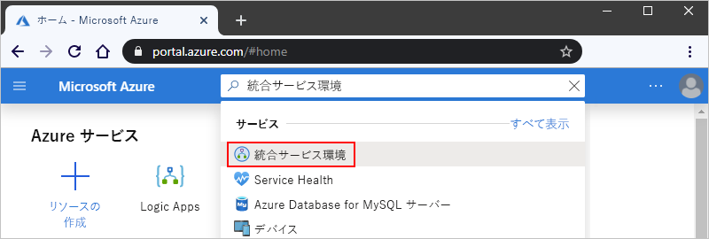
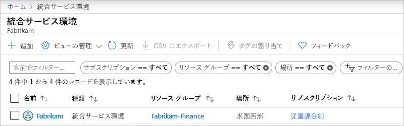
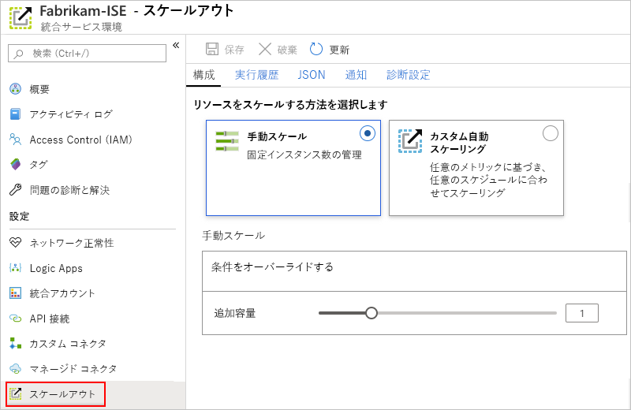
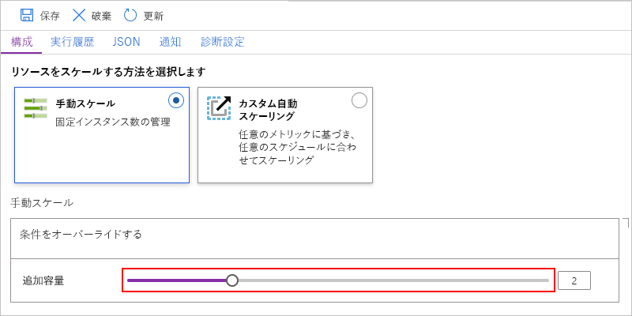
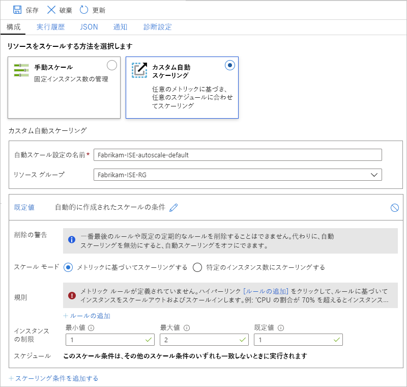

# Azure Logic Apps で統合サービス環境 (ISE) を管理する

この記事では、[統合サービス環境 (ISE)](../logic-apps/connect-virtual-network-vnet-isolated-environment-overview.md) について次のような管理タスクを実行する方法について説明します。

* ISE 内のロジック アプリ、接続、統合アカウント、コネクタなどのリソースの管理。
* ISE のネットワークの正常性の確認。
* 容量の追加、ISE の再起動、または ISE の削除。このトピックの手順に従ってください。 これらの成果物を ISE に追加するには、[成果物の統合サービス環境への追加](../logic-apps/add-artifacts-integration-service-environment-ise.md)に関する記事を参照してください。

## ISE を表示する

1. [Azure portal](https://portal.azure.com) にサインインします。

1. ポータルの検索ボックスに「統合サービス環境」と入力し、 **[統合サービス環境]** を選択します。

   

1. 結果リストで [統合サービス環境] を選択します。

   

1. 次のセクションに進み、ISE のロジック アプリ、接続、コネクタ、または統合アカウントを見つけます。

## ネットワーク正常性を確認する

ISE メニューの **[設定]** で、 **[ネットワーク正常性]** を選択します。 このウィンドウには、サブネットの正常性状態と、他のサービスに対する送信依存関係が表示されます。

## ロジック アプリを管理する

ISE 内のロジック アプリを表示および管理できます。

1. ISE メニューの **[設定]** で、 **[ロジック アプリ]** を選択します。

   

1. ISE で不要になったロジック アプリを削除するには、それらのロジック アプリを選択し、 **[削除]** を選択します。 削除することを確認するために、 **[はい]** を選択します。

> [!NOTE]
> 子ロジック アプリを削除して再作成する場合は、親ロジック アプリを再保存する必要があります。 再作成された子アプリのメタデータは異なります。
> 子を再作成した後に親ロジック アプリを再保存しないと、子ロジック アプリへの呼び出しは失敗し、"未承認" というエラーが表示されます。 この動作は、統合アカウントのアーティファクトを使用する親子ロジック アプリや、Azure Functions を呼び出す親子ロジック アプリに当てはまります。

## API 接続を管理する

ISE で実行されているロジック アプリによって作成された接続を表示および管理できます。

1. ISE メニューの **[設定]** で **[API 接続]** を選択します。

   

1. ISE で不要になった接続を削除するには、それらの接続を選択し、 **[削除]** を選択します。 削除することを確認するために、 **[はい]** を選択します。

## ISE コネクタを管理する

ISE にデプロイされている API コネクタを表示および管理できます。

1. ISE メニューの **[設定]** で、 **[マネージド コネクタ]** を選択します。

   

1. ISE で使用しないコネクタを削除するには、それらのコネクタを選択し、 **[削除]** を選択します。 削除することを確認するために、 **[はい]** を選択します。

## カスタム コネクタを管理する

ISE にデプロイしたカスタム コネクタを表示および管理できます。

1. ISE メニューの **[設定]** で、 **[カスタム コネクタ]** を選択します。

   

1. ISE で不要になったカスタム コネクタを削除するには、それらのコネクタを選択し、 **[削除]** を選択します。 削除することを確認するために、 **[はい]** を選択します。

## 統合アカウントを管理する

1. ISE メニューの **[設定]** で、 **[統合アカウント]** を選択します。

   

1. 不要になった統合アカウントを ISE から削除するには、該当する統合アカウントを選択し、 **[削除]** を選択します。

## ISE の容量を追加する

Premium ISE ベース ユニットの容量は固定されているため、さらにスループットが必要な場合は、作成中または作成後にスケール ユニットを追加できます。 Developer SKU には、スケール ユニットを追加する機能が含まれていません。

1. [Azure portal](https://portal.azure.com) で ISE に移動します。

1. ISE の使用状況とパフォーマンスのメトリックを確認するには、ISE メニューで、 **[概要]** を選択します。

   

1. **[設定]** で、 **[スケールアウト]** を選択します。 **[構成]** ペインで、次のオプションを選択します。

   * [ **[Manual scale]\(手動スケーリング\)** ](#manual-scale):使用する処理ユニット数に基づいてスケーリングします。
   * [ **[カスタム自動スケーリング]** ](#custom-autoscale):さまざまな条件から選択し、その条件を満たすしきい値条件を指定して、パフォーマンス メトリックに基づいてスケーリングします。

   

### 手動でのスケーリング

1. **[Manual scale]\(手動スケーリング\)** を選択したら、**追加容量**について、使用するスケーリング ユニット数を選択します。

   

1. 終了したら、 **[保存]** を選択します。

### カスタム自動スケーリング

1. **[カスタム自動スケーリング]** を選択したら、**自動スケーリング設定の名前**について、設定の名前を指定し、必要に応じて、設定が属す Azure リソース グループを選択します。

   

1. **[既定値]** 条件について、 **[メトリックに基づいてスケーリングする]** または **[特定のインスタンス数にスケーリングする]** のいずれかを選択します。

   * インスタンスベースを選択した場合は、0 から 10 の範囲で処理ユニット数を入力します。

   * メトリック ベースを選択した場合は、次の手順に従います。

     1. **[ルール]** セクションで、 **[ルールの追加]** を選択します。

     1. **[スケール ルール]** ウィンドウで、ルールがトリガーされる条件とその際に実行するアクションを設定します。

     1. **[インスタンスの制限]** で、次の値を指定します。

        * **最小**:使用する処理ユニットの最小数
        * **Maximum**: 使用する処理ユニットの最大数
        * **既定**:リソース メトリックの読み取り中に問題が発生した場合は、現在の容量が既定の容量を下回り、自動スケーリングが処理ユニットの既定数に対してスケールアウトされます。 ただし、現在の容量が既定の容量を超えた場合、自動スケーリングはスケールインしません。

1. 他の条件を追加するには、 **[スケーリング条件を追加する]** を選択します。

1. 自動スケーリングの設定が終了したら、変更を保存します。

## ISE を再起動する

DNS サーバーまたはその設定に変更を加えた場合は、それらの変更を ISE が取得できるよう、ISE を再起動する必要があります。 Premium SKU ISE は、リサイクル中に 1 つずつ再起動されるコンポーネントと冗長性を備えているため、再起動してもダウンタイムは発生しません。 ただし Developer SKU ISE は、冗長性を備えていないためダウンタイムが発生します。 詳細については、「[ISE SKU](../logic-apps/connect-virtual-network-vnet-isolated-environment-overview.md#ise-level)」を参照してください。

1. [Azure portal](https://portal.azure.com) で ISE に移動します。

1. ISE メニューで **[概要]** を選択します。 [概要] ツール バーの **[再起動]** を選択します。

   

## ISE の削除

不要になった ISE、または ISE を含む Azure リソース グループを削除する前に、これらのリソースを含む Azure リソース グループ、または Azure 仮想ネットワークにポリシーやロックがないことを確認してください。これらの項目が削除をブロックする可能性があるからです。

ISE を削除した後、Azure 仮想ネットワークまたはサブネットの削除を試みる前に、最大 9 時間の待機が必要な場合があります。

## 次のステップ

* [統合サービス環境にリソースを追加する](../logic-apps/add-artifacts-integration-service-environment-ise.md)