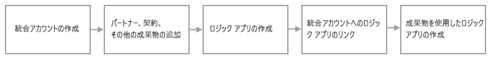

# Azure Logic Apps と Enterprise Integration Pack を使用した B2B エンタープライズ統合ソリューション

組織の間に企業間 (B2B) ソリューションとシームレスな通信を実現するために、[Azure Logic Apps](../logic-apps/logic-apps-overview.md) で Enterprise Integration Pack (EIP) を使用して、自動化されたスケーラブルなエンタープライズ統合ワークフローを構築することができます。 組織どうしは、異なるプロトコルと形式を使用していても、メッセージを電子的に交換することができます。 異なる形式は、EIP によって、組織のシステムで処理できる、[AS2](../logic-apps/logic-apps-enterprise-integration-as2.md)、[X12](logic-apps-enterprise-integration-x12.md)、[EDIFACT](../logic-apps/logic-apps-enterprise-integration-edifact.md) などの業界標準プロトコルをサポートする形式に変換されます。 また、暗号化とデジタル署名の両方を使用してメッセージのセキュリティを向上させることもできます。 EIP では、これらの[エンタープライズ統合コネクタ](../connectors/apis-list.md#integration-account-connectors)と次の業界標準がサポートされています。

* 電子データ交換 (EDI)
* Enterprise Application Integration (EAI)

Microsoft BizTalk Server または Azure BizTalk Services を使い慣れている場合、EIP は同様の概念に従っており、機能を簡単に使用できます。 ただし、1 つの大きな違いとして、EIP はアーキテクチャ上、B2B 通信で使用されるアーティファクトの格納と管理を簡単にするために、"統合アカウント" に基づいています。 これらのアカウントは、パートナー、契約、スキーマ、マップ、証明書などのアーティファクトをすべて格納するクラウド ベースのコンテナーです。 

## Enterprise Integration Pack を使用する理由

* EIP を使用すれば、対象のアーティファクトをすべて 1 か所 (統合アカウント) に格納できます。

* Azure Logic Apps とコネクタを使用することで、B2B ワークフローを構築し、サード パーティの SaaS (サービスとしてのソフトウェア) アプリ、オンプレミスのアプリ、カスタム アプリと統合できます。

* Azure Functions を使用して、ロジック アプリのカスタム コードを作成できます。

## 開始するには?

EIP を使用した B2B ロジック アプリ ワークフローの構築を開始する前に、次の項目が必要です。

* Azure サブスクリプション。 Azure サブスクリプションがない場合は、[無料の Azure アカウントにサインアップ](https://azure.microsoft.com/free/)してください。

* 使用するアーティファクトを含む[統合アカウント](../logic-apps/logic-apps-enterprise-integration-create-integration-account.md)

* マップとスキーマを作成するには、[Microsoft Azure Logic Apps Enterprise Integration Tools for Visual Studio 2015 2.0](https://aka.ms/vsmapsandschemas) と Visual Studio 2015 を使用できます。

統合アカウントを作成し、アーティファクトを追加したら、Azure portal でロジック アプリを作成することにより、これらのアーティファクトを使用して B2B ワークフローの構築を開始できます。 ロジック アプリを初めて使用する場合は、[基本的なロジック アプリを作成](../logic-apps/quickstart-create-first-logic-app-workflow.md)してみてください。 ただし、これらのアーティファクトを使用するには、統合アカウントとロジック アプリの関連付けを行っておく必要があります。 その後、ロジック アプリから統合アカウントにアクセスできます。 また、Visual Studio または [PowerShell](https://docs.microsoft.com/powershell/module/az.logicapp) を使用して、ロジック アプリを作成、管理、デプロイすることもできます。

B2B ロジック アプリの構築を開始する手順の概要を次に示します。

  

## 今すぐ試す

[AS2 メッセージの送受信を行う完全に動作するサンプル ロジック アプリをデプロイする](https://github.com/Azure/azure-quickstart-templates/tree/master/201-logic-app-as2-send-receive)

## 次のステップ

* [取引先を作成する](logic-apps-enterprise-integration-partners.md)
* [契約を作成する](../logic-apps/logic-apps-enterprise-integration-agreements.md)
* [スキーマを追加する](logic-apps-enterprise-integration-schemas.md)
* [マップを追加する](../logic-apps/logic-apps-enterprise-integration-maps.md)
* [BizTalk Services から移行する](../logic-apps/logic-apps-move-from-mabs.md)
