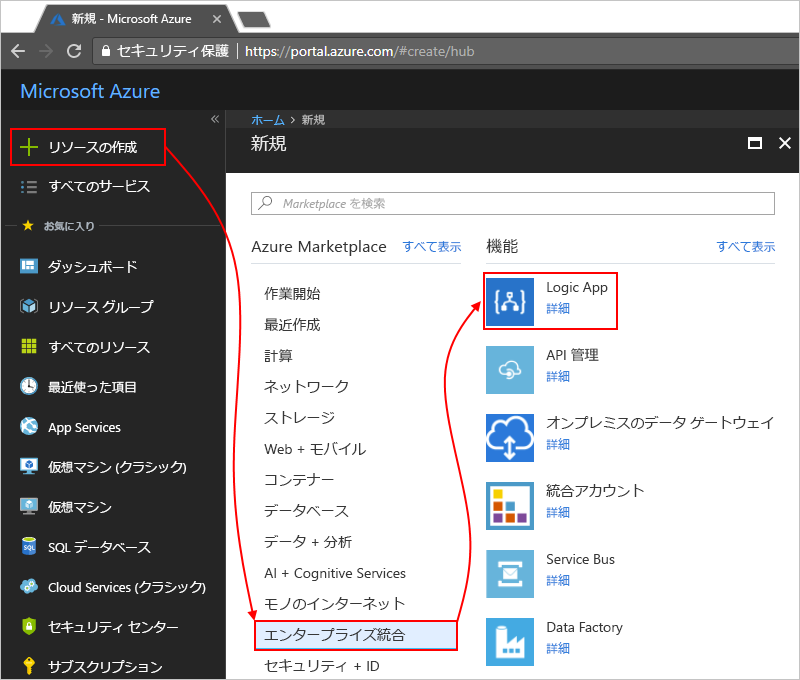

# Azure Log Analytics でロジック アプリを監視する

ロジック アプリを監視してより多くのデバッグ詳細情報を取得するには、ロジック アプリの作成時に [Azure Log Analytics](../log-analytics/log-analytics-overview.md) を有効にします。 Azure portal で Logic Apps 管理ソリューションをインストールすると、Log Analytics によりロジック アプリの診断ログと監視の機能が提供されます。 このソリューションは、ロジック アプリ実行の集計情報に加えて、状態、実行時間、再送信の状態、関連付け ID など、特定の詳細情報も提供します。 この記事では、Log Analytics を有効にして、ロジック アプリ実行のランタイム イベントとランタイム データを確認する方法を説明します。

既存のロジック アプリに対して Azure Log Analytics を有効にするには、[診断ログを有効にしてロジック アプリのランタイム データを Log Analytics に送信する](../logic-apps/logic-apps-monitor-your-logic-apps.md#azure-diagnostics)手順に従います。

> [!NOTE]
> このページでは、以前、Microsoft Operations Management Suite (OMS) を使用してこれらのタスクを実行する手順を説明していましたが、OMS は [2019 年 1 月に廃止される](../azure-monitor/platform/oms-portal-transition.md)ため、代わりに Azure Log Analytics を使用する手順に置き換えられています。 

## 前提条件

開始する前に、Log Analytics ワークスペースが必要です。 [Log Analytics ワークスペースの作成方法](../azure-monitor/learn/quick-create-workspace.md)に関するページを参照してください。 

## ロジック アプリの作成時に診断ログの記録をオンにする

1. [Azure Portal](https://portal.azure.com) で、ロジック アプリを作成します。 **[リソースの作成]** > **[統合]** > **[ロジック アプリ]** を選択します。

   

1. **[ロジック アプリの作成]** で、次に示すタスクを実行します。

   1. ロジック アプリに名前を付け、Azure サブスクリプションを選択します。 

   1. Azure リソース グループを作成するか選択します。

   1. **[Log Analytics]** を **[オン]** にします。 

   1. Log Analytics ワークスペースの一覧から、ロジック アプリの実行データを送信するワークスペースを選択します。 

      

      この手順を完了すると、Azure によりロジック アプリが作成されます。このアプリは、Log Analytics ワークスペースに関連付けられています。 
      また、この手順では、ワークスペースに Logic Apps 管理ソリューションが自動的にインストールされます。

   1. 操作が完了したら、**[作成]** を選択します。

1. ロジック アプリの実行を確認するには、[この手順を続行します](#view-logic-app-runs-oms)。

## Logic Apps 管理ソリューションをインストールする

ロジック アプリの作成時にすでに Log Analytics をオンにしている場合は、この手順をスキップします。 Logic Apps 管理ソリューションが既にインストールされています。

1. [Azure portal](https://portal.azure.com) で **[すべてのサービス]** を選択します。 検索ボックスに「log analytics」と入力して検索し、**[Log Analytics]** を選択します。

   

1. **[Log Analytics]** で、ご利用の Log Analytics ワークスペースを見つけて選択します。 

   

1. **[Log Analytics の使用を開始する]** > **[監視ソリューションの構成]** の順に選択し、**[ソリューションの表示]** を選択します。

   ![[ソリューションの表示] を選択する](media/logic-apps-monitor-your-logic-apps-oms/log-analytics-workspace.png)

1. [概要] ページで、**[追加]** を選択して、**[管理ソリューション]** の一覧を開きます。 その一覧から **[Logic Apps 管理]** を選択します。 

   ![[Logic Apps 管理] を選択する](./media/logic-apps-monitor-your-logic-apps-oms/add-logic-apps-management-solution.png)

   ソリューションが見つからない場合は、ソリューションが表示されるまで一覧の下端にある **[さらに読み込む]** を選択します。

1. **[作成]** を選択し、ソリューションをインストールする Log Analytics ワークスペースを確認してから、もう一度 **[作成]** を選択します。   

   ![[Logic Apps 管理] の [作成] を選択する](./media/logic-apps-monitor-your-logic-apps-oms/create-logic-apps-management-solution.png)

   既存のワークスペースを使用しない場合は、この時点で新しいワークスペースを作成することもできます。

   完了すると、Logic Apps 管理ソリューションが [概要] ページに表示されます。 

## ロジック アプリ実行情報を参照する

ロジック アプリを実行した後、**[Logic Apps 管理]** タイルで状態と実行件数を参照できます。 

1. Log Analytics ワークスペースに移動し、[概要] ページを開きます。 **[Logic Apps 管理]** を選択します。 

   

   ここでは、ロジック アプリの実行は名前または実行状態でグループ化されます。 
   このページには、ロジック アプリの実行のアクションまたはトリガーで発生したエラーに関する詳細も表示されます。

   
   
1. 特定のロジック アプリまたは状態のすべての実行を表示するには、ロジック アプリまたは状態の行を選択します。

   特定のロジック アプリのすべての実行を表示する例は次の通りです。

   

   このページには、次のような高度なオプションがあります。

   * **[追跡対象プロパティ]**:

     この列には、ロジック アプリの追跡プロパティがアクション別にグループ化されて表示されます。 追跡対象プロパティを表示するには、**[表示]** を選択します。 
     追跡対象プロパティを検索するには、列フィルターを使用します。
   
     

     追跡対象プロパティを新たに追加した場合、最初に表示されるまでに 10 - 15 分かかる場合があります。 [ロジック アプリに追跡対象プロパティを追加する方法](logic-apps-monitor-your-logic-apps.md#azure-diagnostics-event-settings-and-details)をご覧ください。

   * **[再送信]:** 失敗、成功、または実行中の状態の、1 つ以上のロジック アプリの実行を再送信できます。 再送信する実行のチェックボックスをオンにして、**[再送信]** を選択します。 

     

1. これらの結果をフィルター処理するには、クライアント側およびサーバー側の両方でフィルター処理を実行します。

   * **クライアント側のフィルター**:各列で、必要なフィルターを選択します。

     

   * **サーバー側のフィルター**:特定の時間枠を選択または表示される実行の数を制限するには、ページ上部のスコープ コントロールを使用します。 既定では、一度に 1000 件のレコードのみ表示されます。
   
     
 
1. 特定の実行のすべてのアクションとその詳細を表示するには、ロジック アプリの実行の行を選択します。

   特定のロジック アプリの実行のすべてアクションを表示する例は次の通りです。

   
   
1. 結果ページで、結果の背後にあるクエリを表示したり、すべての結果を表示したりするには、**[See All]\(すべて表示\)** を選択します。すると、[ログ検索] ページが開きます。
   
   ![結果ページの [See All]\(すべて表示\)](media/logic-apps-monitor-your-logic-apps-oms/logic-app-seeall.png)
   
   [ログ検索] ページで、

   * クエリの結果を表で確認するには、**[表]** を選択します。

   * クエリを変更するには、検索バーでクエリ文字列を編集します。 
   より高いエクスペリエンスを得るには、**[高度な分析]** を選択します。

     
     
     [Azure Log Analytics] ページで、クエリを更新して表から結果を確認できます。 このクエリは [Kusto クエリ言語](https://aka.ms/LogAnalyticsLanguageReference)を使用します。他の結果を表示するには編集します。 

     

## 次の手順

* [B2B メッセージを監視する](../logic-apps/logic-apps-monitor-b2b-message.md)