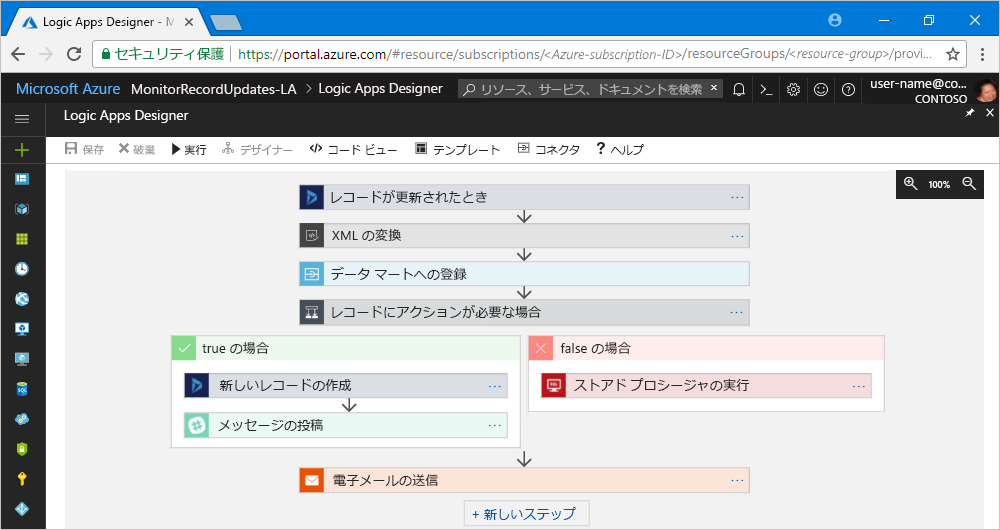

# Azure Logic Apps とは

[Logic Apps](https://azure.microsoft.com/services/logic-apps) は、タスクとビジネス プロセスを[ワークフロー](#logic-app-concepts)として自動化します。これによって企業や組織の垣根を越えて、アプリ、データ、システム、サービスを統合するソリューションが構築しやすくなります。 Logic Apps は、Azure のクラウド サービスです。Logic Apps を使えば、クラウド、オンプレミス、その両方のどこにあるかを問わず、アプリの統合、データの統合、システムの統合、Enterprise Application Integration (EAI)、および企業間 (B2B) 通信が可能になるスケーラブルなソリューションを設計および作成する作業を簡略化できます。

ロジック アプリを使って自動化できるワークロードには、たとえば次のようなものがあります。

* オンプレミス システムとクラウド サービスの間で命令を処理し、ルーティングする。
* アップロードされたファイルを SFTP サーバーまたは FTP サーバーから Azure Storage に移動する。 
* 各種のシステム、アプリ、サービスでイベントが発生したときに Office 365 でメール通知を送信する。
* 特定の話題のツイートを監視したり、そこに込められた感情を分析したり、確認が必要な項目についてアラートやタスクを作成したりする。

Logic Apps を使った統合ソリューションは、成長を続けるギャラリーからの選択によって構築できます。ギャラリーには、他の Azure サービス (Service Bus、Functions、Storage)、SQL、Office 365、Dynamics、BizTalk、Salesforce、SAP、Oracle DB、ファイル共有など、[200 点以上のコネクタ](../connectors/apis-list.md)が用意されています。 これらの[コネクタ](#logic-app-concepts)には、データにリアル タイムで安全にアクセスして処理するロジック アプリを作成するための[トリガー](#logic-app-concepts)、[アクション](#logic-app-concepts)、またはその両方が備わっています。

> [!VIDEO https://channel9.msdn.com/Blogs/Azure/Introducing-Azure-Logic-Apps/player]

## Logic Apps のしくみ 

ロジック アプリを使ったワークフローはいずれも、トリガーによって起動します。そして、トリガーは特定のイベントが発生するか、新たに利用可能になったデータが特定の条件を満たした時点で起動します。 多くのトリガーには、ワークロードの実行頻度を指定できる基本的なスケジューリング機能が備わっています。 スケジューリングの詳細なカスタマイズが必要なシナリオでは、ワークフローの起動にスケジュール トリガーを使用します。 詳細については、[スケジュールベースのワークフローを構築する方法](../logic-apps/tutorial-build-schedule-recurring-logic-app-workflow.md)に関するページを参照してください。

トリガーが起動するたびに、Logic Apps エンジンによって、ワークフローのアクションを実行するロジック アプリ インスタンスが作成されます。 これらのアクションにはデータ変換のほか、条件文、switch 文、ループ、分岐などのフロー制御が含まれることもあります。 たとえば、このロジック アプリは "レコードが更新されたとき" という条件が組み込まれている Dynamics 365 トリガーによって起動するものです。 トリガーがこの条件に一致するイベントを検出すると、トリガーが起動し、ワークフローのアクションを実行します。 ここで実行されるアクションとしては、XML の変換、データの更新、条件分岐、メール通知があります。

ロジック アプリは、Logic Apps デザイナーを使って視覚的に作成できます。Logic Apps デザイナーは、ブラウザーを使って Azure ポータルからアクセスできるほか、Visual Studio でも利用できます。 ロジック アプリをさらにカスタマイズするときは、"コード ビュー" モードを使うと、JavaScript Object Notation (JSON) でロジック アプリの定義を作成したり編集したりすることができます。 一定のタスクについては、Azure PowerShell コマンドや Azure Resource Manager テンプレートを使用することもできます。 ロジック アプリは Azure のクラウドにデプロイされ、そこで実行されます。 さらに詳細な概要については、ビデオ「[Use Azure Enterprise Integration Services to run cloud apps at scale](https://channel9.msdn.com/Events/Connect/2017/T119/) (Azure のエンタープライズ統合サービスを使って大規模なクラウド アプリを実行する)」を参照してください。

## Logic Apps を使う理由

ロジック アプリなら、Microsoft のマネージ コネクタとして事前構築済みの API が用意されているため、ビジネスのデジタル化が進むなかでもレガシ システムと最先端のシステムを簡単にすばやく接続できます。 このため、アプリのビジネス ロジックと機能に集中できます。 アプリのビルド、ホスティング、スケール、管理、メンテナンス、監視に関する心配は無用です。 そのような問題は、Logic Apps が代わりに処理してくれます。 さらに、支払いは従量[課金モデル](../logic-apps/logic-apps-pricing.md)に基づき、使用した分のみとなります。 

多くの場合、コードを記述する必要はありません。 もっとも、コードの記述が必要な場合には、[Azure Functions](../azure-functions/functions-overview.md) を使ってコード スニペットを作成し、ロジック アプリからオンデマンドで実行できます。 また、ロジック アプリと Azure サービス、カスタム アプリ、またはサードパーティ ソリューションのイベントとの間でやり取りが必要な場合には、ロジック アプリと [Azure Event Grid](../event-grid/overview.md) を併用するとイベントを監視、ルーティング、および公開できます。

Logic Apps、Functions、Event Grid はいずれも Microsoft Azure によって完全に管理されており、ソリューションのビルド、ホスティング、スケール、管理、監視、メンテナンスに関する心配から解放されます。 ["サーバーレス" のアプリとソリューション](../logic-apps/logic-apps-serverless-overview.md) を作成できる機能が備わっているため、ビジネス ロジックだけに集中できます。 ここに挙げたサービスは、お客様のニーズに合わせて自動でスケールできるだけでなく、統合にかかる時間を短縮したり、最小限のコードで堅牢なクラウド アプリを作成するために役立てたりすることができます。 さらに、支払いは従量[課金モデル](../logic-apps/logic-apps-pricing.md)に基づき、使用した分のみとなります。 

企業が Logic Apps を他の Azure サービスや Microsoft 製品と組み合わせることによってどのようにアジリティを高め、自らの中核となるビジネスに集中できるようになったかについては、[お客様事例](https://aka.ms/logic-apps-customer-stories)を参照してください。

ここでは、Logic Apps の機能とメリットを詳しく紹介します。

### 使いやすいツールで視覚的にワークフローを構築

ビジュアルを使ったデザイン ツールが用意されており、時間の節約と複雑なプロセスの簡略化が可能です。 ロジック アプリの作成は、最初から最後まで Logic Apps デザイナーを使って進めることができます。このツールは、ブラウザーを使って Azure ポータルからアクセスできるほか、Visual Studio からも利用できます。 ワークフローの起動にはトリガーを使用します。[コネクタ ギャラリー](../connectors/apis-list.md)から追加できるアクションの数に上限はありません。

### ロジック アプリ テンプレートを使って時間を節約

[テンプレート ギャラリー](../logic-apps/logic-apps-create-logic-apps-from-templates.md)にある定義済みのワークフローを選んで使用すれば、よく使われるソリューションを今まで以上に短期間で作成できます。 サービスとしてのソフトウェア (SaaS) アプリのための単純な接続を実現するものから、高度な B2B ソリューションの構築に役立つものや、"単に楽しむための" ものまで、さまざまなテンプレートがあります。 詳細については、[事前構築済みのテンプレートからロジック アプリを作成する方法](../logic-apps/logic-apps-create-logic-apps-from-templates.md)に関するページを参照してください。

### 異なる環境にまたがる別個のシステムを接続

パターンやワークフローによっては、説明は簡単でもコードで実装するのは困難なこともあります。 ロジック アプリなら、各種のシステムがオンプレミスの環境とクラウド環境のどちらに存在していても、シームレスに接続できます。 たとえば、クラウドのマーケティング ソリューションをオンプレミスの請求システムに接続したり、エンタープライズ サービス バスを使ってさまざまな API とシステムのメッセージングを一元化したりすることが可能になります。 ロジック アプリは、このようなシナリオに役立つ再利用可能かつ再構成可能なソリューションを提供するにあたり、高速で信頼性と一貫性に優れた方法を提供するものです。

### エンタープライズ統合と B2B のシナリオに最上級のサポートを実現

企業でも組織でも、相互に電子的なやり取りをするにあたっては業界標準のメッセージ プロトコルや形式を使用しています。しかし、具体的なプロトコルや形式を見ると EDIFACT、AS2、X12 など、さまざまに異なります。 [Enterprise Integration Pack (EIP)](../logic-apps/logic-apps-enterprise-integration-overview.md) の機能を使えば、パートナーが使用しているメッセージ形式をユーザーの組織のシステムが解釈して処理できる形式に変換するロジック アプリを作成できます。 Logic Apps はこのようなやり取りを円滑に処理すると共に、暗号化とデジタル署名を使ってその安全を確保します。

最初は現在のシステムとサービスを使用して小規模な運用から始め、自分のペースで段階的に利用を増やしていくことをお勧めします。 準備ができたら、以下に示す Logic Apps と EIP のさまざまな機能を使って高度な統合シナリオを実装し、スケールアップしていきましょう。

* 次の製品およびサービスを使って作成:

  * [Microsoft BizTalk Server](https://docs.microsoft.com/biztalk/core/introducing-biztalk-server)
  * [Azure Functions](../azure-functions/functions-overview.md)
  * [Azure API Management](../api-management/api-management-key-concepts.md)
  * [Azure Service Bus](../service-bus-messaging/service-bus-messaging-overview.md)

* [XML メッセージ](../logic-apps/logic-apps-enterprise-integration-xml.md)の処理
* [フラット ファイル](../logic-apps/logic-apps-enterprise-integration-flatfile.md)の処理
* [EDIFACT](../logic-apps/logic-apps-enterprise-integration-edifact.md)、[AS2](../logic-apps/logic-apps-enterprise-integration-as2.md)、[X12](../logic-apps/logic-apps-enterprise-integration-x12.md) プロトコルによるメッセージのやり取り
* [統合アカウント](../logic-apps/logic-apps-enterprise-integration-accounts.md)により、以下をはじめとする B2B アーティファクトを一箇所で格納、管理

  * [パートナー](../logic-apps/logic-apps-enterprise-integration-partners.md)
  * [アグリーメント](../logic-apps/logic-apps-enterprise-integration-agreements.md) 
  * [XML 変換マップ](../logic-apps/logic-apps-enterprise-integration-maps.md)
  * [XML 検証スキーマ](../logic-apps/logic-apps-enterprise-integration-schemas.md)
   
たとえば、Microsoft BizTalk Server を使っている場合、ロジック アプリから [BizTalk Server コネクタ](../connectors/apis-list.md#on-premises-connectors)を使用してご利用の BizTalk Server に接続し、通信を行うことができます。 その後、[統合アカウント コネクタ](../connectors/apis-list.md#integration-account-connectors) (Enterprise Integration Pack に付属) を追加することで、BizTalk と同様の操作をロジック アプリで拡張したり実行したりすることができます。 

逆に、[Microsoft BizTalk Server Adapter for Logic Apps](https://www.microsoft.com/download/details.aspx?id=54287) を使用して、BizTalk Server からロジック アプリに接続して通信を行うこともできます。 BizTalk Server で [BizTalk Server Adapter を設定して使用する](https://docs.microsoft.com/biztalk/core/logic-app-adapter)方法をご覧ください。

### 1 回の作成で何度も再利用

ロジック アプリをテンプレートとして作成すると、多数の環境やリージョンにまたがる[アプリをデプロイし、再構成](../logic-apps/logic-apps-create-deploy-template.md)できます。

### 組み込みの拡張機能

必要とするコネクタが見つからない場合や、カスタム コードの実行が必要な場合には、独自のコード スニペットを作成し、[Azure Functions](../azure-functions/functions-overview.md) を使ってオンデマンドで呼び出せば、ロジック アプリを拡張できます。 独自の [API](../logic-apps/logic-apps-create-api-app.md) や[カスタム コネクタ](../logic-apps/custom-connector-overview.md)を作成し、ロジック アプリから呼び出すこともできます。

### 使用した分だけお支払い
  
Logic Apps では、App Service プランで以前に作成したロジック アプリがないかぎり、使用量に応じた[課金および測定](../logic-apps/logic-apps-pricing.md)が採用されます。

Logic Apps の詳細については、以下のビデオで紹介しています。

* [Logic Apps を使った統合 - "ゼロ" から "ヒーロー" へ](https://channel9.msdn.com/Events/Build/2017/C9R17) 
* [Microsoft Azure Logic Apps を使用したエンタープライズ統合](https://channel9.msdn.com/Events/Ignite/Microsoft-Ignite-Orlando-2017/BRK2188)
* [Logic Apps を使用して高度なビジネス プロセスを構築する](https://channel9.msdn.com/Events/Ignite/Microsoft-Ignite-Orlando-2017/BRK3179)

## キーワード

* **ワークフロー**: ビジネス プロセスを一連のステップとして視覚化、設計、構築、自動化、デプロイします。

* **マネージ コネクタ**: ロジック アプリにはデータ、サービス、システムへのアクセスが必要です。 データへの接続とアクセスおよびデータの操作のために設計された事前構築済みの Microsoft のマネージ コネクタを利用できます。 詳細については、[Azure Logic Apps のコネクタ](../connectors/apis-list.md)に関するページを参照してください。

* **トリガー**: 多くの Microsoft マネージ コネクタには、イベントや新しいデータが一定の条件を満たした場合に起動するトリガーが用意されています。 イベントとしては、メールを受信したり、Azure Storage アカウントに対する変更が検出されたりした場合などが考えられます。 トリガーが起動するたびに、Logic Apps エンジンによって、ワークフローを実行するロジック アプリ インスタンスが新たに作成されます。

* **アクション**: アクションとは、トリガーの後に発生するステップすべてを指します。 各アクションは通常、マネージ コネクタ、カスタム API、またはカスタム コネクタにより定義される 1 件の操作にマップされています。

* **Enterprise Integration Pack**: Logic Apps には、高度な統合シナリオ向けに BizTalk Server の機能が含まれています。 Enterprise Integration Pack は、ロジック アプリが検証や変換などを簡単に実行するためのコネクタを提供するものです。

## Logic Apps と Functions、WebJobs、Flow の違い

ここに挙げたサービスはいずれも、別個のシステムをつなげるための "接着剤" のような役割を果たします。 どのサービスにもそれぞれ長所とメリットが存在するため、十分な機能を備えたスケーラブルな統合システムを短期間で構築するためには、各サービスの機能を組み合わせるのが一番です。 詳細については、「[Flow、Logic Apps、Functions、WebJobs の比較](../azure-functions/functions-compare-logic-apps-ms-flow-webjobs.md)」を参照してください。

## 作業開始 

Logic Apps は、Microsoft Azure でホストされている多くのサービスの 1 つです。 このため、利用開始には Azure サブスクリプションが必要です。 サブスクリプションをお持ちでない場合には、<a href="https://azure.microsoft.com/free/" target="_blank">無料の Azure アカウントにサインアップ</a>してください。 

Azure サブスクリプションをお持ちであれば、[初めてのロジック アプリの作成に関するクイック スタート](../logic-apps/quickstart-create-first-logic-app-workflow.md)をお試しください。このクイックスタートでは、RSS フィードを使って Web サイトの新しいコンテンツを監視し、新しいコンテンツが公開された時点でメールを送信する方法を紹介しています。

## サポートとフィードバック

* 質問がある場合は、[Azure Logic Apps フォーラム](https://social.msdn.microsoft.com/Forums/en-US/home?forum=azurelogicapps)にアクセスしてください。
* 機能のアイデアについて投稿や投票を行うには、[Logic Apps のユーザー フィードバック サイト](http://aka.ms/logicapps-wish)にアクセスしてください。

## 次の手順

* [スケジュールに基づいたロジック アプリでトラフィックをチェックする](../logic-apps/tutorial-build-schedule-recurring-logic-app-workflow.md)
* [Azure を使ったサーバーレス ソリューション](../logic-apps/logic-apps-serverless-overview.md)の詳細を確認する
* [Enterprise Integration Pack によるB2B 統合](../logic-apps/logic-apps-enterprise-integration-overview.md)の詳細を確認する