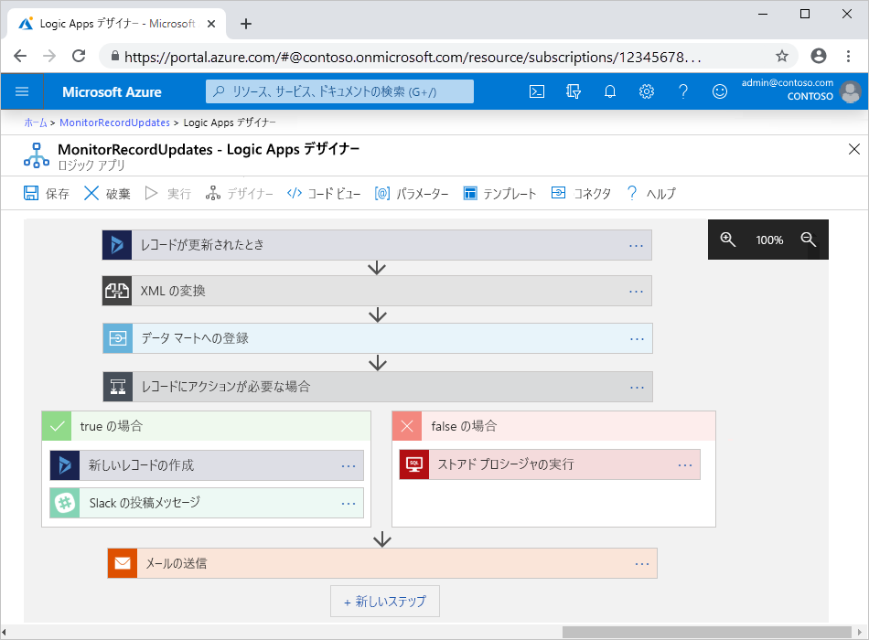

# Azure Logic Apps とは

[Logic Apps](https://azure.microsoft.com/services/logic-apps) は、自動化された[ワークフロー](#logic-app-concepts)の構築と実行によって、アプリ、データ、システム、サービスをすばやく簡単に統合することを支援するクラウドベースのプラットフォームです。 [Azure Integration Services](https://azure.microsoft.com/product-categories/integration/) の一部である Logic Apps は、エンタープライズのシナリオや企業間 (B2B) のシナリオ向けのスケーラビリティに優れた統合ソリューションの作成、ホスト、管理を、クラウド、オンプレミス、ハイブリッドという環境の垣根を越えて簡素化します。

この一覧に例として挙げたのは、Logic Apps サービスを使用して自動化できるタスク、ビジネス プロセス、ワークロードのうちのごく一部です。

* オンプレミス システムとクラウド サービスの垣根を越えて顧客注文をルーティングし、処理する。
* Office 365 を使用して、特定のイベントが発生したときのメール通知をスケジュールして送信する。
* アップロードされたファイルを SFTP サーバーまたは FTP サーバーから Azure Storage に移動する。
* ツイートを監視したり、そのセンチメントを分析したり、確認が必要な項目についてアラートやタスクを作成したりする。

> [!VIDEO https://channel9.msdn.com/Blogs/Azure/Introducing-Azure-Logic-Apps/player]

さまざまなデータ ソースに対し、リアルタイムかつ安全にアクセスして操作を実行できるよう、日々拡充される [Microsoft マネージド コネクタ](#logic-app-concepts)の[ギャラリー](/connectors/connector-reference/connector-reference-logicapps-connectors)をご利用ください。たとえば次のようなものがあります。

* Azure サービス (Blob Storage、Service Bus など)
* Office サービス (Outlook、Excel、SharePoint など)
* データベース サーバー (SQL、Oracle など)
* エンタープライズ システム (SAP、IBM MQ など)
* ファイル共有 (FTP、SFTP など)

サービス エンドポイントとの通信、独自コードの実行、ワークフローの編成、データの操作のために、Logic Apps サービス内でネイティブに実行される[組み込みのトリガーとアクション](#logic-app-concepts)を使用できます。 たとえば、組み込みトリガーとしては、要求トリガー、HTTP トリガー、繰り返しトリガーなどがあります。 組み込みアクションには、条件、For each、JavaScript コードに加えて、Azure でホストされる Azure 関数、Web アプリ、API アプリのほか、他の Logic Apps ワークフローを呼び出す操作などがあります。

Logic Apps には、B2B 統合シナリオ向けに [BizTalk Server](/biztalk/core/introducing-biztalk-server) の機能が含まれています。 [統合アカウント](logic-apps-enterprise-integration-create-integration-account.md)を作成して、そこに取引先、契約、スキーマ、マップなどの B2B アーティファクトを定義することができます。 そのアカウントをロジック アプリにリンクすると、AS2、EDIFACT、X12 といったプロトコルを使用して、そうしたアーティファクトと連携しつつメッセージを交換するワークフローを構築できます。

ワークフローからアプリやデータ、サービス、システムにアクセスしてそれらと連携する方法について詳しくは、次のドキュメントを参照してください。

* [Azure Logic Apps のコネクタ](../connectors/apis-list.md)
* [Azure Logic Apps のマネージド コネクタ](../connectors/built-in.md)
* [Azure Logic Apps の組み込みのトリガーとアクション](../connectors/managed.md)
* [Azure Logic Apps を使用した B2B エンタープライズ統合ソリューション](logic-apps-enterprise-integration-overview.md)

## キーワード

* **ワークフロー**: タスクまたはプロセスを定義する一連のステップ。単一のトリガーを起点として 1 つまたは複数のアクションを実行します

* **トリガー**: 各ワークフローの起点となると共に、ワークフローのアクションを実行するにあたって満たすべき条件を指定する最初のステップ。 たとえば、受信トレイにメールが届いた、ストレージ アカウントで新しいファイルを検出した、といったトリガー イベントが考えられます。

* **アクション**: トリガーの後、ワークフロー内のなんらかの操作を実行する後続の各ステップ。

* **マネージド コネクタ**: 特定のアプリ、データ、サービス、システムへのアクセスを提供する、Microsoft によるマネージド コネクタ。 ほとんどのマネージド コネクタは、その使用前に、ワークフローから接続を作成し、ID の認証を行う必要があります。

  たとえば、トリガーを使用してワークフローを開始したり、Azure Blob Storage、Office 365、Salesforce、SFTP サーバーと連携するアクションを追加したりすることができます。 詳細については、[Azure Logic Apps のマネージド コネクタ](../connectors/managed.md)に関するページを参照してください。

* **組み込みのトリガーまたはアクション**: ネイティブで実行される Logic Apps 操作。ワークフローのスケジュールや構造の制御、独自のコードの実行、データの管理または操作、ワークフロー内の他のタスクの実行などを可能にする手段となります。 ほとんどの組み込み操作は、いずれのサービスやシステムにも関連付けられていません。 また、その多くは、ワークフローから接続を作成したり、ID の認証を行ったりする必要がありません。 Azure Functions、Azure API Management、Azure App Service など、いくつかのサービス、システム、プロトコルでも、組み込み操作を利用できます。

  たとえば、繰り返しトリガーを使用すると、ほぼどのようなワークフローでもスケジュールに従って開始できます。 また、要求トリガーを使用すると、呼び出すまでワークフローを待機させることもできます。 詳細については、[Azure Logic Apps の組み込みのトリガーとアクション](../connectors/built-in.md)に関するページを参照してください。

## ロジック アプリが機能するしくみ

ロジック アプリでは、各ワークフローが必ず単一の[トリガー](#logic-app-concepts)で始まります。 トリガーは、条件が満たされたとき、たとえば特定のイベントが発生したときや特定の条件をデータが満たしたときに起動します。 多くのトリガーには、ワークフローの実行頻度を制御する[スケジューリング機能](../logic-apps/concepts-schedule-automated-recurring-tasks-workflows.md)が含まれています。 トリガーに続けて、1 つまたは複数の[アクション](#logic-app-concepts)によって各種操作 (ワークフロー内を通過するデータを加工、処理、変換する操作や、ワークフローを次のステップに進める操作など) が実行されます。

たとえば、次のワークフローは、"**When a record is updated (レコードが更新されたとき)** " という名前の組み込みの条件が指定された Dynamics トリガーで始まります。 そのアクションとして、XML の変換、データを更新する Web アプリの呼び出し、実行するアクションを制御する条件の評価、結果を含んだメール通知の送信などがあります。 条件を満たしたイベントがトリガーによって検出されると、トリガーが起動し、ワークフローに含まれているアクションの実行が開始されます。 トリガーが起動するたびに、そのアクションを実行するワークフロー インスタンスが Logic Apps サービスによって作成されます。

ワークフローは、Azure portal 内の Logic Apps デザイナー、Visual Studio、Visual Studio Code を使用して視覚的に作成できます。 各ワークフローには、JavaScript Object Notation (JSON) を使用して記述された、基になる定義も含まれています。 必要であれば、Azure portal 内のコード ビュー エディター、Visual Studio、Visual Studio Code を使用して、ワークフローを作成したりカスタマイズしたりすることもできます。 Logic Apps では、一部の作成タスクと管理タスクについて、Azure PowerShell と Azure CLI コマンドがサポートされます。 Logic Apps では、デプロイの自動化を目的として、Azure Resource Manager テンプレートがサポートされます。

## ロジック アプリを使う理由

Logic Apps プラットフォームなら、Microsoft のマネージド コネクタとして、あらかじめ構築された API が用意されているため、ビジネスのデジタル化が進む中で、従来のシステム、新しいシステム、最先端のシステムを簡単にすばやく接続できます。 このため、アプリのビジネス ロジックと機能に集中できます。 アプリのビルド、ホスティング、スケール、管理、メンテナンス、監視に関する心配は無用です。 そのような問題は、Logic Apps が代わりに処理してくれます。 さらに、支払いは従量[課金モデル](../logic-apps/logic-apps-pricing.md)に基づき、使用した分のみとなります。

通常、コードを記述する必要はありません。 もっとも、コードの記述が必要な場合には、[Azure Functions](../azure-functions/functions-overview.md) を使ってコード スニペットを作成し、ワークフローからオンデマンドで実行できます。 また、Azure サービス、カスタム アプリ、またはその他のソリューションのイベントとワークフローとの間でやり取りが必要な場合には、ワークフローと [Azure Event Grid](../event-grid/overview.md) を併用するとイベントを監視、ルーティング、公開できます。

Logic Apps、Functions、Event Grid はいずれも Microsoft Azure によって完全に管理されており、ソリューションのビルド、ホスティング、スケール、管理、監視、メンテナンスに関する心配から解放されます。 ["サーバーレス" のアプリとソリューション](../logic-apps/logic-apps-serverless-overview.md) を作成できる機能が備わっているため、ビジネス ロジックだけに集中できます。 ここに挙げたサービスは、お客様のニーズに合わせて自動でスケールできるだけでなく、統合にかかる時間を短縮したり、最小限のコードで堅牢なクラウド アプリを作成するために役立てたりすることができます。

企業が Logic Apps を他の Azure サービスや Microsoft 製品と組み合わせることによってどのようにアジリティを高め、自らの中核となるビジネスに集中できるようになったかについては、[お客様事例](https://aka.ms/logic-apps-customer-stories)を参照してください。

ここでは、Logic Apps の機能とメリットを詳しく紹介します。

### 使いやすいツールで視覚的にワークフローを構築

ビジュアルを使ったデザイン ツールが用意されており、時間の節約と複雑なプロセスの簡略化が可能です。 ワークフローの作成は、最初から最後まで Logic Apps デザイナーを使って進めることができます。これは、ブラウザーを使って Azure portal から利用できるほか、Visual Studio からも利用できます。 ワークフローの起動にはトリガーを使用します。[コネクタ ギャラリー](../connectors/apis-list.md)から追加できるアクションの数に上限はありません。

### Logic Apps テンプレートを使って時間を節約

[テンプレート ギャラリー](../logic-apps/logic-apps-create-logic-apps-from-templates.md)にある定義済みのワークフローを選んで使用すれば、よく使われるソリューションを今まで以上に短期間で作成できます。 サービスとしてのソフトウェア (SaaS) アプリのための単純な接続を実現するものから、高度な B2B ソリューションの構築に役立つものや、"単に楽しむための" ものまで、さまざまなテンプレートがあります。 詳細については、[事前構築済みのテンプレートからロジック アプリを作成する方法](../logic-apps/logic-apps-create-logic-apps-from-templates.md)に関するページを参照してください。

### 異なる環境にまたがる別個のシステムを接続

パターンやプロセスによっては、説明は簡単でもコードで実装するのは困難なこともあります。 Logic Apps のワークフローなら、各種のシステムがオンプレミスの環境とクラウド環境のどちらに存在していても、シームレスに接続できます。 たとえば、クラウドのマーケティング ソリューションをオンプレミスの請求システムに接続したり、エンタープライズ サービス バスを使ってさまざまな API とシステムのメッセージングを一元化したりすることが可能になります。 Logic Apps プラットフォームは、このようなシナリオに役立つ再利用可能かつ再構成可能なソリューションを提供するにあたり、高速で信頼性と一貫性に優れた方法を提供するものです。

### エンタープライズ統合と B2B のシナリオに最上級のサポートを実現

企業でも組織でも、相互に電子的なやり取りをするにあたっては業界標準のメッセージ プロトコルや形式を使用しています。しかし、具体的なプロトコルや形式を見ると EDIFACT、AS2、X12 など、さまざまに異なります。 [Enterprise Integration Pack (EIP)](../logic-apps/logic-apps-enterprise-integration-overview.md) の機能を使えば、パートナーが使用しているメッセージ形式をユーザーの組織のシステムが解釈して処理できる形式に変換するワークフローを作成できます。 Logic Apps はこのようなやり取りを円滑に処理すると共に、暗号化とデジタル署名を使ってその安全を確保します。

最初は現在のシステムとサービスを使用して小規模な運用から始め、自分のペースで段階的に利用を増やしていくことをお勧めします。 準備ができたら、以下に示す Logic Apps と EIP のさまざまな機能を使って高度な統合シナリオを実装し、スケールアップしていきましょう。

* 次の製品およびサービスを使って作成:

  * [Microsoft BizTalk Server](/biztalk/core/introducing-biztalk-server)
  * [Azure Service Bus](../service-bus-messaging/service-bus-messaging-overview.md)
  * [Azure Functions](../azure-functions/functions-overview.md)
  * [Azure API Management](../api-management/api-management-key-concepts.md)

* [XML メッセージ](../logic-apps/logic-apps-enterprise-integration-xml.md)の処理

* [フラット ファイル](../logic-apps/logic-apps-enterprise-integration-flatfile.md)の処理

* [EDIFACT](../logic-apps/logic-apps-enterprise-integration-edifact.md)、[AS2](../logic-apps/logic-apps-enterprise-integration-as2.md)、[X12](../logic-apps/logic-apps-enterprise-integration-x12.md) プロトコルによるメッセージのやり取り

* [統合アカウント](./logic-apps-enterprise-integration-create-integration-account.md)により、以下をはじめとする B2B アーティファクトを一箇所で格納、管理

  * [パートナー](../logic-apps/logic-apps-enterprise-integration-partners.md)
  * [アグリーメント](../logic-apps/logic-apps-enterprise-integration-agreements.md) 
  * [XML 変換マップ](../logic-apps/logic-apps-enterprise-integration-maps.md)
  * [XML 検証スキーマ](../logic-apps/logic-apps-enterprise-integration-schemas.md)

たとえば、Microsoft BizTalk Server を使っている場合、ロジック アプリで [BizTalk Server コネクタ](../connectors/managed.md#on-premises-connectors)を使用して、ご利用の BizTalk Server と通信することができます。 その後、[統合アカウント コネクタ](../connectors/managed.md#integration-account-connectors) (Enterprise Integration Pack に付属) を追加することで、BizTalk と同様の操作をワークフローで拡張したり実行したりすることができます。

逆に、[Microsoft BizTalk Server Adapter for Logic Apps](https://www.microsoft.com/download/details.aspx?id=54287) を使用して、BizTalk Server からロジック アプリに接続して通信を行うこともできます。 BizTalk Server で [BizTalk Server Adapter を設定して使用する](/biztalk/core/logic-app-adapter)方法をご覧ください。

### 1 回の作成で何度も再利用

複数の環境とリージョンにわたって[ロジック アプリ デプロイを自動化](../logic-apps/logic-apps-azure-resource-manager-templates-overview.md)できるように、Azure Resource Manager テンプレートとしてロジック アプリを作成します。

### Azure 仮想ネットワーク内のリソースにアクセスする

"[*統合サービス環境*" (ISE)](../logic-apps/connect-virtual-network-vnet-isolated-environment-overview.md) を作成するときに、ロジック アプリは [Azure 仮想ネットワーク](../virtual-network/virtual-networks-overview.md)内にあるセキュリティで保護されたリソース (仮想マシン (VM) や他のシステムまたはサービスなど) にアクセスできます。 ISE は、専用のリソースを使用し、"グローバル" なマルチテナント Logic Apps サービスとは別に実行される専用の Logic Apps サービス インスタンスです。

分離された自分専用のインスタンスでロジック アプリを実行することで、他の Azure テナントが自分のアプリのパフォーマンスに与える可能性がある影響 (["うるさい隣人" エフェクト](https://en.wikipedia.org/wiki/Cloud_computing_issues#Performance_interference_and_noisy_neighbors)とも呼ばれる) を減らすことができます。 ISE には、次の利点があります。

* 自分専用の静的 IP アドレス。これらの IP アドレスは、マルチテナント サービスのロジック アプリによって共有される静的 IP アドレスとは区別されています。 また、送信先システムとの通信のために、単一の予測可能な静的パブリック アウトバウンド IP アドレスを自分で設定することもできます。 このようにすると、それらの送信先システムで ISE ごとに追加のファイアウォールを設定する必要はありません。

* 実行継続時間、ストレージのリテンション期間、スループット、HTTP の要求と応答のタイムアウト、メッセージのサイズ、カスタム コネクタの要求の上限が引き上げられました。 詳細については、[Azure Logic Apps の制限と構成](../logic-apps/logic-apps-limits-and-config.md)に関するページを参照してください。

ISE を作成すると、Azure によってその ISE が Azure 仮想ネットワークに "*挿入*"(デプロイ) されます。 アクセスを必要とする統合アカウントやロジック アプリの場所としてその ISE を使用することができます。 ISE の作成について詳しくは、[Azure Logic Apps から Azure Virtual Network への接続](../logic-apps/connect-virtual-network-vnet-isolated-environment.md)に関するページをご覧ください。

### 組み込みの拡張機能

カスタム コードを実行するために必要なコネクタが見つからない場合には、独自のコード スニペットを作成し、[Azure Functions](../azure-functions/functions-overview.md) を使ってオンデマンドで呼び出せば、ロジック アプリを拡張できます。 独自の [API](../logic-apps/logic-apps-create-api-app.md) や[カスタム コネクタ](../logic-apps/custom-connector-overview.md)を作成し、ロジック アプリから呼び出すこともできます。

### 使用した分だけお支払い
  
Logic Apps では、App Service プランで以前に作成したロジック アプリがないかぎり、使用量に応じた[課金および測定](../logic-apps/logic-apps-pricing.md)が採用されます。

Logic Apps の詳細については、以下のビデオで紹介しています。

* [Logic Apps を使った統合 - "ゼロ" から "ヒーロー" へ](https://channel9.msdn.com/Events/Build/2017/C9R17)
* [Microsoft Azure Logic Apps を使用したエンタープライズ統合](https://channel9.msdn.com/Events/Ignite/Microsoft-Ignite-Orlando-2017/BRK2188)
* [Logic Apps を使用して高度なビジネス プロセスを構築する](https://channel9.msdn.com/Events/Ignite/Microsoft-Ignite-Orlando-2017/BRK3179)

## Logic Apps と Functions、WebJobs、Power Automate の違い

ここに挙げたサービスはいずれも、別個のシステムをつなげるための "接着剤" のような役割を果たします。 どのサービスにもそれぞれ長所とメリットが存在するため、十分な機能を備えたスケーラブルな統合システムを短期間で構築するためには、各サービスの機能を組み合わせるのが一番です。 詳細については、[Logic Apps、Functions、WebJobs、Power Automate の比較](../azure-functions/functions-compare-logic-apps-ms-flow-webjobs.md)に関する記事を参照してください。

## はじめに

Logic Apps は、Microsoft Azure でホストされている多くのサービスの 1 つです。 このため、利用開始には Azure サブスクリプションが必要です。 サブスクリプションをお持ちでない場合には、[無料の Azure アカウントにサインアップ](https://azure.microsoft.com/free/)してください。

Azure サブスクリプションをお持ちであれば、[初めてのロジック アプリの作成に関するクイック スタート](../logic-apps/quickstart-create-first-logic-app-workflow.md)をお試しください。このクイックスタートでは、RSS フィードを使って Web サイトの新しいコンテンツを監視し、新しいコンテンツが公開された時点でメールを送信する方法を紹介しています。

## 次のステップ

* [スケジュールに基づいたロジック アプリでトラフィックをチェックする](../logic-apps/tutorial-build-schedule-recurring-logic-app-workflow.md)
* [Azure を使ったサーバーレス ソリューション](../logic-apps/logic-apps-serverless-overview.md)の詳細を確認する
* [Enterprise Integration Pack によるB2B 統合](../logic-apps/logic-apps-enterprise-integration-overview.md)の詳細を確認する
