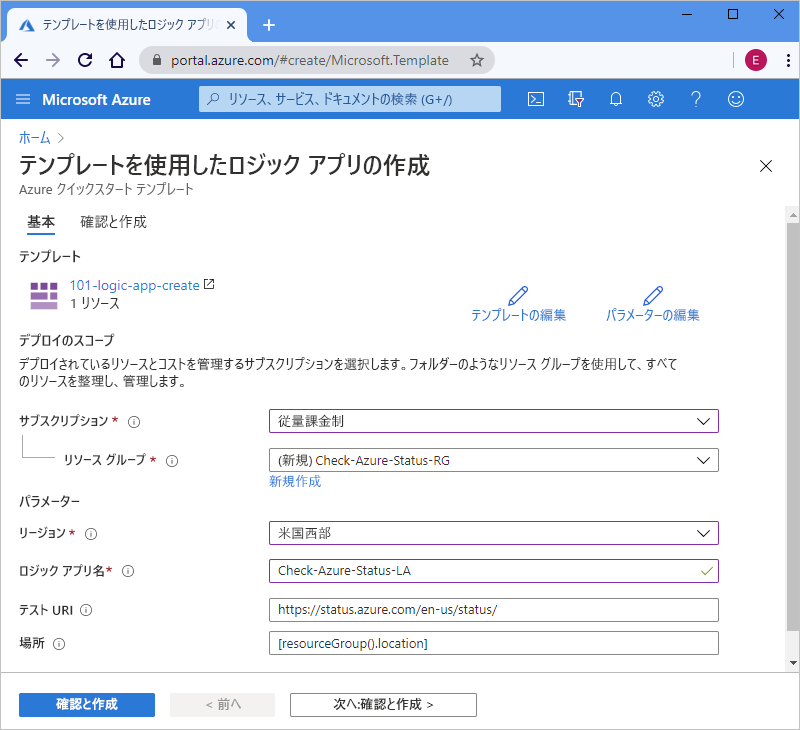

# <a name="quickstart-create-and-deploy-a-logic-app-workflow-by-using-an-arm-template"></a>クイック スタート:ARM テンプレートを使用してロジック アプリ ワークフローを作成してデプロイする

[Azure Logic Apps](../logic-apps/logic-apps-overview.md) は、[数百のコネクタ](/connectors/connector-reference/connector-reference-logicapps-connectors)から選択することで、データ、アプリ、クラウドベースのサービス、オンプレミスのシステムを統合する自動化されたワークフローを作成して実行するのに役立つクラウド サービスです。 このクイック スタートでは、Azure Resource Manager テンプレート (ARM テンプレート) をデプロイし、1 時間ごとのスケジュールで Azure の状態を確認する基本的なロジック アプリを作成するプロセスに焦点を当てます。 

[!INCLUDE [About Azure Resource Manager](../../includes/resource-manager-quickstart-introduction.md)]

環境が前提条件を満たしていて、ARM テンプレートの使用に慣れている場合は、 **[Azure へのデプロイ]** ボタンを選択します。 Azure portal でテンプレートが開きます。

[](https://portal.azure.com/#create/Microsoft.Template/uri/https%3a%2f%2fraw.githubusercontent.com%2fAzure%2fazure-quickstart-templates%2fmaster%2f101-logic-app-create%2fazuredeploy.json)

## <a name="prerequisites"></a>前提条件

Azure サブスクリプションをお持ちでない場合は、開始する前に[無料の Azure アカウント](https://azure.microsoft.com/free/?WT.mc_id=A261C142F)を作成してください。

## <a name="review-the-template"></a>テンプレートを確認する

このクイック スタートでは、[**ロジック アプリの作成**](https://azure.microsoft.com/resources/templates/101-logic-app-create/)テンプレートを使用します。これは、[Azure クイック スタート テンプレート ギャラリー](https://azure.microsoft.com/resources/templates) にありますが、長すぎるため、ここには表示できません。 代わりに、テンプレート ギャラリーのクイック スタート テンプレートの ["azuredeploy.json ファイル"](https://github.com/Azure/azure-quickstart-templates/blob/master/101-logic-app-create/azuredeploy.json) を確認できます。

クイック スタート テンプレートでは、1 時間ごとに実行するように設定されている繰り返しトリガーと、Azure の状態を返す URL を呼び出す HTTP の "[*組み込み*" アクション](../connectors/built-in.md)を使用して、ロジック アプリ ワークフローを作成します。 組み込みアクションは、Azure Logic Apps プラットフォームにネイティブなものです。

このテンプレートでは、次の Azure リソースを作成します。

* [**Microsoft.Logic/workflows**](/azure/templates/microsoft.logic/workflows)。ロジック アプリのワークフローを作成します。

Azure Logic Apps の他のクイック スタート テンプレートについては、ギャラリーの [Microsoft.Logic](https://azure.microsoft.com/resources/templates/?resourceType=Microsoft.Logic) テンプレートを確認してください。

<a name="deploy-template"></a>

## <a name="deploy-the-template"></a>テンプレートのデプロイ

クイック スタート テンプレートをデプロイするために使用するオプションに従います。

| オプション | 説明 |
|--------|-------------|
| [Azure Portal](../logic-apps/quickstart-create-deploy-azure-resource-manager-template.md?tabs=azure-portal#deploy-template) | Azure 環境で前提条件が満たされており、ARM テンプレートの使用に慣れている場合は、これらの手順が、Azure に直接サインインし、Azure portal でクイック スタート テンプレートを開くのに役立ちます。 詳細については、「[ARM テンプレートと Azure portal でリソースをデプロイする](../azure-resource-manager/templates/deploy-portal.md)」を参照してください。 |
| [Azure CLI](../logic-apps/quickstart-create-deploy-azure-resource-manager-template.md?tabs=azure-cli#deploy-template) | Azure コマンド ライン インターフェイス (Azure CLI) は、Azure リソースを作成および管理するためのコマンド セットです。 これらのコマンドを実行するには、Azure CLI バージョン 2.6 以降が必要です。 ご利用の CLI のバージョンを確認するには、「`az --version`」と入力します。 詳細については、以下のトピックを参照してください。 <p><p>- [Azure CLI とは](/cli/azure/what-is-azure-cli) <br>- [Azure CLI の概要](/cli/azure/get-started-with-azure-cli) |
| [Azure PowerShell](../logic-apps/quickstart-create-deploy-azure-resource-manager-template.md?tabs=azure-powershell#deploy-template) | Azure PowerShell には、Azure リソースの管理に Azure Resource Manager モデルを使用する一連のコマンドレットが用意されています。 詳細については、以下のトピックを参照してください。 <p><p>- [Azure PowerShell の概要](/powershell/azure/azurerm/overview) <br>- [Azure PowerShell Az モジュールの概要](/powershell/azure/new-azureps-module-az) <br>- [Azure PowerShell の概要](/powershell/azure/get-started-azureps) |
| [Azure Resource Management REST API](../logic-apps/quickstart-create-deploy-azure-resource-manager-template.md?tabs=rest-api#deploy-template) | Azure では、サービス リソースに対する作成、取得、更新、または削除アクセスに使用する HTTP 操作 (メソッド) をサポートするサービス エンドポイントである、Representational State Transfer (REST) API が提供されます。 詳細については、[Azure REST API の概要](/rest/api/azure/)に関するページを参照してください。 |
|||

<a name="deploy-azure-portal"></a>

#### <a name="portal"></a>[ポータル](#tab/azure-portal)

1. 次の画像を選択して Azure アカウントでサインインし、Azure portal でクイック スタート テンプレートを開きます。

   [](https://portal.azure.com/#create/Microsoft.Template/uri/https%3a%2f%2fraw.githubusercontent.com%2fAzure%2fazure-quickstart-templates%2fmaster%2f101-logic-app-create%2fazuredeploy.json)

1. ポータルの **[テンプレートを使用したロジック アプリの作成]** ページで、これらの値を入力するか選択します。

   | プロパティ | 値 | 説明 |
   |----------|-------|-------------|
   | **サブスクリプション** | <*Azure サブスクリプション名*> | 使用する Azure サブスクリプションの名前。 |
   | **リソース グループ** | <*Azure-resource-group-name*> | 新規または既存の Azure リソース グループの名前。 この例では、`Check-Azure-Status-RG` を使用します。 |
   | **リージョン** | <*Azure-region*> | ロジック アプリを使用する Azure データセンターのリージョン。 この例では、`West US` を使用します。 |
   | **ロジック アプリ名** | <*ロジック アプリ名*> | ロジック アプリに使用する名前。 この例では、`Check-Azure-Status-LA` を使用します。 |
   | **テスト URI** | <*test-URI*> | 特定のスケジュールに基づいて呼び出すサービスの URI。 この例では、Azure の状態ページである `https://status.azure.com/en-us/status/` を使用します。 |
   | **場所** |  <*Azure-region-for-all-resources*> | すべてのリソースで使用する Azure リージョン (既定値と異なる場合)。 この例では、リソース グループの場所である既定値の `[resourceGroup().location]` を使用します。 |
   ||||

   この例で使用された値でページがどのように見えるかを、以下に示します。

   

1. 完了したら、 **[確認および作成]** を選択します。

1. 「[デプロイされているリソースを確認する](#review-deployed-resources)」の手順を続行します。

#### <a name="cli"></a>[CLI](#tab/azure-cli)

```azurecli-interactive
read -p "Enter a project name name to use for generating resource names:" projectName &&
read -p "Enter the location, such as 'westus':" location &&
templateUri="https://raw.githubusercontent.com/Azure/azure-quickstart-templates/master/101-logic-app-create/azuredeploy.json" &&
resourceGroupName="${projectName}rg" &&
az group create --name $resourceGroupName --location "$location" &&
az deployment group create --resource-group $resourceGroupName --template-uri  $templateUri &&
echo "Press [ENTER] to continue ..." &&
read
```

詳細については、以下のトピックを参照してください。

* [Azure CLI: az deployment group](/cli/azure/deployment/group)
* [ARM テンプレートと Azure CLI でリソースをデプロイする](../azure-resource-manager/templates/deploy-cli.md)

#### <a name="powershell"></a>[PowerShell](#tab/azure-powershell)

```azurepowershell-interactive
$projectName = Read-Host -Prompt "Enter a project name to use for generating resource names"
$location = Read-Host -Prompt "Enter the location, such as 'westus'"
$templateUri = "https://raw.githubusercontent.com/Azure/azure-quickstart-templates/master/101-logic-app-create/azuredeploy.json"

$resourceGroupName = "${projectName}rg"

New-AzResourceGroup -Name $resourceGroupName -Location "$location"
New-AzResourceGroupDeployment -ResourceGroupName $resourceGroupName -TemplateUri $templateUri

Read-Host -Prompt "Press [ENTER] to continue ..."
```

詳細については、以下のトピックを参照してください。

* [Azure PowerShell: New-AzResourceGroup](/powershell/module/az.resources/new-azresourcegroup)
* [Azure PowerShell: New-AzResourceGroupDeployment](/powershell/module/az.resources/new-azresourcegroupdeployment)
* [ARM テンプレートと Azure PowerShell を使用したリソースのデプロイ](../azure-resource-manager/templates/deploy-powershell.md)

#### <a name="rest-api"></a>[REST API](#tab/rest-api)

1. 既存の Azure リソース グループを使用しない場合は、Resource Management REST API に送信する要求でこの構文に従って、新しいリソース グループを作成します。

   ```http
   PUT https://management.azure.com/subscriptions/{subscriptionId}/resourcegroups/{resourceGroupName}?api-version=2019-10-01
   ```

   | 値 | 説明 |
   |-------|-------------|
   | `subscriptionId`| 使用する Azure サブスクリプションの GUID |
   | `resourceGroupName` | 作成する Azure リソース グループの名前。 この例では、`Check-Azure-Status-RG` を使用します。 |
   |||

   次に例を示します。

   ```http
   PUT https://management.azure.com/subscriptions/xxxxXXXXxxxxXXXXX/resourcegroups/Check-Azure-Status-RG?api-version=2019-10-01
   ```

   詳細については、以下のトピックを参照してください。

   * [Azure REST API リファレンス - Azure REST API を呼び出す方法](/rest/api/azure/)
   * [Resource Management REST API: リソース グループ - 作成または更新](/rest/api/resources/resourcegroups/createorupdate)。

1. リソース グループにクイック スタート テンプレートをデプロイするには、Resource Management REST API に送信する要求でこの構文に従います。

   ```http
   PUT https://management.azure.com/subscriptions/{subscriptionId}/resourcegroups/{resourceGroupName}/providers/Microsoft.Resources/deployments/{deploymentName}?api-version=2019-10-01
   ```

   | 値 | 説明 |
   |-------|-------------|
   | `subscriptionId`| 使用する Azure サブスクリプションの GUID |
   | `resourceGroupName` | 使用する Azure リソース グループの名前。 この例では、`Check-Azure-Status-RG` を使用します。 |
   | `deploymentName` | デプロイに使用する名前。 この例では、`Check-Azure-Status-LA` を使用します。 |
   |||

   次に例を示します。

   ```http
   PUT https://management.azure.com/subscriptions/xxxxXXXXxxxxXXXXX/resourcegroups/Check-Azure-Status-RG/providers/Microsoft.Resources/deployments/Check-Azure-Status-LA?api-version=2019-10-01
   ```

   詳細については、[Resource Management REST API: デプロイ - 作成または更新](/rest/api/resources/deployments/createorupdate)に関するページを参照してください。

1. デプロイに使用する値 (Azure リージョン、クイック スタート テンプレートへのリンク、デプロイ時に使用するクイック スタート テンプレートの値を含む[パラメーター ファイル](../azure-resource-manager/templates/template-parameters.md)へのリンクなど) を指定するには、Resource Management REST API に送信する要求本文でこの構文に従います。

   ```json
   {
      "location": "{Azure-region}",
      "properties": {
         "templateLink": {
            "uri": "{quickstart-template-URL}",
            "contentVersion": "1.0.0.0"
         },
         "parametersLink": {
            "uri": "{quickstart-template-parameter-file-URL}",
            "contentVersion": "1.0.0.0"
         },
         "mode": "Incremental"
      }
   }
   ```

   | プロパティ | 値 | 説明 |
   |----------|-------|-------------|
   | `location`| <*Azure-region*> | デプロイに使用する Azure リージョン。 この例では、`West US` を使用します。 |
   | `templateLink` : `uri` | <*quickstart-template-URL*> | デプロイに使用するクイック スタート テンプレートの URL の場所: <p><p>`https://raw.githubusercontent.com/Azure/azure-quickstart-templates/master/101-logic-app-create/azuredeploy.json`. |
   | `parametersLink` : `uri` | <*quickstart-template-parameter-file-URL*> | デプロイに使用するクイック スタート テンプレートのパラメーター ファイルの URL の場所: <p><p>`https://raw.githubusercontent.com/Azure/azure-quickstart-templates/master/101-logic-app-create/azuredeploy.parameters.json` <p><p>Resource Manager パラメーター ファイルの詳細については、これらのトピックを参照してください。 <p><p>- [Resource Manager パラメーター ファイルを作成する](../azure-resource-manager/templates/parameter-files.md) <br>- [チュートリアル:パラメーター ファイルを使用して ARM テンプレートをデプロイする](../azure-resource-manager/templates/template-tutorial-use-parameter-file.md) |
   | `mode` | <*deployment-mode*> | 増分更新または完全更新のいずれかを実行します。 この例では `Incremental` を使用します。これが既定値です。 詳しくは、「[Azure Resource Manager のデプロイ モード](../azure-resource-manager/templates/deployment-modes.md)」を参照してください。 |
   |||

   次に例を示します。

   ```json
   {
      "location": "West US",
      "properties": {
         "templateLink": {
            "uri": "https://raw.githubusercontent.com/Azure/azure-quickstart-templates/master/101-logic-app-create/azuredeploy.json",
            "contentVersion": "1.0.0.0"
         },
         "parametersLink": {
            "uri": "https://raw.githubusercontent.com/Azure/azure-quickstart-templates/master/101-logic-app-create/azuredeploy.parameters.json",
            "contentVersion": "1.0.0.0"
         },
         "mode": "Incremental"
      }
   }
   ```

詳細については、以下のトピックを参照してください。

* [Resource Management REST API](/rest/api/resources/)
* [ARM テンプレートと Resource Manager REST API を使用してリソースをデプロイする](../azure-resource-manager/templates/deploy-rest.md)

---

<a name="review-deployed-resources"></a>

## <a name="review-deployed-resources"></a>デプロイされているリソースを確認する

ロジック アプリを表示するには、Azure portal を使用するか、Azure CLI または Azure PowerShell で作成したスクリプトを実行するか、Logic App REST API を使用します。

### <a name="portal"></a>[ポータル](#tab/azure-portal)

1. Azure portal の検索ボックスに、ロジック アプリの名前 (この例では `Check-Azure-Status-LA`) を入力します。 結果の一覧からロジック アプリを選択します。

1. Azure portal で、ロジック アプリ (この例では `Check-Azure-Status-RG`) を見つけて選択します。

1. ロジック アプリ デザイナーが開いたら、クイック スタート テンプレートによって作成されたロジック アプリを確認します。

1. ロジック アプリをテストするには、デザイナーのツール バーで **[実行]** を選択します。

### <a name="cli"></a>[CLI](#tab/azure-cli)

```azurecli-interactive
echo "Enter your logic app name:" &&
read logicAppName &&
az logic workflow show --name $logicAppName &&
echo "Press [ENTER] to continue ..."
```

詳細については、[Azure CLI: az logic workflow show](/cli/azure/ext/logic/logic/workflow#ext-logic-az-logic-workflow-show) に関する記述を参照してください。

### <a name="powershell"></a>[PowerShell](#tab/azure-powershell)

```azurepowershell-interactive
$logicAppName = Read-Host -Prompt "Enter your logic app name"
Get-AzLogicApp -Name $logicAppName
Write-Host "Press [ENTER] to continue..."
```

詳細については、[Azure PowerShell: Get-AzLogicApp](/powershell/module/az.logicapp/get-azlogicapp) に関する記述を参照してください。

### <a name="rest-api"></a>[REST API](#tab/rest-api)

```http
GET https://management.azure.com/subscriptions/{subscriptionId}/resourceGroups/{resourceGroupName}/providers/Microsoft.Logic/workflows/{workflowName}?api-version=2016-06-01
```

| 値 | 説明 |
|-------|-------------|
| `subscriptionId`| クイック スタート テンプレートをデプロイした Azure サブスクリプションの GUID。 |
| `resourceGroupName` | クイック スタート テンプレートをデプロイした Azure リソース グループの名前。 この例では、`Check-Azure-Status-RG` を使用します。 |
| `workflowName` | デプロイしたロジック アプリの名前。 この例では、`Check-Azure-Status-LA` を使用します。 |
|||

次に例を示します。

```http
GET https://management.azure.com/subscriptions/xxxxXXXXxxxxXXXXX/resourceGroups/Check-Azure-Status-RG/providers/Microsoft.Logic/workflows/Check-Azure-Status-LA?api-version=2016-06-01
```

詳細については、[Logic Apps REST API: Workflows - Get](/rest/api/logic/workflows/get) に関する記述を参照してください。

---

## <a name="clean-up-resources"></a>リソースをクリーンアップする

後続のクイック スタートおよびチュートリアルで引き続き作業を行う場合は、これらのリソースを保持することをお勧めします。 ロジック アプリが不要になったら、Azure portal、Azure CLI、Azure PowerShell、または Resource Management REST API を使用して、リソース グループを削除します。

### <a name="portal"></a>[ポータル](#tab/azure-portal)

1. Azure portal で、削除するリソース グループ (この例では `Check-Azure-Status-RG`) を見つけて選択します。

1. リソース グループのメニューで、 **[概要]** を選択します (まだ選択されていない場合)。 概要ページで、 **[リソース グループの削除]** を選択します。

1. 確定するには、リソース グループの名前を入力します。

詳細については、「[リソース グループの削除](../azure-resource-manager/management/delete-resource-group.md?tabs=azure-portal#delete-resource-group)」を参照してください。

### <a name="cli"></a>[CLI](#tab/azure-cli)

```azurecli-interactive
echo "Enter your resource group name:" &&
read resourceGroupName &&
az group delete --name $resourceGroupName &&
echo "Press [ENTER] to continue ..."
```

詳細については、[Azure CLI: az group delete](/cli/azure/group#az_group_delete) に関する記述を参照してください。

### <a name="powershell"></a>[PowerShell](#tab/azure-powershell)

```azurepowershell-interactive
$resourceGroupName = Read-Host -Prompt "Enter the resource group name"
Remove-AzResourceGroup -Name $resourceGroupName
Write-Host "Press [ENTER] to continue..."
```

詳細については、[Azure PowerShell: Remove-AzResourceGroup](/powershell/module/azurerm.resources/remove-azurermresourcegroup) に関するページを参照してください。

### <a name="rest-api"></a>[REST API](#tab/rest-api)

```http
DELETE https://management.azure.com/subscriptions/{subscriptionId}/resourcegroups/{resourceGroupName}?api-version=2019-10-01
```

| 値 | 説明 |
|-------|-------------|
| `subscriptionId`| クイック スタート テンプレートをデプロイした Azure サブスクリプションの GUID。 |
| `resourceGroupName` | クイック スタート テンプレートをデプロイした Azure リソース グループの名前。 この例では、`Check-Azure-Status-RG` を使用します。 |
|||

次に例を示します。

```http
GET https://management.azure.com/subscriptions/xxxxXXXXxxxxXXXXX/resourceGroups/Check-Azure-Status-RG?api-version=2019-10-01
```

詳細については、[Resource Management REST API: リソース グループ - 削除](/rest/api/resources/resourcegroups/delete)に関するページを参照してください。

---

## <a name="next-steps"></a>次のステップ

> [!div class="nextstepaction"]
> [チュートリアル:初めての ARM テンプレートを作成してデプロイする](../azure-resource-manager/templates/template-tutorial-create-first-template.md)
