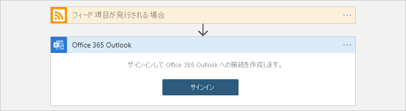

# クイックスタート: マルチテナントの Azure Logic Apps および Azure portal を使用して統合ワークフローを作成する

このクイックスタートでは、["*マルチテナント*"Azure Logic Apps](logic-apps-overview.md) を使用して、Web サイトの RSS フィードと電子メール アカウントの 2 つのサービスを統合する、自動化されたサンプル ワークフローを作成する方法について説明します。 この例はクラウドベースですが、Azure Logic Apps では、クラウド、オンプレミス、ハイブリッド環境でアプリ、データ、サービス、システムを接続するワークフローがサポートされています。 マルチテナントとシングルテナントの Azure Logic Apps の比較の詳細については、「[シングルテナントとマルチテナント、および統合サービス環境](single-tenant-overview-compare.md)」を参照してください。

この例では、RSS コネクタと Office 365 Outlook コネクタを使用するロジック アプリのリソースとワークフローを作成します。 このリソースはマルチテナント Azure Logic Apps で実行され、[従量課金モデル](logic-apps-pricing.md#consumption-pricing)に基づいています。 RSS コネクタには、スケジュールに基づいて RSS フィードをチェックするトリガーがあります。 Office 365 Outlook コネクタには、新しい項目ごとに電子メールを送信するアクションがあります。 この例のコネクタは、ワークフローで使用できる[数百個のコネクタ](/connectors/connector-reference/connector-reference-logicapps-connectors)の中の 2 つにすぎません。

次のスクリーンショットは、大まかなサンプル ワークフローを示しています。

このクイックスタートでは、これらの基本的な手順について説明します。

* マルチテナント Azure Logic Apps 環境で実行されるロジック アプリ リソースを作成する。
* "空のロジック アプリ" テンプレートを選択する。
* ワークフローを実行するタイミングを指定するトリガーを追加する。
* トリガーが起動した後にタスクを実行するアクションを追加する。
* ワークフローを実行する。

他のツールを使用してロジック アプリ リソースを作成および管理するには、これらの他の Azure Logic Apps クイックスタートをご覧ください。

* [Visual Studio Code でロジック アプリを作成および管理する](quickstart-create-logic-apps-visual-studio-code.md)
* [Visual Studio でロジック アプリを作成および管理する](quickstart-create-logic-apps-with-visual-studio.md)
* [Azure コマンド ライン インターフェイス (Azure CLI) を使用してロジック アプリを作成および管理する](quickstart-logic-apps-azure-cli.md)

## 必須コンポーネント

* Azure アカウントとサブスクリプション。 サブスクリプションをお持ちでない場合には、[無料の Azure アカウントにサインアップ](https://azure.microsoft.com/free/?WT.mc_id=A261C142F)してください。

* Office 365 Outlook や Outlook.com など、Azure Logic Apps と連携するサービスの電子メール アカウント。 サポートされている他の電子メール プロバイダーについては、[Azure Logic Apps のコネクタ](/connectors/connector-reference/connector-reference-logicapps-connectors)に関する記事をご覧ください。

  > [!NOTE]
  > [Gmail コネクタ](/connectors/gmail/)を使用する場合、Azure Logic Apps で制限なしにこのコネクタを使用できるのは、G Suite アカウントだけです。 コンシューマー Gmail アカウントを持っている場合は、[Gmail コネクタでの認証に使用する Google クライアント アプリを作成](/connectors/gmail/#authentication-and-bring-your-own-application)しない限り、Google によって承認された特定のサービスでのみこのコネクタを使用できます。 詳細については、「[Azure Logic Apps での Google コネクタのデータ セキュリティとプライバシー ポリシー](../connectors/connectors-google-data-security-privacy-policy.md)」を参照してください。

* 特定の IP アドレスへのトラフィックを制限するファイアウォールがある場合は、自分のロジック アプリ ワークフローを作成する Azure リージョンの Logic Apps サービスで使用される [インバウンド](logic-apps-limits-and-config.md#inbound)と [アウトバウンド](logic-apps-limits-and-config.md#outbound)の IP アドレスの "*両方*" へのアクセスを許可するようにファイアウォールを設定します。

  この例では、[Microsoft が管理する](../connectors/managed.md) RSS および Office 365 Outlook コネクタを使用します。 これらのコネクタでは、ロジック アプリ リソースの Azure リージョン内の "*すべて*" の[マネージド コネクタ アウトバウンド IP アドレス](/connectors/common/outbound-ip-addresses)へのアクセスを許可するようにファイアウォールを設定する必要があります。

## ロジック アプリ リソースを作成する

1. Azure アカウントで [Azure Portal](https://portal.azure.com) にサインインします。

1. Azure の検索ボックスに「`logic apps`」と入力し、**ロジック アプリ** を選択します。

   

1. **[ロジック アプリ]** ページで **[追加]** を選択します。

   ![Azure portal と、Logic Apps サービス ページで [追加] オプションが選択されていることを示すスクリーンショット。](./media/quickstart-create-first-logic-app-workflow/add-new-logic-app.png)

1. **[ロジックアプリの作成]** ペインで、使用する Azure サブスクリプションを選択し、ロジック アプリ リソースの新しい[リソース グループ](../azure-resource-manager/management/overview.md#terminology)を作成して、ロジック アプリ リソースに関する基本的な詳細情報を指定します。

   | プロパティ | 値 | 説明 |
   |----------|-------|-------------|
   | **サブスクリプション** | <*Azure サブスクリプション名*> | お使いの Azure サブスクリプションの名前。 |
   | **リソース グループ** | <*Azure-resource-group-name*> | [Azure リソース グループ](../azure-resource-manager/management/overview.md#terminology)の名前。リージョン全体で一意である必要があります。 この例では、"My-First-LA-RG" を使用します。 |
   | **Type** | **従量課金プラン** | リソースに使用するロジック アプリのリソースの種類と課金モデル: 

- **消費量**: このロジック アプリのリソースの種類は、グローバルなマルチテナント Azure Logic Apps で実行され、[従量課金モデル](logic-apps-pricing.md#consumption-pricing)を使用します。 この例では、**消費** モデルを使用します。 
- **標準**: このロジック アプリのリソースの種類はシングルテナント Azure Logic Apps で実行され、[標準課金モデル](logic-apps-pricing.md#standard-pricing)を使用します。 |
   | **ロジック アプリ名** | <*ロジック アプリ名*> | ロジック アプリ リソースの名前。リージョン全体で一意である必要があります。 この例では、"My-First-Logic-App" を使用します。 

**重要**: この名前に含めることができるのは、文字、数字、ハイフン (`-`)、アンダースコア (`_`)、かっこ (`(`、`)`)、ピリオド (`.`) だけです。  |
   | **リージョン** | <*Azure-region*> | アプリの情報を保存する Azure データセンター リージョン。 この例では "米国西部" を使用します。 
**注**: お使いのサブスクリプションが[統合サービス環境](connect-virtual-network-vnet-isolated-environment-overview.md)に関連付けられている場合、この一覧にはこれらの環境が含まれます。 |
   | **Log Analytics を有効にする** | **いいえ** | 診断ログを有効にする場合にのみ、このオプションを変更します。 この例では、このオプションをオフのままにします。 |
   ||||

   

1. 準備ができたら、**[確認および作成]** を選択します。 検証ページで、入力した詳細を確認し、 **[作成]** を選択します。

## 空のテンプレートを選択する

1. Azure によってアプリが正常にデプロイされたら、**[リソースに移動]** を選択します。 または、Azure の検索ボックスに名前を入力して、自分のロジック アプリ リソースを見つけて選択します。

   ![リソースのデプロイ ページと選択された [リソースに移動] ボタンを示すスクリーンショット。](./media/quickstart-create-first-logic-app-workflow/go-to-new-logic-app-resource.png)

   ワークフロー デザイナーが開き、紹介ビデオとよく使用されるトリガーが含まれたページが表示されます。

1. **[テンプレート]** で **[空のロジック アプリ]** を選択します。

   ![ワークフロー デザイナー、テンプレート ギャラリーと、選択された [空のロジック アプリ] テンプレートを示すスクリーンショット。](./media/quickstart-create-first-logic-app-workflow/choose-logic-app-template.png)

   テンプレートを選択すると、デザイナーに空のワークフロー サーフェイスが表示されます。

## トリガーを追加する

ワークフローは、常に 1 つの[トリガー](../logic-apps/logic-apps-overview.md#how-do-logic-apps-work)で開始されます。それにより、ワークフローでアクションを実行する前に満たすべき条件が指定されます。 トリガーが起動するたびに、Azure Logic Apps によりワークフロー インスタンスが作成され、実行されます。 トリガーが起動しない場合、インスタンスは作成されず、実行もされません。 さまざまなトリガーから選択してワークフローを開始できます。

この例では、スケジュールに基づいて RSS フィードをチェックする RSS トリガーを使用します。 フィードに新しい項目が存在すると、トリガーが起動し、新しいワークフロー インスタンスの実行が開始されます。 チェック間に複数の新しい項目が存在する場合は、項目ごとにトリガーが起動し、項目ごとに個別の新しいワークフロー インスタンスが実行されます。

1. ワークフロー デザイナーの検索ボックスの下で、 **[すべて]** を選択します。

1. RSS トリガーを見つけるために、検索ボックスに「`rss`」と入力します。 **[トリガー]** の一覧から、RSS トリガー **[フィード項目が発行される場合]** を選択します。

   ![検索ボックスに「rss」と入力され、[フィード項目が発行される場合] RSS トリガーが選択されているワークフロー デザイナーを示すスクリーンショット。](./media/quickstart-create-first-logic-app-workflow/add-rss-trigger-new-feed-item.png)

1. トリガーの詳細で次の情報を入力します。

   | プロパティ | 必須 | 値 | 説明 |
   |----------|----------|-------|-------------|
   | **RSS フィードの URL** | はい | <*RSS-feed-URL*> | 監視する RSS フィードの URL。 

この例では、`https://feeds.a.dj.com/rss/RSSMarketsMain.xml` のウォール ストリート ジャーナルの RSS フィードを使用しています。 ただし、HTTP 承認を必要としない任意の RSS フィードを使用できます。 ワークフローを簡単にテストできるように、頻繁に発行される RSS フィードを選択します。 |
   | **Chosen property will be used to determine (選択されたプロパティを使用して判断する)** | No | PublishDate | どの項目が新しいかを判断するためのプロパティ。 |
   | **間隔** | はい | 1 | フィードのチェックの間隔 (単位数)。 

この例では、間隔として `1` を使用します。 |
   | **頻度** | はい | 分 | 各間隔に使用する頻度の単位。 

この例では、頻度として `Minute` を使用します。 |
   |||||

   

1. タイトル バー内をクリックして、トリガーの詳細を一時的に折りたたみます。

   

1. 完了したら、ロジック アプリを保存します。これは、Azure portal ですぐに公開されます。 デザイナーのツール バーで、 **[保存]** を選択します。

   このトリガーでは、RSS フィードのチェック以外は何も実行されません。 そのため、トリガーが起動したときの動作を定義するアクションを追加する必要があります。

## アクションを追加する

トリガーに続く[アクション](../logic-apps/logic-apps-overview.md#logic-app-concepts)は、ワークフローでなんらかの操作を実行する後続のステップです。 どのアクションでも、前のステップ (トリガーまたは別のアクション) の出力を使用できます。 さまざまなアクションから選択し、[ワークフローごとの上限](logic-apps-limits-and-config.md#definition-limits)まで複数のアクションを追加できます。また、さまざまなアクション パスを作成することもできます。

この例では、新しい RSS フィード項目に対してトリガーが起動するたびに電子メールを送信する Office 365 Outlook アクションを使用します。 チェック間に複数の新しい項目が存在する場合は、複数の電子メールが届きます。

1. **[フィード項目が発行される場合]** トリガーの下の **[新しいステップ]** を選択します。

   ![ワークフロー トリガーと、選択された [新しいステップ] ボタンを示すスクリーンショット。](./media/quickstart-create-first-logic-app-workflow/add-new-step-under-trigger.png)

1. **[操作を選択してください]** の検索ボックスの下の **[すべて]** を選択します。

1. 検索ボックスに「`send an email`」と入力すると、このアクションを提供するコネクタが見つかります。 **[アクション]** の一覧を特定のアプリまたはサービスに絞り込むには、最初にそのアプリまたはサービスを選択します。

   たとえば、Microsoft の職場または学校アカウントがあり、Office 365 Outlook を使用する場合は、 **[Office 365 Outlook]** を選択します。 個人用の Microsoft アカウントを使用している場合は、**Outlook.com** を選択します。 この例では、Office 365 Outlook を選択して続行します。

   > [!NOTE]
   > サポートされている別の電子メール サービスをワークフローで使用する場合は、ユーザー インターフェイスの外観が若干異なることがあります。 ただし、別の電子メール サービスに接続するための基本的な概念は同じです。

   ![電子メール サービスとして [Office 365 Outlook] が選択された [操作を選択してください] の一覧を示すスクリーンショット。](./media/quickstart-create-first-logic-app-workflow/select-connector.png)

   これで、 **[電子メールの送信]** など、目的のアクションをより簡単に見つけて選択できるようになりました。

   

1. 選択した電子メール サービスで、サインインして ID を認証するよう求められた場合は、その手順をすぐに実行します。

   多くのコネクタでは、続行する前に、まず接続を作成し、ID を認証する必要があります。

   

   > [!NOTE]
   > この例では、Office 365 Outlook に接続するための手動認証を示しています。 ただし、他のサービスでは異なる認証の種類がサポートまたは使用されている場合があります。 シナリオに基づいて、さまざまな方法で接続認証を処理できます。
   > 
   > たとえば、デプロイに Azure Resource Manager テンプレートを使用する場合、接続の詳細などの値をパラメーター化することで、頻繁に変更される入力のセキュリティを強化できます。 詳細については、次のトピックをご覧ください。
   >
   > * [デプロイ用のテンプレート パラメーター](../logic-apps/logic-apps-azure-resource-manager-templates-overview.md#template-parameters)
   > * [OAuth 接続を承認する](../logic-apps/logic-apps-deploy-azure-resource-manager-templates.md#authorize-oauth-connections)
   > * [マネージド ID を利用してアクセスを認証する](../logic-apps/create-managed-service-identity.md)
   > * [ロジック アプリのデプロイ用の接続を認証する](../logic-apps/logic-apps-azure-resource-manager-templates-overview.md#authenticate-connections)

1. **[メールの送信]** アクションで、メールに含める情報を指定します。

   1. **[宛先]** ボックスに、受信者のメール アドレスを入力します。 この例では、自分のメール アドレスを使用します。

      > [!NOTE]
      > **[宛先]** ボックス内や、特定の入力の種類の他のボックス内をクリックすると、 **[動的なコンテンツの追加]** の一覧が表示されます。 この一覧には、現在のアクションの入力として選択できる、以前のステップの出力が表示されます。 現時点では、この一覧は無視してかまいません。 動的なコンテンツの一覧は、次の手順で使用します。

   1. **[件名]** ボックスに、電子メールの件名を入力します。 この例では、「`New RSS item: `」と入力します (末尾に空白スペースを含めます)。

      ![[電子メールの送信] アクションと、[件名] プロパティ ボックス内のカーソルを示すスクリーンショット。](./media/quickstart-create-first-logic-app-workflow/send-email-subject.png)

   1. **[動的なコンテンツの追加]** の一覧で、 **[フィード項目が発行される場合]** の **[フィード タイトル]** を選択します。

      フィード タイトルは、RSS 項目のタイトルを参照するトリガー出力です。 電子メールでは、この出力を使用して RSS 項目のタイトルを示します。

      ![[電子メールの送信] アクションと、[件名] プロパティ ボックス内のカーソルを示すスクリーンショット。動的なコンテンツの一覧が開かれ、トリガー出力の [フィード タイトル] が選択されています。](./media/quickstart-create-first-logic-app-workflow/send-email-subject-dynamic-content.png)

      > [!TIP]
      > 動的なコンテンツのリストで、 **[フィード項目が発行される場合]** トリガーからの出力が表示されない場合は、アクションのヘッダーの横にある **[See more]\(もっと見る\)** を選択します。
      > 
      > ![開かれた動的なコンテンツの一覧と、トリガーに対して選択された [表示を増やす] を示すスクリーンショット。](./media/quickstart-create-first-logic-app-workflow/dynamic-content-list-see-more-actions.png)

      操作を終了すると、電子メールの件名は、次の例のようになります。

      ![[電子メールの送信] アクションと、[フィード タイトル] プロパティが含まれたメールの件名の例を示すスクリーンショット。](./media/quickstart-create-first-logic-app-workflow/send-email-feed-title.png)

      > [!NOTE]
      > デザイナーに **For each** ループが表示されている場合は、**categories-Item** プロパティなど、配列を参照する出力が選択されています。 この出力の種類では、デザイナーによって、出力を参照するアクションに **For each** ループが自動的に追加されます。 これにより、ワークフローで各配列項目に対して同じアクションが実行されます。 
      >
      > ループを削除するには、ループのタイトル バーの省略記号 ( **[...]** ) ボタンを選択し、 **[削除]** を選択します。

   1. **[本文]** ボックスに、メールの本文の内容を入力します。
   
      この例の本文には、各プロパティの説明テキストに続いて、次のプロパティが含まれています。 編集ボックスで空白行を追加するには、Shift + Enter キーを押します。

      | 説明テキスト | プロパティ | 説明 |
      |------------------|----------|-------------|
      | `Title:` | **フィード タイトル** | 項目のタイトル |
      | `Date published:` | **フィードの公開日付** | 項目の公開日時 |
      | `Link:` | **プライマリ フィード リンク** | 項目の URL |
      ||||

      ![ワークフロー デザイナー、[電子メールの送信] アクション、[本文] ボックス内で選択されたプロパティを示すスクリーンショット。](./media/quickstart-create-first-logic-app-workflow/send-email-body.png)

1. ロジック アプリを保存します。 デザイナーのツール バーで、 **[保存]** を選択します。

## ワークフローを実行する

ワークフローが正しく実行されていることを確認するには、トリガーによって、設定されたスケジュールに基づいて RSS フィードがチェックされるまで待ちます。 または、次のスクリーンショットに示すように、ワークフロー デザイナーのツール バーの **[実行]** を選択して、ワークフローを手動で実行することもできます。

![ワークフロー デザイナーと、デザイナーのツール バーで選択された [実行] ボタンを示すスクリーンショット。](./media/quickstart-create-first-logic-app-workflow/run-logic-app-test.png)

RSS フィードに新しい項目がある場合、ワークフローによって、新しい項目ごとに電子メールが送信されます。 それ以外の場合は、次の間隔まで待ってから RSS フィードがもう一度チェックされます。

次のスクリーンショットは、サンプル ワークフローによって送信されたサンプル電子メールを示しています。 この電子メールには、選択した各トリガー出力の詳細と、項目ごとに含めた説明テキストが含まれています。

## 問題のトラブルシューティング

想定どおりにワークフローからメールが届かない場合:

* 該当の電子メール アカウントの迷惑メールまたはスパム フォルダーを確認してください。メッセージが誤ってフィルター処理されている可能性があります。

* 使用している RSS フィードに、前回のスケジュールされたチェックまたは手動チェック以降に発行された項目があることを確認してください。

## リソースをクリーンアップする

このクイックスタートを完了したら、この例のために作成したリソース グループを削除して、サンプル ロジック アプリ リソースと関連リソースを削除します。

1. Azure の検索ボックスに「`resource groups`」と入力し、**[リソース グループ]** を選択します。

   

1. 目的のロジック アプリのリソース グループを見つけて選択します。 **[概要]** ウィンドウで、 **[リソース グループの削除]** を選択します。

   ![選択したリソース グループと [リソース グループの削除] ボタンが表示されている Azure portal を示すスクリーンショット。](./media/quickstart-create-first-logic-app-workflow/delete-resource-group.png)

1. 確認ウィンドウが表示されたら、リソース グループ名を入力して、 **[削除]** を選択します。

   

## 次のステップ

このクイックスタートでは、RSS フィードをチェックし、新しい項目ごとに電子メールを送信する、初めてのロジック アプリ ワークフローを Azure portal で作成しました。 スケジュールされた高度なワークフローの詳細については、次のチュートリアルを参照してください。

> [!div class="nextstepaction"]
> [スケジュールに基づいたロジック アプリでトラフィックをチェックする](../logic-apps/tutorial-build-schedule-recurring-logic-app-workflow.md)
