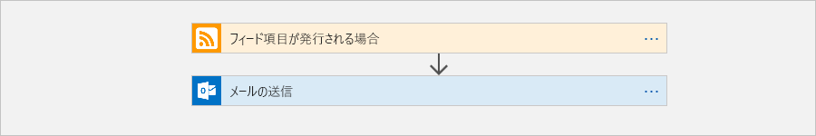
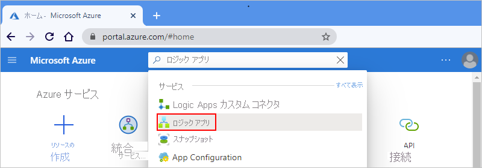
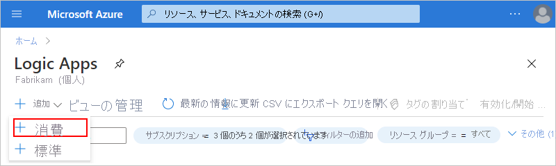
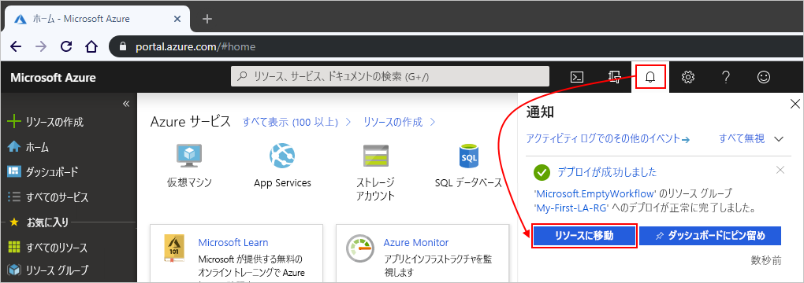
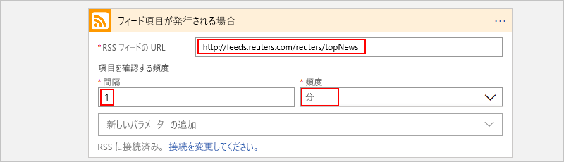
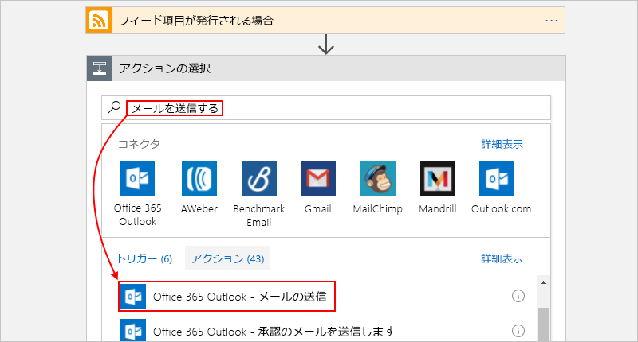
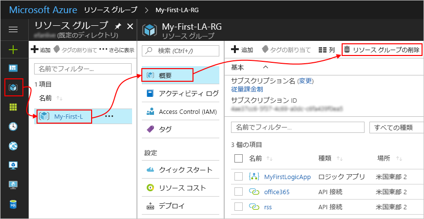

# クイック スタート:Azure Logic Apps を使用して初めてのワークフローを作成する - Azure portal

このクイックスタートでは、空のロジック アプリの作成、トリガーとアクションの追加、ロジック アプリのテストなど、[Azure Logic Apps](../logic-apps/logic-apps-overview.md) を使用して、初めてのワークフローを構築する方法を裏付ける基本的な一般概念を紹介します。 このクイックスタートでは、新しい項目のために Web サイトの RSS フィードを定期的にチェックするロジック アプリを構築します。 新しい項目が存在する場合、ロジック アプリから項目ごとにメールが送信されます。 完成したロジック アプリの大まかなワークフローは、次のようになります。

このシナリオでは、Office 365 Outlook、Outlook.com、Gmail など、Azure Logic Apps によってサポートされているサービスの電子メール アカウントが必要です。 サポートされているその他の電子メール サービスについては、[こちらでコネクタの一覧を確認](https://docs.microsoft.com/connectors/)してください。 この例のロジック アプリでは、Office 365 Outlook を使用します。 別の電子メール サービスを使用する場合、一般的な手順全体は同じですが、ユーザー インターフェイスはやや異なる可能性があります。

また、Azure サブスクリプションがない場合は、[無料の Azure アカウントにサインアップ](https://azure.microsoft.com/free/)してください。

## Azure portal にサインインする

Azure アカウントの資格情報で [Azure Portal](https://portal.azure.com) にサインインします。

## ロジック アプリを作成する

1. Azure ホーム ページから、検索ボックスで **[Logic Apps]** を検索して選択します。

   

1. **[Logic Apps]** ページで **[追加]** を選択します。

   

1. **[Logic App]** に、以下に示すようにロジック アプリに関する詳細を入力します。 完了したら、 **[作成]** を選択します。

   

   | プロパティ | 値 | [説明] |
   |----------|-------|-------------|
   | **Name** | <*ロジック アプリ名*> | ロジック アプリの名前。文字、数字、ハイフン (`-`)、アンダースコア (`_`)、かっこ (`(`、`)`)、およびピリオド (`.`) のみを含めることができます。 この例では、"My-First-Logic-App" を使用します。 |
   | **サブスクリプション** | <*Azure サブスクリプション名*> | お使いの Azure サブスクリプション名 |
   | **リソース グループ** | <*Azure-resource-group-name*> | 関連するリソースの整理に使用する[Azure リソース グループ](../azure-resource-manager/management/overview.md)の名前。 この例では、"My-First-LA-RG" を使用します。 |
   | **Location** | <*Azure-region*> | ロジック アプリの情報の保存先となるリージョン。 この例では "米国西部" を使用します。 |
   | **Log Analytics** | Off | 診断ログの場合は、この設定を**オフ**のままにしてください。 |
   ||||

1. Azure によってアプリがデプロイされた後、Azure ツール バーで、対象のデプロイされたロジック アプリに対して、 **[通知]**  >  **[リソースに移動]** の順に選択します。

   

   または、検索ボックスに名前を入力して、目的のロジック アプリを見つけて選択することもできます。

   ロジック アプリ デザイナーが開き、紹介ビデオとよく使用されるトリガーが含まれたページが表示されます。 **[テンプレート]** で **[空のロジック アプリ]** を選択します。

   

次に、新しい RSS フィード項目が発行されたときに起動される[トリガー](../logic-apps/logic-apps-overview.md#logic-app-concepts)を追加します。 すべてのロジック アプリは必ずトリガーから起動され、トリガーは、特定のイベントが発生するか特定の条件が満たされたときに起動されます。 トリガーが起動されるたびに、Azure Logic Apps エンジンによって、ワークフローを開始および実行するロジック アプリ インスタンスが作成されます。

## RSS トリガーを追加する

1. **ロジック アプリ デザイナー**の検索ボックスの下で、 **[すべて]** を選択します。

1. 検索ボックスに「`rss`」と入力して、RSS コネクタを検索します。 トリガーの一覧から、 **[フィード項目が発行される場合]** トリガーを選択します。

   ![[フィード項目が発行される場合] トリガーを選択する](./media/quickstart-create-first-logic-app-workflow/add-rss-trigger-new-feed-item.png)

1. トリガーに関する情報を次のように入力します。

   

   | プロパティ | 値 | [説明] |
   |----------|-------|-------------|
   | **RSS フィードの URL** | `http://feeds.reuters.com/reuters/topNews` | 監視する RSS フィードのリンク |
   | **間隔** | 1 | チェックの間隔 (単位数) |
   | **頻度** | 分 | チェックの間隔に使う時間の単位  |
   ||||

   ロジック アプリのトリガーには、間隔と頻度の組み合わせでそのスケジュールを定義します。 このロジック アプリでは、1 分おきにフィードをチェックします。

1. ここでは、トリガーの詳細を非表示にするために、トリガーのタイトル バー内をクリックします。

   

1. ロジック アプリを保存します。 デザイナーのツール バーで、 **[保存]** を選択します。

ロジック アプリは現在稼働していますが、RSS フィードをチェックすること以外は何もしていません。 そこで、トリガーが起動したときに反応するアクションを追加します。

## "電子メールの送信" アクションを追加する

今度は、RSS フィードに新しい項目が発行されたときにメールを送信する[アクション](../logic-apps/logic-apps-overview.md#logic-app-concepts)を追加します。

1. **[フィード項目が発行される場合]** トリガーの下の **[新しいステップ]** を選択します。

   ![トリガーで [新しいステップ] を選択する](./media/quickstart-create-first-logic-app-workflow/add-new-step-under-trigger.png)

1. **[アクションを選択してください]** と検索ボックスの下の **[すべて]** を選択します。

1. 検索ボックスに「`send an email`」と入力して、このアクションを提供するコネクタを検索します。 アクションの一覧から、使用する電子メール サービスに対応する "電子メールの送信" アクションを選択します。 この例では、 **[電子メールの送信]** アクションがある Office 365 Outlook コネクタを使用します。

   

   アクション リストを絞り込んで特定のアプリまたはサービスだけが表示されるようにするには、最初にアプリまたはサービスを選択します。

   * Azure の職場または学校アカウントには、Office 365 Outlook を選択します。
   * 個人用 Microsoft アカウントには、Outlook.com を選択します。

1. 選択した電子メール コネクタによって ID の認証を求められた場合は、その手順を完了して、ロジック アプリと電子メール サービス間の接続を作成します。

   > [!NOTE]
   > 今回の例では、手動で ID を認証します。 ただし、認証を必要とするコネクタは、それらがサポートしている認証の種類によって異なります。 また、認証の処理方法を設定するオプションも用意されています。 たとえば、デプロイに Azure Resource Manager テンプレートを使用する場合、接続情報など、頻繁または簡単に変更される入力をパラメーター化して、セキュリティで保護することができます。 詳細については、以下のトピックを参照してください。
   >
   > * [デプロイ用のテンプレート パラメーター](../logic-apps/logic-apps-azure-resource-manager-templates-overview.md#template-parameters)
   > * [OAuth 接続を承認する](../logic-apps/logic-apps-deploy-azure-resource-manager-templates.md#authorize-oauth-connections)
   > * [マネージド ID を利用してアクセスを認証する](../logic-apps/create-managed-service-identity.md)
   > * [ロジック アプリのデプロイ用の接続を認証する](../logic-apps/logic-apps-azure-resource-manager-templates-overview.md#authenticate-connections)

1. **[電子メールの送信]** アクションで、メールに設定するデータを指定します。

   1. **[宛先]** ボックスに、受信者の電子メール アドレスを入力します。 テスト目的のために、ご自身の電子メール アドレスを使用できます。

      **[動的なコンテンツの追加]** リストが表示されますが、ここでは無視してください。 いくつかの編集ボックスは、その内部をクリックすると、このリストが表示され、先行するステップから、ワークフローへの入力として追加できるパラメーターがすべて表示されます。

   1. **[件名]** ボックスに「`New RSS item: `」と入力し、その後ろに空白スペースを追加します。

      ![[件名] プロパティにメールの件名を入力する](./media/quickstart-create-first-logic-app-workflow/add-action-send-email-subject.png)

   1. **[動的なコンテンツの追加]** リストから **[フィード タイトル]** を選択して RSS 項目のタイトルを追加します。

      ![動的コンテンツ リストから [フィード タイトル] プロパティを選択する](./media/quickstart-create-first-logic-app-workflow/add-action-send-email-subject-dynamic-content.png)

      操作を終了すると、電子メールの件名は、次の例のようになります。

      

      デザイナーに "For each" ループが表示される場合、 **[categories-item]\(カテゴリ-項目\)** トークンなど、配列のトークンを選択したことが原因です。 この種のトークンを参照するアクションの前後には、デザイナーによってこのループが自動的に追加されます。 そうすることで個々の配列項目に同じアクションが実行されます。 ループを削除するには、ループのタイトル バーの**省略記号** ( **...** ) を選択し、 **[削除]** を選択します。

   1. **[本文]** ボックスには、メール本文に使用するテキストを次のように入力し、対応するトークンを選択します。 編集ボックスで空白行を追加するには、Shift + Enter キーを押します。

      

      | プロパティ | [説明] |
      |----------|-------------|
      | **フィード タイトル** | 項目のタイトル |
      | **フィードの公開日付** | 項目の公開日時 |
      | **プライマリ フィード リンク** | 項目の URL |
      |||

1. ロジック アプリを保存します。

ロジック アプリのテストに進みます。

## ロジック アプリを実行する

ロジック アプリを手動で開始するには、デザイナーのツール バーの **[実行]** を選択します。 または、指定したスケジュール (1 分おき) に従ってロジック アプリが RSS フィードをチェックするのを待ちます。 RSS フィードに新しい項目がある場合、ロジック アプリは新しい項目ごとに電子メールを送信します。 それ以外の場合、ロジック アプリは、次の機会を待ってからもう一度チェックします。 電子メールが届かない場合は、迷惑メール フォルダーを確認してください。

このロジック アプリからは、次のようなメールが送信されます。

技術的には、トリガーによって RSS フィードがチェックされて新しい項目が見つかると、トリガーが起動され、ワークフローのアクションを実行するロジック アプリ ワークフローのインスタンスが Azure Logic Apps エンジンによって作成されます。 トリガーで新しい項目が見つからなかった場合、トリガーは起動せず、ワークフローのインスタンス作成は "スキップ" されます。

お疲れさまでした。初めてのロジック アプリを Azure portal で正しく作成し、実行することができました。

## リソースをクリーンアップする

このサンプルの必要がなくなったら、ロジック アプリと関連リソースが含まれるリソース グループを削除しましょう。

1. Azure のメイン メニューの **[リソース グループ]** を選択し、対象のロジック アプリのリソース グループを選択します。 **[概要]** ウィンドウで、 **[リソース グループの削除]** を選択します。

   

1. 確認ウィンドウが表示されたら、リソース グループ名を入力して、 **[削除]** を選択します。

   ![削除を確定するために [削除] を選択する](./media/quickstart-create-first-logic-app-workflow/delete-resource-group-2.png)

> [!NOTE]
> ロジック アプリを削除にすると、新しい実行は開始されなくなります。 すべての進行中および保留中の実行は取り消されます。 何千もの実行がある場合、取り消しが完了するまでかなりの時間がかかる場合があります。

## 次のステップ

このクイックスタートでは、初めてのロジック アプリを作成しました。作成したロジック アプリは、指定したスケジュール (1 分おき) で RSS の更新をチェックし、更新があったときはアクション (メール送信) を実行するものです。 さらに理解を深めるために、より高度なスケジュール ベースのワークフローを作成するチュートリアルに取り組みましょう。

> [!div class="nextstepaction"]
> [スケジュールに基づいたロジック アプリでトラフィックをチェックする](../logic-apps/tutorial-build-schedule-recurring-logic-app-workflow.md)
