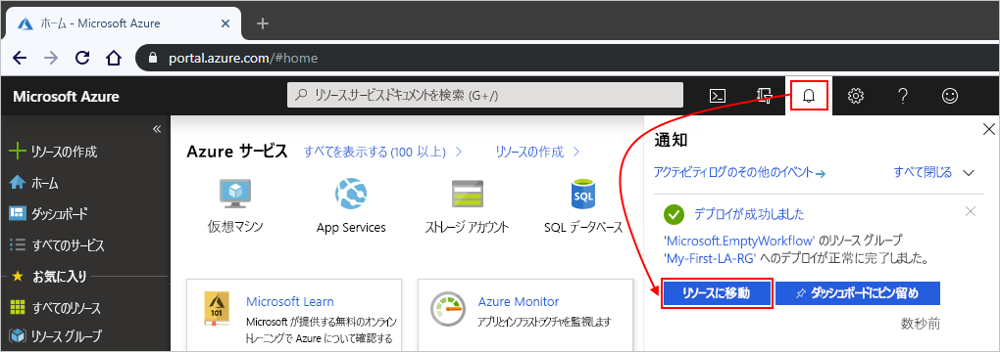
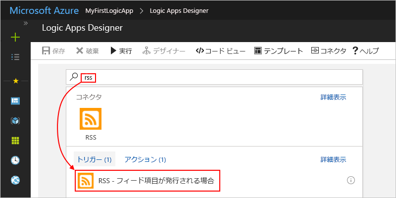

# <a name="quickstart-create-your-first-automated-workflow-with-azure-logic-apps---azure-portal"></a>クイック スタート:Azure Logic Apps を使用して自動化されたワークフローを初めて作成する - Azure portal

このクイックスタートでは、[Azure Logic Apps](../logic-apps/logic-apps-overview.md) を使用して、自動化されたワークフローを初めてビルドする基本的な方法を紹介しています。 この記事では、Web サイトの RSS フィードを定期的にチェックして新しい項目を検出するロジック アプリを作成します。 新しい項目が存在する場合、ロジック アプリから項目ごとにメールが送信されます。 完成したロジック アプリの大まかなワークフローは、次のようになります。


このクイックスタートの手順に従うためには、Office 365 Outlook、Outlook.com、Gmail など、Logic Apps に対応しているプロバイダーのメール アカウントが必要です。 その他のプロバイダーについては、[こちらのコネクタ一覧を参照](https://docs.microsoft.com/connectors/)してください。 このロジック アプリでは、Office 365 Outlook アカウントを使います。 別のメール アカウントをお使いの場合でも、全体的な手順は同じですが、UI がやや異なる場合があります。

また、Azure サブスクリプションがない場合は、[無料の Azure アカウントにサインアップ](https://azure.microsoft.com/free/)してください。

## <a name="sign-in-to-the-azure-portal"></a>Azure portal にサインインします

Azure アカウントの資格情報で [Azure Portal](https://portal.azure.com) にサインインします。

## <a name="create-your-logic-app"></a>ロジック アプリを作成する

1. Azure のメイン メニューで、 **[リソースの作成]**  >  **[統合]**  >  **[ロジック アプリ]** の順に選択します。

   

1. **[ロジック アプリの作成]** で、次に示すようにロジック アプリの詳細を入力します。 完了したら、 **[作成]** を選択します。

   

   | プロパティ | 値 | 説明 |
   |----------|-------|-------------|
   | **Name** | <*ロジック アプリ名*> | ロジック アプリの名前。文字、数字、ハイフン (`-`)、アンダースコア (`_`)、かっこ (`(`、`)`)、およびピリオド (`.`) のみを含めることができます。 この例では、"My-First-Logic-App" を使用します。 |
   | **サブスクリプション** | <*Azure サブスクリプション名*> | お使いの Azure サブスクリプション名 |
   | **リソース グループ** | <*Azure-resource-group-name*> | 関連するリソースの整理に使用する[Azure リソース グループ](../azure-resource-manager/resource-group-overview.md)の名前。 この例では、"My-First-LA-RG" を使用します。 |
   | **Location** | <*Azure-region*> | ロジック アプリの情報の保存先となるリージョン。 この例では "米国西部" を使用します。 |
   | **Log Analytics** | オフ | 診断ログの場合は、この設定を**オフ**のままにしてください。 |
   ||||

1. Azure によってアプリがデプロイされた後、Azure ツール バーで、対象のデプロイされたロジック アプリに対して、 **[通知]**  >  **[リソースに移動]** の順に選択します。

   

   または、検索ボックスに名前を入力して、目的のロジック アプリを見つけて選択することもできます。

   ロジック アプリ デザイナーが開き、紹介ビデオとよく使用されるトリガーが含まれたページが表示されます。 **[テンプレート]** で **[空のロジック アプリ]** を選択します。

   ![[空のロジック アプリ] テンプレートを選択する](./media/quickstart-create-first-logic-app-workflow/choose-logic-app-template.png)

次に、新しい RSS フィード項目が発行されたときに起動される[トリガー](../logic-apps/logic-apps-overview.md#logic-app-concepts)を追加します。 すべてのロジック アプリは必ずトリガーから起動され、トリガーは、特定のイベントが発生するか特定の条件が満たされたときに起動されます。 トリガーが起動するたびに、Logic Apps エンジンによって、ワークフローを開始および実行するロジック アプリ インスタンスが作成されます。

<a name="add-rss-trigger"></a>

## <a name="check-rss-feed-with-a-trigger"></a>トリガーを使って RSS フィードをチェックする

1. ロジック アプリ デザイナーの検索ボックスの下の **[すべて]** を選択します。

1. 検索ボックスに「rss」と入力します。 トリガーの一覧から、 **[フィード項目が発行される場合 - RSS]** トリガーを選択します

   

1. トリガーに関する情報を次のように入力します。

   

   | プロパティ | 値 | 説明 |
   |----------|-------|-------------|
   | **RSS フィードの URL** | ```http://feeds.reuters.com/reuters/topNews``` | 監視する RSS フィードのリンク |
   | **間隔** | 1 | チェックの間隔 (単位数) |
   | **頻度** | 分 | チェックの間隔に使う時間の単位  |
   ||||

   ロジック アプリのトリガーには、間隔と頻度の組み合わせでそのスケジュールを定義します。 このロジック アプリでは、1 分おきにフィードをチェックします。

1. ここではトリガーの詳細を非表示にするために、トリガーのタイトル バー内をクリックします。

   

1. ロジック アプリを保存し、 デザイナーのツール バーで、 **[保存]** を選択します。

ロジック アプリは現在稼働していますが、RSS フィードをチェックすること以外は何もしていません。 そこで、トリガーが起動したときに反応するアクションを追加します。

## <a name="send-email-with-an-action"></a>アクションを使ってメールを送信する

今度は、RSS フィードに新しい項目が発行されたときにメールを送信する[アクション](../logic-apps/logic-apps-overview.md#logic-app-concepts)を追加します。

1. **[フィード項目が発行される場合]** トリガーの下の **[新しいステップ]** を選択します。

   

1. **[アクションを選択してください]** と検索ボックスの下の **[すべて]** を選択します。

1. 検索ボックスに、「メールの送信」と入力します。 アクション リストから、目的のメール プロバイダーの "メールの送信" アクションを選択します。

   

   アクション リストを絞り込んで特定のアプリまたはサービスだけが表示されるようにするには、最初にアプリまたはサービスを選択します。

   * Azure の職場または学校アカウントには、Office 365 Outlook を選択します。
   * 個人用 Microsoft アカウントには、Outlook.com を選択します。

1. 資格情報を求められた場合は、お使いのメール アカウントへの接続が Logic Apps によって作成されるように、そのメール アカウントにサインインします。

1. **[電子メールの送信]** アクションで、メールに設定するデータを指定します。

   1. **[宛先]** ボックスに、受信者の電子メール アドレスを入力します。 テスト目的で自分の電子メール アドレスを使用できます。

      **[動的なコンテンツの追加]** リストが表示されますが、ここでは無視してください。 いくつかの編集ボックスは、その内部をクリックすると、このリストが表示され、先行するステップから、ワークフローへの入力として追加できるパラメーターがすべて表示されます。

   1. **[件名]** ボックスに「```New RSS item:```」と入力し、その後ろに空白スペースを追加します。

      

   1. **[動的なコンテンツの追加]** リストから **[フィード タイトル]** を選択して RSS 項目のタイトルを追加します。

      

      操作を終了すると、電子メールの件名は、次の例のようになります。

      

      デザイナーに "For each" ループが表示される場合、 **[categories-item]\(カテゴリ-項目\)** トークンなど、配列のトークンを選択したことが原因です。 この種のトークンを参照するアクションの前後には、デザイナーによってこのループが自動的に追加されます。 そうすることで個々の配列項目に同じアクションが実行されます。 ループを削除するには、ループのタイトル バーの**省略記号** ( **...** ) を選択し、 **[削除]** を選択します。

   1. **[本文]** ボックスには、メール本文に使用するテキストを次のように入力し、対応するトークンを選択します。 編集ボックスで空白行を追加するには、Shift + Enter キーを押します。

      

      | プロパティ | 説明 |
      |----------|-------------|
      | **フィード タイトル** | 項目のタイトル |
      | **フィードの公開日付** | 項目の公開日時 |
      | **プライマリ フィード リンク** | 項目の URL |
      |||

1. ロジック アプリを保存し、

ロジック アプリのテストに進みます。

## <a name="run-your-logic-app"></a>ロジック アプリを実行する

ロジック アプリを手動で開始するには、デザイナーのツール バーの **[実行]** を選択します。 または、指定したスケジュール (1 分おき) に従ってロジック アプリが RSS フィードをチェックするのを待ちます。 RSS フィードに新しい項目がある場合、ロジック アプリは新しい項目ごとに電子メールを送信します。 それ以外の場合、ロジック アプリは、次の機会を待ってからもう一度チェックします。 電子メールが届かない場合は、迷惑メール フォルダーを確認してください。

このロジック アプリからは、次のようなメールが送信されます。


技術的には、トリガーが RSS フィードをチェックして新しい項目を見つけると、トリガーが起動し、ワークフローのアクションを実行するロジック アプリのワークフローのインスタンスが Logic Apps エンジンによって作成されます。 トリガーで新しい項目が見つからなかった場合、トリガーは起動せず、ワークフローのインスタンス作成は "スキップ" されます。

お疲れさまでした。初めてのロジック アプリを Azure portal で正しく作成し、実行することができました。

## <a name="clean-up-resources"></a>リソースのクリーンアップ

このサンプルの必要がなくなったら、ロジック アプリと関連リソースが含まれるリソース グループを削除しましょう。

1. Azure のメイン メニューの **[リソース グループ]** を選択し、対象のロジック アプリのリソース グループを選択します。 **[概要]** ウィンドウで、 **[リソース グループの削除]** を選択します。

   ![[リソース グループ] > [概要] > [リソース グループの削除]](./media/quickstart-create-first-logic-app-workflow/delete-resource-group.png)

1. 確認のためにリソース グループ名を入力し、 **[削除]** を選択します。

   

> [!NOTE]
> ロジック アプリを削除にすると、新しい実行は開始されなくなります。 すべての進行中および保留中の実行は取り消されます。 何千もの実行がある場合、取り消しが完了するまでかなりの時間がかかる場合があります。

## <a name="get-support"></a>サポートを受ける

質問がある場合は、[Azure Logic Apps フォーラム](https://social.msdn.microsoft.com/Forums/home?forum=azurelogicapps)にアクセスしてください。

## <a name="next-steps"></a>次の手順

このクイックスタートでは、初めてのロジック アプリを作成しました。作成したロジック アプリは、指定したスケジュール (1 分おき) で RSS の更新をチェックし、更新があったときはアクション (メール送信) を実行するものです。 さらに理解を深めるために、より高度なスケジュール ベースのワークフローを作成するチュートリアルに取り組みましょう。

> [!div class="nextstepaction"]
> [スケジュールに基づいたロジック アプリでトラフィックをチェックする](../logic-apps/tutorial-build-schedule-recurring-logic-app-workflow.md)
