# クイック スタート: Azure Logic Apps を使用してタスク、プロセス、ワークフローを作成および自動化する - Visual Studio

[Azure Logic Apps](../logic-apps/logic-apps-overview.md) と Visual Studio を使用して、企業および組織の間でアプリ、データ、システム、サービスを統合するタスクとプロセスを自動化するワークフローを作成できます。 このクイックスタートでは、これらのワークフローを設計して構築する方法について説明します。そのために、Visual Studio でロジック アプリを作成し、それらのアプリをクラウドの <a href="https://docs.microsoft.com/azure/guides/developer/azure-developer-guide" target="_blank">Azure</a> にデプロイします。 これらのタスクは <a href="https://portal.azure.com" target="_blank">Azure Portal</a> でも実行できます。しかし、Visual Studio を使用すれば、ロジック アプリをソース管理に追加したり、さまざまなバージョンを発行したり、異なるデプロイ環境用の Azure Resource Manager テンプレートを作成したりできます。 

Azure Logic Apps を使用するのが初めてであり、単に基本的な概念を確認したい場合は、[Azure Portal でのロジック アプリの作成に関するクイックスタート](../logic-apps/quickstart-create-first-logic-app-workflow.md)をお試しください。 ロジック アプリ デザイナーの機能は、Azure Portal でも Visual Studio でも同様です。 

ここでは、Azure Portal のクイックスタートと同じロジック アプリを、Visual Studio で作成します。 このロジック アプリでは、Web サイトの RSS フィードを監視し、サイトに投稿される新しい項目ごとにメールを送信します。 完成したロジック アプリの大まかなワークフローは、次のようになります。

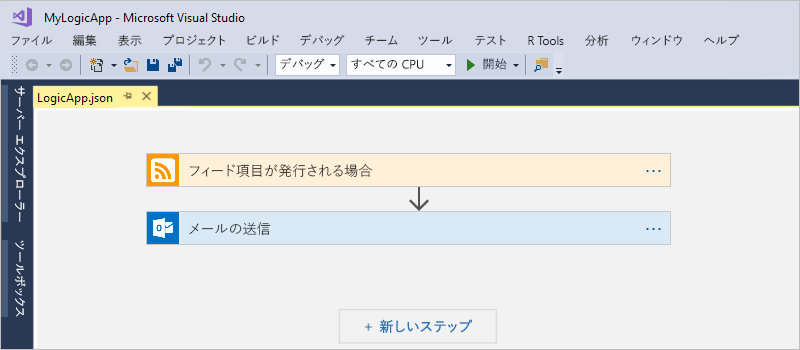

開始する前に、以下を用意してください。

* Azure サブスクリプションがない場合は、<a href="https://azure.microsoft.com/free/" target="_blank">無料の Azure アカウントにサインアップ</a>してください。

* まだお持ちでない場合は、以下のツールをダウンロードしてインストールしてください。 

  * <a href="https://www.visualstudio.com/downloads" target="_blank">Visual Studio 2017 または Visual Studio 2015 - Community エディション以上</a>。 
  このクイックスタートでは、無料の Visual Studio Community 2017 を使用します。

  * <a href="https://azure.microsoft.com/downloads/" target="_blank">Microsoft Azure SDK for .NET (2.9.1 以降)</a> と <a href="https://github.com/Azure/azure-powershell#installation" target="_blank">Azure PowerShell</a>。 
  <a href="https://docs.microsoft.com/dotnet/azure/dotnet-tools?view=azure-dotnet">Azure SDK for .NET</a> の詳細を参照してください。

  * <a href="https://marketplace.visualstudio.com/items?itemName=VinaySinghMSFT.AzureLogicAppsToolsforVisualStudio-18551" target="_blank">Azure Logic Apps Tools for Visual Studio 2017</a> または <a href="https://marketplace.visualstudio.com/items?itemName=VinaySinghMSFT.AzureLogicAppsToolsforVisualStudio" target="_blank">Visual Studio 2015 バージョン</a>
  
    Azure Logic Apps Tools は、Visual Studio Marketplace から直接ダウンロードしてインストールできます。または、<a href="https://docs.microsoft.com/visualstudio/ide/finding-and-using-visual-studio-extensions" target="_blank">この拡張機能を Visual Studio 内からインストールする方法</a>を確認できます。 
    インストールが完了したら、必ず Visual Studio を再起動してください。

* Logic Apps でサポートされるメール アカウント (Office 365 Outlook、Outlook.com、Gmail など)。 その他のプロバイダーについては、<a href="https://docs.microsoft.com/connectors/" target="_blank">こちらのコネクタ一覧を参照</a>してください。 このロジック アプリでは、Office 365 Outlook を使用します。 別のプロバイダーを使用する場合も、全体的な手順は同じです。ただし、UI がやや異なる場合があります。

* 組み込みのロジック アプリ デザイナーを使用する際の Web へのアクセス

  デザイナーが Azure でリソースを作成し、ロジック アプリでコネクタからプロパティとデータを読み取るためには、インターネット接続が必要です。 
  たとえば、Dynamics CRM Online コネクタを使用する場合、デザイナーは CRM インスタンスの使用可能な既定およびカスタムのプロパティをチェックします。

## Azure リソース グループ プロジェクトを作成する

最初に、[Azure リソース グループ プロジェクト](../azure-resource-manager/vs-azure-tools-resource-groups-deployment-projects-create-deploy.md)を作成します。 Azure リソース グループとリソースについて詳しくは、[こちら](../azure-resource-manager/resource-group-overview.md)を参照してください。

1. Visual Studio を起動し、Azure アカウントでサインインします。

2. **[ファイル]** メニューで、**[新規作成]** > **[プロジェクト]** の順に選択します  (Ctrl + Shift + N キー)。

   ![[ファイル] メニューで [新規作成]、[プロジェクト] の順に選択する](./media/quickstart-create-logic-apps-with-visual-studio/create-new-visual-studio-project.png)

3. **[インストール済み]** で、**[Visual C#]** または **[Visual Basic]** を選択します。 **[クラウド]** > **[Azure リソース グループ]** の順に選択します。 プロジェクトに名前を付けます。例:

   

4. **[ロジック アプリ]** テンプレートを選択します。 

   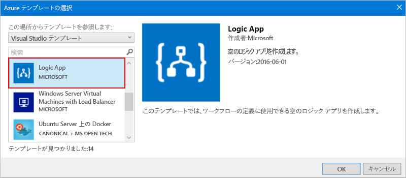

   プロジェクトが作成された後、ソリューション エクスプローラーが開かれ、ソリューションが表示されます。 

   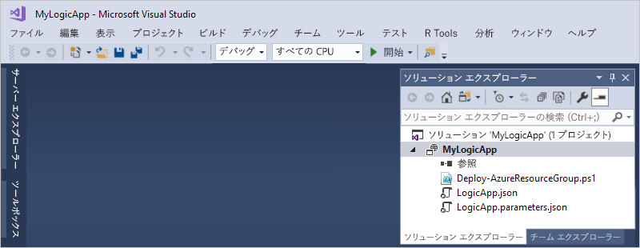

   ソリューション内の **LogicApp.json** ファイルには、ロジック アプリの定義が格納されます。それだけでなく、このファイルは、デプロイの設定を行える Azure Resource Manager テンプレートでもあります。

## 空のロジック アプリを作成する

Azure リソース グループ プロジェクトを作成した後、**[空のロジック アプリ]** テンプレートからロジック アプリを作成して構築します。

1. ソリューション エクスプローラーで、**LogicApp.json** ファイルのショートカット メニューを開きます。 **[Open With Logic App Designer]\(ロジック アプリ デザイナーで開く\)** を選択します  (Ctrl + L キー)。

   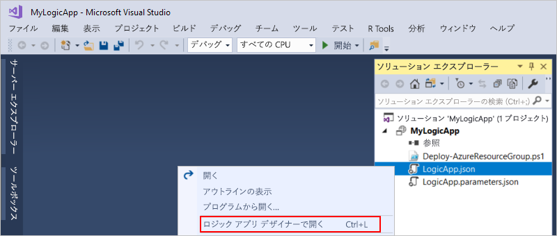

2. **[サブスクリプション]** で、使用する Azure サブスクリプションを選択します。 **[リソース グループ]** で **[新規作成...]** を選択します。これで、新しい Azure リソース グループが作成されます。 

   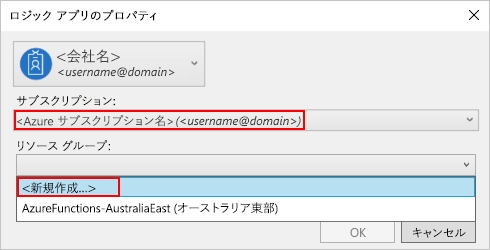

   Visual Studio では、ロジック アプリと接続に関連付けられたリソースの作成とデプロイに、Azure サブスクリプションとリソース グループが必要です。 

   | Setting | 値の例 | 説明 | 
   | ------- | ------------- | ----------- | 
   | ユーザー プロファイルの一覧 | Contoso   jamalhartnett@contoso.com | 既定ではサインインに使用したアカウント | 
   | **サブスクリプション** | 従量課金制   (jamalhartnett@contoso.com) | Azure サブスクリプションの名前および関連付けられたアカウント |
   | **リソース グループ** | MyLogicApp-RG   (米国西部) | ロジック アプリのリソースを格納してデプロイする Azure リソース グループとその場所 | 
   | **場所** | MyLogicApp-RG2   (米国西部) | リソース グループの場所を使用しない場合の別の場所 |
   ||||

3. ロジック アプリ デザイナーが開き、紹介ビデオとよく使用されるトリガーが含まれたページが表示されます。 ビデオとトリガーを超えてスクロールします。 **[テンプレート]** で **[空のロジック アプリ]** を選択します。

   ![[空のロジック アプリ] を選択する](./media/quickstart-create-logic-apps-with-visual-studio/choose-blank-logic-app-template.png)

## ロジック アプリ ワークフローを構築する

次に、新しい RSS フィード項目が発行されたときに起動される[トリガー](../logic-apps/logic-apps-overview.md#logic-app-concepts)を追加します。 すべてのロジック アプリは必ずトリガーによって起動されます。このトリガーは、特定の条件が満たされたときに起動されます。 トリガーが起動されるたびに、ワークフローを実行するロジック アプリ インスタンスが Logic Apps エンジンによって作成されます。

1. ロジック アプリ デザイナーの検索ボックスに「rss」と入力します。 **[フィード項目が発行される場合]** トリガーを選択します。

   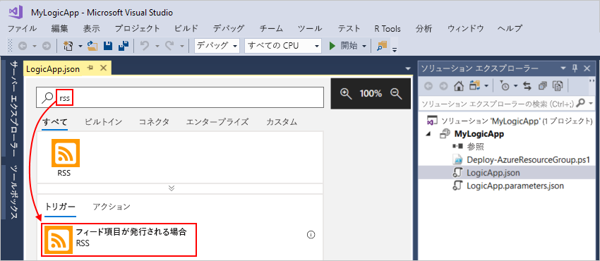

   デザイナーにトリガーが表示されます。

   

2. ロジック アプリの構築を完了するには、[Azure Portal のクイックスタート](../logic-apps/quickstart-create-first-logic-app-workflow.md#add-rss-trigger)にあるワークフロー手順を実行して、この記事に戻ります。

   完了すると、ロジック アプリは次の例のようになります。 

   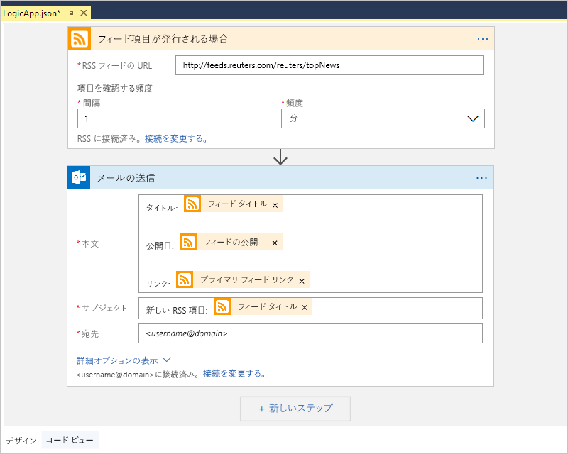

3. ロジック アプリを保存するには、Visual Studio ソリューションを保存します  (Ctrl + S キー)。

次に、ロジック アプリをテストする前にアプリを Azure にデプロイします。

## ロジック アプリを Azure にデプロイする

ロジック アプリを実行する前に、Visual Studio から Azure にアプリをデプロイします。必要な手順はわずか数ステップです。

1. ソリューション エクスプローラーのプロジェクトのショートカット メニューで、**[デプロイ]** > **[新規作成]** の順に選択します。 メッセージに従って Azure アカウントでサインインします。

   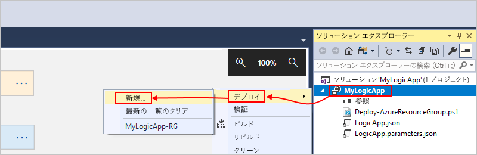

2. このデプロイでは、Azure サブスクリプション、リソース グループ、およびその他の既定の設定を維持します。 準備ができたら、**[デプロイ]** を選択します。 

   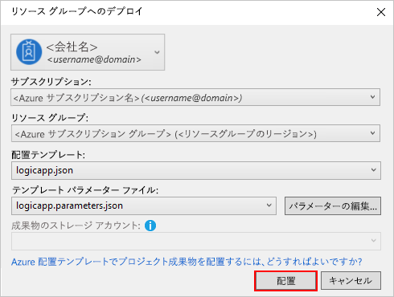

3. **[パラメーターの編集]** ボックスが表示されたら、デプロイで使用するロジック アプリのリソース名を入力して、設定を保存します。例:

   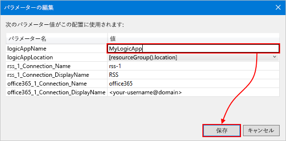

   デプロイが開始されると、Visual Studio の **[出力]** ウィンドウにアプリのデプロイ状態が表示されます。 
   状態が表示されない場合、**[Show output from]\(出力元の表示\)** の一覧を開いて、Azure リソース グループを選択します。

   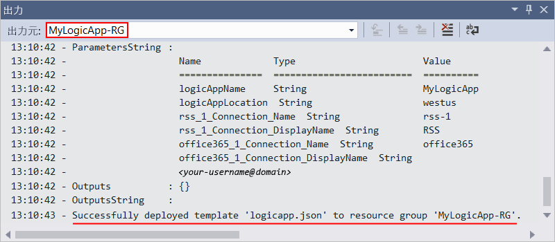

   デプロイの完了後、ロジック アプリは Azure Portal で有効になり、特定のスケジュール (毎分) に基づいて RSS フィードをチェックします。 
   RSS フィードに新しい項目がある場合、ロジック アプリは新しい項目ごとに電子メールを送信します。 
   それ以外の場合、ロジック アプリは、次の機会を待ってからもう一度チェックします。 

   このロジック アプリからは、次のようなメールが送信されます。 
   電子メールが届かない場合は、迷惑メール フォルダーを確認してください。 

   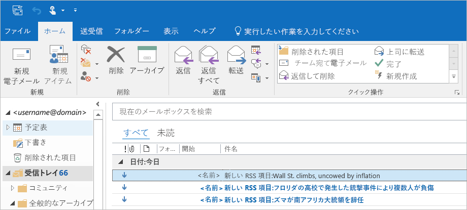

   技術的には、トリガーが RSS フィードをチェックして新しい項目を見つけると、トリガーが起動し、ワークフローのアクションを実行するロジック アプリのワークフローのインスタンスが Logic Apps エンジンによって作成されます。
   トリガーで新しい項目が見つからなかった場合、トリガーは起動せず、ワークフローのインスタンス作成は "スキップ" されます。

これで、Visual Studio でロジック アプリをビルドしてデプロイできました。 ロジック アプリを管理して実行履歴を確認するには、「[Manage logic apps with Visual Studio (Visual Studio でロジック アプリを管理する)](../logic-apps/manage-logic-apps-with-visual-studio.md)」を参照してください。

## リソースのクリーンアップ

必要がなくなったら、ロジック アプリと関連リソースを含んだリソース グループを削除しましょう。

1. ロジック アプリの作成に使用したのと同じアカウントで、<a href="https://portal.azure.com" target="_blank">Azure Portal</a> にサインインします。 

2. Azure のメイン メニューで **[リソース グループ]** を選択します。
ロジック アプリのリソース グループを選択し、**[概要]** を選択します。

3. **[概要]** ページで **[リソース グループの削除]** を選択します。 確認のためにリソース グループ名を入力し、**[削除]** を選択します。

   ![[リソース グループ] > [概要] > [リソース グループの削除]](./media/quickstart-create-logic-apps-with-visual-studio/delete-resource-group.png)

4. ローカル コンピューターで Visual Studio ソリューションを削除します。

## サポートを受ける

* 質問がある場合は、<a href="https://social.msdn.microsoft.com/Forums/en-US/home?forum=azurelogicapps" target="_blank">Azure Logic Apps フォーラム</a>にアクセスしてください。
* 機能のアイデアについて投稿や投票を行うには、<a href="http://aka.ms/logicapps-wish" target="_blank">Logic Apps のユーザー フィードバック サイト</a>にアクセスしてください。

## 次の手順

この記事では、Visual Studio を使用してロジック アプリの構築、デプロイ、実行を行いました。 Visual Studio でロジック アプリの高度なデプロイを管理して実行する方法については、次の記事を参照してください。

> [!div class="nextstepaction"]
> * [Visual Studio でロジック アプリを管理する](../logic-apps/manage-logic-apps-with-visual-studio.md)
> * [Visual Studio でロジック アプリのデプロイ テンプレートを作成する](../logic-apps/logic-apps-create-deploy-template.md)
