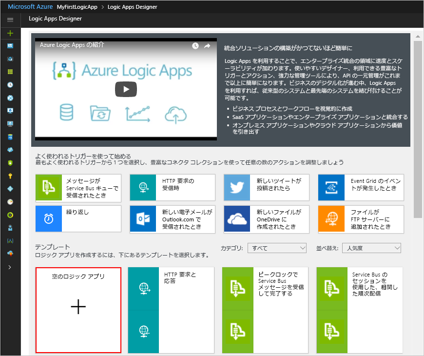

# <a name="check-traffic-on-a-schedule-with-azure-logic-apps"></a>Azure Logic Apps を使用してスケジュールに従ってトラフィックをチェックする

スケジュールに従って実行されるワークフローは、Azure Logic Apps を使って簡単に自動化することができます。 このチュートリアルでは、スケジューラ トリガーを使った[ロジック アプリ](../logic-apps/logic-apps-overview.md)の作成方法を紹介します。このロジック アプリは、平日朝に毎日実行され、移動時間 (2 地点間の交通量を含む) をチェックします。 その時間が特定の上限を超えた場合、目的地までの移動時間と超過時間が記載されたメールをロジック アプリから送信します。

このチュートリアルでは、以下の内容を学習します。

> [!div class="checklist"]
> * 空のロジック アプリを作成します。 
> * ロジック アプリのスケジューラとして機能するトリガーを追加します。
> * ルートの移動時間を取得するアクションを追加します。
> * 変数を作成して移動時間を秒から分に変換し、その結果を変数に保存するアクションを追加します。
> * 指定した上限に照らして移動時間を比較する条件を追加します。
> * 移動時間が上限を超えた場合にメールを送信するアクションを追加します。

完成したロジック アプリの大まかなワークフローは、次のようになります。


Azure サブスクリプションがない場合は、始める前に<a href="https://azure.microsoft.com/free/" target="_blank">無料の Azure アカウントにサインアップ</a>してください。

## <a name="prerequisites"></a>前提条件

* Logic Apps がサポートするメール プロバイダー (Office 365 Outlook、Outlook.com、Gmail など) のメール アカウント。 その他のプロバイダーについては、[こちらのコネクタ一覧を参照](https://docs.microsoft.com/connectors/)してください。 このクイックスタートでは、Outlook.com アカウントを使います。 別のメール アカウントを使う場合、おおよその手順は変わりませんが、UI の表示がやや異なることがあります。

* ルートの移動時間を取得するために Bing Maps API のアクセス キーが必要となります。 このキーを取得するには、<a href="https://msdn.microsoft.com/library/ff428642.aspx" target="_blank">Bing 地図のキーを取得する方法</a>に関するページの手順に従ってください。 

## <a name="sign-in-to-the-azure-portal"></a>Azure portal にサインインします

Azure アカウントの資格情報で <a href="https://portal.azure.com" target="_blank">Azure Portal</a> にサインインします。

## <a name="create-your-logic-app"></a>ロジック アプリを作成する

1. Azure のメイン メニューで、**[リソースの作成]** > **[Enterprise Integration]** > **[Logic App]** の順に選択します。

   

2. **[ロジック アプリの作成]** で、ロジック アプリに関する情報を次のように入力します。 終了したら、**[ダッシュボードにピン留めする]** > **[作成]** を選びます。

   

   | Setting | 値 | 説明 | 
   | ------- | ----- | ----------- | 
   | **Name** | LA-TravelTime | ロジック アプリの名前 | 
   | **サブスクリプション** | <*Azure サブスクリプションの名前*> | Azure サブスクリプションの名前 | 
   | **リソース グループ** | LA-TravelTime-RG | 関連するリソースの整理に使用する[Azure リソース グループ](../azure-resource-manager/resource-group-overview.md)の名前 | 
   | **場所** | 米国東部 2 | ロジック アプリに関する情報の保存先となるリージョン | 
   | **Log Analytics** | オフ | 診断ログの場合は、この設定を**オフ**のままにしてください。 | 
   |||| 

3. アプリのデプロイ後、Logic Apps デザイナーが起動し、使用頻度の高いロジック アプリのパターンのテンプレートや紹介ビデオを掲載したページが表示されます。 **[テンプレート]** で **[空のロジック アプリ]** を選択します。

   

次に、指定したスケジュールに基づいて起動される定期実行[トリガー](../logic-apps/logic-apps-overview.md#logic-app-concepts)を追加します。 すべてのロジック アプリは必ずトリガーから起動され、トリガーは、特定のイベントが発生するか、新しいデータが特定の条件を満たしたときに起動されます。 詳細については、[初めてのロジック アプリの作成](../logic-apps/quickstart-create-first-logic-app-workflow.md)に関する記事を参照してください。

## <a name="add-scheduler-trigger"></a>スケジューラ トリガーを追加する

1. デザイナーの検索ボックスに「繰り返し」と入力します。 トリガーとして、**スケジュール - 繰り返し**

   

2. **[繰り返し]** シェイプの**省略記号** (**...**) ボタンを選択し、**[名前の変更]** を選択します。 トリガーの名前をわかりやすく「```Check travel time every weekday morning```」に変更します。

   

3. トリガー内の **[詳細オプションを表示する]** を選択します。

4. トリガーに関するスケジュールと定期実行の詳細を次のように入力します。

   

   | Setting | 値 | 説明 | 
   | ------- | ----- | ----------- | 
   | **間隔** | 1 | チェックの間隔 (単位数) | 
   | **頻度** | 週 | 定期実行の時間の単位 | 
   | **タイム ゾーン** | なし | 開始時刻を指定したときに限り適用されます。 ローカル タイム ゾーン以外のタイム ゾーンを指定するときなどに使います。 | 
   | **開始時刻** | なし | 特定の日時まで定期実行を先送りします。 詳細については、[定期的に実行されるタスクとワークフローのスケジューリング](../connectors/connectors-native-recurrence.md)に関するページを参照してください。 | 
   | **設定曜日** | 月曜日,火曜日,水曜日,木曜日,金曜日 | **[頻度]** を "週" に設定したときにのみ選択できます。 | 
   | **設定時刻 (時間)** | 7,8,9 | **[頻度]** を "週" または "日" に設定したときにのみ選択できます。 この定期実行の時刻 (時) を選択します。 この例では、7 時、8 時、9 時に実行されます。 | 
   | **設定時刻 (分)** | 0,15,30,45 | **[頻度]** を "週" または "日" に設定したときにのみ選択できます。 この定期実行の時刻 (分) を選択します。 この例は、正時を起点として 15 分おきに実行されます。 | 
   ||||

   このトリガーは、平日の毎朝午前 7 時 00 分から午前 9 時 45 分まで 15 分おきに起動します。 
   定期実行のスケジュールは **[プレビュー]** ボックスに表示されます。 
   詳細については、[タスクとワークフローのスケジュール](../connectors/connectors-native-recurrence.md)および[ワークフローのアクションとトリガー](../logic-apps/logic-apps-workflow-actions-triggers.md#recurrence-trigger)に関するページを参照してください。

5. ここではトリガーの詳細を非表示にするために、シェイプのタイトル バー内をクリックします。

   

6. ロジック アプリを保存し、 デザイナーのツール バーで、**[保存]** を選択します。 

この時点でロジック アプリは稼働していますが、定期実行すること以外は何もしていません。 そこで、トリガーが起動したときに反応するアクションを追加します。

## <a name="get-the-travel-time-for-a-route"></a>ルートの移動時間を取得する

トリガーが完成したら、2 地点間の移動時間を取得する[アクション](../logic-apps/logic-apps-overview.md#logic-app-concepts)を追加します。 Logic Apps には Bing Maps API 用のコネクタが用意されているため、この情報を簡単に取得することができます。 このタスクを開始する前に、このチュートリアルの前提条件で触れた Bing Maps API キーを用意しておいてください。

1. Logic Apps デザイナーのトリガーで、**[+ 新しいステップ]** > **[アクションの追加]** の順に選択します。

2. "地図" を検索し、次のアクションを選択します: **[Bing Maps - Get route]\(Bing 地図 - ルートを取得する\)**

3. Bing 地図の接続が存在しない場合、接続を作成するように求められます。 これらの接続情報を入力して **[作成]** を選択します。

   ![[Bing Maps - Get route]\(Bing 地図 - ルートを取得する\) アクションを選択](./media/tutorial-build-scheduled-recurring-logic-app-workflow/create-maps-connection.png)

   | Setting | 値 | 説明 |
   | ------- | ----- | ----------- |
   | **Connection Name** | BingMapsConnection | 接続の名前を指定します。 | 
   | **API キー** | <*your-Bing-Maps-key*> | あらかじめ取得しておいた Bing 地図のキーを入力します。 Bing 地図のキーを所有していない場合は、<a href="https://msdn.microsoft.com/library/ff428642.aspx" target="_blank">キーの取得方法</a>に関するページを参照してください。 | 
   | | | |  

4. アクションの名前をわかりやすく「```Get route and travel time with traffic```」に変更します。

5. **[Get route]\(ルートを取得する\)** アクションを次のように指定します。

   ![[Bing Maps - Get route]\(Bing 地図 - ルートを取得する\) アクションの情報を入力](./media/tutorial-build-scheduled-recurring-logic-app-workflow/get-route-action-settings.png) 

   | Setting | 値 | 説明 |
   | ------- | ----- | ----------- |
   | **通過地点 1** | <*start-location*> | ルートの起点 | 
   | **通過地点 2** | <*end-location*> | ルートの目的地 | 
   | **回避** | なし | ルート上で回避する要素 (高速道路、通行料金など) | 
   | **最適化** | timeWithTraffic | ルートを最適化するためのパラメーター (距離、最新の交通量を加味した移動時間など) このパラメーターとして "timeWithTraffic" を選択します。 | 
   | **距離単位** | <*your-preference*> | ルートの距離の単位。 この記事では、次の単位を使用します: "マイル"  | 
   | **Travel mode (移動手段)** | Driving (車) | ルートの移動手段。 次の手段を選択します: "車" | 
   | **Transit Date-Time (交通機関の日時)** | なし | 移動手段が交通機関の場合のみ | 
   | **Date-Time Type (日時の種類)** | なし | 移動手段が交通機関の場合のみ | 
   |||| 

   これらのパラメーターの詳細については、「[Calculate a route (ルートの計算)](https://msdn.microsoft.com/library/ff701717.aspx)」を参照してください。

6. ロジック アプリを保存し、

次に、最新の移動時間を秒ではなく分に変換して格納するための変数を作成します。 そうすることで、同じ変換処理を繰り返す手間が省け、以降の手順で値が利用しやすくなります。 

## <a name="create-variable-to-store-travel-time"></a>移動時間を格納するための変数を作成する

ワークフロー内でデータに対する操作を実行し、その結果を後続のアクションで使うことが必要になる場合があります。 こうした結果を再利用または参照しやすいよう保存するには、処理の結果を格納するための変数を作成します。 変数は、ロジック アプリの最上位でのみ作成することができます。

前出の **[Get route]\(ルートを取得する\)** アクションからは、交通量を加味した最新の移動時間が **[Travel Duration Traffic]\(交通量を加味した移動時間\)** フィールドを介して返されます。このときの時間の単位は、既定では "秒" です。 この値を "分" に変換して格納しておけば、後で同じ変換を繰り返さずに済み、再利用しやすくなります。

1. **[Get route]\(ルートを取得する\)** アクションで、**[+ 新しいステップ]** > **[アクションの追加]** を選択します。

2. "変数" を検索し、次のアクションを選択します: **変数 - 変数を初期化する**

   ![[変数 - 変数を初期化する] アクションを選択](./media/tutorial-build-scheduled-recurring-logic-app-workflow/select-initialize-variable-action.png)

3. このアクションの名前をわかりやすく「```Create variable to store travel time```」に変更します。

4. 変数の詳細を次のように入力します。

   | Setting | 値 | 説明 | 
   | ------- | ----- | ----------- | 
   | **Name** | travelTime | 変数の名前 | 
   | **Type** | 整数 | 変数のデータ型 | 
   | **値** | 最新の移動時間を秒から分に変換する式 (この表の下の手順を参照)。 | 変数の初期値 | 
   |||| 

   1. **[値]** フィールドの式を作成するには、フィールド内をクリックして動的コンテンツ リストを表示します。 
   必要に応じて、リストが表示されるまでブラウザーの幅を広げてください。 
   動的コンテンツ リストの **[式]** を選択します。 

      ![[変数 - 変数を初期化する] アクションの情報を入力](./media/tutorial-build-scheduled-recurring-logic-app-workflow/initialize-variable-action-settings.png)

      いくつかの編集ボックスは、その内部をクリックすると、動的コンテンツ リストまたはインライン パラメーター リストが表示されます。 このリストには、先行するアクションから、ワークフローの入力として使用できるパラメーターがすべて表示されます。 
      動的コンテンツ リストには、式エディターが備わっており、操作を実行するための関数を選択できます。 
      この式エディターは、動的コンテンツ リストでのみ表示されます。

      どちらのリストが表示されるかは、お使いのブラウザーの幅によって決まります。 
      ブラウザーの幅が広い場合、動的コンテンツ リストが表示されます。 
      ブラウザーの幅が狭い場合は、パラメーター リストが、現在フォーカスのある編集ボックスの下にインラインで表示されます。

   2. 式エディターに、「```div(,60)```」という式を入力します。

      

   3. 式の左かっこ (**(**) とコンマ (**,**) の間にカーソルを置きます。 
   **[動的なコンテンツ]** を選択します。

      ![カーソルを置き、[動的なコンテンツ] を選択します。](./media/tutorial-build-scheduled-recurring-logic-app-workflow/initialize-variable-action-settings-3.png)

   4. 動的コンテンツ リストで **[Travel Duration Traffic]\(移動時間の交通量\)** を選択します。

      ![[Travel Duration Traffic]\(移動時間の交通量\) フィールドを選択](./media/tutorial-build-scheduled-recurring-logic-app-workflow/initialize-variable-action-settings-4.png)

   5. 式の中でフィールドが解決されたら **[OK]** を選択します。

      ![[OK] を選択](./media/tutorial-build-scheduled-recurring-logic-app-workflow/initialize-variable-action-settings-5.png)

      **[値]** フィールドが次のように表示されます。

      ![式が解決された状態の [値] フィールド](./media/tutorial-build-scheduled-recurring-logic-app-workflow/initialize-variable-action-settings-6.png)

5. ロジック アプリを保存し、

次に、最新の移動時間が特定の上限を超えたかどうかをチェックする条件を追加します。

## <a name="compare-travel-time-with-limit"></a>移動時間と上限を比較する

1. 直前のアクションの下で、**[+ 新しいステップ]** > **[条件の追加]** の順に選択します。 

2. 条件の名前をわかりやすく「```If travel time exceeds limit```」に変更します。

3. **travelTime** が特定の上限を超えているかどうかを調べる条件を次の説明に従って作成します。

   1. 条件内で **[値の選択]** ボックス内をクリックします。このボックスは、ブラウザーの表示幅が広い場合は左側に、表示幅が狭い場合は上部に表示されます。

   2. 動的コンテンツ リストまたはパラメーター リストから、**[変数]** の **[travelTime]** フィールドを選択します。

   3. 比較ボックスで、演算子として **[次の値より大きい]** を選択します。

   4. 右側 (表示幅が広い場合) または下部 (表示幅が狭い場合) にある **[値の選択]** ボックスで、上限として「```15```」を入力します。

   たとえば表示幅を狭くしている場合は、次のようにしてこの条件を作成します。

   

4. ロジック アプリを保存し、

次に、移動時間が上限を超えたときに実行するアクションを追加します。

## <a name="send-email-when-limit-exceeded"></a>上限を超えたときにメールを送信する

今度は、指定した移動時間の上限を超えたときにメールで通知を受けるためのアクションを追加します。 このメールには、指定されたルートで移動するために必要な最新の移動時間と超過時間が記載されます。 

1. 条件の **[true の場合]** 分岐で、**[アクションの追加]** を選択します。

2. "メールの送信" を検索し、目的のメール コネクタと "メールの送信アクション" を選択します。

   

   * 個人用 Microsoft アカウントには、**Outlook.com** を選択します。 
   * Azure の職場または学校アカウントには、**Office 365 Outlook** を選択します。

3. まだ接続していない場合、お使いのメール アカウントにサインインするように求められます。

   Logic Apps によって電子メール アカウントへの接続が作成されます。

4. アクションの名前をわかりやすく「```Send email with travel time```」に変更します。

5. **[宛先]** ボックスに、受信者の電子メール アドレスを入力します。 テスト目的のため、ご自身のメール アドレスを使ってください。

6. **[件名]** ボックスに、メールの件名を指定し、**travelTime** 変数を追加します。

   1. 「```Current travel time (minutes):```」というテキストを入力します。末尾にスペースを 1 つ追加してください。 
   
   2. パラメーター リストまたは動的コンテンツ リストの **[変数]** から **travelTime** を選択します。 
   
      たとえばブラウザーの表示幅を狭くしている場合は、次のように表示されます。

      

7. **[本文]** ボックスに、メールの本文の内容を指定します。 

   1. 「```Add extra travel time (minutes):```」というテキストを入力します。末尾にスペースを 1 つ追加してください。 
   
   2. 必要に応じて、動的コンテンツ リストが表示されるまでブラウザーの幅を広げてください。 
   動的コンテンツ リストの **[式]** を選択します。

      

   3. 上限の超過時間 (分) を求めるために、式エディターで「```sub(,15)```」という式を入力します。

      

   4. 式の左かっこ (**(**) とコンマ (**,**) の間にカーソルを置きます。 **[動的なコンテンツ]** を選択します。

      

   5. **[変数]** で **[travelTime]** を選択します。

      ![式に使う [travelTime] フィールドを選択](./media/tutorial-build-scheduled-recurring-logic-app-workflow/send-email-body-settings-4.png)

   6. 式の中でフィールドが解決されたら **[OK]** を選択します。

      ![式が解決された状態の [Body]\(本文\) フィールド](./media/tutorial-build-scheduled-recurring-logic-app-workflow/send-email-body-settings-5.png)

      **[Body]\(本文\)** フィールドが次のように表示されます。

      ![式が解決された状態の [Body]\(本文\) フィールド](./media/tutorial-build-scheduled-recurring-logic-app-workflow/send-email-body-settings-6.png)

8. ロジック アプリを保存し、

次に、ロジック アプリをテストします。この時点で、ロジック アプリは次のようになっています。


## <a name="run-your-logic-app"></a>ロジック アプリを実行する

ロジック アプリを手動で開始するには、デザイナーのツール バーで **[実行]** を選択します。 最新の移動時間が指定した上限を下回っている限り、このロジック アプリは何も実行せず、次の間隔が経過するのを待って再びチェックを実行します。
そして最新の移動時間が指定の上限を超えた場合、最新の移動時間と上限を基準とした超過分の時間 (分) とがメールで通知されます。 以下に示したのは、このロジック アプリから送信されるメールの例です。


メールが届かない場合は、迷惑メール フォルダーを確認してください。 この種のメールは、迷惑メール フィルターによってリダイレクトされる場合があります。 また、ロジック アプリが正しく動作しているかどうかわからない場合は、[ロジック アプリのトラブルシューティング](../logic-apps/logic-apps-diagnosing-failures.md)に関するページを参照してください。

お疲れさまでした。スケジュールに基づいて定期実行されるロジック アプリを作成し、実行することができました。 

**[スケジュール - 繰り返し]** トリガーを使って作成できるロジック アプリは他にもあります。次のテンプレートが用意されていますので、ロジック アプリの作成後にぜひご覧ください。

* 毎日リマインダーを受け取る。
* 古くなった Azure BLOB を削除する。
* Azure Storage キューにメッセージを追加する。

## <a name="clean-up-resources"></a>リソースのクリーンアップ

必要がなくなったら、ロジック アプリと関連リソースを含んだリソース グループを削除しましょう。 Azure のメイン メニューから **[リソース グループ]** に移動し、対象のロジック アプリのリソース グループを選択します。 **[リソース グループの削除]** を選択します。 確認のためにリソース グループ名を入力し、**[削除]** を選択します。

![[概要] > [リソース グループの削除]](./media/tutorial-build-scheduled-recurring-logic-app-workflow/delete-resource-group.png)

## <a name="get-support"></a>サポートを受ける

* 質問がある場合は、[Azure Logic Apps フォーラム](https://social.msdn.microsoft.com/Forums/en-US/home?forum=azurelogicapps)にアクセスしてください。
* 機能のアイデアについて投稿や投票を行うには、[Logic Apps のユーザー フィードバック サイト](https://aka.ms/logicapps-wish)にアクセスしてください。

## <a name="next-steps"></a>次の手順

このチュートリアルでは、指定したスケジュールに基づいて (平日朝毎日) 交通量をチェックし、移動時間が指定の上限を超えたときに、必要なアクション (メール送信) を実行するロジック アプリを作成しました。 次回は、Azure サービスや Microsoft サービスなど、各種の SaaS アプリを連携させることによって、メーリング リストの登録申請を送信するロジック アプリの作成方法について詳しく見ていきましょう。

> [!div class="nextstepaction"]
> [メーリング リストの登録申請の管理](../logic-apps/tutorial-process-mailing-list-subscriptions-workflow.md)
