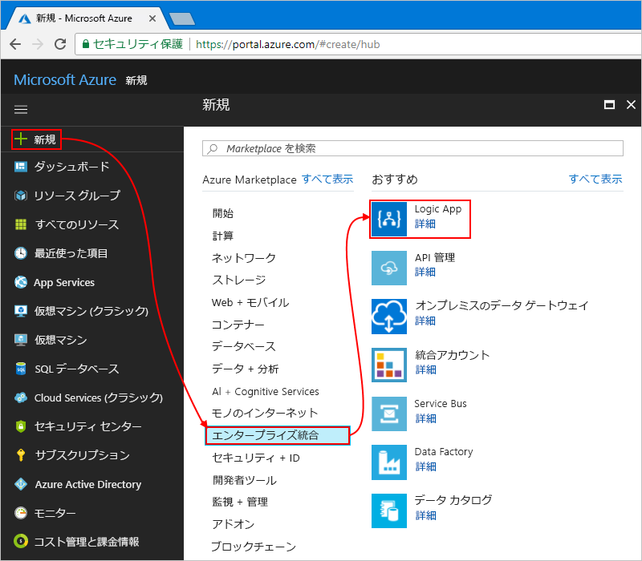

# <a name="manage-mailing-list-requests-with-azure-logic-apps"></a>Azure Logic Apps でメーリング リスト要求を管理する

Azure Logic Apps を使うと、Azure サービスや Microsoft サービスを初めとする各種の SaaS (サービスとしてのソフトウェア) アプリとオンプレミス システムの垣根を越えてワークフローを自動化したりデータを統合したりすることができます。 このチュートリアルでは、[MailChimp](https://mailchimp.com/) サービスによって管理されたメーリング リストの登録申請を処理する[ロジック アプリ](../logic-apps/logic-apps-overview.md)の作成方法を紹介します。
このロジック アプリは、登録申請用のメール アカウントを監視して承認依頼を送信し、承認済みのメンバーをメーリング リストに追加するものです。

このチュートリアルでは、以下の内容を学習します。

> [!div class="checklist"]
> * 空のロジック アプリを作成します。
> * 登録申請のメールを監視するトリガーを追加します。
> * 申請の承認/拒否を依頼するメールの送信アクションを追加します。
> * 承認応答をチェックする条件を追加します。
> * 承認済みのメンバーをメーリング リストに登録するアクションを追加します。
> * これらのメンバーが正常にリストに登録されているかどうかをチェックする条件を追加します。
> * これらのメンバーが正常にリストに登録されているかどうかを伝えるメールの送信アクションを追加します。

完成したロジック アプリの大まかなワークフローは、次のようになります。


Azure サブスクリプションがない場合は、始める前に<a href="https://azure.microsoft.com/free/" target="_blank">無料の Azure アカウントにサインアップ</a>してください。

## <a name="prerequisites"></a>前提条件

* MailChimp アカウント。 承認済みメンバーのメール アドレスの追加先となる "test-members-ML" という名前のリストを作成してください。 アカウントがない場合は、[無料アカウントにサインアップ](https://login.mailchimp.com/signup/)し、[リストの作成方法](https://us17.admin.mailchimp.com/lists/#)を確認してください。 

* 承認ワークフローに対応した Office 365 Outlook または Outlook.com のメール アカウント。 この記事では Office 365 Outlook を使います。 別のメール アカウントを使う場合、おおよその手順は変わりませんが、UI の表示がやや異なることがあります。

## <a name="sign-in-to-the-azure-portal"></a>Azure portal にサインインします

Azure アカウントの資格情報で <a href="https://portal.azure.com" target="_blank">Azure Portal</a> にサインインします。

## <a name="create-your-logic-app"></a>ロジック アプリを作成する

1. Azure のメイン メニューで、 **[リソースの作成]**  >  **[Enterprise Integration]**  >  **[Logic App]** の順に選択します。

   

2. **[ロジック アプリの作成]** で、ロジック アプリに関する情報を次のように入力します。 終了したら、 **[ダッシュボードにピン留めする]**  >  **[作成]** を選びます。

   

   | Setting | 値 | 説明 | 
   | ------- | ----- | ----------- | 
   | **Name** | LA-MailingList | ロジック アプリの名前 | 
   | **サブスクリプション** | <*Azure サブスクリプションの名前*> | Azure サブスクリプションの名前 | 
   | **リソース グループ** | LA-MailingList-RG | 関連するリソースの整理に使用する[Azure リソース グループ](../azure-resource-manager/resource-group-overview.md)の名前 | 
   | **Location** | 米国東部 2 | ロジック アプリに関する情報の保存先となるリージョン | 
   | **Log Analytics** | オフ | 診断ログの場合は、この設定を**オフ**のままにしてください。 | 
   |||| 

3. アプリのデプロイ後、Logic Apps デザイナーが起動し、使用頻度の高いロジック アプリのパターンのテンプレートや紹介ビデオを掲載したページが表示されます。 **[テンプレート]** で **[空のロジック アプリ]** を選択します。

   

次に、登録申請を含んだ受信メールをリッスンする[トリガー](../logic-apps/logic-apps-overview.md#logic-app-concepts)を追加します。
すべてのロジック アプリは必ずトリガーから起動され、トリガーは、特定のイベントが発生するか、新しいデータが特定の条件を満たしたときに起動されます。 詳細については、[初めてのロジック アプリの作成](../logic-apps/quickstart-create-first-logic-app-workflow.md)に関する記事を参照してください。

## <a name="add-trigger-to-monitor-emails"></a>メールを監視するトリガーを追加する

1. デザイナーの検索ボックスに「メールが届いたとき」と入力します。 メール プロバイダーに対応するトリガーとして、 **[<*your-email-provider*> - 新しい電子メールが届いたとき]** を選択します。
   
   ![電子メール プロバイダーに対して、[When a new email arrives \(新しい電子メールが届いたとき\)] のトリガーを選択する](./media/tutorial-process-mailing-list-subscriptions-workflow/add-trigger-new-email.png)

   * Azure の職場または学校アカウントには、Office 365 Outlook を選択します。
   * 個人用 Microsoft アカウントには、Outlook.com を選択します。

2. 資格情報を求められた場合は、お使いのメール アカウントへの接続が Logic Apps によって作成されるように、そのメール アカウントにサインインします。

3. すべての新着メールを対象にトリガーでチェックする基準を指定します。

   1. メールをチェックするフォルダー、間隔、頻度を指定します。

      

      | Setting | 値 | 説明 | 
      | ------- | ----- | ----------- | 
      | **フォルダー** | Inbox | 監視するメール フォルダー | 
      | **間隔** | 1 | チェックの間隔 (単位数) | 
      | **頻度** | 時 | チェックの間隔に使う時間の単位  | 
      |  |  |  | 

   2. **[詳細オプションを表示する]** を選択します。 トリガーでメールの件名から探すテキストとして「```subscribe-test-members-ML```」を **[件名フィルター]** ボックスに入力します。

      

4. ここではトリガーの詳細を非表示にするために、トリガーのタイトル バーをクリックします。

   

5. ロジック アプリを保存し、 デザイナーのツール バーで、 **[保存]** を選択します。

   ロジック アプリは現在稼働していますが、受信メールをチェックすること以外は何もしていません。 
   そこで、トリガーが起動したときに反応するアクションを追加します。

## <a name="send-approval-email"></a>承認の電子メールを送信します

トリガーが完成したら、申請の承認/拒否を依頼するメールの送信[アクション](../logic-apps/logic-apps-overview.md#logic-app-concepts)を追加します。 

1. トリガーで、 **[+ 新しいステップ]**  >  **[アクションの追加]** の順に選択します。 "承認" を検索し、 **[<*your-email-provider*> - 承認の電子メールを送信します]** アクションを選択します。

   ![[<your-email-provider> - 承認の電子メールを送信します] を選択](./media/tutorial-process-mailing-list-subscriptions-workflow/add-action-send-approval-email.png)

2. このアクションの情報を次のように入力します。 

   

   | Setting | 値 | 説明 | 
   | ------- | ----- | ----------- | 
   | **To** | <*approver-email-address*> | 承認者のメール アドレス。 テスト目的のため、ご自身のアドレスを使ってください。 | 
   | **ユーザー オプション** | Approve, Reject | 承認者が選ぶことのできる回答の選択肢。 既定では、承認者が回答として [Approve] または [Reject] を選択できます。 | 
   | **[件名]** | test-members-ML のメンバー申請の承認 | わかりやすいメールの件名 | 
   |  |  |  | 

   特定の編集ボックス内をクリックしたときに表示される動的コンテンツ リストまたはインライン パラメーター リストは、ここでは無視してください。 
   このリストでは、先行するアクションから、ワークフローの入力として使用できるパラメーターを選択できます。 
   どちらのリストが表示されるかは、お使いのブラウザーの幅によって決まります。 
 
4. ロジック アプリを保存し、

次に、承認者によって選択された回答をチェックする条件を追加します。

## <a name="check-approval-response"></a>承認応答をチェックする

1. **[承認の電子メールを送信します]** アクションの下で、 **[+ 新しいステップ]**  >  **[条件の追加]** の順に選択します。

   条件シェイプが表示され、ワークフローへの入力として追加できるパラメーターが表示されます。 

2. 条件の名前をわかりやすい名前に変更します。

   1. 条件のタイトル バーにある**省略記号** ( **...** ) ボタンを選択し、 **[名前の変更]** を選択します。

      たとえばブラウザーの表示幅を狭くしている場合は、次のように表示されます。

      

      ブラウザーの表示幅を広くしていて、省略記号ボタンが動的コンテンツ リストの影に隠れてクリックできない場合は、[条件] 内の **[動的なコンテンツの追加]** を選択して、このリストを閉じてください。

   2. 条件の名前をわかりやすく「```If request approved```」に変更します。

3. 承認者によって **[Approve]** が選択されたかどうかをチェックする条件を作成します。

   1. 条件内で **[値の選択]** ボックス内をクリックします。このボックスは、ブラウザーの表示幅が広い場合は左側に、表示幅が狭い場合は上部に表示されます。
   パラメーター リストまたは動的コンテンツ リストから、 **[承認の電子メールを送信します]** の **[SelectedOption]** フィールドを選択します。

      たとえば表示幅を広くしている場合、条件は次のように表示されます。

      ![[承認の電子メールを送信します] の [SelectedOption] を選択](./media/tutorial-process-mailing-list-subscriptions-workflow/build-condition-check-approval-response.png)

   2. 比較演算子ボックスで、 **[次の値に等しい]** を選択します。

   3. 右側 (表示幅が広い場合) または下部 (表示幅が狭い場合) にある **[値の選択]** ボックスに、値として「```Approve```」を入力します。

      完成した条件は次の例のようになります。

      

4. ロジック アプリを保存し、

次に、レビュー担当者が申請を承認したときにロジック アプリによって実行されるアクションを指定します。 

## <a name="add-member-to-mailchimp-list"></a>MailChimp リストにメンバーを追加する

今度は、承認済みのメンバーをメーリング リストに登録するアクションを追加します。

1. 条件の **[true の場合]** 分岐で、 **[アクションの追加]** を選択します。
"mailchimp" を検索し、次のアクションを選択します: **[MailChimp - メンバーをリストに追加する]**

   ![[MailChimp - メンバーをリストに追加する] を選択](./media/tutorial-process-mailing-list-subscriptions-workflow/add-action-mailchimp-add-member.png)

3. MailChimp アカウントにサインインするように求められた場合は、MailChimp の資格情報でサインインします。

4. このアクションの情報を次のように入力します。

   ![[メンバーをリストに追加する] の情報を入力](./media/tutorial-process-mailing-list-subscriptions-workflow/add-action-mailchimp-add-member-settings.png)

   | Setting | 値 | 説明 | 
   | ------- | ----- | ----------- | 
   | **リスト ID** | test-members-ML | MailChimp メーリング リストの名前 | 
   | **状態** | subscribed | 新しいメンバーの登録ステータス。 詳細については、「<a href="https://developer.mailchimp.com/documentation/mailchimp/guides/manage-subscribers-with-the-mailchimp-api/" target="_blank">Manage subscribers with the MailChimp API (MailChimp API を使った購読者管理)</a>」を参照してください。 | 
   | **メール アドレス** | <*new-member-email-address*> | パラメーター リストまたは動的コンテンツ リストから、 **[新しい電子メールが届いたとき]** の **[差出人]** を選択します。ここから、新しいメンバーのメール アドレスが渡されます。 
   |  |  |  | 

5. ロジック アプリを保存し、

次に、新しいメンバーがメーリング リストに正常に登録されたかどうかをチェックするための条件を追加します。 そうすることで、この操作の成否に関する通知をロジック アプリから受け取ることができます。

## <a name="check-for-success-or-failure"></a>成功か失敗かをチェックする

1. **[true の場合]** 分岐の **[メンバーをリストに追加する]** アクションで、 **[More]\(さらに表示\)**  >  **[条件の追加]** の順に選択します。

2. 条件の名前をわかりやすく「```If add member succeeded```」に変更します。

3. 承認済みのメンバーが正常にメーリング リストに登録されているかどうかをチェックする条件を作成します。

   1. 条件内で **[値の選択]** ボックス内をクリックします。このボックスは、ブラウザーの表示幅が広い場合は左側に、表示幅が狭い場合は上部に表示されます。
   パラメーター リストまたは動的コンテンツ リストから、 **[メンバーをリストに追加する]** の **[Status]\(ステータス\)** フィールドを選択します。

      たとえば表示幅を広くしている場合、条件は次のように表示されます。

      ![[メンバーをリストに追加する] の [Status]\(ステータス\) を選択](./media/tutorial-process-mailing-list-subscriptions-workflow/build-condition-check-added-member.png)

   2. 比較演算子ボックスで、 **[次の値に等しい]** を選択します。

   3. 右側 (表示幅が広い場合) または下部 (表示幅が狭い場合) にある **[値の選択]** ボックスに、値として「```subscribed```」を入力します。

   完成した条件は次の例のようになります。

   

次に、承認されたメンバーのメーリング リストへの登録に成功するか失敗したときに送信されるメールを設定します。

## <a name="send-email-if-member-added"></a>メンバーが追加された場合にメールを送信する

1. **[If add member succeeded]** 条件の **[true の場合]** 分岐で、 **[アクションの追加]** を選択します。

   ![条件の [true の場合] 分岐で、[アクションの追加] を選択します。](./media/tutorial-process-mailing-list-subscriptions-workflow/add-action-email-success.png)

2. "outlook メールの送信" を検索し、 **[<*your-email-provider*> - 電子メールの送信]** アクションを選択します。

   ![[電子メールの送信] アクションを追加](./media/tutorial-process-mailing-list-subscriptions-workflow/add-action-email-success-2.png)

3. アクションの名前をわかりやすく「```Send email on success```」に変更します。

4. このアクションの情報を次のように入力します。

   

   | Setting | 値 | 説明 | 
   | ------- | ----- | ----------- | 
   | **To** | <*your-email-address*> | 成功時のメールの送信先アドレス。 テスト目的で自分の電子メール アドレスを使用できます。 | 
   | **[件名]** | <*subject-for-success-email*> | 成功時に送信されるメールの件名。 このチュートリアルでは、次のテキストを入力し、パラメーター リストまたは動的コンテンツ リストから、 **[メンバーをリストに追加する]** 下の指定したフィールドを選択します。 <p>"Success! Member added to 'test-members-ML': **メール アドレス**" | 
   | **本文** | <*body-for-success-email*> | 成功時に送信されるメールの本文の内容。 このチュートリアルでは、次のテキストを入力し、パラメーター リストまたは動的コンテンツ リストから、 **[メンバーをリストに追加する]** 下の指定したフィールドを選択します。  <p>"New member has joined 'test-members-ML': **メール アドレス**"</br>"Member opt-in status: **状態**" | 
   | | | | 

5. ロジック アプリを保存し、

## <a name="send-email-if-member-not-added"></a>メンバーが追加されなかった場合にメールを送信する

1. **[If add member succeeded]** 条件の **[false の場合]** 分岐で、 **[アクションの追加]** を選択します。

   ![条件の [false の場合] 分岐で、[アクションの追加] を選択します。](./media/tutorial-process-mailing-list-subscriptions-workflow/add-action-email-failed.png)

2. "outlook メールの送信" を検索し、 **[<*your-email-provider*> - 電子メールの送信]** アクションを選択します。

   ![[電子メールの送信] アクションを追加](./media/tutorial-process-mailing-list-subscriptions-workflow/add-action-email-failed-2.png)

3. アクションの名前をわかりやすく「```Send email on failure```」に変更します。

4. このアクションの情報を次のように入力します。

   

   | Setting | 値 | 説明 | 
   | ------- | ----- | ----------- | 
   | **To** | <*your-email-address*> | 失敗時のメールの送信先アドレス。 テスト目的で自分の電子メール アドレスを使用できます。 | 
   | **[件名]** | <*subject-for-failure-email*> | 失敗時に送信されるメールの件名。 このチュートリアルでは、次のテキストを入力し、パラメーター リストまたは動的コンテンツ リストから、 **[メンバーをリストに追加する]** 下の指定したフィールドを選択します。 <p>"Failed, member not added to 'test-members-ML': **メール アドレス**" | 
   | **本文** | <*body-for-failure-email*> | 失敗時に送信されるメールの本文の内容。 このチュートリアルでは、次のテキストを入力します。 <p>"Member might already exist. Check your MailChimp account." | 
   | | | | 

5. ロジック アプリを保存し、 

次に、ロジック アプリをテストします。この時点で、ロジック アプリは次のようになっています。

 

## <a name="run-your-logic-app"></a>ロジック アプリを実行する

1. メーリング リストの登録申請メールを自分宛てに送信します。
申請が受信トレイに配信されるまで待ちます。

3. ロジック アプリを手動で開始するには、デザイナーのツール バーで **[実行]** を選択します。 

   メールの件名がトリガーの件名フィルターと一致した場合、登録申請の承認依頼メールがロジック アプリから届きます。

4. 承認依頼メールで **[Approve]** を選択します。

5. 購読者のメール アドレスがメーリング リストに存在しない場合、その人物のメール アドレスが追加され、次のようなメールが届きます。

   

   購読者を追加できなかった場合は、次のようなメールが届きます。

   

   メールが届かない場合は、迷惑メール フォルダーを確認してください。 
   この種のメールは、迷惑メール フィルターによってリダイレクトされる場合があります。 
   また、ロジック アプリが正しく動作しているかどうかわからない場合は、[ロジック アプリのトラブルシューティング](../logic-apps/logic-apps-diagnosing-failures.md)に関するページを参照してください。

お疲れさまでした。Azure、Microsoft サービスなどの SaaS アプリの垣根を越えて情報を統合するロジック アプリを作成し、実行することができました。

## <a name="clean-up-resources"></a>リソースのクリーンアップ

必要がなくなったら、ロジック アプリと関連リソースを含んだリソース グループを削除しましょう。 Azure のメイン メニューから **[リソース グループ]** に移動し、対象のロジック アプリのリソース グループを選択します。 **[リソース グループの削除]** を選択します。 確認のためにリソース グループ名を入力し、 **[削除]** を選択します。

![[概要] > [リソース グループの削除]](./media/tutorial-process-mailing-list-subscriptions-workflow/delete-resource-group.png)

## <a name="get-support"></a>サポートを受ける

* 質問がある場合は、[Azure Logic Apps フォーラム](https://social.msdn.microsoft.com/Forums/en-US/home?forum=azurelogicapps)にアクセスしてください。
* 機能のアイデアについて投稿や投票を行うには、[Logic Apps のユーザー フィードバック サイト](https://aka.ms/logicapps-wish)にアクセスしてください。

## <a name="next-steps"></a>次の手順

このチュートリアルでは、メーリング リスト登録申請の承認依頼を管理するロジック アプリを作成しました。 次回は、Azure Storage と Azure Functions など各種 Azure サービスを統合することによって、メールの添付ファイルを処理して保存するロジック アプリを作成する方法について詳しく見ていきましょう。

> [!div class="nextstepaction"]
> [メールの添付ファイルの処理](../logic-apps/tutorial-process-email-attachments-workflow.md)
